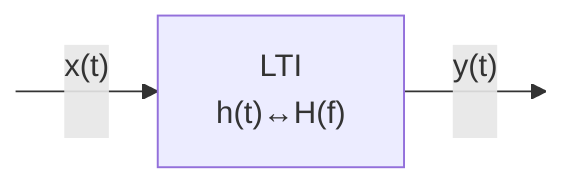
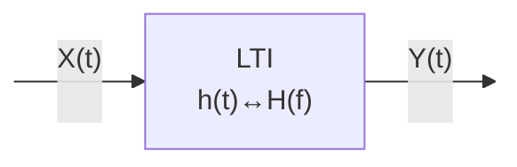
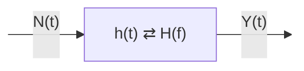
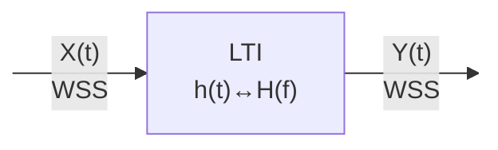
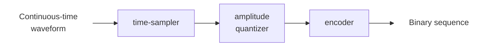

# Chapter 2: Signals & Spectral Densities

## Energy & Power Signals

In this given diagram, as we've learned in our previous electronic circuits course power is calculated as $$p(t)=\frac{|e(t)|^2}{R}=|i(t)|^2R$$ and if $R=1\ ohm$, then $$p(t)=|e(t)|^2=|i(t)|^2=|x(t)|^2$$ and in this course, we'll be using symbols like $x(t)$ or $f(t)$ to represnet a signal, which can be a current or voltage.
### Energy Signals

**Definition** - ==Energy Signals==: A signal $x(t)$ is considered an energy signal if the total energy $E_x$ defined by $$E_x = \int_{-\infty}^{\infty} |x(t)|^2 \ dt=\lim\limits_{T \to \infty}\int_{-\frac{T}{2}}^{\frac{T}{2}} |x(t)|^2 \ dt$$is finite. 

*For instance,* $x(t) = A\cos(2\pi f_0 t + \theta)$ which is described, in words, as a single tone frequency signal, is not an energy signal since its energy extends to infinity over time.
> [!Proof] $A\cos(2\pi f_0 t + \theta)$ is not an energy signal
> The total energy $E_x$ of the signal can be calculated as follows:
> $$E_x = \lim_{T \to \infty} \int_{-\frac{T}{2}}^{\frac{T}{2}} A^2 \cos^2(2\pi f_0 t + \theta) \, dt$$
> Using the identity $\cos^2 x = \frac{1 + \cos(2x)}{2}$, the energy expression becomes:
> $$E_x = \lim_{T \to \infty} \int_{-\frac{T}{2}}^{\frac{T}{2}} \frac{A^2}{2} \left(1 + \cos(4\pi f_0 t + 2\theta)\right) \, dt$$
> The integral of $\cos(4\pi f_0 t + 2\theta)$ over a symmetric interval about zero, as $T \to \infty$, approaches zero due to the periodicity and symmetry of the cosine function. Hence, we simplify to:
> $$E_x = \lim_{T \to \infty} \left[\frac{A^2 T}{2} + \frac{A^2}{8\pi f_0} \sin(4\pi f_0 t + 2\theta) \Bigg|_{-\frac{T}{2}}^{\frac{T}{2}}\right]$$
> Since $\sin(4\pi f_0 t + 2\theta)$ is bounded, the sinusoidal term vanishes as $T \to \infty$, leading to:
> $$E_x = \lim_{T \to \infty} \frac{A^2 T}{2} = \infty$$
> Therefore, $x(t)$ is **not an energy signal**.

### Power Signals

> "Some signals have infinite energy, but they may have a finite time-average of energy. This time-average of energy is called _average power._"

**Definition** - ==Power Signals==: If a signal does not qualify as an energy signal due to infinite energy, it may still be classified as a power signal if it possesses finite average power. The average power $P$ is given by $$P =\lim_\limits{T \to \infty}\frac{1}{2T}\int_{-T}^{T}|x(t)|^2 \ dt$$
**Rule**: A signal cannot be both power- and energy-type, because for energy-type signals $P_x=0$ and for power-type signals $E_x=\infty$.

**Note**: It's possible that a signal may be neither energy-type nor power-type.

*As two examples,* consider the signal $x(t) = A\cos(2\pi f_0 t + \theta)$. This signal is not an energy signal as we have seen, but it can be analyzed as a power signal. Also, *consider* the signal $y(t) = e^{-at}u(t)$ where $a > 0$. This is an example of an energy signal, and has zero-power.

> [!Proof] $A\cos(2\pi f_0 t + \theta)$ being a power signal and not an energy signal
> The average power $P_x$ of the signal is calculated using the formula: $$P_x = \lim_\limits{T \to \infty} \frac{1}{T} \int_{-\frac{T}{2}}^{\frac{T}{2}} A^2 \cos^2(2\pi f_0 t + \theta) \ dt$$
> Utilizing the trigonometric identity for cosine squared and simplifying: $$P_x = \lim_\limits{T \to \infty} \frac{1}{T} \left[ \frac{A^2 T}{2} + \frac{A^2}{8\pi f_0} \sin(4\pi f_0 t + 2\theta) \bigg|_{-\frac{T}{2}}^{\frac{T}{2}} \right]$$The sinusoidal term vanishes as $T \to \infty$, leading to: $$P_x = \frac{A^2}{2}$$Thus, $x(t)$ is a **power signal** because it has finite average power.

> [!Proof] $y(t) = e^{-at}u(t)$ being an energy signal and having zero power.
> The total energy $E_y$ of the signal can be calculated as:
> $$E_y = \int_{0}^{\infty} e^{-2at} \ dt = \frac{1}{2a}$$
> As the result is finite, $x(t)$ qualifies as an **energy signal**.
> However, if we consider the average power $P_y$:$$P_y = \lim_{T \to \infty} \frac{1}{T} \int_{0}^{T} e^{-2at} \, dt = \lim_{T \to \infty} \frac{1 - e^{-2aT}}{2aT} = 0$$As the limit approaches zero, $y(t)$ demonstrates that it does not have **finite average power**, consistent with its classification as an energy signal.

#### 3. Fourier Series and Transforms

- **Fourier Series**: A periodic signal $x(t)$ with period $T_0$ can be expressed as a sum of sines and cosines (or equivalently, complex exponentials), which is particularly useful in the analysis of Linear Time-Invariant (LTI) systems.

- **Fourier Transform**: Provides a continuous spectrum for non-periodic signals, representing the signal in the frequency domain. The Fourier Transform $X(f)$ of a signal $x(t)$ is defined as
$$X(f) = \int_{-\infty}^{\infty} x(t) e^{-j2\pi ft} \, dt.$$

#### 4. Linear Time-Invariant (LTI) Systems

- **Impulse Response and Convolution**: The output $y(t)$ of an LTI system with impulse response $h(t)$ to an input $x(t)$ is given by the convolution:
$$y(t) = (h * x)(t) = \int_{-\infty}^{\infty} h(\tau) x(t - \tau) \, d\tau.$$
- **Frequency Response**: The frequency response $H(f)$ is the Fourier Transform of the impulse response $h(t)$.

#### 5. Filters and Their Frequency Responses

- **Ideal Filters**: Characterized by their frequency responses, such as Low-Pass (LPF), High-Pass (HPF), and Band-Pass Filters (BPF). Real filters approximate these ideal characteristics.

- **3dB Bandwidth**: Commonly used to describe the width of the frequency band over which the filter passes signals with less than a 3dB attenuation relative to the peak response.

#### 6. Power and Energy Spectral Densities

- **Energy Spectral Density**: Represents how the energy of the signal is distributed across frequencies.
$$E_x = \int_{-\infty}^{\infty} |X(f)|^2 \, df.$$

- **Power Spectral Density**: Describes how power of a power signal is distributed across frequencies for signals with infinite energy but finite average power.
$$P_x = \int_{-\infty}^{\infty} S_x(f) \, df,$$
where $S_x(f)$ is the power spectral density.

#### 7. Practical Applications and Theorems

- **Parseval's Theorem**: Relates the total energy of a signal in the time domain to its total energy in the frequency domain, affirming the conservation of energy across domains.

These notes intend to offer a structured and detailed approach to understanding the concepts of energy and power in signals, their spectral representations, and the fundamental principles governing LTI systems and filtering processes. For visual illustrations, refer to the diagrams using links like , , and others to be attached later.

### Chapter 3 Amplitude Modulation (AM)

**(Chapter 3 in Textbook)**

#### Objectives:
- To study different amplitude modulation schemes
- To study generation and detection of AM signals
- To study application of amplitude modulation

Amplitude modulation includes
- **Double Sideband Large Carrier (DSB-LC) Modulation**: Commercial broadcast stations use this type and it is commonly known as just amplitude modulation (AM)
- **Double Sideband Suppressed Carrier (DSB-SC) Modulation**
- **Single Sideband (SSB) Modulation**
### § 3.1 Introduction
**Analog Communication System**
$$
\begin{array}{cccccc}
\text{Information Source} & \rightarrow & \text{Signal Modulator} & \rightarrow & \text{Propagation Channel} & \rightarrow & \text{Signal Demodulator} & \rightarrow & \text{Information Destination}
\end{array}
$$

- Analog signals may be transmitted directly via carrier modulation over the propagation channel and be carrier-demodulated at the receiver.
- Transmitter $\rightarrow$ Modulator: to generate a waveform, based on the information signal, that can be transmitted efficiently over the given physical channel.
- Receiver $\rightarrow$ Demodulator: to recover the information signal from the received (modulated) signal.


**Modulation**: The process by which some characteristics of a carrier signal (i.e. modulated signal) is varied in accordance with the message signal (i.e. modulating signal).

- $m(t)$: message signal  
  A band-limited signal whose frequency content is in the neighborhood of $f=0$ (DC) $\rightarrow$ baseband signal
- $c(t)$: the carrier signal, independent of $m(t)$
  
$$
c(t) = A_c \cos(2 \pi f_c t + \phi_c)
$$

$A_c$: carrier amplitude  
$f_c$: carrier frequency in Hz, $\omega_c = 2 \pi f_c$ carrier frequency in radian/s  
$\phi_c$: initial carrier phase at $t = 0$

$m(t)$ modulates $c(t)$ in amplitude, frequency, or phase. In effect, modulation converts $m(t)$ to a bandpass form, in the neighborhood of center frequency $f_c$.


$$
\begin{array}{c}
\text{modulator} \\
\begin{array}{ccc}
\text{modulating signal } m(t) \text{ (baseband)} & \rightarrow & \text{modulated signal } u(t) \text{ (passband, narrow-band)} \\
 & & \uparrow \\
 & & \text{carrier } c(t)
\end{array}
\end{array}
$$

- If the carrier is a sinusoidal wave, then we have continuous-wave (CW) modulation, which includes AM, FM, PM.
- Modulating wave (baseband signal) + carrier $\rightarrow$ modulated wave (RF signal) in radio transmission, i.e.:

$$
\begin{array}{ccccccc}
\text{baseband signal } m(t) & \xrightarrow{\text{modulation}} & c(t) & \rightarrow & u(t) & \xrightarrow{\text{demodulation}} & c(t) \text{ or not} \\
 & & & & \downarrow \\
 & & & & \text{channel in between}
\end{array}
$$


### Why is Modulation Required?

- **To achieve efficient radiation**: If the communication channel consists of free space, antennas are required to radiate and receive the signal. Dimension of the antennas is limited by the corresponding wavelength.

Example: Voice signal bandwidth $f = 3$ kHz

$$
\lambda = \frac{c}{f} = \frac{3 \times 10^8}{3 \times 10^3} = 10^5 \text{ m} \\
\rightarrow \lambda / 4 = 25000 \text{ m}!!
$$

If we modulate a carrier wave @ $f_c = 100$ MHz with the voice signal

$$
\lambda = \frac{c}{f} = \frac{3 \times 10^8}{100 \times 10^6} = 3 \text{ m} \\
\rightarrow \lambda / 4 = 75 \text{ cm}
$$


### Why is Modulation Required? (Cont'd)

- **To accommodate for simultaneous transmission of several signals**

$$
\begin{array}{cc}
m_1 & \rightarrow \\
m_2 & \rightarrow \\
m_3 & \rightarrow
\end{array}
\quad
\begin{array}{cccc}
 & & f_{c1} & \rightarrow \\
 & & f_{c2} & \rightarrow \\
 & & f_{c3} & \rightarrow
\end{array}
$$

Example: Radio/TV broadcasting


### Why is Modulation Required? (Cont'd)

- **To expand the bandwidth of the transmitted signal for better transmission quality (to reduce noise and interference)**

$$
W \uparrow \quad \text{The required signal-to-noise ratio (for fixed noise level, corresponding signal power) decreases, e.g., in FM}
$$
### § 3.2 Double Side Band Large Carrier (DSB-LC)
**(§3.2.2 in Textbook)**

```tikz
\begin{document}

\begin{tikzpicture}
  \node (a) {m(t)};
  \node (b) [right of=a, node distance=2cm] {Modulator};
  \node (c) [right of=b, node distance=3cm] {$u(t) = A_c [1+m(t)] \cos 2 \pi f_c t$};
  \node (d) [below of=b, node distance=1.5cm] {$c(t) = A_c \cos 2 \pi f_c t$};
  \draw[->] (a) -- (b);
  \draw[->] (b) -- (c);
  \draw[->] (d) -- (b);
\end{tikzpicture}

\end{document}
```

$m(t)$: the baseband signal carrying information to be sent  
$c(t)$: the carrier, independent of $m(t)$

Let $m(t) = a m_n(t)$, where $m_n(t) = \frac{m(t)}{\max |m(t)|} \in [-1,+1]$, $a = \max |m(t)|$ (a is called modulation index)

**Definition**: Amplitude modulation is a process in which the amplitude of modulated signal $u(t)$ is varied, about a mean value, linearly with baseband signal $m(t)$

$$
\Rightarrow u(t) = A_c [1+m(t)] \cos 2 \pi f_c t = A_c \cos 2 \pi f_c t + A_c a m_n(t) \cdot \cos 2 \pi f_c t
$$


### Observations

If $1 + m(t) > 0$ for all $t$, the envelope of $u(t)$ has essentially the same shape as $m(t)$.


### On the Frequency Domain

Review:  
$$
1 \leftrightarrow \delta(f), \quad m_n(t) e^{\pm j 2 \pi f_0 t} \leftrightarrow M_n(f \mp f_0)
$$

Let $U(f) = \mathcal{F}\{u(t)\}$ and $M_n(f) = \mathcal{F}\{m_n(t)\}$, then we have

$$
U(f) = \mathcal{F} \left\{ A_c a m_n(t) \cos(2 \pi f_c t) + A_c \cos(2 \pi f_c t) \right\}
$$

$$
= \mathcal{F} \left\{ \frac{A_c a m_n(t)}{2} \left( e^{j 2 \pi f_c t} + e^{-j 2 \pi f_c t} \right) + \frac{A_c}{2} \left( e^{j 2 \pi f_c t} + e^{-j 2 \pi f_c t} \right) \right\}
$$

$$
= \frac{A_c a}{2} \left[ M_n(f - f_c) + M_n(f + f_c) \right] + \frac{A_c}{2} \left[ \delta(f - f_c) + \delta(f + f_c) \right]
$$

$$
= \frac{A_c a}{2} \left[ M(f - f_c) + M(f + f_c) \right] + \frac{A_c}{2} \left[ \delta(f - f_c) + \delta(f + f_c) \right]
$$


### Observations:

- Modulation shifts the content of $M(f)$ to the neighborhood of $f_c$;
- $M(f)$ for $f \in [-W, 0]$ is shifted to $U(f)$ for $f \in [-f_c - W, f_c]$ and called as lower sideband;
- $M(f)$ for $f \in [0, W]$ is shifted to $U(f)$ for $f \in [f_c, f_c + W]$ and called as upper sideband.

Let $W$ denote the highest frequency component of $m(t)$.  
Assume $f_c \gg W \rightarrow u(t)$ is defined as a narrowband signal (i.e., its spectral content is located in the immediate vicinity of some high center frequency).

The bandwidth of message signal is $W$. The transmission bandwidth $\beta_T = 2W$ (i.e., DSB-LC is wasteful of bandwidth);  
The carrier term does not carry any information and hence the carrier power is wasted.


### Carrier and Sideband Power in DSB-LC

$$
u(t) = A_c \cos(2 \pi f_c t) + A_c m(t) \cos(2 \pi f_c t)
$$

$$
u^2(t) = A_c^2 \left[ \cos^2(2 \pi f_c t) + m^2(t) \cos^2(2 \pi f_c t) + 2m(t) \cos^2(2 \pi f_c t) \right]
$$

If $m(t)$ changes very slowly with respect to $\cos(2 \pi f_c t)$, then

$$
m^2(t) \cos^2(2 \pi f_c t) = m^2(t) \cdot \cos^2(2 \pi f_c t)
$$

$$
m(t) \cos^2(2 \pi f_c t) = m(t) \cdot \cos^2(2 \pi f_c t)
$$

Furthermore, if $m(t) = 0$, then

$$
u^2(t) = A_c^2 \left[ \cos^2(2 \pi f_c t) + m^2(t) \cos^2(2 \pi f_c t) \right] = A_c^2 \left[ \frac{1}{2} + \frac{m^2(t)}{2} \right]
$$

where

$$
\cos^2(2 \pi f_c t) = \lim_{T \to \infty} \frac{1}{T} \int_{-T/2}^{T/2} \cos^2(2 \pi f_c t) dt = \lim_{T \to \infty} \frac{1}{T} \int_{-T/2}^{T/2} \frac{1 + \cos(4 \pi f_c t)}{2} dt
$$

$$
= \frac{1}{2} \lim_{T \to \infty} \frac{t}{T} \Big|_{-T/2}^{T/2} + \lim_{T \to \infty} \frac{1}{2T} \int_{-T/2}^{T/2} \cos(4 \pi f_c t) dt = \frac{1}{2}
$$

$$
\Rightarrow \lim_{T \to \infty} \frac{1}{2T} \int_{-T/2}^{T/2} \cos(4 \pi f_c t) dt = 0
$$

$$u^2(t) = \frac{A_c^2}{2} + \frac{A_c^2 m^2(t)}{2}$$


### Modulation (Power) Efficiency:

$$\eta = \frac{\text{useful power}}{\text{total power}} = \frac{m^2(t)}{1 + m^2(t)}$$


### Example on single-tone modulating signal:

$$
m(t) = a \cos(2 \pi f_m t)
$$

$$
u(t) = A_c [1 + a \cos(2 \pi f_m t)] \cos 2 \pi f_c t
$$

$$
= A_c \cos(2 \pi f_c t) + \frac{a A_c}{2} \cos[(2 \pi f_c + 2 \pi f_m) t] + \frac{a A_c}{2} \cos[(2 \pi f_c - 2 \pi f_m) t]
$$


### Upper sideband power

$$
\left(\frac{a A_c}{2}\right)^2 \cos^2[(2 \pi f_c + 2 \pi f_m) t] = \frac{a^2 A_c^2}{8}
$$

### Lower sideband power

$$
\left(\frac{a A_c}{2}\right)^2 \cos^2[(2 \pi f_c - 2 \pi f_m) t] = \frac{a^2 A_c^2}{8}
$$

$$
\eta = \frac{\text{total useful power}}{\text{total power}} = \frac{\frac{a^2 A_c^2}{4}}{\frac{A_c^2}{2} + \frac{a^2 A_c^2}{4}} = \frac{a^2}{2 + a^2}, \quad \text{where } a \text{ is modulation index}
$$

For $a \leq 1 \rightarrow \eta \leq 33\%$. Under the best condition (i.e. $a=1$), 67% of the total power is used in the carrier and represents wasted power.


### Generation of DSB-LC Signals

Given $m(t)$, how will be the modulated signal $u(t)$ be generated?
```tikz
\begin{document}
\begin{tikzpicture}
  \node[draw, rectangle] at (0, 0) (modulator) {Modulator};
  \node at (-2, 1) {$m(t)$};
  \node at (2, 1) {$u(t) = A_c [1 + \alpha \cdot m_n(t)] \cos 2 \pi f_c t$};
  \node at (0, -1.5) {$c(t) = A_c \cos 2 \pi f_c t$};
  \draw[->] (-2, 0.5) -- (modulator.west);
  \draw[->] (modulator.east) -- (2, 0.5);
  \draw[->] (0, -1) -- (modulator.south);
\end{tikzpicture}
\end{document}
```

```tikz
\begin{document}

\begin{tikzpicture}
  \node[draw, rectangle] at (0, 0) (modulator) {Modulator};
  \node at (-2, 1) {$m(t)$};
  \node at (2, 1) {$u(t) = A_c [1 + \alpha \cdot m_n(t)] \cos 2 \pi f_c t$};
  \node at (0, -1.5) {$c(t) = A_c \cos 2 \pi f_c t$};
  \draw[->] (-2, 0.5) -- (modulator.west);
  \draw[->] (modulator.east) -- (2, 0.5);
  \draw[->] (0, -1) -- (modulator.south);
\end{tikzpicture}

\end{document}
```


#### Chopper Modulator

```tikz
\begin{document}
\usetikzlibrary{circuits.ee.IEC}
\begin{tikzpicture}
  \node[draw, circle] at (-2, 0) (source) {$c(t)$};
  \node[draw, diode, rotate=90] at (0, 0) (diode) {};
  \node[draw, resistor, rotate=90] at (2, 0) (resistor) {};
  \node[draw, rectangle] at (4, 0) (bpf) {Bandpass Filter @ $f_c$};
  \node[draw, circle] at (6, 0) (output) {$V_0(t)=u(t)$};
  \node[draw, circle] at (0, -2) (m_signal) {$m(t)$};
  \draw[->] (source.east) -- (diode.west);
  \draw[->] (diode.east) -- (resistor.west);
  \draw[->] (resistor.east) -- (bpf.west);
  \draw[->] (bpf.east) -- (output.west);
  \draw[->] (m_signal.north) -- (diode.south);
\end{tikzpicture}
\end{document}
```


$$
V_1(t) = m(t) + c(t) = m(t) + A_c \cos (2 \pi f_c t)
$$

Assume D is an ideal diode, and $|m(t)| \ll A_c$, then $$V_2(t) = \left\{ \begin{array}{l}
V_1(t), \text{if } c(t) > 0 \\
0, \text{if } c(t) < 0
\end{array} \right.$$

$$
V_2(t) = g_T(t) V_1(t)
$$

The nonlinear behavior of the diode $\rightarrow$ the piecewise linear time varying operation

```tikz
\begin{document}
\begin{tikzpicture}
  \node[draw, rectangle] at (0, 0) (gain) {Gain $g_T(t)$};
  \node[draw, circle] at (-2, 0) (V1) {$V_1(t)$};
  \node[draw, circle] at (2, 0) (V2) {$V_2(t)$};
  \draw[->] (V1.east) -- (gain.west);
  \draw[->] (gain.east) -- (V2.west);
\end{tikzpicture}
\end{document}
```


The diode can be represented by a rectangle pulse generator.

$$
T = 1/f_c
$$

```tikz
\usepackage{pgfplots}
\begin{document}
\begin{tikzpicture}
  \begin{axis}[
    axis lines=middle,
    xlabel={$t$},
    ylabel={$g_T(t)$},
    xtick=\empty,
    ytick=\empty,
    width=10cm,
    height=5cm,
    ymin=0, ymax=1.5
  ]
    \addplot[domain=-1:1, samples=100, smooth]{(x > -0.5 && x < 0.5) ? 1 : 0};
  \end{axis}
\end{tikzpicture}
\end{document}
```

Expanding $g_T(t)$ using Fourier Series, we have $$ g_T(t) = \frac{1}{2} + \frac{2}{\pi} \sum_{n=1}^{\infty} \frac{(-1)^{n-1}}{2n-1} \cos(2 \pi f_c (2n-1)t)
$$$$
V_2(t) = V_1(t) g_T(t)
$$$$
V_2(t) = (m(t) + A_c \cos (2 \pi f_c t)) \left( \frac{1}{2} + \frac{2}{\pi} \sum_{n=1}^{\infty} \frac{(-1)^{n-1}}{2n-1} \cos(2 \pi f_c (2n-1)t) \right)
$$$$
= \frac{1}{2} m(t) + \frac{1}{2} A_c \cos(2 \pi f_c t) + \frac{2}{\pi} m(t) \cos(2 \pi f_c t) + \frac{2}{\pi} A_c \cos^2(2 \pi f_c t) - \frac{2}{3\pi} m(t) \cos(6 \pi f_c t) - \frac{2}{3\pi} A_c \cos(2 \pi f_c t) \cos(6 \pi f_c t) + \text{other terms}
$$

Useful components in $V_2(t)$ are $\frac{1}{2} A_c \cos(2 \pi f_c t)$ and $\frac{2}{\pi} m(t) \cos(2 \pi f_c t)$.
Use a bandpass filter centered at $f_c$ with bandwidth $2W$ to extract the useful components:
$$
V_2(t) = \frac{1}{2} m(t) + \frac{1}{2} A_c \cos(2 \pi f_c t) + \frac{2}{\pi} m(t) \cos(2 \pi f_c t) + \frac{2}{\pi} A_c \cos^2(2 \pi f_c t) - \frac{2}{3\pi} m(t) \cos(6 \pi f_c t) - \frac{2}{3\pi} A_c \cos(2 \pi f_c t) \cos(6 \pi f_c t) + \text{other terms}
$$

```tikz
\begin{document}

\begin{tikzpicture}
  \node at (0,0) (A) {Only these terms go through the bandpass filter};
\end{tikzpicture}
\end{document}
```

Output of BPF:

$$
V_0(t) = \frac{1}{2} A_c \cos(2 \pi f_c t) + \frac{2}{\pi} m(t) \cos(2 \pi f_c t) = \frac{A_c}{2} \left[ 1 + \frac{4}{\pi A_c} m(t) \right] \cos(2 \pi f_c t)
$$

$V_0(t)$ is DSB-LC modulated signal $u(t)$ with a scaling factor.


### Demodulation of DSB-LC Signals

$$
u(t) \xrightarrow{\text{demodulation}} m(t)
$$

Since the envelope of DSB-LC signal $u(t)$ has the same shape as $m(t)$, we can use an envelope detector to recover $m(t)$ from $u(t)$.

**Envelope Detector**: $R_L \gg R_S$

```tikz
\usetikzlibrary{circuits.ee.IEC}
\begin{document}
\begin{tikzpicture}
  \node[draw, resistor] at (-2, 0) (Rs) {$R_S$};
  \node[draw, capacitor] at (0, 0) (C) {C};
  \node[draw, resistor] at (2, 0) (RL) {$R_L$};
  \node[draw, circle] at (-2, 1) (u) {$u(t)$};
  \node[draw, circle] at (2, 1) (V0) {$V_0(t)$};
  \node[draw, diode, rotate=90] at (0, 1) (diode) {};
  \draw[->] (u.south) -- (diode.north);
  \draw[->] (diode.south) -- (C.north);
  \draw[->] (C.south) -- (RL.north);
  \draw[->] (RL.east) -- (V0.west);
\end{tikzpicture}
\end{document}
```

$R_L$: load resistor  
$R_S$: source resistor (including the forward resistor of the diode D)  
$R_L-C$: a low-pass filter, since the impedance of C decreases as the frequency increases.


**General principle**:

- $U(f)$ consists of $\delta(f \pm f_c)$ and $M(f \pm f_c)$. Since the diode is a nonlinear device, it generates signal components at frequencies which are linear combinations of $\pm f_c$ and those of $M(f \pm f_c)$.
- Among them, there is the component $M(f)$.
- The LP filter extracts the useful component $M(f)$ and attenuate all the unwanted high-frequency components.

```tikz
\usetikzlibrary{circuits.ee.IEC}
\begin{document}
\begin{tikzpicture}
  \node[draw, resistor] at (-2, 0) (Rs) {$R_S$};
  \node[draw, capacitor] at (0, 0) (C) {C};
  \node[draw, resistor] at (2, 0) (RL) {$R_L$};
  \node[draw, circle] at (-2, 1) (u) {$u(t)$};
  \node[draw, circle] at (2, 1) (V0) {$V_0(t)$};
  \node[draw, diode, rotate=90] at (0, 1) (diode) {};
  \draw[->] (u.south) -- (diode.north);
  \draw[->] (diode.south) -- (C.north);
  \draw[->] (C.south) -- (RL.north);
  \draw[->] (RL.east) -- (V0.west);
\end{tikzpicture}
\end{document}
```

```tikz
\usetikzlibrary{circuits.ee.IEC}
\begin{document}
\begin{tikzpicture}
  \node[draw, resistor] at (-2, 0) (Rs) {$R_S$};
  \node[draw, capacitor] at (0, 0) (C) {C};
  \node[draw, resistor] at (2, 0) (RL) {$R_L$};
  \node[draw, circle] at (-2, 1) (u) {$u(t)$};
  \node[draw, circle] at (2, 1) (V0) {$V_0(t)$};
  \node[draw, diode, rotate=90] at (0, 1) (diode) {};
  \draw[->] (u.south) -- (diode.north);
  \draw[->] (diode.south) -- (C.north);
  \draw[->] (C.south) -- (RL.north);
  \draw[->] (RL.east) -- (V0.west);
\end{tikzpicture}

\begin{tikzpicture}
  \node[draw, resistor] at (-2, 0) (Rs) {$R_S$};
  \node[draw, capacitor] at (0, 0) (C) {C};
  \node[draw, resistor] at (2, 0) (RL) {$R_L$};
  \node[draw, circle] at (-2, 1) (u) {$u(t)$};


  \node[draw, circle] at (2, 1) (V0) {$V_0(t)$};
  \node[draw, diode, rotate=90] at (0, 1) (diode) {};
  \draw[->] (u.south) -- (diode.north);
  \draw[->] (diode.south) -- (C.north);
  \draw[->] (C.south) -- (RL.north);
  \draw[->] (RL.east) -- (V0.west);
\end{tikzpicture}
\end{document}
```

When $u(t) > V_0(t)$:
- The diode is forward biased $\rightarrow$ C charges up rapidly (with time constant $\tau_1 = R_S C$) $\rightarrow V_0(t)$ follows the variations of the input signal $u(t)$ if $\tau_1 \ll 1/f_c$

When $u(t) < V_0(t)$:
- The diode turns off $\rightarrow$ C discharges slowly through $R_L$ (with time constant $\tau_2 = R_L C$)

**Choice of $R_L C$**: $1/f_c \ll \tau_2 \ll 1/W$, where $W$ is the bandwidth of $m(t)$.

```tikz
\usepackage{pgfplots}
\usetikzlibrary{circuits.ee.IEC}
\begin{document}
\begin{tikzpicture}
  \begin{axis}[
    axis lines=middle,
    xlabel={$t$},
    ylabel={$u(t)$},
    xtick=\empty,
    ytick=\empty,
    width=5cm,
    height=3cm
  ]
    \addplot[domain=0:10, samples=100, smooth]{exp(-0.1*x)*cos(deg(2*pi*x))};
  \end{axis}
\end{tikzpicture}
\begin{tikzpicture}
  \node[draw, resistor] at (-2, 0) (Rs) {$R_S$};
  \node[draw, capacitor] at (0, 0) (C) {C};
  \node[draw, resistor] at (2, 0) (RL) {$R_L$};
  \node[draw, circle] at (-2, 1) (u) {$u(t)$};
  \node[draw, circle] at (2, 1) (V0) {$V_0(t)$};
  \node[draw, diode, rotate=90] at (0, 1) (diode) {};
  \draw[->] (u.south) -- (diode.north);
  \draw[->] (diode.south) -- (C.north);
  \draw[->] (C.south) -- (RL.north);
  \draw[->] (RL.east) -- (V0.west);
\end{tikzpicture}
\end{document}
```

**Comments on DSB-LC**:
- Both the modulator and demodulator have simple structures (low cost).
- DSB-LC is wasteful of power (carrier does not carry information).
- DSB-LC is wasteful of bandwidth ($W$ vs $2W$)

To overcome the drawbacks, we have
- Double Sideband Suppressed Carrier (DSB-SC) modulation, which saves the transmitted power, but not bandwidth;
- Single Sideband (SSB) modulation, which uses minimum power and bandwidth at the cost of implementation complexity.

### § 3.3 Double Sideband Suppressed Carrier (DSB-SC)
**(§3.2.1 in Textbook)**

```tikz
\begin{document}
\begin{tikzpicture}
  \node (a) {m(t)};
  \node (b) [right of=a, node distance=2cm] {X};
  \node (c) [right of=b, node distance=2cm] {$u(t) = A_c m(t) \cos(2 \pi f_c t)$};
  \node (d) [below of=b, node distance=1.5cm] {$c(t) = A_c \cos(2 \pi f_c t)$};
  \draw[->] (a) -- (b);
  \draw[->] (b) -- (c);
  \draw[->] (d) -- (b);
\end{tikzpicture}
\end{document}
```

also called product modulator

$$
\mathcal{M}(f) = \mathcal{F}\{m(t)\} \\
U(f) = \mathcal{F}\{u(t)\} \\
$$

$$
U(f) = \mathcal{F}\left\{ A_c m(t) \cos(2 \pi f_c t) \right\} \\
= \mathcal{F}\left\{ \frac{A_c m(t)}{2} e^{j 2 \pi f_c t} + \frac{A_c m(t)}{2} e^{-j 2 \pi f_c t} \right\} \\
= \frac{A_c}{2} M(f - f_c) + \frac{A_c}{2} M(f + f_c)
$$

$$
\cos(2 \pi f_c t) = \frac{1}{2} \left( e^{j 2 \pi f_c t} + e^{-j 2 \pi f_c t} \right)
$$


### Observations:

- $u(t)$ undergoes a phase reversal whenever $m(t)$ crosses zero. The envelope of $u(t)$ is different from $m(t)$. Both amplitude and phase of $u(t)$ carry information of $m(t)$.
- The modulation simply shifts $M(f)$ by $\pm f_c$.
- The transmission bandwidth required by DSB-SC is the same as that for DSB-LC, i.e. $\beta_T = 2W$.


### Demodulation of DSB-SC Signals

Given $u(t)$, how will the message signal $m(t)$ be recovered?

```tikz
\begin{document}
\begin{tikzpicture}
  \node (a) {u(t)};
  \node (b) [right of=a, node distance=2cm] {X};
  \node (c) [right of=b, node distance=2cm] {x(t)};
  \node (d) [right of=c, node distance=2cm] {Lowpass filter};
  \node (e) [right of=d, node distance=2cm] {y(t)};
  \node (f) [below of=b, node distance=1.5cm] {$A_c' \cos(2 \pi f_c t)$: Locally generated carrier signal};
  \draw[->] (a) -- (b);
  \draw[->] (b) -- (c);
  \draw[->] (c) -- (d);
  \draw[->] (d) -- (e);
  \draw[->] (f) -- (b);
\end{tikzpicture}
\end{document}
```

$$
x(t) = u(t) A_c' \cos(2 \pi f_c t) = A_c' A_c m(t) \cos^2(2 \pi f_c t) \\
= \frac{1}{2} A_c' A_c m(t) + \frac{1}{2} A_c' A_c m(t) \cos(4 \pi f_c t)
$$

$$
\text{Let } X(f) = \mathcal{F}\{x(t)\} \\
X(f) = \frac{1}{2} A_c' A_c M(f) + \frac{1}{4} A_c' A_c \left[ M(f - 2 f_c) + M(f + 2 f_c) \right]
$$

$$
\text{LPF only allows this component, others are rejected:} \\
y(t) = \frac{1}{2} A_c' A_c m(t)
$$


### Observations:

- If $\Delta f = 0$ and $\phi = 0$, the output is $y(t) = \frac{1}{2} A_c' A_c m(t)$ $\rightarrow$ no distortion
- If $\Delta f = 0$, the output is $y(t) = \frac{1}{2} A_c' A_c m(t) \cos(\phi)$

The phase error introduces a variable attenuation factor. For small fixed phase errors, this is quite tolerable. If $\phi = \pm 90^\circ$, the received signal is wiped out.

- If $\phi = 0$, the output is $y(t) = \frac{1}{2} A_c' A_c m(t) \cos(2 \pi \Delta f t)$

To recover $m(t)$ accurately from $u(t)$, we need to use a synchronized oscillator $\rightarrow$ Coherent detection (synchronous detection) is required.


**Note**: Both amplitude and phase of $u(t)$ carry information. $\rightarrow$ Both the correct phase and frequency of $c(t)$ are necessary to correctly demodulate DSB-SC signals.


### Quadrature Multiplexing

By utilizing the orthogonality between sine and cosine carriers, we can transmit two independent signals over one common channel without interference between them at the receiver outputs.

```tikz
\begin{document}
\begin{tikzpicture}
  \node (a) {$m_1(t)$};
  \node (b) [right of=a, node distance=2cm] {X};
  \node (c) [right of=b, node distance=2cm] {$u_1(t)$};
  \node (d) [below of=a, node distance=1.5cm] {$m_2(t)$};
  \node (e) [right of=d, node distance=2cm] {X};
  \node (f) [right of=e, node distance=2cm] {$u_2(t)$};
  \node (g) [right of=c, node distance=3cm] {channel};
  \node (h) [right of=g, node distance=3cm] {$u_1(t) + u_2(t)$};
  \node (i) [right of=h, node distance=3cm] {X};
  \node (j) [right of=i, node distance=2cm] {$x_1(t)$};
  \node (k) [right of=j, node distance=2cm] {LPF};
  \node (l) [right of=k, node distance=2cm] {$y_1(t)$};
  \node (m) [below of=i, node distance=1.5cm] {X};
  \node (n) [right of=m, node distance=2cm] {$x_2(t)$};
  \node (o) [right of=n, node distance=2cm] {LPF};
  \node (p) [right of=o, node distance=2cm] {$y_2(t)$};
  \node (q) [below of=m, node distance=1.5cm] {$c_4(t) = A_r \sin(2 \pi f_c t)$};
  \node (r) [below of=j, node distance=1.5cm] {$c_3(t) = A_r \cos(2 \pi f_c t)$};
  \node (s) [below of=f, node distance=1.5cm] {$c_2(t) = A_c \sin(2 \pi f_c t)$};
  \node (t) [below of=c, node distance=1.5cm] {$c_1(t) = A_c \cos(2 \pi f_c t)$};
  \draw[->] (a) -- (b);
  \draw[->] (b) -- (c);
  \draw[->] (d) -- (e);
  \draw[->] (e) -- (f);
  \draw[->] (c) -- (g);
  \draw[->] (f) -- (g);
  \draw[->] (g) -- (h);
  \draw[->] (h) -- (i);
  \draw[->] (i) -- (j);
  \draw[->] (j) -- (k);
  \draw[->] (k) -- (l);
  \draw[->] (h) -- (m);
  \draw[->] (m) -- (n);
  \draw[->] (n) -- (o);
  \draw[->] (o) -- (p);
  \draw[->] (q) -- (m);
  \draw[->] (r) -- (i);
  \draw[->] (s) -- (e);
  \draw[->] (t) -- (b);
\end{tikzpicture}
\end{document}
```

$$
u_1(t) = m_1(t) c_1(t) = A_c m_1(t) \cos(2 \pi f_c t) \\
u_2(t) = m_2(t) c_2(t) = A_c m_2(t) \sin(2 \pi f_c t) \\
$$

$$
U_1(f) = \frac{A_c}{2} \left[ M_1(f - f_c) + M_1(f + f_c) \right] \\
U_2(f) = \frac{A_c}{2j} \left[ M_2(f - f_c) - M_2(f + f_c) \right] \\
$$

$$
x_1(t) = [u_1(t) + u_2(t)] c_3(t) = A_c A_r m_1(t) \cos^2(2 \pi f_c t) + A_c A_r m_2(t) \sin(2 \pi f_c t) \cos(2 \pi f_c t) \\
$$

$$
= \frac{1}{2} A_c A_r m_1(t) + \frac{1}{2} A_c A_r m_1(t) \cos(4 \pi f_c t) + \frac{1}{2j} A_c A_r m_2(t) \left[ M_2(f - 2 f_c) - M_2(f + 2 f_c) \right] \\
$$

$$
\text{LPF:} \quad Y_1(f) = \frac{1}{2} A_c A_r M_1(f) \rightarrow y_1(t) = \frac{1}{2} A_c A_r m_1(t) \quad \text{No interference}
$$

$$
x_2(t) = [u_1(t) + u_2(t)] c_4(t) = A_c A_r m_1(t) \cos(2 \pi f_c t) \sin(2 \pi f_c t) + A_c A_r m_2(t) \sin^2(2 \pi f_c t) \\
$$

$$
= \frac{1}{2j} A_c A_r m_1(t) \left[ M_1(f - 2 f_c) - M_1(f + 2 f_c) \right] + \frac{1}{2} A_c A_r m_2(t) - \frac{1}{2} A_c A_r m_2(t) \cos(4 \pi f_c t) \\
$$

$$
\text{LPF:} \quad Y_2(f) = \frac{1}{2} A_c A_r M_2(f) \rightarrow y_2(t) = \frac{1}{2} A_c A_r m_2(t) \quad \text{No interference}
$$


### Requirements:
1. At both transmitter and receiver, the sine and cosine carriers should have an exactly $90^\circ$ phase difference.
2. The receiver carriers should accurately synchronize with the carriers of the received signals respectively.


### § 3.4 Single Sideband (SSB) Modulation
**(§ 3.2.3 in Textbook)**

**Motivation:**
- DSB-SC: more power efficient than DSB-LC
- Both DSB-LC and DSB-SC occupy a bandwidth of $2W$
- How can we reduce the bandwidth requirements?

$$
m(t) \leftrightarrow \mathcal{M}(f) \\
m^*(t) \leftrightarrow \mathcal{M}^*(-f) \quad \text{(Complex conjugate property of Fourier Transform)}
$$

For a real-valued signal, $m(t) = m^*(t) \rightarrow \mathcal{M}(-f) = \mathcal{M}^*(f)$

$$
\begin{aligned}
\rightarrow & \text{upper sideband} \leftrightarrow \text{lower sideband} \\
\rightarrow & \text{A transmission bandwidth } B \text{ is necessary} \\
\rightarrow & \text{SSB: to transmit one sideband of the modulated signal}
\end{aligned}
$$


```tikz
\begin{document}
\begin{tikzpicture}
  \node (a) at (0,0) {$\mathcal{M}(f) = \mathcal{F}\{m(t)\}$};
  \node (b) at (0,-2) {baseband};
  \node (c) at (3,0) {DSB-SC};
  \node (d) at (3,-2) {passband};
  \node (e) at (-2,-1) {Upper sideband};
  \node (f) at (2,-1) {Lower sideband};
  \node (g) at (-2,-3) {Lower sideband};
  \node (h) at (2,-3) {Upper sideband};
  \node (i) at (0,-4) {Reconstructed signal using only upperband};
  \node (j) at (0,-6) {Reconstructed signal using only lowerband};
  \draw[->] (a) -- (b);
  \draw[->] (c) -- (d);
  \draw[->] (e) -- (f);
  \draw[->] (g) -- (h);
\end{tikzpicture}
\end{document}
```

**Assume similar definitions for "upper sideband" and "lower sideband" hold for negative frequencies.**


### Generation of SSB Signals: Filtering Method

![[Pasted image 20240614091509.png]]

(a)  
(b)  
(c)  
(d)  
(e)  
$$
\begin{aligned}
&\text{A straightforward method: DSB-SC modulator + sideband filter} \\
&\text{Challenges in the filter design, especially when } m(t) \text{ has a large component in the vicinity of } f = 0
\end{aligned}
$$


### Generation of SSB Signals: Phase-Shift Method

$$
\begin{aligned}
&\text{DSB-SC: } u_{\text{DSB}}(t) = m(t) c(t) = A_c m(t) \cos(2 \pi f_c t) \\
&\text{If } m(t) = \cos(2 \pi f_m t), \text{ then} \\
&u_{\text{DSB}}(t) = A_c \cos(2 \pi f_m t) \cos(2 \pi f_c t) \\
&= \frac{A_c}{2} \left[ e^{j 2 \pi (f_c + f_m) t} + e^{-j 2 \pi (f_c + f_m) t} \right] \\
&= \frac{A_c}{2} \left[ e^{j 2 \pi f_c t} \cos(2 \pi f_m t) + e^{-j 2 \pi f_c t} \cos(2 \pi f_m t) \right] \\
&= \frac{A_c}{2} \left[ e^{j 2 \pi f_c t} + e^{-j 2 \pi f_c t} \right] \cos(2 \pi f_m t)
\end{aligned}
$$

$$
\text{where } \tilde{m}(t) = \sin(2 \pi f_m t) \text{ is } m(t) \text{ shifted by } -90^\circ.
$$

In general, $\tilde{m}(t)$ is called the quadrature function of $m(t)$, or the Hilbert transform of $m(t)$. It is obtained by shifting the phase of $m(t)$ by $-90^\circ$ at each frequency. $\rightarrow m(t)$ and $\tilde{m}(t)$ have the same frequencies (bandwidth).


### Representations for SSB Signals

$$u_{\text{SSB}+} = A_c \left[ m(t) \cos(2 \pi f_c t) - \tilde{m}(t) \sin(2 \pi f_c t) \right]$$$$u_{\text{SSB}-} = A_c \left[ m(t) \cos(2 \pi f_c t) + \tilde{m}(t) \sin(2 \pi f_c t) \right]$$


```tikz
\usepackage{pgfplots}
\usepackage{amsmath}
\usetikzlibrary{decorations.pathmorphing, positioning}
\begin{document}
\begin{tikzpicture}
  \node (a) at (0,0) {m(t)};
  \node (b) at (2,0) {X};
  \node (c) at (4,0) {$90^\circ$};
  \node (d) at (6,0) {X};
  \node (e) at (8,0) {$A_c m(t) cos(2 \pi f_c t)$};
  \node (f) at (4,-2) {$90^\circ$};
  \node (g) at (6,-2) {X};
  \node (h) at (8,-2) {$A_c \tilde{m}(t) sin(2 \pi f_c t)$};
  \node (i) at (10,0) {+};
  \node (j) at (12,0) {$u_{\text{SSB}+}(t)$};
  \node (k) at (10,-2) {-};
  \node (l) at (12,-2) {$u_{\text{SSB}-}(t)$};
  \draw[->] (a) -- (b);
  \draw[->] (b) -- (c);
  \draw[->] (c) -- (d);
  \draw[->] (d) -- (e);
  \draw[->] (d) -- (i);
  \draw[->] (d) -- (k);
  \draw[->] (f) -- (g);
  \draw[->] (g) -- (h);
  \draw[->] (i) -- (j);
  \draw[->] (k) -- (l);
\end{tikzpicture}
\end{document}
```

**SSB+: Upper sideband**  
**SSB-: Lower sideband**


### Demodulation of SSB Signals

Given $u(t)$, how will the message signal $m(t)$ be recovered?

```tikz
\begin{document}
\begin{tikzpicture}
  \node (a) {u(t)};
  \node (b) [right of=a, node distance=2cm] {X};
  \node (c) [right of=b, node distance=2cm] {x(t)};
  \node (d) [right of=c, node distance=2cm] {Lowpass filter};
  \node (e) [right of=d, node distance=2cm] {y(t)};
  \node (f) [below of=b, node distance=1.5cm] {$\cos(2 \pi f_c t)$ receiver locally generated carrier signal};
  \draw[->] (a) -- (b);
  \draw[->] (b) -- (c);
  \draw[->] (c) -- (d);
  \draw[->] (d) -- (e);
  \draw[->] (f) -- (b);
\end{tikzpicture}
\end{document}
```

$$
\begin{aligned}
x(t) &= u_{\pm}(t) \cos(2 \pi f_c t) \\
&= A_c \left[ m(t) \cos(2 \pi f_c t) \pm \tilde{m}(t) \sin(2 \pi f_c t) \right] \cos(2 \pi f_c t) \\
&= A_c \left[ \frac{1}{2} m(t) + \frac{1}{2} m(t) \cos(4 \pi f_c t) \pm \frac{1}{2} \tilde{m}(t) \sin(4 \pi f_c t) \right] \\
\end{aligned}
$$

**Only this term passes through LPF:**

$$
y(t) = \frac{A_c}{2} m(t)
$$


### Comparison of Amplitude Modulation Techniques

|                                           | Modulator | Demodulator        | Power Efficiency     | Bandwidth |
| -- | - |-  | -- |-  |
| DSB-LC (audio broadcasting)               | Simple    | Simple (envelope)  | $<1/3$ (single tone) | $2W$      |
| DSB-SC                                    | Simple    | Complex (coherent) | 1                    | $2W$      |
| SSB-SC (telephony - wirelines and cables) | Complex   | Complex (coherent) | 1                    | $W$       |

## Example 3.1: A DSB-LC signal has the form

$$
u(t) = \left[ 20 + 2 \cos(3000 \pi t) + 10 \cos(6000 \pi t) \right] \cos(2 \pi f_c t), \quad f_c = 10^5 \text{ Hz}
$$

### a) Determine the Fourier transform of $u(t)$

$$
\begin{aligned}
u(t) &= 20 \cos(2 \pi f_c t) + \cos(2 \pi f_c t - 3000 \pi t) + \cos(2 \pi f_c t + 3000 \pi t)\\ &+ 5 \cos(2 \pi f_c t - 6000 \pi t) + 5 \cos(2 \pi f_c t + 6000 \pi t) \\
U(f) &= \mathcal{F}\{u(t)\} = 10[\delta(f - f_c) + \delta(f + f_c)] + \frac{1}{2}[\delta(f - f_c + 1500)+ \delta(f + f_c - 1500)]\\&+ \frac{1}{2}[\delta(f - f_c - 1500) + \delta(f + f_c + 1500)] + \frac{5}{2}[\delta(f - f_c + 3000) + \delta(f + f_c - 3000)]\\&+ \frac{5}{2}[\delta(f - f_c - 3000) + \delta(f + f_c + 3000)]
\end{aligned}
$$

```tikz
\begin{document}
\begin{tikzpicture}
  \draw[->] (-6,0) -- (6,0) node[right] {$f$};
  \draw[->] (0,-1) -- (0,3) node[above] {$U(f)$};
  \foreach \x in {-5,-3,3,5} {
    \draw (\x,0) -- (\x,2.5) node[above] {$2.5$};
    \draw[dotted] (\x,-0.5) -- (\x,0);
  }
  \foreach \x in {-4,-2,2,4} {
    \draw (\x,0) -- (\x,0.5) node[above] {$0.5$};
  }
  \foreach \x in {-5,-4,-3,-2,2,3,4,5} {
    \draw[dotted] (\x,0) -- (\x,-0.5) node[below] {$f_c - \x$};
  }
  \node[below] at (-5,-0.5) {$-f_c - 3000$};
  \node[below] at (-3,-0.5) {$-f_c - 1500$};
  \node[below] at (-2,-0.5) {$-f_c$};
  \node[below] at (2,-0.5) {$f_c$};
  \node[below] at (3,-0.5) {$f_c + 1500$};
  \node[below] at (5,-0.5) {$f_c + 3000$};
\end{tikzpicture}

\end{document}
```


### b) Determine the power in each of the frequency components

$$
\begin{aligned}
u(t) &= 20 \cos(2 \pi f_c t) + \cos(2 \pi f_c t - 3000 \pi t) + \cos(2 \pi f_c t + 3000 \pi t) \\
&\quad + 5 \cos(2 \pi f_c t - 6000 \pi t) + 5 \cos(2 \pi f_c t + 6000 \pi t) \\
P_1 &= \frac{20^2}{2} = 200 \\
P_2 &= \frac{1^2}{2} = 0.5 \\
P_3 &= \frac{1^2}{2} = 0.5 \\
P_4 &= \frac{5^2}{2} = 12.5 \\
P_5 &= \frac{5^2}{2} = 12.5
\end{aligned}
$$


### c) Determine the modulation index

$$
\begin{aligned}
u(t) &= A_c \left[ 1 + \frac{m(t)}{A_c} \right] \cos(2 \pi f_c t) \\
m(t) &= 2 \cos(3000 \pi t) + 10 \cos(6000 \pi t) \\
a &= \frac{\max |m(t)|}{A_c} = \frac{12}{20} = 0.6
\end{aligned}
$$


### d) Determine the modulation efficiency

$$
\mu = \frac{\text{useful power}}{\text{total power}} = \frac{P_2 + P_3 + P_4 + P_5}{P_1 + P_2 + P_3 + P_4 + P_5} = \frac{26}{226} = 0.115
$$


## Example 3.2: DSB-SC

```tikz
\usepackage{amsmath}
\usepackage{pgfplots}
\usetikzlibrary{decorations.pathmorphing, positioning}
\begin{document}
\begin{tikzpicture}
  \node (a) {m(t)};
  \node (b) [right of=a, node distance=2cm] {+};
  \node (c) [right of=b, node distance=2cm] {x_1(t)};
  \node (d) [right of=c, node distance=2cm] {Nonlinear device};
  \node (e) [right of=d, node distance=2cm] {y_1(t)};
  \node (f) [below of=b, node distance=1.5cm] {Nonlinear device};
  \node (g) [right of=f, node distance=2cm] {y_2(t)};
  \node (h) [right of=g, node distance=2cm] {v(t)};
  \node (i) [right of=h, node distance=2cm] {Filter};
  \node (j) [right of=i, node distance=2cm] {u(t)};
  \node (k) [below of=a, node distance=1.5cm] {$\cos(2 \pi f_c t)$};
  \node (l) [below of=k, node distance=1.5cm] {-};
  \node (m) [below of=l, node distance=1.5cm] {x_2(t)};
  \draw[->] (a) -- (b);
  \draw[->] (b) -- (c);
  \draw[->] (c) -- (d);
  \draw[->] (d) -- (e);
  \draw[->] (e) -- (h);
  \draw[->] (g) -- (h);
  \draw[->] (h) -- (i);
  \draw[->] (i) -- (j);
  \draw[->] (a) -- (k);
  \draw[->] (k) -- (f);
  \draw[->] (f) -- (g);
  \draw[->] (m) -- (l);
  \draw[->] (l) -- (b);
  \draw[->] (l) -- (f);
\end{tikzpicture}
\end{document}
```
Non-linear devices are described by the following input-output relations:

$$
\begin{aligned}
y_1(t) &= a x_1(t) + b x_1^2(t) \\
y_2(t) &= a x_2(t) + b x_2^2(t)
\end{aligned}
$$

### a) What is the input signal of the filter?

$$
\begin{aligned}
x_1(t) &= m(t) + \cos(2 \pi f_c t) \\
x_2(t) &= -m(t) + \cos(2 \pi f_c t) \\
v(t) &= y_1(t) - y_2(t) = 2 a m(t) + 4 b m(t) \cos(2 \pi f_c t) \\
V(f) &= 2a M(f) + 2b [M(f - f_c) + M(f + f_c)]
\end{aligned}
$$


### b) Specify the transfer function of the filter

$$
\begin{aligned}
v(t) &= 2 a m(t) + 4 b m(t) \cos(2 \pi f_c t) \\
V(f) &= 2a M(f) + 2b [M(f - f_c) + M(f + f_c)] \\
H(f) &= \begin{cases}
c, & |f - f_c| \leq W \\
0, & \text{otherwise}
\end{cases}
\end{aligned}
$$
```tikz
\begin{document}
\begin{tikzpicture}
  \draw[->] (-6,0) -- (6,0) node[right] {$f$};
  \draw[->] (0,-1) -- (0,3) node[above] {$H(f)$};
  \foreach \x in {-5,5} {
    \draw (\x,0) -- (\x,2) node[above] {$c$};
  }
  \draw[dotted] (-5,2) -- (-3,2) -- (-3,0);
  \draw[dotted] (5,2) -- (3,2) -- (3,0);
  \node[below] at (-5,-0.5) {$-f_c - W$};
  \node[below] at (-3,-0.5) {$-f_c + W$};
  \node[below] at (3,-0.5) {$f_c - W$};
  \node[below] at (5,-0.5) {$f_c + W$};
\end{tikzpicture}
\end{document}
```


### c) What is the output signal of the filter?

$$
u(t) = 4bc \cdot m(t) \cos(2 \pi f_c t)
$$


## Example 3.3: A SSB-AM signal is generated by modulating an 800 kHz carrier by the signal $m(t) = \cos(2000 \pi t) + 2 \sin(2000 \pi t)$. The amplitude of the carrier is $A_c = 100$.

### a) Determine the signal $\tilde{m}(t)$

The Hilbert transform of $\cos(2000 \pi t)$ is $\sin(2000 \pi t)$, whereas the Hilbert transform of $\sin(2000 \pi t)$ is $-\cos(2000 \pi t)$. $\rightarrow$

$$
\tilde{m}(t) = \sin(2000 \pi t) - 2 \cos(2000 \pi t)
$$


### b) Determine the (time domain) expression for the lower sideband of the SSB-AM signal

$$
\begin{aligned}
u_{\text{SSB}}(t) &= A_c m(t) \cos(2 \pi f_c t) + A_c \tilde{m}(t) \sin(2 \pi f_c t) \\
&= 100 \left[ \cos(2000 \pi t) + 2 \sin(2000 \pi t) \right] \cos(2 \pi f_c t) \\
&\quad + 100 \left[ \sin(2000 \pi t) - 2 \cos(2000 \pi t) \right] \sin(2 \pi f_c t) \\
&= 100 \left[ \cos(2000 \pi t) \cos(2 \pi f_c t) + \sin(2000 \pi t) \sin(2 \pi f_c t) \right] \\
&\quad + 200 \left[ \sin(2000 \pi t) \cos(2 \pi f_c t) - \cos(2000 \pi t) \sin(2 \pi f_c t) \right] \\
&= 100 \left[ \cos \left( 2 \pi (f_c + 1000) t \right) + \sin \left( 2 \pi (f_c - 1000) t \right) \right] \\
&\quad - 200 \left[ \sin \left( 2 \pi (f_c - 1000) t \right) - \cos \left( 2 \pi (f_c + 1000) t \right) \right] \\
&= 100 \cos \left( 2 \pi (f_c + 1000) t \right) - 200 \sin \left( 2 \pi (f_c - 1000) t \right)
\end{aligned}
$$
### c) Determine the magnitude spectrum density of the lower sideband SSB signal

$$
\begin{aligned}
U_{-}(f) &= 50 \left[ \delta(f - f_c + 1000) + \delta(f + f_c - 1000) \right]  + 100 j \left[ \delta(f - f_c + 1000) - \delta(f + f_c - 1000) \right] \\
|U_{-}(f)| &= 50 \sqrt{1 + (2j)^2} \left[ \delta(f - f_c + 1000) + \delta(f + f_c - 1000) \right]
\end{aligned}
$$

```tikz
\begin{document}

\begin{tikzpicture}
  \draw[->] (-6,0) -- (6,0) node[right] {$f$};
  \draw[->] (0,-1) -- (0,3) node[above] {$|U_{-}(f)|$};
  \foreach \x in {-5,5} {
    \draw (\x,0) -- (\x,2) node[above] {$50\sqrt{5}$};
  }
  \node[below] at (-5,-0.5) {$-f_c + 1000$};
  \node[below] at (5,-0.5) {$f_c - 1000$};
\end{tikzpicture}

\end{document}
```


## § 3.5 Frequency-Division Multiplexing (FDM)

**(§ 3.4.1 in Textbook)**

- Multiplexing: to combine a number of independent signals into a composite signal suitable for transmission over a common channel
- Frequency-division multiplexing: the technique of separating the signals in the frequency domain
- Time-division multiplexing: the technique of separating the signals in the time domain

**Example:** AM broadcasting (see § 3.5 in Textbook)
![[Pasted image 20240614094004.png]]
```tikz
\begin{document}
\begin{tikzpicture}
  \node (a) at (0,0) {Message signals};
  \node (b) at (2,0) {LPF};
  \node (c) at (4,0) {Modulator};
  \node (d) at (6,0) {$f_{c1}$};
  \node (e) at (8,0) {Channel};
  \node (f) at (10,0) {BPF};
  \node (g) at (12,0) {Demodulator};
  \node (h) at (14,0) {LPF};
  \node (i) at (16,0) {Message signals};
  \node (j) at (6,2) {Summation};
  \node (k) at (0,-2) {$m_1(t)$};
  \node (l) at (2,-2) {LPF};
  \node (m) at (4,-2) {Modulator};
  \node (n) at (6,-2) {$f_{c2}$};
  \node (o) at (8,-2) {Channel};
  \node (p) at (10,-2) {BPF};
  \node (q) at (12,-2) {Demodulator};
  \node (r) at (14,-2) {LPF};
  \node (s) at (16,-2) {Message signals};
  \node (t) at (0,-4) {$m_2(t)$};
  \node (u) at (2,-4) {LPF};
  \node (v) at (4,-4) {Modulator};
  \node (w) at (6,-4) {$f_{c3}$};
  \node (x) at (8,-4) {Channel};
  \node (y) at (10,-4) {BPF};
  \node (z) at (12,-4) {Demodulator};
  \node (aa) at (14,-4) {LPF};
  \node (ab) at (16,-4) {Message signals};
  \node (ac) at (6,-6) {Frequency synthesizer};
  \node (ad) at (6,4) {Transmitter};
  \node (ae) at (8,4) {Receiver};
  \draw[->] (a) -- (b);
  \draw[->] (b) -- (c);
  \draw[->] (c) -- (d);
  \draw[->] (d) -- (e);
  \draw[->] (e) -- (f);
  \draw[->] (f) -- (g);
  \draw[->] (g) -- (h);
  \draw[->] (h) -- (i);
  \draw[->] (d) -- (j);
  \draw[->] (n) -- (j);
  \draw[->] (w) -- (j);
  \draw[->] (k) -- (l);
  \draw[->] (l) -- (m);
  \draw[->] (m) -- (n);
  \draw[->] (n) -- (o);
  \draw[->] (o) -- (p);
  \draw[->] (p) -- (q);
  \draw[->] (q) -- (r);
  \draw[->] (r) -- (s);
  \draw[->] (t) -- (u);
  \draw[->] (u) -- (v);
  \draw[->] (v) -- (w);
  \draw[->] (w) -- (x);
  \draw[->] (x) -- (y);
  \draw[->] (y) -- (z);
  \draw[->] (z) -- (aa);
  \draw[->] (aa) -- (ab);
  \draw[->] (j) -- (ac);
  \draw[->] (ad) -- (ae);
\end{tikzpicture}
\end{document}
```

**Figure 3.31:** Frequency-division multiplexing of multiple signals.

$$
\begin{aligned}
\text{DSB-SC:} &\quad f_{c2} - f_{c1} = 2W \\
\text{SSB-SC:} &\quad f_{c2} - f_{c1} = W
\end{aligned}
$$


# Chapter 4: Angle Modulation


$$u(t)=\underbracket{a(t)}_{AM}cos(2\pi \underbracket{f_c}_{FM} t + \underbracket{\phi(t)}_{PM})$$
### Amplitude Modulation (Prev Chapter)

**Definition** - *Amplitude Modulation (AM)*: The amplitude of the carrier varies in accordance with the message signal $m(t)$. The spectrum of the modulated signal is *shifted* or *scaled* version of the message signal spectrum.  Also, $Transmission\ Bandwidth\ \leq\ Message\ Bandwidth$. 
$SNR_{out}$ can be increased only and only by increasing the transmitted signal power.

This can be expressed mathematically as:
$$u(t) = A_c \cos(2\pi f_c t + \phi(t))$$
where:
- $A_c$ is the amplitude of the carrier,
- $f_c$ is the carrier frequency,
- $\phi(t)$ is the phase of the carrier.
## Angle Modulation : Frequency Modulation (FM) and Phase Modulation (PM)

**Definition** - *Angle Modulation (FM: Frequency Modulation, PM: Phase Modulation)*: The angle (either the phase or the frequency) of the carrier is varied in accordance with the message signal while the amplitude of the carrier is constant. This also implies that the spectrum of the modulated signal is **NOT** simply related to the message signal spectrum. 
$Transmitted\ Bandwidth >> Message\ Bandwidth$
Improvement in $SNR_{out}$ without increasing the transmitted signal power.

### Phase Modulation (PM)

![[Pasted image 20240612172627.png]]
**Definition**: Phase modulation (PM) involves varying the phase of the carrier signal in proportion to the instantaneous value of the message signal $m(t)$. The PM signal is given by: $$u_{PM}(t) = A_c \cos(2\pi f_c t + \phi(t))$$where: $$\phi(t) = \theta_0 + k_p m(t)$$
- $\theta_0$ is the initial phase,
- $k_p$ is the phase deviation constant.
Some other properties to consider when talking about phase modulation:
- **Instantaneous Phase (also angle):** The phase of the PM signal at any instant is $$\theta(t) = 2\pi f_c t + \theta_0 + k_p m(t)$$ Also, this implies, $$in\ PM: Phase \propto m(t)$$
- **Instantaneous Frequency:** The instantaneous frequency $f_i(t)$ of the PM signal is:
$$f_i(t) =\frac{1}{2\pi}\frac{d\theta_i(t)}{dt}= f_c + \frac{1}{2\pi} \frac{d\theta(t)}{dt}$$
- Also, $$\Delta\phi_{max}=k_p max(|m(t)|)$$where $\Delta\phi_{max}$ is the maximum (or peak) phase deviation of $u(t)$ from that of $c(t)$
### Frequency Modulation (FM)
![[Pasted image 20240612180148.png]]
**Definition**: Frequency modulation (FM) involves varying the frequency of the carrier signal in proportion to the instantaneous value of the message signal $m(t)$. The FM signal can be expressed as:
$$u_{FM}(t) = A_c \cos\left(2\pi f_c t + 2\pi k_f \int_{0}^{t} m(\tau) d\tau \right)$$
where:
- $k_f$ is the frequency deviation constant.


Some other properties to consider when talking about frequency modulation:
- **Instantaneous Frequency:** The instantaneous frequency $f_i(t)$ of the FM signal is:
$$f_i(t) = f_c + k_f m(t)$$ Which implies, that: $$in\ FM: Frequency\propto m(t)$$
- **Maximum Frequency Deviation:** The maximum deviation $\Delta f$ from the carrier frequency is given by:
$$\Delta f = k_f \cdot |m(t)|_{max}$$
- **Instantaneous Angle**: $\theta_i(t)=2\pi f_ct+2\pi k_f \int_{0}^{i}m(\tau)d\tau +\theta_0$ 
- **Modulation Index:** The modulation index $\beta$ in FM is defined as:
$$\beta = \frac{\Delta f}{f_m}$$
where $f_m$ is the maximum frequency of the message signal $m(t)$.


### FM PM and PM-FM Conversion
![[Pasted image 20240612180642.png]]
- **FM to PM:** To convert an FM signal to a PM signal, the message signal $m(t)$ is differentiated before modulation. Given an FM signal:
$$u_{FM}(t) = A_c \cos\left(2\pi f_c t + 2\pi k_f \int_{0}^{t} m(\tau) d\tau \right)$$
If $m(t)$ is differentiated, the resulting signal is:
$$u_{PM}(t) = A_c \cos\left(2\pi f_c t + k_p \frac{d}{dt} \left(2\pi k_f \int_{0}^{t} m(\tau) d\tau \right) \right)$$

![[Pasted image 20240612180654.png]]
- **PM to FM:** To convert a PM signal to an FM signal, the message signal $m(t)$ is integrated before modulation.Given a PM signal:
$$u_{PM}(t) = A_c \cos(2\pi f_c t + k_p m(t))$$
If $m(t)$ is integrated, the resulting signal is:
$$u_{FM}(t) = A_c \cos\left(2\pi f_c t + 2\pi k_f \int_{0}^{t} m(\tau) d\tau \right)$$

#### Differences Between AM and Angle Modulation

| Carrier Signal Under Different Modulations |
| ------------------------------------------ |
| ![[Pasted image 20240613001824.png]]       |
| ![[Pasted image 20240613001843.png]]       |
| ![[Pasted image 20240613001905.png]]       |
| ![[Pasted image 20240613001920.png]]       |
| ![[Pasted image 20240613001935.png]]       |
- **AM Zero Crossings:** AM signals have regular spacing in zero crossings.
- **FM and PM Constant Envelope:** FM and PM signals maintain a constant amplitude, resulting in constant envelope characteristics.
### Simplification Of FM Using Modulation Index

As we know, and can see in the following formula, $$u_{FM}(t) = A_c \cos\left(2\pi f_c t + 2\pi k_f \int_{0}^{t} m(\tau) d\tau \right)\longleftarrow\ not\ a\ linear\ function\ of\ m(t)$$because of which, FM in it's entirety, becomes a nonlinear modulation scheme and it is difficult to analyze the spectrum of $u(t)$.

If we tae the example of the simplest case of Frequency Modulation: $m(t)=a cos(2\pi f_m t)$, we see that the instantaneous frequency of $u(t)$ is $$f_i=f_c+k_fm(t)=f_c+\Delta f\cdot cos(2\pi f_mt)$$ where, $\Delta f=a\cdot k_f$ is the *peak frequency deviation*. Giving us $$\theta_i(t)=2\pi f_ct+\int_{0}^{i}2\pi\Delta f\cdot cos(2\pi f_m\tau)d\tau\ \ \ \  \Biggl\{where\ \theta_0=0
$$
$$\rightarrow\theta_i(t)=2\pi f_ct+ \beta sin(2\pi f_mt)$$
Where $\beta$ is the modulation index of the FM Signal:$$\beta=\frac{\Delta f}{f_m}=\frac{ak_f}{f_m}$$In essence, this represents the maximum phase deviation of $\theta_i(t)$ from $2\pi f_ct$ of the unmodulated carrier.

Using this, we get a better function for the Frequency Modulated Signal $$u_{FM}(t)=A_c cos(2\pi f_ct+\beta sin(2\pi f_mt)$$
⭐ **Note**: An FM signal is considered as *Narrowband FM* if $\beta << 1 rad$ and a *Wideband FM* if $\beta > 1 rad$ 


### Fourier Transform of FM Signals
For a general FM signal, it is not possible to evaluate the Fourier transform. Here, we again focus on a single tone modulating signal.

$$
m(t) = a \cos 2 \pi f_m t
$$

$$
u(t) = A_c \cos \left( 2 \pi f_c t + \beta \sin (2 \pi f_m t) \right), \quad \beta = \frac{a k_f}{f_m}
$$

How can we write the above expression in terms of $\cos \left[ 2 \pi (f_c + \underbracket{n}_{ n = 0, \pm 1, \pm 2, \ldots}f_m) t \right]$? 
For that, we'll do: $$u(t) = A_c \cos \left( 2 \pi f_c t + \beta \sin (2 \pi f_m t) \right)$$$$= A_c \Re \left\{ e^{j \left[ 2 \pi f_c t + \beta \sin (2 \pi f_m t) \right]} \right\} = A_c \Re \left\{e^{j 2 \pi f_c t} x(t) \right\}$$where $x(t) = e^{j \beta \sin (2 \pi f_m t)}$ is the complex envelope of $u(t)$, a periodic signal with frequency $f_m$.
$$\Rightarrow x(t) = \sum_{n=-\infty}^{\infty} X_n e^{j n 2 \pi f_m t} \quad \leftrightarrow \quad X_n = \frac{1}{T} \int_{-T/2}^{T/2} x(t) e^{-j n 2 \pi f_m t} dt$$$$X_n = \frac{1}{T} \int_{-T/2}^{T/2} e^{j \beta \sin (2 \pi f_m t)} e^{-j n 2 \pi f_m t} dt$$$$X_n = \frac{1}{2 \pi} \int_{-\pi}^{\pi} e^{j \beta \sin \xi - j n \xi} d \xi \quad \text{(Variable change: }\xi = 2 \pi f_m t = (2 \pi / T)t \text{)}$$This integral can be evaluated numerically in terms of the parameters $n$ and $\beta$ and tabulated extensively. It is denoted by $J_n(\beta)$ and called the ***Bessel function*** of the first kind. They are real-valued.

$$x(t) = e^{j \beta \sin (2 \pi f_m t)} = \sum_{n=-\infty}^{\infty} J_n (\beta) e^{j n 2 \pi f_m t}$$where $$J_n (\beta) \stackrel{\text{def}}{=} \frac{1}{2 \pi} \int_{-\pi}^{\pi} e^{j (\beta \sin \xi - n \xi)} d \xi$$
$$u(t) = A_c \Re \left\{ e^{j 2 \pi f_c t} \sum_{n=-\infty}^{\infty} J_n (\beta) e^{j n 2 \pi f_m t} \right\}$$$$= A_c \sum_{n=-\infty}^{\infty} J_n (\beta) \cos \left[ 2 \pi (f_c + n f_m) t \right]$$$$u(t) = A_c \cos \left( 2 \pi f_c t + \beta \sin (2 \pi f_m t) \right) = A_c \sum_{n=-\infty}^{\infty} J_n(\beta) \cos \left[ 2 \pi (f_c + n f_m) t \right]$$$$U(f) = \mathcal{F} \{ u(t) \} = \frac{A_c}{2} \sum_{n=-\infty}^{\infty} J_n (\beta) \left[ \delta(f - f_c -n f_m) + \delta(f + f_c + n f_m) \right]$$
#### Bessel Functions in FM
The Fourier transform of an FM signal involves Bessel functions of the first kind, $J_n(\beta)$. For a single-tone modulating signal $m(t) = A_m \cos(2\pi f_m t)$, the FM signal can be represented using Bessel functions:
$$u_{FM}(t) = A_c \cos\left(2\pi f_c t + \beta \sin(2\pi f_m t)\right)$$
where $\beta = \frac{\Delta f}{f_m}$.

### Basic Properties of Bessel Functions

Bessel functions $J_n(\beta)$ have several key properties, including:

1. $J_{-n}(\beta) = (-1)^n J_n(\beta)$
2. For small $\beta$: $J_0(\beta) \approx 1$ and $J_1(\beta) \approx \frac{\beta}{2}$ and $J_n(\beta)=0$ for $n\geq2$
3. For large $\beta$, $J_n(\beta)$ diminishes rapidly for $n > \beta$
4. $\sum\limits_{n=-\infty}^{+\infty}J_n^2(\beta)=1$ 

```tex
\usepackage{pgfplots}
\usepackage{amsmath}
\pgfplotsset{compat=newest}
\directlua{
  ffi=require("ffi")
  ffi.cdef[[
  double jn(int n, double x);
  ]]
}
\pgfmathdeclarefunction{BesselJ}{2}{%
  \edef\pgfmathresult{%
    \directlua{tex.print(ffi.C.jn(\pgfmathfloatvalueof{#1},\pgfmathfloatvalueof{#2}))}%
  }%
}
\begin{document}
\begin{tikzpicture}
  \begin{axis}[
    width=15cm,
    height=10cm,
    xlabel={$ \beta $},
    ylabel={$ J_n(\beta) $},
    title={Bessel functions of the first kind},
    legend style={at={(1.05,1)}, anchor=north west, legend columns=1},
    domain=0:10,
    samples=500,
    thick,
    cycle list name=color list,
    grid=both,
    axis y line=left,
    axis x line=bottom,
    xmin=0, xmax=10,
    ymin=-0.5, ymax=1.1
  ]

    \pgfplotsinvokeforeach{0,...,7}{
      \addplot { BesselJ(#1,x) };
      \addlegendentry{$J_{#1}(\beta)$};
    }

  \end{axis}
\end{tikzpicture}

\end{document}
```

![[Pasted image 20240612203255.png|Plots of Bessel function of the first kind]]
#### Frequency Spectrum
The frequency spectrum of an FM signal is complex and depends on the modulation index $\beta$. The FM signal can be expressed as a sum of carrier and sidebands:
$$u_{FM}(t) = A_c \sum_{n=-\infty}^{\infty} J_n(\beta) \cos\left(2\pi (f_c + nf_m) t \right)$$


#####   WBFM signal (β > 1):
$$u(t) = A_c \sum_{n=-\infty}^{+\infty} J_n(\beta) \cos[2\pi(f_c + nf_m)t]$$
##### NBFM signal:
For $\beta \ll 1$ : $$J_0(\beta) \approx 1 \quad J_1(\beta) \approx \frac{\beta}{2} \quad J_{-1}(\beta) \approx -\frac{\beta}{2}$$$$J_n(\beta) \approx 0 \quad \text{for} \; n \ge 2$$
$$u(t) \approx A_c J_0(\beta) \cos(2\pi f_c t) + A_c J_1(\beta) \cos[2\pi(f_c + f_m)t] + A_c J_{-1}(\beta) \cos[2\pi(f_c - f_m)t]$$$$\text{NBFM:} \quad u(t) \approx A_c \cos(2\pi f_c t) - A_c \beta \sin(2\pi f_m t) \sin(2\pi f_c t)$$

#### Bandwidth of FM Signals
$$u(t) = A_c \sum_{n=-\infty}^{+\infty} J_n (\beta) \cos \left[ 2 \pi (f_c + n f_m) t \right]$$$$\leftrightarrow \quad U(f) = \frac{A_c}{2} \sum_{n=-\infty}^{+\infty} J_n (\beta) \left[ \delta(f - f_c - n f_m) + \delta(f + f_c + n f_m) \right]$$$U(f)$ contains a carrier component and an infinite set of side frequencies located symmetrically on either side of the carrier frequency (i.e. $\pm n f_m$). These frequencies are integer multiples of $f_m$ defined as harmonics.

![[Pasted image 20240613003341.png]]
##### How many sidebands are important to the FM transmission of a signal?
- This depends on the intended application requirements and message signal;
- A rule commonly adopted is that a side frequency is significant if its magnitude is equal to or exceeds 1% of the unmodulated carrier, i.e. $$|J_n(\beta)| \ge 0.01$$
- For $\beta \ll 1$, only $n = 0, \pm 1$ terms in $J_n(\beta)$ exist $\Rightarrow B_c = 2f_m$;
- $J_n(\beta)$ diminishes rapidly and the ratio $n / \beta \rightarrow 1$ as $\beta$ becomes large $\Rightarrow \beta \gg 1, \quad n \approx \beta$.
![[Pasted image 20240613003503.png]]
Therefore, the bandwidth for a large $\beta$ can be approximated as $$B(\text{Hz}) = 2nf_m \approx 2\beta f_m = 2 \Delta f$$Recall: $\beta = \frac{\Delta f}{f_m} = \frac{a_k f_m}{f_m}$


### Carson's Rule For Bandwidth Of FM Signals
According to Carson's Rule, the approximate bandwidth $B$ is given by: $$B = 2(\Delta f + f_m) = 2 f_m (\beta + 1)$$$$very\ small\ \beta: B_c\approx2f_m$$$$very\ large\ \beta: B_c\approx2f_m\beta=2\Delta f$$
**Note**: Carson’s Rule also holds for general modulating signals that are band-limited and have finite power (by replacing $f_m$ with signal bandwidth $W$).


> [!Example] 4.1
> In North America, the maximum value of frequency deviation $\Delta f$ is fixed at 75 kHz for commercial FM broadcasting by radio. If we take the modulation frequency $W = 15$ kHz, which is typically the maximum audio frequency of interest in FM transmission, we find that the corresponding value of the deviation ratio is $$D = \frac{\Delta f}{W} = \frac{75}{15} = 5$$Using Carson's rule with $\beta = D$ and $f_m = W$, the approximated value of the transmission bandwidth of the FM signal is $$W_T = 2 \times (75 + 15) = 180 \text{ kHz}$$From the curve shown on page 17, with $\beta = 5$, $|J_n(\beta)| \geq 0.01$ corresponds to $(n/\beta) = 1.6 \rightarrow n = 1.6 \beta = 8 \rightarrow W_T = 2nf_m = 2 \times 8 \times 15 = 240 \text{ kHz}$. Thus, Carson’s rule underestimates the transmission bandwidth by 25%.
> 

#### Average Power of FM Signals
$$u(t) = A_c \cos \left( 2 \pi f_c t + \beta \sin (2 \pi f_m t) \right)$$
**Total average power** $$P = u^2(t) = \frac{A_c^2}{2}$$**Alternative calculation (in terms of Bessel function):** $$u(t) = A_c \sum_{n=-\infty}^{+\infty} J_n (\beta) \cos \left[ 2 \pi (f_c + nf_m) t \right]$$$$P = \left[ A_c \sum_{n=-\infty}^{+\infty} J_n (\beta) \cos \left[ 2 \pi (f_c + nf_m) t \right] \right]^2$$$$= \sum_{n=-\infty}^{+\infty} A_c^2 J_n^2 (\beta) \cos^2 \left[ 2 \pi (f_c + nf_m) t \right]$$$$= \frac{A_c^2}{2} \sum_{n=-\infty}^{+\infty} J_n^2 (\beta)$$$$ = \frac{A_c^2}{2}$$


> [!Example] 4.2 
> **Question**: A 10 MHz signal is frequency-modulated by a sinusoidal signal such that the peak frequency deviation is 50 kHz. Determine the bandwidth of the FM signal if the frequency of the modulating sinusoid is:
> a) 500 kHz,  
> b) 500 Hz,  
> c) 10 kHz.
> **Solution**
> Given:  
> $f_c = 10 \text{ MHz}$,  
> $f_m = \text{500 kHz, 500 Hz, 10 kHz}$,  
> $\Delta f = 50 \text{ kHz}$.
> 
> The modulation index $\beta$ is given by: $$\beta = \frac{\Delta f}{f_m}$$
> #### a) $f_m = 500 \text{ kHz}$
> $$\beta = \frac{50 \times 10^3}{500 \times 10^3} = 0.1$$
> For a narrowband signal: $$W \approx 2f_m = 1 \text{ MHz}$$
> For a wideband signal: $$W = 2f_m(1 + \beta)_{\beta=0.1} = 1.1 \text{ MHz}$$
> #### b) $f_m = 500 \text{ Hz}$
> $$\beta = \frac{50 \times 10^3}{500} = 100$$For a wideband signal: $$W \approx 2\Delta f = 100 \text{ kHz}$$$$W = 2f_m(1 + \beta)_{\beta=100} = 101 \text{ kHz}$$
> #### c) $f_m = 10 \text{ kHz}$ 
> $$\beta = \frac{50 \times 10^3}{10 \times 10^3} = 5$$
> Using the definition of "significant sidebands" (slide 17):$$n / \beta = 1.6 \rightarrow \beta = 8$$
> For a narrowband signal: $$W = 2nf_m = 2 \cdot 8 \cdot 10^3 = 160 \text{ kHz}$$
> For a wideband signal: $$W = 2f_m(1 + \beta)_{\beta=5} = 120 \text{ kHz}$$

> [!Example] 4.3
> **Carrier signal** $c(t)=10\cos(2\pi f_ct)$
> **Message signal** $m(t) = \cos (20 \pi t)$ 
> The message is used to frequency modulate the carrier with $k_f = 50$. Find the expression for the modulated signal and determine how many harmonics should be selected to contain 99% of the modulated signal power.$$u(t) = 10 \cos \left( 2 \pi f_c t + 2 \pi k_f \int_0^t m(\tau) d\tau \right) = 10 \cos (2 \pi f_c t + 5 \sin(20 \pi t))$$
> $$u(t) = 10 \sum_{n=-\infty}^{+\infty} J_n (5) \cos \left[ 2 \pi (f_c + 10n) t \right]$$$$\beta = 5, \quad f_m = 10 \text{ Hz}$$$$P = u^2(t) = \frac{A_c^2}{2} \sum_{n=-\infty}^{+\infty} J_n^2 (\beta) = \frac{A_c^2}{2} = 50$$$$50 \sum_{n=-k}^{k} J_n^2 (5) \geq 0.99 \times 50$$$$50 \left[ J_0^2 (5) + 2 \sum_{n=1}^{k} J_n^2 (5) \right] \geq 49.5 \quad \rightarrow \quad k = 6 \quad \text{(by trial and error)}$$There are a total of 13 harmonics which contain at least 99% of the total power.
> 
# Introduction to Random Processes

#### Basic Concepts
A **random process** is a rule for assigning a real-valued time function (or signal) to each outcome of a random experiment. Let's denote a random experiment's outcome as $e_i$. The random process $X(t, e_i)$ maps each outcome $e_i$ to a real function $x_i(t)$.
For instance, consider a sample space $S$ with outcomes $e_1, e_2, e_3, \ldots$. Each outcome $e_i$, $X(t, \cdot)$ generates a corresponding real function $x_i(t)$, represented as $X(t, e_i) = x_i(t)$. This mapping creates a set of functions over time, forming a two-dimensional signal space $(x, t)$.
![[Pasted image 20240630201626.png|Random Processes]]


#### Interpretations 
A random process $X(t,e)$ can be interpreted in various ways:
- **Family of deterministic functions:** Here, $t$ and $e$ are variables. $X(t,e) = \{x(t,e_i)|e_i \in S\}$.
- **Random variable at $t = t_0$:** $X = X(t_0,e)$, where $e$ varies depending on the outcome of a particular trial.
- **Single time function (or a sample of the given process):** Given that $e$ is fixed, $X(t,e) = x(t)$, where $t$ is variable.
- **Real number:** If both $t$ and $e$ are fixed.
```tikz
\usepackage{pgfplots}
\usetikzlibrary{3d,decorations.pathmorphing}
\begin{document}
\begin{tikzpicture}
    \begin{axis}[
        view={120}{60},
        axis lines=center,
        xlabel={}, ylabel={}, zlabel={},
        zmin=0, zmax=5,
        ymin=0, ymax=5,
        xmin=0, xmax=5.5,
        samples=50,
        domain=0:10,
        grid=major,
		xtick=\empty, ytick=\empty, ztick=\empty
    ]
    % Plot the random process 1
    \addplot3[thick, color=orange, samples y=0, domain=0:5] ({1},{x},  {cos(deg(2*pi*1*x))});
    % Plot the random process 2
    \addplot3[thick, color=yellow, samples y=0, domain=0:5] ({3.5},{x},  {sin(deg(2*pi*0.5*x))});
    % Draw lines e1 and en
    \draw[dashed, thick] (axis cs:1,0,-2) -- (axis cs:1,5,-2) node [pos=0.5,below left] {$e_1$};
    \draw[dashed, thick] (axis cs:3.5,0,-2) -- (axis cs:3.5,5,-2) node [pos=0.5, below left] {$e_n$};
    % Axes labels
    \node at (axis cs:5,0,0) [below right] {$e$};
    \node at (axis cs:0,5,0) [above left] {$t$};
    \node at (axis cs:0,0,4) [below] {$X(t,e)$};
    \end{axis}
\end{tikzpicture}
\end{document}
```

To simplify, we'll use $X(t)$ to represent $X(t, e)$.
##### Example 1: Sinusoidal Process
Let's generate a sinusoid $X(t) = A \cos(2\pi f_c t + \Theta)$ where:
- $A$ is the amplitude,
- $f_c$ is the frequency,
- $\Theta$ is a random variable uniformly distributed over $[0, 2\pi]$.

```tikz
\usepackage{pgfplots}
\begin{document}
\begin{tikzpicture}
\begin{axis}[
    domain=-3*pi:3*pi, 
    samples=100, 
    axis lines=middle, 
    xlabel=$t$, 
    ylabel={}, 
    ymin=-1.5, 
    ymax=1.5,
    xtick={0, pi, 2*pi},
    xticklabels={0, $\pi$, $2\pi$},
    ytick={0},
    width=10cm,
    height=4cm,
    ]
    \addplot[orange, thick] {cos(deg(x))};
    \node at (axis cs:pi/2,1.5) [anchor=south] {$\theta=0$};
\end{axis}
\end{tikzpicture}
\begin{tikzpicture}
\begin{axis}[
    domain=-3*pi:3*pi, 
    samples=100, 
    axis lines=middle, 
    xlabel=$t$, 
    ylabel={}, 
    ymin=-1.5, 
    ymax=1.5,
    xtick={0, pi, 2*pi},
    xticklabels={0, $\pi$, $2\pi$},
    ytick={0},
    width=10cm,
    height=4cm,
    ]
    \addplot[orange, thick] {cos(deg(x - pi/4))};
    \node at (axis cs:pi/2,1.5) [anchor=south] {$\theta=-\pi/4$};
\end{axis}
\end{tikzpicture}

\begin{tikzpicture}
\begin{axis}[
    domain=-3*pi:3*pi, 
    samples=100, 
    axis lines=middle, 
    xlabel=$t$, 
    ylabel={}, 
    ymin=-1.5, 
    ymax=1.5,
    xtick={0, pi, 2*pi},
    xticklabels={0, $\pi$, $2\pi$},
    ytick={0},
    width=10cm,
    height=4cm,
    ]
    \addplot[orange, thick] {cos(deg(x + 3*pi/4))};
    \node at (axis cs:pi/2,1.5) [anchor=south] {$\theta=3\pi/4$};
\end{axis}
\end{tikzpicture}

\end{document}
```
##### Outputs Different Scenarios
- **Given $t = t_0$:** $X(t_0) = A\cos(2\pi f_c t_0 + \Theta) = X$ (a random variable).
- **Given $\Theta = \theta$:** $X(t) = A\cos(2\pi f_c t + \theta) = x(t)$ (a deterministic time function).
- **Given $t = t_0$ and $\Theta = \theta$:** $X(t_0) = A\cos(2\pi f_c t_0 + \theta) = x$ (a real number).
#### Description of Random Processes
**Analytical Description:** 
$$
X(t): \{x(t, e_i)|e_i \in S\} \ +\ \text{probability information of S}
$$

**Statistical Description:**
**Definition:** A complete statistical description of a random process $X(t)$ is known if, for any integer $n$ and any choice of sampling instants $t_1, t_2, \ldots, t_n$, the joint pdf of $(X(t_1), X(t_2), \ldots, X(t_n))$,

$$
f_{X(t_1),X(t_2), \ldots, X(t_n)}(x_1, x_2, \ldots, x_n)
$$

is given.
![[Pasted image 20240704013106.png|Statistical Average - Mean]]

#### Statistical Averages
**Statistical average (mean):**
The mean, or expectation, of a random process $X(t)$ is a deterministic function of time. It is denoted by $m_X(t)$ and is defined as: 
$$
m_X(t) = E[X(t)]
$$

If we fix a time instant $t = t_0$, $X(t_0)$ becomes a random variable with a probability density function (pdf) $f_{X(t_0)}(x)$. The mean at $t_0$ is given by: 
$$
m_X(t_0) = E[X(t_0)] = \int_{-\infty}^{\infty} x \cdot f_{X(t_0)}(x) \, dx
$$

For example, consider a random process where $X(t) = A \cos(2\pi f_c t + \Theta)$, and $\Theta$ is a random variable uniformly distributed over $[0, 2\pi]$. The mean $m_X(t)$ is computed as: 
$$
m_X(t) = E[X(t)] = \int_{0}^{2\pi} A \cos(2\pi f_c t + \Theta) \cdot f_{\Theta}(\theta) \, d\theta = 0
$$

This result shows that the mean $m_X(t)$ is independent of $t$.
> [!Context] A direct conclusion from "uniformly distributed over $[0,2\pi]$"
> 
$$
f_\Theta(\theta) = \begin{cases} 
> 						\frac{1}{2\pi}     , & \text{if } 0 \leq \theta \leq 2\pi \\
> 						0                  , & \text{otherwise}
> 				   \end{cases}
$$


> [!Example] Detailed Example Solution
> The mean $m_X(t)$ of the random process $X(t) = A \cos(2\pi f_c t + \Theta)$ is zero due to the properties of the cosine function and the uniform distribution of $\Theta$.
> **Uniform Distribution of $\Theta$**: The random variable $\Theta$ is uniformly distributed over $[0, 2\pi]$. This means its probability density function $f_{\Theta}(\theta)$ is given by:
$$
f_{\Theta}(\theta) = \begin{cases} \frac{1}{2\pi}, & \text{if } 0 \leq \theta \leq 2\pi \\0, & \text{otherwise}
>    \end{cases}
$$
**Expected Value Calculation**: The mean (expected value) of $X(t)$, $m_X(t)$, is calculated as:
$$
m_X(t) = E[X(t)] = \int_{0}^{2\pi} A \cos(2\pi f_c t + \theta) \cdot f_{\Theta}(\theta) \, d\theta
$$
**Substitute $f_{\Theta}(\theta)$**: Substituting the PDF of $\Theta$ into the integral:
$$
m_X(t) = \int_{0}^{2\pi} A \cos(2\pi f_c t + \theta) \cdot \frac{1}{2\pi} \, d\theta
$$
**Factor Out Constants**: Since $A$ and $\frac{1}{2\pi}$ are constants, they can be factored out:
$$
m_X(t) = \frac{A}{2\pi} \int_{0}^{2\pi} \cos(2\pi f_c t + \theta) \, d\theta
$$
**Integral of Cosine Function**: To solve the integral, note that the integral of $\cos$ over a full period $0$ to $2\pi$ is zero: 
$$
\int_{0}^{2\pi} \cos(2\pi f_c t + \theta) \, d\theta = \left[ \sin(2\pi f_c t + \theta) \right]_{0}^{2\pi} = \sin(2\pi f_c t + 2\pi) - \sin(2\pi f_c t + 0) = \sin(2\pi f_c t + 2\pi) - \sin(2\pi f_c t) = \sin(2\pi f_c t) - \sin(2\pi f_c t) = 0
$$
This is because $\sin(x + 2\pi) = \sin(x)$, and hence both terms cancel out.
> **Conclusion**: Hence, the mean $m_X(t)$ simplifies to:
$$
m_X(t) = \frac{A}{2\pi} \cdot 0 = 0
$$
So, the mean $m_X(t)$ is zero. This result is independent of $t$ because the integral of the cosine function over a full period $[0, 2\pi]$ always equals zero, regardless of the phase shift $2\pi f_c t$.
#### Autocorrelation Function
The **autocorrelation function** of a random process $X(t)$, denoted as $R_X(t_1, t_2)$, is defined by:

$$
R_X(t_1, t_2) = E[X(t_1)X(t_2)]
$$


The autocorrelation function provides a way of describing the interdependence of two random variables obtained by observing a random process $X(t)$ at $t_1$ and $t_2$. The more rapidly $X(t)$ changes with time, the more rapidly $R_X(t_1, t_2)$ decreases from its maximum value $R_X(t_1, t_2)$ as $|t_2 - t_1|$ increases.

For example, the autocorrelation function of the random process in Example 1 is:

$$
R_X(t_1, t_2) = E[A \cos(2\pi f_c t_1 + \Theta) \cdot A \cos(2\pi f_c t_2 + \Theta)]
$$


$$
R_X(t_1, t_2) = \frac{A^2}{2} \cos[2\pi f_c (t_1 - t_2)]
$$

> [!Example] Detailed Example Solution
> Given: 
$$
R_X(t_1, t_2) = E[A \cos(2\pi f_c t_1 + \Theta) \cdot A \cos(2\pi f_c t_2 + \Theta)]
$$

> 1. **Expand the Expectation**: First, we expand the expectation:
$$
R_X(t_1, t_2) = A^2 E[\cos(2\pi f_c t_1 + \Theta) \cos(2\pi f_c t_2 + \Theta)]
$$

> 2. **Use Trigonometric Identity**: We use the trigonometric identity for the product of cosines:
$$
\cos(x) \cos(y) = \frac{1}{2}[\cos(x - y) + \cos(x + y)]
$$

> Applying this identity: 
$$
\cos(2\pi f_c t_1 + \Theta) \cos(2\pi f_c t_2 + \Theta) = \frac{1}{2} [\cos(2\pi f_c t_1 + \Theta - (2\pi f_c t_2 + \Theta)) + \cos(2\pi f_c t_1 + \Theta + 2\pi f_c t_2 + \Theta)]
$$

> Simplify the arguments of the cosines: 
$$
= \frac{1}{2} [\cos(2\pi f_c (t_1 - t_2)) + \cos(2\pi f_c (t_1 + t_2) + 2\Theta)]
$$

> 3. **Take the Expectation**: Now we take the expectation of both terms. Remember that $\Theta$ is uniformly distributed over $[0, 2\pi]$ with $f_{\Theta}(\theta) = \frac{1}{2\pi}$ for $0 \leq \theta \leq 2\pi$.
>    The expectation of $\cos(2\pi f_c (t_1 + t_2) + 2\Theta)$ is zero because $\Theta$ is uniformly distributed, making the average value of a cosine function over one full period zero.
>    Thus:
$$
E[\cos(2\pi f_c (t_1 + t_2) + 2\Theta)] = \int_0^{2\pi} \cos(2\pi f_c (t_1 + t_2) + 2\theta) \cdot \frac{1}{2\pi} \, d\theta = 0
$$

>    However, the expectation of $\cos(2\pi f_c (t_1 - t_2))$ is simply $\cos(2\pi f_c (t_1 - t_2))$, as it is a constant with respect to $\Theta$:
$$
E[\cos(2\pi f_c (t_1 - t_2))] = \cos(2\pi f_c (t_1 - t_2))
$$

> Putting it all together:
$$
R_X(t_1, t_2) = \frac{A^2}{2} \cos[2\pi f_c (t_1 - t_2)]
$$

> So, the autocorrelation function $R_X(t_1, t_2)$ is:
$$
R_X(t_1, t_2) = \frac{A^2}{2} \cos[2\pi f_c (t_1 - t_2)]
$$


#### Wide-Sense Stationary (WSS) Processes
A process is called **wide-sense stationary (WSS)** if its mean $m_X(t)$ is constant over time and its autocorrelation function $R_X(t_1, t_2)$ depends only on the time difference $t_2 - t_1$. The autocorrelation function is defined as: 
$$
R_X(t_1, t_2) = E[X(t_1)X(t_2)]
$$

The autocorrelation function provides a way to describe the interdependence of two random variables obtained by observing a random process $X(t)$ at different times $t_1$ and $t_2$.
For example, consider the random process $X(t) = A \cos(2\pi f_c t + \Theta)$ from before. The autocorrelation function is: 
$$
R_X(t_1, t_2) = E[A \cos(2\pi f_c t_1 + \Theta) \cdot A \cos(2\pi f_c t_2 + \Theta)]
$$


$$
R_X(t_1, t_2) = \frac{A^2}{2} \cos[2\pi f_c (t_1 - t_2)]
$$

#### Wide-Sense Stationary (WSS) Processes.
A random process $X(t)$ is considered **Wide-Sense Stationary (WSS)** if its mean $m_X(t)$ is constant and its autocorrelation function $R_X(t_1, t_2)$ depends only on the time difference $\tau = t_2 - t_1$. Specifically,                                                                                                                                                                               9
$$
m_X(t) = m_X
$$

$$
R_X(t_1, t_2) = R_X(\tau)
$$

For example, the random process in Example 1 is WSS. Generally, we will focus on WSS processes in our studies.
**Properties of $R_X(\tau)$**:
1. **Symmetry**: 
$$
R_X(\tau) = R_X(-\tau)
$$
**Proof**: By definition, 
$$
R_X(\tau) = E[X(t)X(t - \tau)]
$$
Since $E[X(t)X(t - \tau)] = E[X(t - \tau)X(t)]$, 
$$
R_X(\tau) = R_X(-\tau)
$$

2. **Non-negativity**: 
$$
|R_X(\tau)| \leq R_X(0)
$$
**Proof**: Consider the expectation of the squared process: 
$$
E[(X(t) \pm X(t - \tau))^2] \geq 0
$$
Expanding this, 
$$
E[X^2(t) + X^2(t - \tau) \pm 2X(t)X(t - \tau)] \geq 0
$$
 
$$
R_X(0) + R_X(0) \pm 2R_X(\tau) \geq 0
$$
 
$$
2R_X(0) \pm 2R_X(\tau) \geq 0
$$
Thus, 
$$
|R_X(\tau)| \leq R_X(0)
$$

#### Power and PSD of WSS Random Signal $X(t)$
For a random signal $X(t)$, the corresponding power is a random variable. The average power of $X(t)$ is defined as:

$$
P = E\left[\lim_{T \to \infty} \frac{1}{T} \int_{-T/2}^{T/2} X^2(t) \, dt \right] = \lim_{T \to \infty} \frac{1}{T} \int_{-T/2}^{T/2} E[X^2(t)] \, dt
$$


If $X(t)$ is WSS, then $E[X^2(t)] = R_X(0)$:

$$
P = E\left[\lim_{T \to \infty} \frac{1}{T} \int_{-T/2}^{T/2} X^2(t) \, dt \right] = \lim_{T \to \infty} \frac{1}{T} \int_{-T/2}^{T/2} R_X(0) \, dt = R_X(0)
$$

#### Wiener-Khintchine Relations for WSS Processes
For a WSS random signal, its autocorrelation function and its power spectral density (PSD) are a pair of Fourier transforms: 
$$
S_X(f) = \int_{-\infty}^{\infty} R_X(\tau) e^{-j2\pi f \tau} \, d\tau
$$

$$
R_X(\tau) = \int_{-\infty}^{\infty} S_X(f) e^{j2\pi f \tau} \, df
$$
**Check**: The average power $P$ is:

$$
P = \int_{-\infty}^{\infty} S_X(f) \, df = R_X(0)
$$

#### Response of LTI System to Random Signal Input
For an LTI system, the input-output relation is given by: 
$$
y(t) = x(t) \otimes h(t) = \int_{-\infty}^{\infty} x(t - \tau) h(\tau) \, d\tau
$$
with $H(f) = F[h(t)] = \int_{-\infty}^{\infty} h(t) e^{-j2\pi f t} \, dt$ (Fourier Transform).


In the case of a random input: 
$$
m_Y(t) = E[Y(t)] = E\left[\int_{-\infty}^{\infty} X(t - \tau) h(\tau) \, d\tau \right] = \int_{-\infty}^{\infty} E[X(t - \tau)] h(\tau) \, d\tau
$$

$$
m_Y(t) = E[X(t)] \otimes h(t) = m_X \otimes h(t)
$$

If $X(t)$ is WSS, then $m_Y(t) = m_X \cdot H(0)$ is constant.
The autocorrelation function of the output $Y(t)$ is: 
$$
R_Y(t, t + \tau) = E[Y(t)Y(t + \tau)] = E\left[\{X(t) \ast h(t)\} \cdot \{X(t + \tau) \ast h(t)\}\right]
$$
 

$$
R_Y(\tau) = \int_{-\infty}^{\infty} \int_{-\infty}^{\infty} h(a) h(b) R_X(\tau + a - b) \, da \, db
$$

Thus, $Y(t)$ is also a WSS signal.
#### The White Noise Model and Thermal Noise
**Noise** consists of unwanted signals that interfere with the transmission and processing of desired signals in a communication system. Noise can be either random or deterministic.
**Noise Sources**:
- **External**: Atmospheric noise, man-made noise, etc.
- **Internal**: Thermal noise
**Thermal noise** is produced due to the random motion of free electrons in a conducting medium, such as a resistor.
*One Level Deeper Information:* 
	**White noise** is a random process with a constant power spectral density over all frequencies. This means that its autocorrelation function $R_X(t_1, t_2)$ is a delta function: 
$$
R_X(t_1, t_2) = N_0 \delta(t_2 - t_1)
$$
**Thermal noise** is a type of white noise that originates from the random motion of electrons in a conductor due to thermal energy. It has a flat power spectral density and is modeled as a Gaussian process with zero mean and variance proportional to the temperature of the conductor.
#### Time-Average Representations of Random Noise
For random noise, time-average representations are useful:
- **Mean (DC) value**: 
$$
\overline{n(t)} = \lim_{T \to \infty} \frac{1}{T} \int_{-T/2}^{T/2} n(t) \, dt
$$

  here, the $\overline{overbar}$ indicates time averaging 
- **Mean-square value (Power)**: 
$$
P_n = \overline{n^2(t)} = \lim_{T \to \infty} \frac{1}{T} \int_{-T/2}^{T/2} n^2(t) \, dt
$$

- **AC component**: 
$$
\sigma(t) = n(t) - \overline{n(t)}
$$

**Signal-to-Noise Ratio (SNR)** is also a widely used performance measure: 
$$
\frac{S}{N} = \frac{\overline{s^2(t)}}{\overline{n^2(t)}}
$$

$$
\left[ \frac{S}{N} \right]_{dB} = 10 \log_{10} \left( \frac{\overline{s^2(t)}}{\overline{n^2(t)}} \right)
$$

#### White Noise and Band-Limited White Noise
**White noise** is characterized by a flat power spectral density (PSD), meaning it contains all frequency components with equal power, akin to white light. The PSD of white noise, which can be denoted as $S_n(f)$ is constant:

$$
S_n(f) = \frac{N_0}{2}
$$

```tikz
\begin{document}
\begin{tikzpicture}
    % Draw axes
    \draw[thick,->] (-3,0) -- (3,0) node[right] {$f$}; % x-axis
    \draw[thick,->] (0,0) -- (0,3) node[above] {$S_n(f)$}; % y-axis
    % Draw the vertical line
    \draw[thick] (0,0) -- (0,2);
    % Draw the horizontal line as a marker
    \draw[thick] (-2,2) -- (2,2);
    % Draw labels
    \node at (0,2.25) [left] {$N_0/2$};
\end{tikzpicture}
\end{document}
```
The average power of white noise, $P_n$, is theoretically infinite:

$$
P_n = \overline{n^2(t)} = \int_{-\infty}^{\infty} S_n(f) \, df \to \infty
$$


However, in practical systems, the bandwidth of the receiver is narrower than the bandwidth of the noise process. When the noise process is limited to a certain bandwidth $W$, it is called **band-limited white noise**. The average power of band-limited white noise is finite:

$$
P_n = \overline{n^2(t)} = \int_{-W}^{W} \frac{N_0}{2} \, df = N_0 W
$$


```tikz
\begin{document}
\begin{tikzpicture}
    % Draw axes
    \draw[thick,->] (-3,0) -- (3,0) node[right] {$f$}; % x-axis
    \draw[thick,->] (0,0) -- (0,3) node[above] {$S_n(f)$}; % y-axis

    % Draw the gate function
    \draw[thick] (-2,0) -- (-2,2) -- (2,2) -- (2,0);
    
    % Draw labels
    \node at (0,2) [left] {$N_0/2$};
    \node at (2,0) [below] {$W$};
    \node at (-2,0) [below] {$-W$};
    
    % Optionally adding grid or dashed lines
    \draw[dashed] (-2,0) -- (-2,2); % Dashed line to y-axis
    \draw[dashed] (2,0) -- (2,2); % Dashed line to y-axis
\end{tikzpicture}
\end{document}
```
#### Thermal Noise
**Thermal noise** arises from the random motion of electrons in a conductor due to thermal energy. The PSD of thermal noise $S_n(f)$ is given by: 
$$
S_n(f) = \frac{h|f|}{2} \left[ \exp\left(\frac{h|f|}{kT}\right) - 1 \right]^{-1}
$$

Where:
- $T$ is the temperature in Kelvin.
- $k$ is Boltzmann's constant ($1.38 \times 10^{-23}$ joules/K).
- $h$ is Planck's constant ($6.625 \times 10^{-34}$ joule-seconds).
Thermal noise achieves its maximum at $f = 0$, with a value of $\frac{kT}{2}$. As $f \to \infty$, the PSD approaches zero, but the convergence is very slow. For frequencies much less than $\frac{kT}{h}$, thermal noise can be approximated as white noise with a PSD of $\frac{kT}{2}$. $kT/h$ can be approximated with a value of $6\cdot 10^{12}\ Hz$, which is well beyond the operating frequency of conventional systems.

![[Pasted image 20240630195303.png]]
```tikz

\usepackage{pgfplots}
\pgfplotsset{compat=newest}
\begin{document}
\begin{tikzpicture}
\begin{axis}[
    title={Power Spectral Density},
    xlabel={$\omega$ [rad]},
    ylabel={Power Spectral Density},
    xmin=-40, xmax=40,
    ymin=1, ymax=10e10,
    ymode=log, % Logarithmic scale for y-axis
    grid=both, % Enables grid
    grid style={line width=.1pt, draw=gray!10},
    major grid style={line width=.2pt,draw=gray!50},
    minor tick num=10, % Number of minor ticks between major ticks
    tick align=outside,
    tickpos=left, % Positions the ticks on the left side
    scaled ticks=false,
    legend pos=north west,
    legend style={draw=none}, % No box around the legend
    thick,
    no markers,
    every axis plot/.append style={thick}
]
\addplot[orange, domain=-40:0] {x*1e6 + 1e8};
\addplot[orange, domain=0:40]  {-x*1e6 + 1e8};
\legend{Modeled PSD}
\end{axis}
\end{tikzpicture}
\end{document}
```
Conclusion: For most practical purposes, thermal noise can be considered white.
#### Example 4: Power Spectral Density (PSD) of a Random Process
Consider a random process $Y(t) = X(t) \cos(2\pi f_c t + \Theta)$, where $X(t)$ is a WSS process with PSD $S_X(f)$, $f_c$ is a constant, and $\Theta$ is a uniformly distributed random variable over $[0, 2\pi]$ independent of $X(t)$. Find the power spectral density of $Y(t)$.
**Step 1**: Show that $Y(t)$ is WSS. 
$$
m_Y(t) = E[Y(t)] = E[X(t) \cos(2\pi f_c t + \Theta)] = E[X(t)] \cdot E[\cos(2\pi f_c t + \Theta)] = 0
$$
 

$$
R_Y(t, t + \tau) = E[Y(t)Y(t + \tau)] = E[X(t) \cos(2\pi f_c t + \Theta) \cdot X(t + \tau) \cos(2\pi f_c (t + \tau) + \Theta)]
$$


$$
= R_X(\tau) \cdot \frac{1}{2} \cos(2\pi f_c \tau)
$$

Thus, $R_Y(t, t + \tau) = R_Y(\tau)$, indicating that $Y(t)$ is WSS.
**Step 2**: Use the Wiener-Khintchine relation to find the PSD of $Y(t)$.

$$
S_Y(f) = F[R_Y(\tau)] = \frac{1}{4} \left[ S_X(f - f_c) + S_X(f + f_c) \right]
$$

> [!Example] Expanded Steps
> #### Step 1: Show that $Y(t)$ is WSS
> To show that $Y(t)$ is WSS, we need to prove two things:
> 1. The mean $m_Y(t)$ of $Y(t)$ is constant and independent of $t$.
> 2. The autocorrelation function $R_Y(t, t + \tau)$ depends only on the time difference $\tau$.
> **Mean of $Y(t)$:**
> 
$$
m_Y(t) = E[Y(t)] = E[X(t) \cos(2\pi f_c t + \Theta)]
$$

> 
> Since $X(t)$ and $\Theta$ are independent, we can write:
> 
$$
E[Y(t)] = E[X(t)] \cdot E[\cos(2\pi f_c t + \Theta)]
$$

> 
> Because $X(t)$ is WSS, $E[X(t)] = m_X$ (a constant). Also, since $\Theta$ is uniformly distributed over $[0, 2\pi]$, its expected value when used inside the cosine function is zero. This is because the integral of the cosine function over a complete period is zero:
> 
$$
E[\cos(2\pi f_c t + \Theta)] = \frac{1}{2\pi} \int_0^{2\pi} \cos(2\pi f_c t + \theta) \, d\theta = 0
$$

> Therefore,
> 
$$
m_Y(t) = m_X \cdot 0 = 0
$$

> 
> So the mean of $Y(t)$ is zero and does not depend on $t$.
> **Autocorrelation of $Y(t)$:**
> 
$$
R_Y(t, t + \tau) = E[Y(t) Y(t + \tau)]
$$

> Substitute $Y(t) = X(t) \cos(2\pi f_c t + \Theta)$:
> 
$$
R_Y(t, t + \tau) = E[X(t) \cos(2\pi f_c t + \Theta) \cdot X(t + \tau) \cos(2\pi f_c (t + \tau) + \Theta)]
$$

> Using the trigonometric identity for the product of cosines:
> 
$$
\cos(A) \cos(B) = \frac{1}{2} [\cos(A - B) + \cos(A + B)]
$$

> Let $A = 2\pi f_c t + \Theta$ and $B = 2\pi f_c (t + \tau) + \Theta$:
> 
$$
\cos(2\pi f_c t + \Theta) \cos(2\pi f_c (t + \tau) + \Theta) = \frac{1}{2} [\cos(-2\pi f_c \tau) + \cos(4\pi f_c t + 2\pi f_c \tau + 2\Theta)]
$$

> Simplifying,
> 
$$
\cos(2\pi f_c t + \Theta) \cos(2\pi f_c (t + \tau) + \Theta) = \frac{1}{2} [\cos(2\pi f_c \tau) + \cos(4\pi f_c t + 2\pi f_c \tau + 2\Theta)]
$$

> Now, taking the expectation:
> 
$$
R_Y(t, t + \tau) = E\left[X(t) X(t + \tau) \cdot \frac{1}{2} [\cos(2\pi f_c \tau) + \cos(4\pi f_c t + 2\pi f_c \tau + 2\Theta)]\right]
$$

> Since $\Theta$ is uniformly distributed and independent of $X(t)$:
> 
$$
E[\cos(4\pi f_c t + 2\pi f_c \tau + 2\Theta)] = \frac{1}{2\pi} \int_0^{2\pi} \cos(4\pi f_c t + 2\pi f_c \tau + 2\theta) \, d\theta = 0
$$

> Therefore,
> 
$$
R_Y(t, t + \tau) = E[X(t) X(t + \tau)] \cdot \frac{1}{2} \cos(2\pi f_c \tau)
$$

> Since $X(t)$ is WSS, $E[X(t) X(t + \tau)] = R_X(\tau)$:
> 
$$
R_Y(t, t + \tau) = R_X(\tau) \cdot \frac{1}{2} \cos(2\pi f_c \tau)
$$

> This shows that $R_Y(t, t + \tau)$ depends only on $\tau$ and not on $t$, indicating that $Y(t)$ is WSS.
> #### Step 2: Use the Wiener-Khintchine relation to find the PSD of $Y(t)$
> The Wiener-Khintchine theorem states that the PSD $S_Y(f)$ is the Fourier transform of the autocorrelation function $R_Y(\tau)$:
> 
$$
S_Y(f) = \mathcal{F}[R_Y(\tau)]
$$

> We have found that:
> 
$$
R_Y(\tau) = R_X(\tau) \cdot \frac{1}{2} \cos(2\pi f_c \tau)
$$

> Using the Fourier transform properties, we can express $\cos(2\pi f_c \tau)$ as:
> 
$$
\cos(2\pi f_c \tau) = \frac{1}{2} \left( e^{j 2\pi f_c \tau} + e^{-j 2\pi f_c \tau} \right)
$$

> So,
> 
$$
R_Y(\tau) = \frac{1}{2} R_X(\tau) \left( \frac{1}{2} e^{j 2\pi f_c \tau} + \frac{1}{2} e^{-j 2\pi f_c \tau} \right) = \frac{1}{4} R_X(\tau) e^{j 2\pi f_c \tau} + \frac{1}{4} R_X(\tau) e^{-j 2\pi f_c \tau}
$$

> 
> The Fourier transform of $R_X(\tau) e^{j 2\pi f_c \tau}$ is $S_X(f - f_c)$ and the Fourier transform of $R_X(\tau) e^{-j 2\pi f_c \tau}$ is $S_X(f + f_c)$:
> 
$$
\mathcal{F}[R_X(\tau) e^{j 2\pi f_c \tau}] = S_X(f - f_c)
$$

> 
$$
\mathcal{F}[R_X(\tau) e^{-j 2\pi f_c \tau}] = S_X(f + f_c)
$$

> Therefore,
> 
$$
S_Y(f) = \mathcal{F}\left[\frac{1}{4} R_X(\tau) e^{j 2\pi f_c \tau} + \frac{1}{4} R_X(\tau) e^{-j 2\pi f_c \tau}\right] = \frac{1}{4} S_X(f - f_c) + \frac{1}{4} S_X(f + f_c)
$$

> Thus, the PSD of $Y(t)$ is:
> 
$$
S_Y(f) = \frac{1}{4} \left[ S_X(f - f_c) + S_X(f + f_c) \right]
$$


#### Example 5: White Gaussian Noise
A random process $N(t)$ is called white Gaussian noise if any samples $N(t_i)$ at any time instants are jointly Gaussian distributed, with:

$$
R_N(\tau) = \frac{N_0}{2} \delta(\tau) \quad \text{and} \quad E[N(t)] = 0
$$

- $E[N(t_1) N(t_2)] = 0$ if $t_1 \neq t_2$.
- $E[N^2(t)] = R_N(0) = \infty$, implying $N(t)$ is physically unrealizable.
- PSD: $S_N(f) = F[R_N(\tau)] = \frac{N_0}{2}$.
- The output of an LTI system with white Gaussian noise input has a PSD:

$$
S_Y(f) = |H(f)|^2 S_N(f) = \frac{N_0}{2} |H(f)|^2
$$


At the output, the mean and average power are: 
$$
m_Y(t) = m_N(t) \otimes h(t) = 0
$$

$$
E[Y^2(t)] = \int_{-\infty}^{\infty} S_Y(f) \, df = \frac{N_0}{2} \int_{-\infty}^{\infty} |H(f)|^2 \, df = \sigma_Y^2
$$

 > [!Example] Detailed Explanation For Example 5: White Gaussian Noise
> A random process $N(t)$ is called white Gaussian noise if any samples $N(t_i)$ at any time instants are jointly Gaussian distributed, with:
$$
R_N(\tau) = \frac{N_0}{2} \delta(\tau) \quad \text{and} \quad E[N(t)] = 0
$$

> #### Properties of White Gaussian Noise
> 1. **Mean of $N(t)$:** 
$$
E[N(t)] = 0
$$
Since the mean of the process is zero, this simplifies our calculations and shows that $N(t)$ has no DC component.
> 2. **Autocorrelation Function:** 
$$
R_N(\tau) = \frac{N_0}{2} \delta(\tau)
$$
The autocorrelation function is a scaled delta function, which indicates that the process is uncorrelated at different times. This is a key characteristic of white noise.
> 3. **Uncorrelated Samples:** 
$$
E[N(t_1) N(t_2)] = 0 \quad \text{if} \quad t_1 \neq t_2
$$
This property follows directly from the autocorrelation function, since the delta function is zero for non-zero $\tau$.
> 4. **Infinite Power:** 
$$
E[N^2(t)] = R_N(0) = \infty
$$
This implies that the instantaneous power of white noise is infinite, making it physically unrealizable. However, it is a useful theoretical construct.
> #### Power Spectral Density (PSD)
> To find the PSD of $N(t)$, we use the Wiener-Khintchine theorem, which states that the PSD is the Fourier transform of the autocorrelation function: 
$$
S_N(f) = \mathcal{F}[R_N(\tau)]
$$

> Given $R_N(\tau) = \frac{N_0}{2} \delta(\tau)$, we find the Fourier transform of the delta function. Recall that: 
$$
\mathcal{F}[\delta(\tau)] = 1
$$

> Therefore, 
$$
S_N(f) = \frac{N_0}{2} \mathcal{F}[\delta(\tau)] = \frac{N_0}{2}
$$

> This indicates that the PSD of white Gaussian noise is constant over all frequencies, which is another defining characteristic of white noise.
> #### Output of an LTI System with White Gaussian Noise Input
> When white Gaussian noise $N(t)$ passes through a Linear Time-Invariant (LTI) system with impulse response $h(t)$ and frequency response $H(f)$, the output process $Y(t)$ has specific properties. The relationship between the input and output in the frequency domain is given by: 
$$
Y(f) = H(f) N(f)
$$

> **PSD of $Y(t)$:** 
$$
S_Y(f) = |H(f)|^2 S_N(f)
$$
Substituting $S_N(f) = \frac{N_0}{2}$: 
$$
S_Y(f) = \frac{N_0}{2} |H(f)|^2
$$
This shows that the output PSD is the input PSD scaled by the magnitude squared of the system's frequency response.
> **Mean of $Y(t)$:** The mean $m_Y(t)$ of the output process is given by the convolution of the input mean $m_N(t)$ and the system's impulse response $h(t)$: 
$$
m_Y(t) = m_N(t) \otimes h(t)
$$

> Since $m_N(t) = 0$: 
$$
m_Y(t) = 0
$$
**Average Power of $Y(t)$:** The average power $E[Y^2(t)]$ of the output process can be found by integrating the output PSD over all frequencies:
> 
$$
E[Y^2(t)] = \int_{-\infty}^{\infty} S_Y(f) \, df = \int_{-\infty}^{\infty} \frac{N_0}{2} |H(f)|^2 \, df
$$
This integral gives us the total power of the output process: 
$$
E[Y^2(t)] = \frac{N_0}{2} \int_{-\infty}^{\infty} |H(f)|^2 \, df
$$
Denoting the result of the integral as $\sigma_Y^2$: 
$$
E[Y^2(t)] = \sigma_Y^2
$$
Thus, the output process $Y(t)$ has zero mean and finite average power, determined by the integral of the squared magnitude of the system's frequency response.
#### Summary
1. **Definition and Description of a Random Process**:
   - Mean: $m_X(t) = E[X(t)]$
   - Correlation: $R_X(t_1, t_2) = E[X(t_1)X(t_2)]$
2. **WSS Random Processes**:
   - $m_X(t) = \text{constant}$
   - $R_X(t, t + \tau) = R_X(\tau)$
   - Wiener-Khintchine relation: $R_X(\tau) \leftrightarrow S_X(f)$
   - Power: $P = \int_{-\infty}^{\infty} S_X(f) \, df = R_X(0)$
3. **Response of LTI System**:

   - $m_Y(t) = m_X \otimes h(t) = m_X \cdot H(0)$
   - $S_Y(f) = S_X(f) |H(f)|^2$
   - $P_Y = \int_{-\infty}^{\infty} S_Y(f) \, df$ 

4. **Thermal Noise, White Noise, Band-Limited White Noise, White Gaussian Noise**:
   - Thermal noise can be approximated as white for practical purposes.


### Chapter 6: Analog-to-Digital Conversion
#### (Chapter 7 in Textbook)
#### Objectives:
- Ideal sampling
- Practical sampling
- Time division multiplexing (TDM)
- Quantization
- Waveform coding (PCM, DPCM, and DM)
### Introduction
#### Analog Communication System


We have studied AM and FM, where the analog signals (continuous-time, continuous-amplitude) are directly imposed on other analog transmitted signals suitable for the propagation channel.
$$u(t)=\underbracket{a(t)}_{AM}cos(2\pi \underbracket{f_c}_{FM} t + \underbracket{\phi(t)}_{PM})$$
- $a(t), \phi(t)$: changes according to message signal $m(t)$
### Digital Communication System
```tikz
\usetikzlibrary{positioning, arrows.meta}
\begin{document}
\begin{tikzpicture}[node distance=2cm, every node/.style={draw, minimum width=2.5cm, minimum height=1.5cm, align=center}]

\node (A) [line width=0] {Original\\ message signal\\ (analog)};
\node (B) [right=of A] {A/D};
\node (C) [right=of B] {Source\\ Encoder};
\node (D) [right=of C] {Channel\\ Encoder};
\node (E) [right=of D, node distance=2.5cm] {Modulator};
\node (F) [below=of E] {Channel};
\node (G) [below=of F] {Demodulator};
\node (H) [left=of G, node distance=2.5cm] {Channel\\ Decoder};
\node (I) [left=of H] {Source\\ Decoder};
\node (J) [left=of I] {D/A};
\node (K) [line width=0, left=of J] {Recovered\\ message signal\\ (analog)};

\draw[->] (A) -- (B);
\draw[->] (B) -- (C);
\draw[->] (C) -- (D);
\draw[->] (D) -- (E);
\draw[->] (E) -- (F);
\draw[->] (F) -- (G);
\draw[->] (G) -- (H);
\draw[->] (H) -- (I);
\draw[->] (I) -- (J);
\draw[->] (J) -- (K);

\end{tikzpicture}

\end{document}
```
An analog (e.g., continuous-time continuous-amplitude) message signal is converted into a discrete-time discrete-amplitude digital signal by time-sampling and amplitude-quantization. The resulting signal is encoded (i.e., mapped to binary codewords). The digitized information signal will be modulated back into an analog waveform for transmission through the physical channel.

### Digital Modulation for RF Transmission
![[Pasted image 20240731175645.png]]
A digital modulator can be considered as a mapping function between to-be-transmitted codewords to analog modulated signals.
1. **Binary Amplitude Shift Keying (ASK)**
   - 1 ↔ $\cos(2\pi f t)$
   - 0 ↔ 0
2. **Binary Frequency Shift Keying (FSK)**
   - 1 ↔ $\cos(2\pi f_1 t)$
   - 0 ↔ $\cos(2\pi f_2 t)$
3. **Binary Phase Shift Keying (PSK)**
   - 1 ↔ $\cos(2\pi f t)$
   - 0 ↔ $\cos(2\pi f t + \pi)$
### Digital Modulation for Baseband Transmission
1. Non-return-to-zero unipolar format
```tikz
\usepackage{pgfplots}
\begin{document}
\begin{tikzpicture}
\begin{axis}[
    width=12cm,
    height=3cm,
    ymin=-0.5, ymax=1.5,
    xmin=0, xmax=11,
    axis lines=middle,
    %% xtick={0.5,1.5,2.5,3.5,4.5,5.5,6.5,7.5,8.5,9.5}, %%
    ytick={0,1},
    xlabel={$t$},
    ylabel={},
    yticklabels={0, +1},
    xticklabels={,,},
    enlargelimits=false,
    clip=false,
    extra x ticks={0.5,1.5,2.5,3.5,4.5,5.5,6.5,7.5,8.5,9.5},
    extra x tick style={tick label style={yshift=50pt}},
    extra x tick labels={0, 1, 1, 0, 1, 0, 0, 0, 1, 1},
]
\addplot[
    thick,
    const plot,
    no marks,
    domain=0:12
] coordinates {(0,0) (1,1) (2,1) (3,0) (4,1) (5,0) (6,0) (7,0) (8,1) (9, 1) (10, 1) (11, 1)};
\end{axis}
\end{tikzpicture}
\end{document}
```
2. Non-return-to-zero polar format
```tikz
\usepackage{pgfplots}
\begin{document}
\begin{tikzpicture}
\begin{axis}[
    width=12cm,
    height=4cm,
    ymin=-1.5, ymax=1.5,
    xmin=0, xmax=11,
    axis lines=middle,
    %% xtick={0.5,1.5,2.5,3.5,4.5,5.5,6.5,7.5,8.5,9.5}, %%
    ytick={-1,1},
    xlabel={$t$},
    ylabel={},
    yticklabels={-1, +1},
    %% xticklabels={0, 1, 1, 0, 1, 0, 0, 0, 1, 1}, %%
    xticklabels={,,},
    enlargelimits=false,
    clip=false,
    extra x ticks={0.5,1.5,2.5,3.5,4.5,5.5,6.5,7.5,8.5,9.5},
    extra x tick style={tick label style={yshift=50pt}},
    extra x tick labels={0, 1, 1, 0, 1, 0, 0, 0, 1, 1},
]
\addplot[
    thick,
    const plot,
    no marks,
    domain=0:12
] coordinates {(0,-1) (1,1) (2,1) (3,-1) (4,1) (5,-1) (6,-1) (7,-1) (8,1) (9, 1) (10, 1) (11, 1)};
\end{axis}
\end{tikzpicture}
\end{document}
```
3. Non-return-to-zero bipolar format
```tikz
\usepackage{pgfplots}
\begin{document}
\begin{tikzpicture}
\begin{axis}[
    width=12cm,
    height=4cm,
    ymin=-1.5, ymax=1.5,
    xmin=0, xmax=11,
    axis lines=middle,
    %% xtick={0.5,1.5,2.5,3.5,4.5,5.5,6.5,7.5,8.5,9.5}, %%
    ytick={-1,1},
    xlabel={$t$},
    ylabel={},
    yticklabels={-1, +1},
    %% xticklabels={0, 1, 1, 0, 1, 0, 0, 0, 1, 1} %%
	xticklabels={,,},
    enlargelimits=false,
    clip=false,
    extra x ticks={0.5,1.5,2.5,3.5,4.5,5.5,6.5,7.5,8.5,9.5},
    extra x tick style={tick label style={yshift=50pt}},
    extra x tick labels={0, 1, 1, 0, 1, 0, 0, 0, 1, 1},
]
\addplot[
    thick,
    const plot,
    no marks,
    domain=0:12
] coordinates {(0,0) (1,1) (2,-1) (3,0) (4,1) (5,0) (6,0) (7,0) (8,-1) (9, 1) (10, 1) (11, 1)};
\end{axis}
\end{tikzpicture}
\end{document}
```
4. Manchester format
```tikz
\usepackage{pgfplots}
\begin{document}
\begin{tikzpicture}
\begin{axis}[
    width=12cm,
    height=4cm,
    ymin=-1.5, ymax=1.5,
    xmin=0, xmax=11,
    axis lines=middle,
    %% xtick={0.5,1.5,2.5,3.5,4.5,5.5,6.5,7.5,8.5,9.5}, %%
    ytick={-1,1},
    xlabel={$t$},
    ylabel={},
    yticklabels={-1, +1},
    %% xticklabels={0, 1, 1, 0, 1, 0, 0, 0, 1, 1} %%

	xticklabels={,,},
    enlargelimits=false,
    clip=false,
    extra x ticks={0.5,1.5,2.5,3.5,4.5,5.5,6.5,7.5,8.5,9.5},
    extra x tick style={tick label style={yshift=50pt}},
    extra x tick labels={0, 1, 1, 0, 1, 0, 0, 0, 1, 1},
]
\addplot[
    thick,
    const plot,
    no marks,
    domain=0:12
] coordinates {(0,-1) (0.5,1) (1.5,-1) (2,1) (2.5,-1) (3.5,1) (4.5,-1) (5.5,1) (6,-1) (6.5,1) (7,-1) (7.5, 1) (8.5, -1) (9, 1) (9.5, -1) (10, -1) (11, -1)};
\end{axis}
\end{tikzpicture}
\end{document}
```
### Topics Studied in This Chapter
```tikz
\usetikzlibrary{positioning, arrows.meta}
\begin{document}
\begin{tikzpicture}[node distance=2cm, every node/.style={align=center}]
	\node (A) [draw] {A/D};
	\node (Analog) [left=of A, node distance=3.5cm] {Analog signal\\continuous-time\\continuous-amplitude};
	\node (Digital) [right=of A, node distance=3.5cm] {Digital signal\\discrete-time\\discrete-amplitude};
	\draw[->] (Analog) -- (A);
	\draw[->] (A) -- (Digital);
\end{tikzpicture}
\end{document}
```

1. **Analog Signal to Digital Signal**
   - Continuous-time continuous-amplitude → Time-Sampler → Amplitude Quantizer → Encoder → Discrete-time discrete-amplitude (Binary Sequence)
2. **Time-Sampling and Amplitude-Quantization**
   - Time-Sampling: Discretize the time
   - Amplitude-Quantization: Discretize the amplitude
### 6.2 The Sampling Theorem (Ideal Time-Sampling)
Ideal sampling is a method where the continuous signal is sampled at regular intervals to create a discrete representation. This process can be represented using a sampling function with $T_s$ as the sampling interval. The ideal sampling function is defined as:
$$\delta_{T_s}(t) = \sum_{n=-\infty}^{\infty} \delta(t - nT_s)$$
where $\delta(t)$ is the Dirac delta function. 

**Time-domain representation:**
When a continuous signal $x(t)$ is sampled using $\delta_{T_s}(t)$, the result is:
$$x_\delta(t) = x(t) \delta_{T_s}(t) = \sum_{n=-\infty}^{\infty} x(nT_s) \delta(t - nT_s)$$
This means that $x(t)$ is sampled at intervals of $T_s$, producing a series of impulses weighted by the signal values at the sampling instants.

**Frequency-domain representation:**
The frequency domain representation of the sampled signal $x_\delta(t)$ is given by the convolution of the signal's spectrum $X(f)$ with a series of delta functions spaced at intervals of $f_s = \frac{1}{T_s}$:
$$X_\delta(f) = X(f) \otimes \left[ f_s \sum_{n=-\infty}^{\infty} \delta(f - nf_s) \right]=f_s\sum_n X(f-nf_s)$$
Here, $\otimes$ denotes convolution. The Fourier transform of the sampling function $\delta_{T_s}(t)$ is: $$\delta_{T_s}(t) \leftrightarrow f_s \sum_{n=-\infty}^{\infty} \delta(f - nf_s)$$
### Review: Fourier Series Representation for Periodic Signals
For a periodic signal $x(t)$ with period $T_0$, it can be expressed as a sum of complex exponentials using the Fourier series:
$$x(t) = \sum_{n=-\infty}^{\infty} x_n e^{j2\pi nf_0t}$$
where the Fourier coefficients $x_n$ which are normally complex numbers, are calculated as:
$$x_n = \frac{1}{T_0} \int_{T_0} x(t) e^{-j2\pi nf_0t} dt$$
These coefficients $x_n$ represent the amplitude and phase of each harmonic component of the signal. The fundamental frequency $f_0$ is given by: $$f_0 = \frac{1}{T_0}$$  The frequencies of the complex exponential signals are multiples of this frequency.
![[Pasted image 20240721130157.png|Example Signal, Sampling Function, and Sampled Signal In Time Domain And Frequency Domain]]

1. **Original Signal in Time Domain** ($x(t)$): The continuous signal as a function of time.
2. **Original Signal in Frequency Domain** ($X(f)$): The spectrum of the continuous signal.
3. **Sampling Function in Time Domain** ($\delta_{T_s}(t)$): A series of delta functions at intervals of $T_s$.
4. **Sampling Function in Frequency Domain** ($\Delta_{T_s}(f)$): The Fourier transform of the sampling function, showing impulses at intervals of $f_s$.
5. **Sampled Signal in Time Domain** ($x_\delta(t)$): The original signal sampled at intervals of $T_s$.
6. **Sampled Signal in Frequency Domain** ($X_\delta(f)$): The spectrum of the sampled signal, showing replicas of $X(f)$ spaced at intervals of $f_s$.
### Sampling Rate and Replicas
As the sampling rate $f_s$ increases, the replicas of $X(f)$ in the frequency domain move farther apart. Conversely, as the sampling rate decreases, these replicas move closer together. If the sampling rate drops too low, the replicas overlap, causing aliasing. To avoid aliasing, the sampling rate must satisfy:
$$f_s \geq 2W \quad \text{or} \quad T_s \leq \frac{1}{2W}$$
where $W$ is the highest frequency component of the signal.
At this limiting condition ($f_s = 2W \quad \text{or} \quad T_s = \frac{1}{2W}$), all replicas are tangent to each other. From figure $(f)$, it can be seen that this point is attained when:
### The Nyquist Theorem for Ideal Time-Sampling
A band-limited continuous-time signal $x(t)$, of finite energy with no frequency components above $W$ Hz, may be fully identified by (i.e., temporally reconstructed from) $\{x(n/(2W)), \text{for all } n\}$ — the signal’s values sampled at time-instants separated by $1/(2W)$ seconds.
The time-sampling rate of $2W$ samples-per-second, for a signal bandwidth of $W$ Hz, is called the “Nyquist rate”, and $1/(2W)$ is called the “Nyquist interval”.
Perfect reconstruction is possible for sampling frequency $f_s \geq 2W$, but not with undersampling (i.e., sampling rate $f_s < 2W$).
### Reconstruction of the Original Signal
To reconstruct the original signal from its samples, the sampled signal is passed through an ideal low-pass filter. The frequency-domain representation of the reconstruction process is:
$$X_\delta(f) = f_s \sum_{n=-\infty}^{\infty} X(f - nf_s) = f_s X(f) + f_s \sum_{n \neq 0}^{\infty} X(f - nf_s)$$
For $-W \leq f \leq W$: $$X(f) = X_\delta(f) / f_s \longrightarrow X(f) = \frac{1}{f_s} X_\delta(f) \cdot \Pi(f/2W)$$where $\Pi(f/2W)$ represents an ideal low-pass filter with cutoff frequency $W$ *(it removes the summation part, where $n\neq 0$ in the first equation)*. The corresponding time-domain representation of the reconstruction filter is: $$h(t) = \frac{2W}{f_s} \text{sinc}(2Wt)$$
The reconstructed signal $x(t)$ is obtained by convolving the sampled signal $x_\delta(t)$ with $h(t)$:
$$x(t) = x_\delta(t) \otimes h(t) = \left[\sum_{n=-\infty}^{\infty} x(nT_s) \delta(t - nT_s)\right] \otimes \left[\frac{2W}{f_s} \text{sinc}(2Wt)\right]$$
$$\longrightarrow x(t)  = \frac{2W}{f_s} \sum_{n=-\infty}^{\infty} x(nT_s) \text{sinc}(2W(t - nT_s))$$
Here, $\text{sinc}(x) = \frac{\sin(\pi x)}{\pi x}$ is the sinc function, which serves as the interpolation function in this temporal reconstruction formula to get the original continuous-time signal $\{x(t), \text{for all } t\}$ from the discrete-time sequence $\{x(nT_s), \text{for all } n\}$.
If the sampling frequency $f_s$ is exactly $2W$, the interpolation formula simplifies to:
$$x(t) = \sum_{n=-\infty}^{\infty} x(nT_s) \text{sinc}(2Wt - n)$$
This allows perfect reconstruction of the original signal from its samples.
$$= \frac{1}{f_s} X_\delta(f) \cdot \Pi(f/2W)$$
![[Pasted image 20240721140922.png|Reconstruction Using Ideal Low Pass Filter]]

#### Illustration of Ideal Reconstruction
![[Pasted image 20240721141052.png]]
### Aliasing: Spectral Overlapping
![[Pasted image 20240721141033.png|Diagram Showing Aliasing Due To Undersampling]]
When the sampling frequency $f_s$ is less than twice the highest frequency component $W$ of the signal, the spectral replicas of the sampled signal overlap in the frequency domain. This phenomenon is known as aliasing. Aliasing makes it impossible to uniquely reconstruct the original signal from its samples because different frequency components become indistinguishable.
- Aliasing occurs if the signal is not band-limited or if $f_s < 2W$
	- Overlapping due to undersampling when $f_s < 2W$
The Nyquist theorem applies strictly to band-limited signals, which means signals with a finite frequency range. However, in practice, most signals are not strictly band-limited because they have finite time duration, and their frequency spectrum extends indefinitely. 
- Since the tails of a function like consist of negligible power, it can be truncated and considered as a band-limited signal of bandwidth $W$.
- To mitigate this, practical systems often use low-pass filters to approximate band-limitation by removing high-frequency components that can cause aliasing.
1. **Frequency Spectrum of Original Signal** $X(f)$:
```tikz
\begin{document}
\begin{tikzpicture}
    % Frequency axis
    \draw[->] (-2, 0) -- (2, 0) node[anchor=north] {$f$};
    % Amplitude axis
    \draw[->] (0, -0.5) -- (0, 2) node[anchor=east] {$X(f) = F[x(t)]$};
    % Gaussian plot
    \draw[thick, domain=-2.75:2.75, smooth] plot (\x, {2*exp(-(\x)^2)});
    % Bandwidth indication
    \draw[<->] (0, -0.2) -- (1.2, -0.2);
    \node[anchor=north] at (0.6, -0.4) {$W$};
\end{tikzpicture}
\end{document}
```

2. **Overlapping Spectra Due to Undersampling**:
```tikz
\usetikzlibrary{arrows.meta, positioning}

\begin{document}
\begin{tikzpicture}
\begin{scope}[shift={(0, 0)}]
    % Frequency axis
    \draw[->] (-6, 0) -- (6, 0) node[anchor=north] {$f$};
    % Amplitude axis
    \draw[->] (0, -0.5) -- (0, 3.5) node[anchor=east] {$X_\delta(f)$};
    
    % Gaussian plots
    \draw[thick, domain=-3:3, smooth] plot (\x, {2*exp(-(\x)^2)});
    \draw[thick, domain=-7:-1, smooth] plot (\x, {2*exp(-(\x+4)^2)});
    \draw[thick, domain=1:7, smooth] plot (\x, {2*exp(-(\x-4)^2)});
    
    % Sampling frequency indication
    \draw[dashed] (2, 0) -- (2, -0.2) node[anchor=north] {$f_s$};
    \node at (2, -1) {$f_s = 2W$};
\end{scope}
\end{tikzpicture}
\end{document}
```
### Natural Sampling

Natural sampling uses a periodic gate function as the sampling function: $$x_{NS}(t) = x(t)p(t)$$
where the periodic gate function $p(t)$ is defined as:$$p(t) = \sum_{n=-\infty}^{\infty} P_n e^{jn2\pi f_s t}$$
with Fourier coefficients: $$P_n = \frac{\tau}{T_s} \text{sinc}\left(\frac{n\tau}{T_s}\right)$$
The Fourier transform (uses the frequency shifting property)of the naturally sampled signal $x_{NS}(t)$ is: 
$$X_{NS}(f) = \mathcal{F}\left\{ x(t) \sum_{n=-\infty}^{\infty} P_n e^{jn2\pi f_s t} \right\} = \sum_{n=-\infty}^{\infty} P_n \mathcal{F}\{ x(t) e^{jn2\pi f_s t} \}$$
$$\longrightarrow X_{NS}(f) = \sum_{n=-\infty}^{\infty} P_n X(f - nf_s)$$
This expression shows how the spectrum of the original signal is shifted and scaled by the coefficients $P_n$.
The original signal $x(t)$ can be recovered from the sampled signal $x_{NS}(t)$ by using an ideal LFP with bandwidth $W$.
![[Pasted image 20240731180431.png]]
(a) **Original Signal in Time Domain** $x(t)$
(b) **Original Signal in Frequency Domain** $X(f)$
(c) **Periodic Gate Function** $p(t)$
(d) **Spectrum of $p(t)$** $P(f)$
(e) **Natural Sampled Signal** $x_{NS}(t) = x(t)p(t)$
(f) **Spectrum of $x_{NS}(t)$** $X_{NS}(f)$
### Flat-Top Sampling

Flat-top sampling is a practical method of sampling a continuous-time signal where the samples are taken at regular intervals, but each sample value is held constant for a specified duration. This results in a series of rectangular pulses, each with a flat top. This method is often used in digital systems because it simplifies the design of the sampling and reconstruction circuits.

Flat-top sampling creates a Pulse Amplitude Modulated (PAM) signal: $$x_\delta(t) = \sum_{n=-\infty}^{\infty} x(nT_s) \delta(t - nT_s)$$
The flat-top sampled signal $x_{PAM}(t)$ is: $$x_{PAM}(t) = x_\delta(t) \otimes q(t) = \sum_{n=-\infty}^{\infty} x(nT_s) q(t - nT_s)$$where $q(t)$ is a rectangular pulse function: $$q(t) = A \cdot \Pi\left( \frac{t - \frac{\tau}{2}}{\tau} \right)$$ and this is also the impulse response of the hold circuit.
In the frequency domain, this becomes: $$X_{PAM}(f) = X_\delta(f) Q(f)=\frac{1}{T_s}\sum_{n=-\infty}^{\infty}X(f-\frac{n}{T_s})Q(f)$$where $Q(f)$ is the Fourier transform of the pulse function: $$Q(f) = A\tau sinc(f\tau) e^{-j2\pi f \frac{\tau}{2}}$$
We can use a sample-and-hold circuit in flat-top sampling, without the need for $x_\delta(t)$.
### Reconstruction of the Original Signal from Flat-Top Sampling
**Effects of Flat-Top Sampling**: Flat-top sampling introduces two types of distortions to the signal:
1.	*Amplitude Distortion*: The amplitude of the sampled signal is affected by the sinc function  $sinc(f\tau)$ This causes the higher frequency components to attenuate, leading to a distortion in the signal’s amplitude.
2.	*Phase Distortion*: The exponential term  $e^{-j2\pi f \frac{\tau}{2}}$  introduces a phase shift in the signal, which affects the phase of the reconstructed signal.
To reconstruct the original signal from the flat-top sampled signal, these distortions must be corrected. This process is known as equalization. The equalizer compensates for the amplitude and phase distortions introduced during sampling. The equalizer’s frequency response  E(f)  is given by:$$E(f) = \frac{1}{Q_1(f)}, \quad |f| \leq W$$
where $Q_1(f)$ is the amplitude response of the rectangular pulse:$$Q_1(f) = A\tau \text{Sinc}(f\tau)$$ 
By applying the equalizer, the original signal can be recovered: $$X(f) = X_{PAM}(f) E(f)$$
### Comparison of Ideal, Natural, and Flat-Top Sampling Methods
In all the methods, pulse amplitudes are proportional to the sampled values of the message signal.
- **Ideal Sampling**: Requires impulse functions, which are impractical.
- **Natural Sampling**: The pulse shape varies with the message signal, necessitating amplification.
- **Flat-Top Sampling**: Preferred method due to the possibility of signal regeneration without amplification. It ensures that the sampling rate $f_s$ meets or exceeds $2W$. $$f_s = \frac{1}{T_s} \geq 2W$$
### Time Division Multiplexing (TDM)
TDM is commonly used to simultaneously transmit several different source signals over a single channel. Each input signal is sampled at the Nyquist rate or higher. The samples are interleaved and a single composite signal is transmitted over the channel.
**Diagram Description:**
1. Transmitter: 
    - Multiple input signals $m_1(t), m_2(t), \ldots, m_N(t)$ are passed through low-pass filters (LPFs).
    - Signals are then sampled and quantized (optional, not shown).
    - Commutator interleaves the samples.
    - Synchronized communication channel transmits the composite signal.
2. Receiver:
    - Commutator receives the composite signal.
    - Signals are passed through LPFs to retrieve $m_1(t), m_2(t), \ldots, m_N(t)$.
**Time-Division Multiplexing Examples:**
- $T_s$ represents the sampling interval.
- $T_s/2$ shows interleaved sampling of two signals.
### Example 1: In ideal sampling, if the signal samples are taken at a frequency of $f_s = 2B$, where $B$ is the highest frequency of the signal, the original signal can be reconstructed by passing the samples through an interpolation filter (i.e., an ideal lowpass filter whose impulse response is an interpolation function).
1. **Derive an expression for the reconstructed signal in terms of the signal samples and the interpolation function.**
2. **For the signal $g(t) = \cos(5\pi t) + 0.5\cos(10\pi t)$:**
    - **Ideally sampled.**
    - **If the sampling signal is a train of impulses $\delta_s(t) = 5\sum_{n=-\infty}^{\infty} \delta(t - 0.1n)$.**
    - **The sampled signal $g_s(t) = g(t)\delta_s(t)$.**
        - $g_s(t)=\sum_{n=-\infty}^{\infty} I_n \delta(t-0.1n$ 
    - **Find the values of $I_0$, $I_1$, and $I_2$ and show that $I_k = I_{k+4}$.**
3. **To reconstruct the signal $g(t)$, the sampled signal $g_s(t)$ in part 2 is passed through an ideal lowpass filter. Find the minimum filter bandwidth to reconstruct the signal without distortion.**
#### 1. Derive an expression for the reconstructed signal
The ideal sampling function is: $$\delta_T(t) = \sum_{n=-\infty}^{\infty} \delta(t - nT_s)$$
where the sampling interval $T_s = \frac{1}{f_s}$. The signal samples can be represented as:
$$g_s(t) = \sum_{n=-\infty}^{\infty} g(nT_s) \delta(t - nT_s) = g(t)\delta_T(t)$$

In the frequency domain, the sampled signal is:
$$G_s(f) = \mathcal{F}[g_s(t)] = G(f) * \mathcal{F}[\delta_T(t)]$$
$$G_s(f) = G(f) * \left[ f_s \sum_{m=-\infty}^{\infty} \delta(f - mf_s) \right]$$
$$G_s(f) = f_s \sum_{m=-\infty}^{\infty} G(f - mf_s)$$
```tikz
\begin{document}
\begin{tikzpicture}
    % Axis
    \draw[->] (-2,0) -- (2,0) node[right] {$f$};
    \draw[->] (0,-0.5) -- (0,3) node[above] {$G_s(f)$};

    \draw[thick] (-1,0) -- (0,2) -- (1,0);

  % Labels
    \node at (0.5,2.35)  {$G(0)$};
    \node at (-1,-0.3) {$-B$};
    \node at (1,-0.3) {$B$};
\end{tikzpicture}
\end{document}
```
```tikz
\begin{document}
\begin{tikzpicture}
    % Axis
    \draw[->] (-4,0) -- (4,0) node[right] {$f$};
    \draw[->] (0,-0.5) -- (0,3) node[above] {$G_s(f)$};

>     % Triangles
    \foreach \x in {-4, -2, 0, 2, 4} {
        \draw[thick] (\x-1,0) -- (\x,2) -- (\x + 1,0);
    }

>     % Labels
    \node at (0.5,2.35)  {$f_s G(0)$};
    \node at (-1,-0.3) {$-B$};
    \node at (1,-0.3) {$B$};
    \node at (-3,-0.3) {$-3B$};
    \node at (3,-0.3) {$3B$};
\end{tikzpicture}
\end{document}
```
From Figure 1, the original signal $g(t)$ can be recovered from $g_s(t)$ by using an ideal lowpass filter:
$$g(t) = g_s(t) * h(t)$$
where the impulse response of the filter is:
$$h(t) = \mathcal{F}^{-1}[H(f)] = \mathcal{F}^{-1} \left[ \frac{1}{f_s} \text{rect} \left( \frac{f}{2B} \right) \right] = \frac{1}{f_s} 2B \text{sinc}(2Bt) = \text{sinc}(2Bt)$$

Thus:
$$g(t) = \sum_{n=-\infty}^{\infty} g(nT_s) \text{sinc}(2B(t - nT_s))$$

#### 2. Sampling the Signal $g(t)$

Given:
$$g(t) = \cos(5\pi t) + 0.5 \cos(10\pi t)$$
$$\delta_s(t) = 5 \sum_{n=-\infty}^{\infty} \delta(t - 0.1n)$$
$$T_s = 0.1$$

The sampled signal:
$$g_s(t) = g(t)\delta_s(t) = \left( \cos(5\pi t) + 0.5 \cos(10\pi t) \right) 5 \sum_{n=-\infty}^{\infty} \delta(t - nT_s)$$
$$g_s(t) = 5 \sum_{n=-\infty}^{\infty} \left( \cos(5\pi t) + 0.5 \cos(10\pi t) \right) \delta(t - nT_s)$$
$$g_s(t) = 5 \sum_{n=-\infty}^{\infty} \left( \cos(5\pi nT_s) + 0.5 \cos(10\pi nT_s) \right) \delta(t - nT_s)$$

The sampled values $I_n$:
$$I_n = 5 \left( \cos(5\pi nT_s) + 0.5 \cos(10\pi nT_s) \right)$$

For specific $n$:
$$I_0 = 5 \left( \cos(5\pi \cdot 0) + 0.5 \cos(10\pi \cdot 0) \right) = 5 (1 + 0.5) = 7.5$$
$$I_1 = 5 \left( \cos(5\pi \cdot 0.1) + 0.5 \cos(10\pi \cdot 0.1) \right) = 5 \left( \cos(0.5\pi) + 0.5 \cos(\pi) \right) = 5 (0 - 0.5) = -2.5$$
$$I_2 = 5 \left( \cos(5\pi \cdot 0.2) + 0.5 \cos(10\pi \cdot 0.2) \right) = 5 \left( \cos(\pi) + 0.5 \cos(2\pi) \right) = 5 (-1 + 0.5) = -2.5$$

To show $I_k = I_{k+4}$:$$I_{k+4} = 5 \left( \cos(5\pi (k+4)T_s) + 0.5 \cos(10\pi (k+4)T_s) \right)$$$$= 5 \left( \cos(5\pi kT_s + 20\pi T_s) + 0.5 \cos(10\pi kT_s + 40\pi T_s) \right)$$Since $20\pi T_s = 2\pi$ and $40\pi T_s = 4\pi$:$$= 5 \left( \cos(5\pi kT_s) + 0.5 \cos(10\pi kT_s) \right) = I_k$$

#### 3. Minimum Filter Bandwidth
The spectral density $G(f)$: $$W = 5 \text{ Hz}$$
For no distortion: $$f_s \geq 2W = 10 \text{ Hz}$$Therefore, the minimum filter bandwidth to reconstruct the signal without distortion is 10 Hz.

---
```tikz
\begin{document}
\begin{tikzpicture}
    % Axis
    \draw[->] (-2.5,0) -- (2.5,0) node[right] {$f$};
    \draw[->] (0,-0.5) -- (0,3) node[above] {$X(f)$};

    \draw[thick] (-2,0) -- (0,2) -- (2,0);

  % Labels
    \node at (0.5,2.35)  {$X(0)$};
    \node at (-2,-0.3) {$-1$};
    \node at (2,-0.3) {$1$};
\end{tikzpicture}
\end{document}
```
### Example 2: Consider the signal $x(t)$ with the Fourier transform $X(f)$ shown in Figure 4. This signal is sampled at a rate $f_s = 1/T_s$ and the following two signals are generated: $$x_1(t) = \sum_{n=-\infty}^{\infty} (-1)^n x(nT_s) \delta(t - nT_s)$$$$x_2(t) = \sum_{n=-\infty}^{\infty} x(2nT_s) \delta(t - 2nT_s)$$
1. **Find the Fourier transform of $x_1(t)$ as a function of $X(f)$ and plot it.**
2. **Find the maximum value of the sampling period $T_s$ such that $x(t)$ can be reconstructed from $x_1(t)$.**
3. **Find the Fourier transform of $x_2(t)$ as a function of $X(f)$ and plot it.**
4. **Find the maximum value of the sampling period $T_s$ such that $x(t)$ can be constructed from $x_2(t)$.**
#### Solution:
1. **Fourier Transform of $x_1(t)$:**
    - Given:
      $$x_1(t) = \sum_{n=-\infty}^{\infty} (-1)^n x(nT_s) \delta(t - nT_s)$$
    - Modify representation:
      $$x_1(t) = \sum_{n=-\infty}^{\infty} e^{jn\pi} x(nT_s) \delta(t - nT_s)$$
      $$= e^{jf_s \pi t} x(t) \sum_{n=-\infty}^{\infty} \delta(t - nT_s)$$
    - Fourier Transform:
      $$X_1(f) = \mathcal{F}\left\{ e^{jf_s \pi t} x(t) \right\} \ast \mathcal{F}\left\{ \sum_{n=-\infty}^{\infty} \delta(t - nT_s) \right\}$$
      $$= X(f - 0.5f_s) \ast \left( f_s \sum_{m=-\infty}^{\infty} \delta(f - mf_s) \right)$$
      $$= f_s \sum_{m=-\infty}^{\infty} X(f - mf_s - 0.5f_s)$$
      - This is shown in Figure 5.
2. **Maximum Sampling Period $T_s$:**
    - From $X_1(f)$, if $T_s \leq 1/2$, $x(t)$ can be recovered from $x_1(t)$ using a frequency shifter and an ideal lowpass filter (Figure 6).
    - Maximum $T_s = 1/2$ seconds, $f_{s,\min} = 2$ Hz.
3. **Fourier Transform of $x_2(t)$:**
    - Given:
      $$x_2(t) = \sum_{n=-\infty}^{\infty} x(2nT_s) \delta(t - 2nT_s)$$
    - Representation:
      $$x_2(t) = x(t) \left[ \sum_{n=-\infty}^{\infty} \delta(t - 2nT_s) \right]$$
    - Fourier Transform:
      $$X_2(f) = X(f) \ast \mathcal{F}\left\{ \sum_{n=-\infty}^{\infty} \delta(t - 2nT_s) \right\}$$
      $$= X(f) \ast \left( \tilde{f_s} \sum_{m=-\infty}^{\infty} \delta(f - m\tilde{f_s}) \right)$$
      $$= \tilde{f_s} \sum_{m=-\infty}^{\infty} X(f - m\tilde{f_s})$$
      $$\tilde{f_s} = 1/2T_s$$
      - Shown in Figure 7.
4. **Minimum Sampling Rate $\tilde{f_s}$:**
    - For reconstructing $x(t)$ from $x_2(t)$ without distortion, the minimum sampling rate is $2$ Hz.
    - Maximum $T_s = 1/2\tilde{f_s} = 1/4$.
### Amplitude Quantization
$$x(t) \rightarrow \text{time-sampler} \rightarrow x(nT_s) \rightarrow \text{amplitude quantizer} \rightarrow x_n = Q(x(nT_s)) \rightarrow \text{PCM encoder} \rightarrow \text{binary sequence}$$
**Signal Descriptions:**
- $x(t)$: Continuous-time continuous-amplitude signal.
- $x(nT_s)$: Discrete-time continuous-amplitude signal.
- $x_n = Q(x(nT_s))$: Discrete-time discrete-amplitude signal.
**Need for Quantization:**
- Transmission of continuous-amplitude signal requires an infinite number of bits.
### Quantization
- Mapping the set of real numbers (infinite set) onto a finite number of amplitude-levels.
- A set $R$ of real numbers is partitioned into $N$ disjoint subsets, $R_i$, $1 \leq i \leq N$.
- Corresponding to each $R_i$ is a point-representation $\bar{x_i}$.
$$Q(x) = \bar{x_i}, \quad \forall x \in R_i = \{x : x_{i-1} < x \leq x_i\}$$
- $Q(.)$ is non-invertible, implying information loss.
- Minimize distortion (quantization noise) by proper choice of quantization levels, $N$.
### Uniform Quantization
- The real line is partitioned into $N$ regions.
- All regions except $R_1$ and $R_N$ are of equal length, $\Delta$.
- Underflow/overflow region boundaries $R_1$ and $R_N$ might be set to $\Delta$.
- Midpoints chosen as quantization levels.
**Quantization Operation:**
$$Q(x) = \bar{x_i}, \quad \forall x \in R_i = \{x : x_{i-1} < x \leq x_i\}$$
### Quantization Error (Noise)
$$\tilde{x} = x - Q(x) = x - \bar{x_i}, \quad \{x \in R_i\} \rightarrow \bar{x_i}, \quad i = 1,2,...,N$$
- Assuming uniform quantization with no over/underflow, quantization error ranges from $-\Delta/2$ to $+\Delta/2$.
- Maximum possible quantization error equals half of the quantization step-size.
- With peak-to-peak amplitude range fixed:
  - Increase in $N \rightarrow$ decrease in $\Delta \rightarrow$ decrease in quantization error $\rightarrow$ increase in number of bits (more resources required to transmit the same analog message signal).
### Uniform Quantization (Continued)
- Viewing quantizer input $X$ as a random variable uniformly distributed within the analog amplitude’s dynamic range, the quantization noise $\tilde{X}$ is also uniformly distributed.
$$\tilde{X} = X - \bar{x_i}, \quad \{X \in R_i\} \rightarrow \bar{x_i}, \quad i = 1,2,...,N$$
- In uniform quantization, $\tilde{X}$ is uniformly distributed over $[- \Delta/2, \Delta/2]$.
$$f_{\tilde{X}}(\tilde{x}) = \begin{cases} 
1/\Delta, & -\Delta/2 \leq \tilde{x} \leq \Delta/2 \\
0, & \text{otherwise} 
\end{cases}$$
**Quantization Noise Distribution:**
$$-\Delta/2 \quad \Delta/2$$
$$\frac{1}{\Delta}$$
#### Quantization Noise Analysis:
- **Mean Value ($m_{\tilde{X}}$)**:
  $$m_{\tilde{X}} = E[\tilde{X}]$$
  Under the assumption of uniform distribution, the mean value of quantization noise is zero.
- **Variance ($\sigma^2_{\tilde{X}}$)**:
  $$\sigma^2_{\tilde{X}} = E[(\tilde{X} - m_{\tilde{X}})^2] = E[\tilde{X}^2]$$
- **Power ($N_{\tilde{X}}$)**:
  $$N_{\tilde{X}} = E[\tilde{X}^2] = \sigma^2_{\tilde{X}}$$
  $$N_{\tilde{X}} = \frac{\Delta^2}{12}$$
  Assuming uniform distribution:
  $$E[\tilde{X}] = \frac{1}{\Delta} \int_{-\Delta/2}^{\Delta/2} \tilde{x} \, d\tilde{x} = 0$$
  $$N_{\tilde{X}} = \frac{1}{\Delta} \int_{-\Delta/2}^{\Delta/2} \tilde{x}^2 \, d\tilde{x} = \frac{\Delta^2}{12}$$
#### Quantization Step and Signal-to-Quantization Noise Ratio (SQNR):
- **Quantization Step ($\Delta$)**:
  $$\Delta = \frac{2x_{\text{max}}}{N} = \frac{x_{\text{max}}}{2^{\nu-1}}$$
- **Quantization Noise Power ($\sigma^2_{\tilde{X}}$)**:
  $$\sigma^2_{\tilde{X}} = \frac{\Delta^2}{12} = \frac{x^2_{\text{max}}}{3 \cdot 4^\nu}$$
- **SQNR**:
  $$\text{SQNR} = \frac{P_X}{\sigma^2_{\tilde{X}}} = \frac{3 \cdot 4^\nu P_X}{x^2_{\text{max}}}$$
#### Example 3:
Calculating SQNR for a signal uniformly distributed over $[-1, 1]$ with 256 levels:
$$\Delta = \frac{1 - (-1)}{256} = \frac{1}{128}$$
$$P_X = E(X^2) = \int_{-1}^{1} x^2 \frac{1}{2} \, dx = \frac{1}{3}$$
$$\text{SQNR} = \frac{P_X}{\Delta^2 / 12} = \frac{1/3}{(1/128)^2 / 12} = 65536 \approx 48.16 \, \text{dB}$$
#### Pulse Code Modulation (PCM):
- **Assumptions**:
  - Signal is bandlimited with bandwidth $W$, Nyquist rate $f_s = 2W$.
  - Signal has finite amplitude: $|x| \leq x_{\text{max}}$.
  - Number of quantization levels $N$ is a power of 2: $N = 2^\nu$.
- **PCM Process**:
  - Conversion of $N$-level signal to $\nu$-bit codeword.
  - PCM changes power spectral distribution but does not translate center frequency.
#### Examples of PCM:
- **Four Quantization Levels**:
  $$
  \begin{array}{cc}
  \text{Codeword Number} & \text{Codeword Sequence} \\
  0 & 00 \\
  1 & 01 \\
  2 & 10 \\
  3 & 11 \\
  \end{array}
 $$
- **Eight Quantization Levels**:
  $$
  \begin{array}{cc}
  \text{Codeword Number} & \text{Codeword Sequence} \\
  0 & 000 \\
  1 & 001 \\
  2 & 010 \\
  3 & 011 \\
  4 & 100 \\
  5 & 101 \\
  6 & 110 \\
  7 & 111 \\
  \end{array}
 $$
#### Example 4:
Illustrates natural samples, quantized samples, and PCM sequence.
#### Example 5 (Problem 7.18 from the textbook):
Given $X(t) = Y \cos(2\pi f_0 t + \Theta)$:
- **Autocorrelation and Power Spectral Density**:
  $$R_X(t + \tau, t) = E[Y^2] \cos(2\pi f_0 \tau)$$
  $$S_X(f) = \frac{3}{4} [\delta(f - f_0) + \delta(f + f_0)]$$
- **Maintaining SQNR**:
  - Required number of bits/sample to maintain SQNR of 40 dB.
  - Least bandwidth requirement.
- **Increasing SQNR by 24 dB**:
  - Additional bits/sample required.
  - New minimum bandwidth requirement.

**2)**
$$10 \log_{10} \text{SQNR} = 10 \log_{10} \left( \frac{3 \times 4^{v} \times R_X(0)}{x_{\max}^2} \right) = 40$$
Thus,
$$\log_{10} \left( \frac{4^v}{2} \right) = 4$$
or
$$v = 8$$
The bandwidth of the process is $W = f_0 \text{Hz} \rightarrow$ The Nyquist sampling rate
$$f_s = 2 f_0 \text{ samples/second} \rightarrow$$ We need to transmit $v f_s = 16 f_0 \text{ bits/second} \rightarrow$ The minimum required bandwidth for distortionless baseband binary transmission is $BW = 8 f_0 \text{ Hz}$. (See textbook p. 315)
3) If SQNR = 64 dB, then
$$v' = \log_4 (2 \cdot 10^{6.4}) = 12$$
Thus, $v' - v = 4$ more bits are needed to increase SQNR by 24 dB.
The minimum required bandwidth is $BW' = 12 f_0 \text{ Hz}$.
#### Example 6 (Problem 7.23 of the textbook)
In a CD player, the sampling rate is 44.1 KHz, and the samples are quantized using a 16 bit/sample quantizer. Determine the resulting number of bits for a piece of music with a duration of 50 minutes.
##### Solution:
The sampling rate is $f_s = 44100 \text{ Hz} \rightarrow$ We take 44100 samples per second.
Each sample is quantized using 16 bits $\rightarrow$ The number of bits per second is 
$$44100 \times 16$$
For a music piece of duration 50 minutes = 3000 seconds, the resulting number of bits per channel (left or right) is
$$44100 \times 16 \times 3000 = 2.1168 \times 10^9$$
For stereo music, the overall number of bits (in both left and right channels) is
$$2.1168 \times 10^9 \times 2 = 4.2336 \times 10^9$$
### Differential PCM (DPCM)
Drawback of PCM: wasteful of bits
Signals are often smooth $\rightarrow$ adjacent samples have similar amplitudes, but PCM encodes them independently.
DPCM solution: Encode the difference between adjacent samples
Sample values: 25  26  26  27  26  28  29  29  27  28  30
Sample differences: 1   0    1   -1    2     1    0   -2   1    2
DPCM is widely used in practice, e.g., in image/video compression
**Differential PCM (DPCM)**
$$
\begin{aligned}
    & \text{Input value from the sampler: } X_n \\
    & \text{Predicted value for } X_n: \hat{Y}'_{n-1} \\
    & \text{Quantizer input (prediction error): } Y_n = X_n - \hat{Y}'_{n-1} \\
    & \text{Quantized prediction error with quantization error: } \tilde{Y}_n = \hat{Y}_n - \hat{Y}'_{n-1} \\
    & \text{Reconstructed input value: } \hat{X}_n = \hat{Y}_n + \hat{X}_{n-1} = X_n - \tilde{Y}_n \\
    & \text{Reconstructed input with quantization error: } \hat{X}_n = \hat{Y}_n + \hat{X}_{n-1} = X_n - \tilde{Y}_n
\end{aligned}
$$
#### Example 7
In DPCM, consider the first-order prediction defined by
$$\hat{Y}'_{n-1} = c \cdot X_{n-1}$$
where $X_{n-1}$ is the sample of a stationary signal of zero mean at $t = (n-1) T_s$, and $c$ is a constant.
1. Derive the variance $\sigma_Y^2$ of the prediction error $Y_n = X_n - \hat{Y}'_{n-1}$.
2. Determine the optimal value of $c$ which minimizes $\sigma_Y^2$ and find the value of minimized $\sigma_Y^2$.
3. What is the condition for which $\sigma_Y^2$ is less than $\sigma_X^2$.
##### Solution:
1. The prediction error is $Y_n = X_n - \hat{Y}'_{n-1} = X_n - c \cdot X_{n-1}$. Since $X_n$ has zero mean, we have
$$E[Y_n] = E[X_n - \hat{Y}'_{n-1}] = E[X_n] - c \cdot E[X_{n-1}] = 0$$.
Therefore, the variance of the prediction error is
$$\sigma_Y^2 = E[(X_n - c \cdot X_{n-1})^2] = E[X_n^2 + c^2 \cdot X_{n-1}^2 - 2c \cdot X_n X_{n-1}] = R_X(0) + c^2 \cdot R_X(0) - 2c \cdot R_X(1) = \sigma_X^2 \left[ 1 + c^2 - 2c \cdot \frac{R_X(1)}{\sigma_X^2} \right]$$
2. To find the optimal value for $c$, we let
$$\frac{\partial \sigma_Y^2}{\partial c} = 0$$
That is,
$$\sigma_X^2 \left[ 2c - \frac{2 R_X(1)}{\sigma_X^2} \right] = 0 \rightarrow c_{opt} = \frac{R_X(1)}{\sigma_X^2}$$
With the optimal $c$ value, the minimum variance of the prediction error is
$$\sigma_{Y,min}^2 = \sigma_X^2 \left[ 1 + \left( \frac{R_X(1)}{\sigma_X^2} \right)^2 - \frac{2 R_X(1)^2}{\sigma_X^4} \right] = \sigma_X^2 - \frac{R_X(1)^2}{\sigma_X^2}$$
3. For $\sigma_Y^2 < \sigma_X^2$, we require
$$\sigma_X^2 \left[ 1 + c^2 - 2c \cdot \frac{R_X(1)}{\sigma_X^2} \right] < \sigma_X^2$$
which means
$$0 < c < \frac{2 R_X(1)}{\sigma_X^2}$$

### Chapter 7 Overview of Digital Communications
#### Objectives:
- **Define digital modulation in signal space**
- **Study optimal receiver over AWGN (Additive White Gaussian Noise) channel**
- **Derive probability of error**
### Digital Modulation for RF Channels
Given a binary information sequence, the modulation process involves switching or keying the amplitude, phase, or frequency of a sinusoidal carrier wave between a pair of possible values in accordance with symbols 0 and 1.
#### Digital Modulation Techniques:
- **Amplitude Shift-Keying (ASK)**
- **Frequency-Shift Keying (FSK)**
- **Phase-Shift Keying (PSK)**
### Binary Modulation
Binary modulation uses one symbol to represent one bit, where the symbol interval is equal to the bit interval. This implies that the symbol energy is equal to the bit energy.
$$T_s = T_b, \quad R_b = \frac{1}{T_b}, \quad E_s = E_b$$
### Binary Amplitude Shift-Keying (BASK)
In BASK, the carrier amplitude is keyed between two possible values to represent symbols 0 and 1.
$$c(t) = A_c \cos(2\pi f_c t)$$
$$m(t) = \begin{cases} 
1, & 0 \leq t < T_b, \text{ for "1"} \\
0, & 0 \leq t < T_b, \text{ for "0"}
\end{cases}$$
The transmitted signal $s(t)$ is given by:
$$s(t) = m(t)c(t) = m(t) \cdot A_c \cos(2\pi f_c t)$$
$$s(t) = \begin{cases} 
A_c \cos(2\pi f_c t), & t \in [0, T_b), \text{ for symbol "1"} \\
0, & t \in [0, T_b), \text{ for symbol "0"}
\end{cases}$$
```tikz
\begin{document}
\begin{tikzpicture}
    % Carrier wave definition
    \def\A{1} % Amplitude
    \def\fc{5} % Frequency
    \def\Tb{1} % Bit interval

    % Draw carrier for bit 1
    \foreach \i in {0, 2} {
        \draw[domain=\i*\Tb:((\i+1)*\Tb-0.01), variable=\t, smooth, samples=100] 
            plot ({\t}, {\A * cos(2*pi*\fc*\t r)});
    }

    % Draw flat line for bit 0
    \draw[red, thick] (0, 0) -- (0, \A);
    \draw[red, thick] (0, \A) -- (\Tb, \A);
    \draw[red, thick] (\Tb, \A) -- (\Tb, 0);

    % Draw red line at the top
    % \foreach \i in {0, 2} {
        % \draw[red, thick] (\i*\Tb, \A) -- ((\i+1)*\Tb, \A);
    % }
    \draw[red, thick] (\Tb, 0) -- (2*\Tb, 0);
    \draw[red, thick] (2*\Tb, 0) -- (2*\Tb, \A);
    \draw[red, thick] (2*\Tb, \A) -- (4*\Tb, \A);
    \draw[red, thick] (4*\Tb, \A) -- (4*\Tb, 0);

    % Draw carrier for bit 1 after bit 0
    \foreach \i in {3} {
        \draw[domain=\i*\Tb:((\i+1)*\Tb-0.01), variable=\t, smooth, samples=100] 
            plot ({\t}, {\A * cos(2*pi*\fc*\t r)});
    }

    % Bit labels
    \node at (0.5*\Tb, \A + 0.5) {1};
    \node at (1.5*\Tb, \A + 0.5) {0};
    \node at (2.5*\Tb, \A + 0.5) {1};
    \node at (3.5*\Tb, \A + 0.5) {1};

    % Axis labels
    \node at (4.2*\Tb, -1.2) {$t$};
    \node at (-0.2, \A + 0.5) {$m(t)$};

    % Title
    \node at (2*\Tb, -2) {Amplitude Modulation};
\end{tikzpicture}
\end{document}
```


### Binary Frequency-Shift Keying (BFSK)
In BFSK, the carrier frequency is keyed between two possible frequencies to represent symbols 0 and 1.
$$c(t) = A_c \cos(2\pi f_c t)$$
$$f_i(t) = \begin{cases} 
f_c - \Delta f, & 0 \leq t < T_b, \text{ for "0"} \\
f_c + \Delta f, & 0 \leq t < T_b, \text{ for "1"}
\end{cases}$$
The transmitted signal $s(t)$ is given by:
$$s(t) = \begin{cases} 
A_c \cos[2\pi(f_c - \Delta f)t], & \text{for symbol "0"} \\
A_c \cos[2\pi(f_c + \Delta f)t], & \text{for symbol "1"}
\end{cases}$$
```tikz
\begin{document}
\begin{tikzpicture}
    % Carrier wave definition
    \def\A{1} % Amplitude
    \def\fc{3.8} % Frequency for bit 1
    \def\fd{2.68} % Frequency for bit 0
    \def\Tb{1} % Bit interval

    % Draw carrier for bit 1
    \foreach \i in {0, 2, 3} {
        \draw[domain=\i*\Tb:((\i+1)*\Tb-0.01), variable=\t, smooth, samples=100] 
            plot ({\t}, {\A * cos(2*pi*\fc*\t r)});
    }

    % Draw carrier for bit 0
    \draw[domain=1*\Tb:((2)*\Tb-0.01), variable=\t, smooth, samples=100] 
        plot ({\t}, {\A * cos(2*pi*\fd*\t r)});

    % Bit labels
    \node at (0.5*\Tb, \A + 0.5) {1};
    \node at (1.5*\Tb, \A + 0.5) {0};
    \node at (2.5*\Tb, \A + 0.5) {1};
    \node at (3.5*\Tb, \A + 0.5) {1};

    % Axis labels
    \node at (4.2*\Tb, -1.2) {$t$};
    \node at (-0.2, \A + 0.5) {$m(t)$};

    % Title
    \node at (2*\Tb, -2) {Frequency Modulation};
\end{tikzpicture}
\end{document}
```
### Binary Phase-Shift Keying (BPSK)
In BPSK, the carrier phase is keyed between two possible phases to represent symbols 0 and 1.
$$c(t) = A_c \cos(2\pi f_c t)$$
$$s(t) = A_c \cos(2\pi f_c t + \theta_0), \quad 0 \leq t < T_b$$
where
$$\theta_0 = \begin{cases} 
0, & \text{for "1"} \\
\pi, & \text{for "0"}
\end{cases}$$
The transmitted signal $s(t)$ is given by:
$$s(t) = \begin{cases} 
A_c \cos(2\pi f_c t), & 0 \leq t < T_b, \text{ for "1"} \\
A_c \cos(2\pi f_c t + \pi), & 0 \leq t < T_b, \text{ for "0"}
\end{cases}$$
This can also be expressed as:
$$s(t) = \begin{cases} 
x(t), & \text{for "1"} \\
-x(t), & \text{for "0"}
\end{cases}$$
where $x(t) = A_c \cos(2\pi f_c t), \quad 0 \leq t < T_b$. This is known as antipodal signaling.
```tikz
\begin{document}
\begin{tikzpicture}
    % Carrier wave definition
    \def\A{1} % Amplitude
    \def\fc{5} % Frequency for bit 1
    \def\fd{4.5} % Frequency for bit 0
    \def\Tb{1} % Bit interval

    % Draw carrier for bit 1
    \foreach \i in {0, 2, 3} {
        \draw[domain=\i*\Tb:((\i+1)*\Tb-0.01), variable=\t, smooth, samples=100] 
            plot ({\t}, {\A * cos(1*pi*\fc*\t r)});
    }
    \draw[red, thick] (0, 0) -- (0, \A);
    \draw[red, thick] (0, \A) -- (\Tb, \A);
    \draw[red, thick] (\Tb, \A) -- (\Tb, 0);
    \draw[red, thick] (\Tb, 0) -- (2*\Tb, 0);
    \draw[red, thick] (2*\Tb, 0) -- (2*\Tb, \A);
    \draw[red, thick] (2*\Tb, \A) -- (4*\Tb, \A);
    \draw[red, thick] (4*\Tb, \A) -- (4*\Tb, 0);
    % Draw carrier for bit 0
    \draw[domain=1*\Tb:((2)*\Tb-0.01), variable=\t, smooth, samples=100] 
        plot ({\t}, {\A * cos(1*pi*\fd*\t r)});

    % Bit labels
    \node at (0.5*\Tb, \A + 0.5) {1};
    \node at (1.5*\Tb, \A + 0.5) {0};
    \node at (2.5*\Tb, \A + 0.5) {1};
    \node at (3.5*\Tb, \A + 0.5) {1};

    % Axis labels
    \node at (4.2*\Tb, -1.2) {$t$};
    \node at (-0.2, \A + 0.5) {$m(t)$};

    % Title
    \node at (2*\Tb, -2) {PM Modulation};
\end{tikzpicture}
\end{document}
```
### Signal Orthogonal Expansions
For any signal $x(t)$ defined on $t \in [t_1, t_2]$, we can represent it as a linear combination of a set of orthogonal signals $\{\varphi_n(t)\}$:

$$x(t) = \sum_{n} x_n \varphi_n(t), \quad t_1 < t < t_2$$

where 

$$\int_{t_1}^{t_2} \varphi_n(t) \varphi_m^*(t) dt = 
\begin{cases} 
K_n, & \text{if } n = m \\
0, & \text{if } n \ne m 
\end{cases}$$

$$x_n = \frac{1}{K_n} \int_{t_1}^{t_2} x(t) \varphi_n^*(t) dt$$

If $K_n = 1$ for all $n$, $\{\varphi_n(t)\}$ is an orthonormal set.
#### Interpretation:
The orthogonal signal set $\{\varphi_n(t)\} |_{n=1}^{N\to\infty}$ forms a signal space of $N$ dimensions. $x(t)$ can be represented by its coordinate $(x_1, x_2, \ldots)$ in the signal space, given $\{\varphi_n(t)\}$. As a result, we can use a constant coordinate to represent a time-varying signal, where the time-varying component is represented by the axes $\{\varphi_n(t)\}$ in the signal space.

> [!Explanation] Deeper Explanation of Orthonormal and Orthogonal in the Context of Digital Communications
> In digital communications, the concepts of orthogonality and orthonormality are crucial for understanding how signals can be efficiently transmitted and distinguished from each other. These concepts are particularly important in the context of signal space representation and modulation techniques.
> #### Orthogonal Signals
> Two signals $\varphi_i(t)$ and $\varphi_j(t)$ are said to be orthogonal over an interval $[t_1, t_2]$ if their inner product is zero. Mathematically, this is expressed as: $$\langle \varphi_i(t), \varphi_j(t) \rangle = \int_{t_1}^{t_2} \varphi_i(t) \varphi_j^*(t) \, dt = 0 \quad \text{for} \quad i \neq j$$
> Here, $\varphi_j^*(t)$ denotes the complex conjugate of $\varphi_j(t)$.
> **Significance of Orthogonality:**
> - Orthogonal signals do not interfere with each other, which makes it possible to transmit them simultaneously over the same channel without crosstalk.
> - In the context of modulation, different orthogonal basis functions can be used to represent different symbols, ensuring that they can be uniquely detected at the receiver.
> #### Orthonormal Signals
> A set of signals $\varphi_i(t)$ is orthonormal if they are orthogonal and each signal has unit energy. This means that: $$\langle \varphi_i(t), \varphi_j(t) \rangle = \int_{t_1}^{t_2} \varphi_i(t) \varphi_j^*(t) \, dt = \delta_{ij}$$
> where $\delta_{ij}$ is the Kronecker delta function, defined as: $$\delta_{ij} = \begin{cases} 
> 1, & \text{if } i = j \\
> 0, & \text{if } i \neq j 
> \end{cases}$$
> **Significance of Orthonormality:**
> - Orthonormal signals not only do not interfere with each other, but also have normalized energy, which simplifies mathematical calculations and practical implementations.
> - They form a complete basis for representing any signal in the signal space, allowing efficient encoding and decoding of information.
> ### Signal Space Representation
> In digital communications, signals can be represented in a multi-dimensional vector space using orthogonal or orthonormal basis functions. This is analogous to representing vectors in Cartesian coordinates using unit vectors along the coordinate axes.
> #### Orthogonal Signal Expansion
> Any signal $x(t)$ defined over an interval $[t_1, t_2]$ can be expressed as a linear combination of orthogonal signals $\{ \varphi_n(t) \}$: $$x(t) = \sum_{n} x_n \varphi_n(t), \quad t_1 < t < t_2$$where $x_n$ are the expansion coefficients, given by:
> $$x_n = \frac{1}{K_n} \int_{t_1}^{t_2} x(t) \varphi_n^*(t) \, dt$$
> and $K_n$ is the normalization constant, which is 1 for orthonormal signals.
> #### Example: Fourier Series Representation
> A periodic signal $x(t)$ with period $T_0$ can be expanded in terms of complex exponential functions, which form an orthonormal set: $$x(t) = \sum_{n=-\infty}^{+\infty} x_n e^{j2\pi nf_0 t}$$$$x_n = \frac{1}{T_0} \int_{T_0} x(t) e^{-j2\pi nf_0 t} \, dt$$Here, the complex exponentials $e^{j2\pi nf_0 t}$ are orthonormal basis functions, and the coefficients $x_n$ are the Fourier series coefficients.
> ### Application in Digital Modulation
> #### Binary Phase-Shift Keying (BPSK)
> In BPSK, two orthonormal signals are used to represent binary symbols 0 and 1. These signals are: $$\varphi_1(t) = \sqrt{\frac{2}{T_b}} \cos(2\pi f_c t), \quad 0 \le t < T_b$$
> The transmitted signal $s(t)$ for BPSK can be represented as: $$s(t) = 
> \begin{cases} 
> \sqrt{E_b} \varphi_1(t), & \text{for symbol "1"} \\
> -\sqrt{E_b} \varphi_1(t), & \text{for symbol "0"}
> \end{cases}$$
> Here, $\varphi_1(t)$ and $-\varphi_1(t)$ are orthonormal signals that form the basis for representing the two possible symbols.
> #### Signal Constellation
> In the signal space, these orthonormal signals define the axes, and each possible transmitted symbol corresponds to a point in this space. For BPSK, the signal constellation consists of two points:
> - $\sqrt{E_b}$ along the axis corresponding to $\varphi_1(t)$ for symbol "1".
> - $-\sqrt{E_b}$ along the same axis for symbol "0".
> ### Summary
> - **Orthogonal Signals:** Signals that do not interfere with each other, allowing simultaneous transmission without crosstalk.
> - **Orthonormal Signals:** Orthogonal signals with unit energy, forming a complete basis for signal representation.
> - **Signal Space Representation:** Any signal can be represented as a combination of orthonormal basis functions, simplifying analysis and implementation.
> - **Digital Modulation:** Techniques like BPSK use orthonormal signals to represent binary symbols, ensuring reliable and efficient communication.
### Fourier Series Representation for Periodic Signals
A special case of orthogonal expansion with complex exponential functions.
#### Definition
Let signal $x(t)$ be a periodic signal with period $T_0$. The signal $x(t)$ can be expanded in terms of the complex exponential signals:
$$x(t) = \sum_{n=-\infty}^{+\infty} x_n e^{j2\pi nf_0 t}$$

The Fourier coefficients $x_n$ are given by:
$$x_n = \frac{1}{T_0} \int_{T_0} x(t) e^{-j2\pi nf_0 t} dt$$

Where:
- The coefficients $x_n$ are called the Fourier series coefficients of the signal $x(t)$. These are, in general, complex numbers.
- $f_0 = 1/T_0$ is called the fundamental frequency. The frequencies of the complex exponential signals are multiples of this frequency.
### Consider BPSK
In Binary Phase-Shift Keying (BPSK), the carrier signal is given by: $$c(t) = A_c \cos(2\pi f_c t)$$
The transmitted signal $s(t)$ is given by: $$s(t) = 
\begin{cases} 
A_c \cos(2\pi f_c t), & 0 \le t < T_b, \text{ for symbol "1"} \\
A_c \cos(2\pi f_c t + \pi), & 0 \le t < T_b, \text{ for symbol "0"}
\end{cases}$$
With $f_c T_b = k$ (an integer), the signal energy over each symbol interval $T_b$ is:$$E_b = \int_{0}^{T_b} s^2(t) dt = \frac{A_c^2 T_b}{2} \implies A_c = \sqrt{\frac{2E_b}{T_b}}$$
Letting: $$\psi_1(t) = \sqrt{\frac{2}{T_b}} \cos(2\pi f_c t), \quad 0 \le t < T_b,$$
Which has unity energy, we have:$$s(t) = 
\begin{cases} 
\sqrt{E_b} \psi_1(t), & \text{for symbol "1"} \\
-\sqrt{E_b} \psi_1(t), & \text{for symbol "0"}
\end{cases}$$
Given a 1D signal space defined by $\psi_1(t)$, we have: $$s(t) = 
\begin{cases} 
\sqrt{E_b} \psi_1(t), & \text{for symbol "1"} \\
-\sqrt{E_b} \psi_1(t), & \text{for symbol "0"}
\end{cases}$$


> [!NOTE]
> 
> ### Consider BPSK:
> In Binary Phase-Shift Keying (BPSK), the carrier phase is keyed between two possible phases to represent symbols 0 and 1. The transmitted signal $s(t)$ can be described as follows: $$s(t) = \begin{cases} 
> A_c \cos(2\pi f_c t), & 0 \le t < T_b, \text{ for symbol "1"} \\
> A_c \cos(2\pi f_c t + \pi), & 0 \le t < T_b, \text{ for symbol "0"}
> \end{cases}$$
> Here, $f_c$ is the carrier frequency, $A_c$ is the amplitude of the carrier, and $T_b$ is the symbol duration. The phase shift for symbol "0" is $\pi$, which means that the signal for symbol "0" is inverted compared to the signal for symbol "1". 
> To better understand this, consider the energy of the signal over the symbol interval $T_b$: $$E_b = \int_{0}^{T_b} s^2(t) \, dt = \frac{A_c^2 T_b}{2}$$
> Given that $E_b$ is the energy per bit and $T_b$ is the bit interval, we can solve for $A_c$: $$A_c = \sqrt{\frac{2E_b}{T_b}}$$
> We can define a basis function $\psi_1(t)$ which has unity energy over the symbol interval $T_b$: $$\psi_1(t) = \sqrt{\frac{2}{T_b}} \cos(2\pi f_c t), \quad 0 \le t < T_b$$
> This function $\psi_1(t)$ is orthonormal, meaning it has unit energy: $$\int_{0}^{T_b} \psi_1^2(t) \, dt = 1$$
> Using this basis function, we can express the BPSK signal as: $$s(t) = \begin{cases} 
> \sqrt{E_b} \psi_1(t), & \text{for symbol "1"} \\
> -\sqrt{E_b} \psi_1(t), & \text{for symbol "0"}
> \end{cases}$$
> This representation shows that the BPSK signal is a one-dimensional signal space defined by the basis function $\psi_1(t)$. The signal for symbol "1" is $\sqrt{E_b} \psi_1(t)$ and for symbol "0" is $-\sqrt{E_b} \psi_1(t)$. This is known as antipodal signaling because the signals for the two symbols are opposite in phase.
> #### Visualization of BPSK Signal Constellation:
> In the signal space representation, the BPSK modulation can be visualized on a single axis (the $\psi_1(t)$ axis). The two possible signals $S_1$ and $S_2$ are represented as points on this axis:
> - For symbol "0": $S_1 = \sqrt{E_b}$
> - For symbol "1": $S_2 = -\sqrt{E_b}$
>```tikz
> \begin{document}
> \begin{tikzpicture}
>     \draw[->] (0,0) -- (5,0) node[right] {$\psi_1(t)$};
>     \draw[->] (2.5,0) -- (2.5,0.2) node[above] {Amplitude};
>     \draw (1,0) circle [radius=0.05] node[above] {$S_1$};
>     \draw (4,0) circle [radius=0.05] node[above] {$S_2$};
>     \draw (1,0) circle [radius=0.05] node[below] {$-\sqrt{E_b}$};
>     \draw (4,0) circle [radius=0.05] node[below] {$\sqrt{E_b}$};
> \end{tikzpicture}
> \end{document}
>```
> In this diagram, the points $S_1$ and $S_2$ correspond to the two possible transmitted signals for BPSK.
> ### Higher Order Phase-Shift Keying (PSK)
> For higher order PSK, such as Quadrature Phase-Shift Keying (QPSK) and 8-PSK, the signal space becomes multidimensional.
> ### Quadrature Phase-Shift Keying (QPSK):
> In QPSK, four different phase shifts are used to represent four symbols. Each symbol carries two bits of information. The signal space is two-dimensional, defined by the orthonormal basis functions: $$\psi_1(t)= \sqrt{\frac{2}{T_s}} \cos(2\pi f_c t), \quad 0 \le t < T_s$$$$\psi_2(t)= -\sqrt{\frac{2}{T_s}} \sin(2\pi f_c t), \quad 0 \le t < T_s$$
> The QPSK signal can be written as: $$s(t) = A_c \cos(2\pi f_c t + \theta_n), \quad \theta_n = \frac{(2n+1)\pi}{4}, \quad n = 0,1,2,3$$
> The corresponding constellation diagram for QPSK shows four points, each representing a symbol (pair of bits).
> ### 8-PSK:
> In 8-PSK, eight different phase shifts are used to represent eight symbols, each carrying three bits of information. The signal space is still two-dimensional, defined by the same orthonormal basis functions as QPSK.
> The 8-PSK signal can be written as: $$s(t) = A_c \cos(2\pi f_c t + \theta_n), \quad \theta_n = \frac{(2n+1)\pi}{8}, \quad n = 0,1,\ldots,7$$
> The corresponding constellation diagram for 8-PSK shows eight points, each representing a symbol (three bits).
> ### Rectangular Signal-Space Constellations for Quadrature-Amplitude Modulation (QAM):
> QAM combines amplitude and phase modulation to create a rectangular grid of constellation points. For example, 16-QAM has 16 points arranged in a 4x4 grid, where each point represents a unique symbol.
> ### Summary:
> - **BPSK**: Binary Phase-Shift Keying uses two phase shifts (0 and π) to represent symbols "1" and "0". The signal space is one-dimensional.
> - **QPSK**: Quadrature Phase-Shift Keying uses four phase shifts to represent four symbols, with each symbol carrying two bits. The signal space is two-dimensional.
> - **8-PSK**: Eight Phase-Shift Keying uses eight phase shifts to represent eight symbols, with each symbol carrying three bits. The signal space is two-dimensional.
> - **QAM**: Quadrature-Amplitude Modulation combines amplitude and phase modulation to create a rectangular constellation of points.

![[Pasted image 20240727152809.png]]
```tikz
\begin{document}
\begin{tikzpicture}
    \begin{scope}
        \draw[->] (-3,0) -- (3,0) node[right] {$\psi_1(t)$};
        \draw[->] (0,-3) -- (0,3) node[above] {$\psi_2(t)$};
        \foreach \x/\y/\txt in {-2/2/"01", 2/2/"00", -2/-2/"11", 2/-2/"10"} {
            \draw (\x,\y) circle [radius=0.05] node[above] {\txt};
        }
        \node at (0,3.5) {QPSK Signal Constellation};
    \end{scope}
    \begin{scope}[shift={(8,0)}]
        \draw[->] (-3,0) -- (3,0) node[right] {$\psi_1(t)$};
        \draw[->] (0,-3) -- (0,3) node[above] {$\psi_2(t)$};
        \foreach \x/\y/\txt in {0/2/"000", 1.414/1.414/"001", 2/0/"011", 1.414/-1.414/"010", 0/-2/"110", -1.414/-1.414/"111", -2/0/"101", -1.414/1.414/"100"} {
            \draw (\x,\y) circle [radius=0.05] node[above] {\txt};
        }
        \node at (0,3.5) {8PSK Signal Constellation};
    \end{scope}
\end{tikzpicture}
\end{document}
```
### Rectangular Signal-Space Constellations for Quadrature-Amplitude Modulation (QAM)
#### Examples of Combined PAM-PSK Signal-Space Constellations
```tikz
\begin{document}
\begin{tikzpicture}
    \begin{scope}
        \draw[->] (-4,0) -- (4,0) node[right] {$I$};
        \draw[->] (0,-4) -- (0,4) node[above] {$Q$};
        \foreach \x in {-3,-1,1,3} {
            \foreach \y in {-3,-1,1,3} {
                \draw (\x,\y) circle [radius=0.05];
            }
        }
        \node at (0,4.5) {Rectangular QAM Constellation};
    \end{scope}
    \begin{scope}[shift={(8,0)}]
        \draw[->] (-4,0) -- (4,0) node[right] {$I$};
        \draw[->] (0,-4) -- (0,4) node[above] {$Q$};
        \foreach \r in {1,2,3} {
            \draw (0,0) circle (\r);
        }
        \node at (0,4.5) {PAM-PSK Combined Constellation};
    \end{scope}
\end{tikzpicture}
\end{document}
```
### Digital Communication System Model
A digital communication system includes key components such as a message source, vector transmitter, modulator, waveform channel, demodulator, and detector. The system can be divided into two primary sections: the transmitter and the receiver.
#### Message Source
The message source generates one message symbol $m$ every $T_s$ seconds. There are $M$ different symbols, all equally likely. $$\Pr(m) = P\{m \text{ emitted}\} = \frac{1}{M}, \quad \text{for } m \in \{1, \ldots, M\}$$
### Transmitter
The transmitter maps the message source output $m$ to a distinct signal $s_m(t)$, suitable for transmission over the channel.
#### Vector Transmitter
The vector transmitter maps a symbol to a real-valued vector in the signal space. $$m \implies \vec{s}_m = (s_{m1}, s_{m2}, \ldots, s_{mN})$$
#### Modulator
The modulator maps a real-valued vector to a real-valued waveform on the interval $0 \leq t < T$ with finite energy $E_m$. $$E_m = \int_{0}^{T} s_m^2(t) dt < \infty$$ $$\vec{s}_m \implies s_m(t) = \sum_{j=1}^{N} s_{mj} \psi_j(t)$$
### Additive White Gaussian Noise (AWGN) Channel
The waveform channel is modeled as a linear time-invariant system with sufficient bandwidth to accommodate $s_m(t)$ without distortion. The received signal $r(t)$ is the sum of the transmitted signal $s_m(t)$ and noise $n(t)$. $$r(t) = s_m(t) + n(t)$$
The noise $n(t)$ is modeled as a zero-mean white Gaussian process with: $$E[n(t)] = 0$$$$R_n(\tau) = \frac{N_0}{2} \delta(\tau)$$
### Receiver
The receiver processes the received signal $r(t)$ to retrieve the transmitted message symbol $\hat{m}$.
#### Demodulator
The demodulator maps $r(t)$ to a real-valued vector in the signal space. $$r(t) \implies \vec{y} = (y_1, y_2, \ldots, y_N) = \vec{s}_m + \vec{n}$$
#### Decision Device
The decision device maps the received vector $\vec{y}$ to one of the $M$ possible messages. $$\vec{y} \implies \hat{m}$$
#### Optimum Receiver Design
The design is statistically optimal to minimize the probability of symbol errors: $$P_e = \sum_{m=1}^{M} \Pr(\hat{m} \ne m \mid m) \Pr(m)$$
### Optimum Receiver: Matched Filters + ML Decisions
#### Matched Filter Demodulator
Matched filter demodulators use filters whose impulse response is the orthonormal basis of the signal space.
- Note:
  - $h(t) = 0$ outside the signal interval $[0, T]$
  - Output at $t = T$
  - No inter-symbol interference (ISI)

> [!NOTE]
> In digital communication systems, the receiver’s primary goal is to accurately recover the transmitted message symbol $\hat{m}$ from the received signal r(t). To achieve this, we use an optimum receiver design that includes matched filters and maximum likelihood (ML) decision criteria. Here’s a detailed explanation:
> 
> **Matched Filter Demodulator**
> 
> A matched filter demodulator is designed to maximize the signal-to-noise ratio (SNR) at the receiver output. The key idea is to use filters whose impulse responses are matched to the transmitted signals s_m(t). These filters are designed based on the orthonormal basis functions of the signal space.
> 
> 1.	Impulse Response: The impulse response h(t) of the matched filter is given by h(t) = s(T - t), where s(t) is the transmitted signal and T is the duration of the signal. This means the filter is matched to the time-reversed version of the transmitted signal.
> 2.	Output Maximization: When the received signal r(t) = s(t) + n(t) (where n(t) is noise) passes through the matched filter, the filter output y(t) is maximized at t = T. The matched filter effectively concentrates the signal energy at this point, improving the SNR.
> 3.	No Inter-Symbol Interference (ISI): The design ensures that h(t) = 0 outside the signal interval [0, T], preventing interference from other symbols.
### Output SNR Calculation
The received signal $r(t) = s(t) + n(t)$ is passed through a filter with impulse response $h(t)$, $0 \le t \le T$, and its output $y(t)$ is sampled at time $t = T$. $$y(t) = \int_{-\infty}^{\infty} r(\tau) h(t - \tau) d\tau = \int_{t-T}^{t} s(\tau) h(t - \tau) d\tau + \int_{t-T}^{t} n(\tau) h(t - \tau) d\tau$$
At $t = T$: $$y(T) = \int_{0}^{T} s(\tau) h(T - \tau) d\tau + \int_{0}^{T} n(\tau) h(T - \tau) d\tau = y_s(T) + y_n(T)$$
- Noise Component: $y_n(T)$ is the contribution from the noise.
- Signal Component: $y_s(T)$ is the contribution from the transmitted signal.
We want to determine $h(t)$ which maximizes the output SNR: $$\left( \frac{S}{N} \right)_o = \frac{y_s^2(T)}{E[y_n^2(T)]}$$
#### Calculation of $E[y_n^2(T)]$
$$E[y_n^2(T)] = \int_{0}^{T} \int_{0}^{T} E[n(\tau) n(s)] h(T - \tau) h(T - s) d\tau ds$$$$= \frac{N_0}{2} \int_{0}^{T} h^2(T - \tau) d\tau$$
To maximize the numerator, we use the Cauchy-Schwartz inequality: $$\left( \int_{-\infty}^{\infty} g_1(t) g_2(t) dt \right)^2 \leq \int_{-\infty}^{\infty} g_1^2(t) dt \int_{-\infty}^{\infty} g_2^2(t) dt$$where equality holds when $g_1(t) = C \cdot g_2(t)$.
This implies: $$\left( \frac{S}{N} \right)_o = \frac{\left[ \int_{0}^{T} s(\tau) h(T - \tau) d\tau \right]^2}{\frac{N_0}{2} \int_{0}^{T} h^2(T - \tau) d\tau}$$
#### Maximizing Output SNR
The output SNR is maximized when $h(t) = C \cdot s(T - t)$, i.e., when $h(t)$ is matched to the input signal $s(t)$, where $C$ is a non-zero constant and does not affect the SNR.
For $C = 1$, we have $h(t) = s(T - t)$, $h(T - t) = s(T - (T - t)) = s(t)$.
The maximum SNR at the matched filter output is: $$\left( \frac{S}{N} \right)_o = \frac{\left[ \int_{0}^{T} s(\tau) h(T - \tau) d\tau \right]^2}{\frac{N_0}{2} \int_{0}^{T} h^2(T - \tau) d\tau} = \frac{2}{N_0} \int_{0}^{T} s^2(\tau) d\tau = \frac{2 E_s}{N_0}$$
### Probability Density Function (pdf) of the Demodulator Output
Received signal:
$$r(t) = s_m(t) + n(t) = \left[ \sum_{i=1}^{N} s_{mi} \psi_i(t) \right] + n(t)$$
where the noise has power spectral density given by $S_n(f) = \frac{N_0}{2}$.
The demodulator output is:
$$y_j = \int_{0}^{T} r(t) \psi_j(t) dt = s_{mj} + n_j, \quad j = 1, 2, \ldots, N$$
Noise component:
$$n_j = \int_{0}^{T} n(t) \psi_j(t) dt, \quad E[n_j] = 0$$
$$E(n_j n_i) = \int_{0}^{T} \int_{0}^{T} E[n(t) n(\tau)] \psi_j(t) \psi_i(\tau) dt d\tau = \frac{N_0}{2} \int_{0}^{T} \psi_j^2(t) dt$$
$$= \begin{cases} 
\frac{N_0}{2}, & i = j \\
0, & i \ne j 
\end{cases}$$
Hence, $\{n_j\}_{j=1}^{N}$ are zero-mean independent Gaussian random variables.
#### Diagram for Matched Filter Output SNR
```tikz
\begin{document}
\begin{tikzpicture}
    % Matched filter SNR
    \draw[->] (0,0) -- (5,0) node[right] {$t$};
    \draw[->] (0,0) -- (0,3) node[above] {$s(t)$};
    \draw[->] (7,0) -- (12,0) node[right] {$\tau$};
    \draw[->] (7,0) -- (7,3) node[above] {$h(\tau)$};
    \draw[->] (14,0) -- (19,0) node[right] {$y(T)$};
    \draw[->] (14,0) -- (14,3) node[above] {};
    
    % Signal s(t)
    \draw (0,0) -- (2,2) -- (4,0);
    \node[below] at (2,0) {$T$};
    \node[above] at (2,2) {$A$};
    
    % Impulse response h(t)
    \draw (7,0) -- (9,2) -- (11,0);
    \node[below] at (9,0) {$T$};
    \node[above] at (9,2) {$A$};

    % Matched filter output
    \draw (14,0) -- (17,2) -- (18,0);
    \node[below] at (17,0) {$T$};
\end{tikzpicture}
\end{document}
```
### Demodulator Output
The demodulator output is represented as:
$$\vec{y} = \{y_1, y_2, \cdots, y_N\},$$
where 
$$y_j = s_{mj} + n_j, \quad j = 1, 2, \cdots, N$$
- $E(y_j) = E(s_{mj} + n_j) = s_{mj}$
- $V(y_j) = V(n_j) = \frac{N_0}{2}$
- Hence, $y_j \sim N(s_{mj}, \frac{N_0}{2})$
$\{y_j\}_{j=1}^{N}$ are independent Gaussian random variables with mean $s_{mj}$ and variance $\frac{N_0}{2}$.
The joint pdf of $\{y_1, y_2, \ldots, y_N\}$ is given by:
$$f(\vec{y} | \vec{s}_m) = \prod_{j=1}^{N} f_{y_j}(y_j | s_{mj}) = \frac{1}{(\pi N_0)^{N/2}} \exp \left[ - \frac{1}{N_0} \sum_{j=1}^{N} (y_j - s_{mj})^2 \right], \quad m = 1, 2, \ldots, M$$
#### Note:
A random variable $X \sim N(\mu, \sigma^2)$ has a pdf given by:
$$f_X(x) = \frac{1}{\sqrt{2 \pi \sigma}} \exp \left[ -\frac{(x - \mu)^2}{2 \sigma^2} \right], \quad -\infty < x < \infty$$
### Optimum Decision Rule
The optimum decision rule is based on the Maximum Likelihood (ML) criterion.
$$\vec{y} = (y_1, y_2, \ldots, y_N)$$
We can make detection errors due to the Gaussian noise. The Gaussian noise with zero mean is more likely to take a value closer to zero (the mean).
#### Euclidean Distance:
$$D(\vec{y}, \vec{s}_i) = \| \vec{y} - \vec{s}_i \| = \left( \sum_{j=1}^{N} (y_j - s_{ij})^2 \right)^{1/2}$$
If all the symbols are equally likely, the maximum likelihood decision rule minimizes the probability of detection errors.
#### Maximum Likelihood Rule:
To choose the message point closest to the received signal point, i.e., set $\hat{m} = m$ if
$$\| \vec{y} - \vec{s}_m \| \le \| \vec{y} - \vec{s}_k \|, \quad k = 1, 2, \ldots, M \text{ and } k \ne m$$
### Decision Regions
For an $N$-dimensional observation space, the optimum receiver is simply a partitioning of the signal space into decision regions, the points of which are closest to a given transmitted signal vector $\vec{s}_m$.
#### Example:
- $N = 2$
- $M = 4$
- All the $M$ symbols are equally likely
If $\vec{y} \in Z_m$, set $\hat{m} = m$.
#### Decision Regions Diagram:
```tikz
\begin{document}
\begin{tikzpicture}
    % Coordinate system
    \draw[->] (-3,0) -- (3,0) node[right] {$\psi_1$};
    \draw[->] (0,-3) -- (0,3) node[above] {$\psi_2$};
    
    % Points
    \foreach \x/\y/\name in {2/2/Message point 1, -2/2/Message point 2, -2/-2/Message point 3, 2/-2/Message point 4} {
        \draw (\x,\y) circle [radius=0.1] node[above] {\name};
    }

    % Decision regions
    \draw[dashed] (2,2) -- (0,0);
    \draw[dashed] (-2,2) -- (0,0);
    \draw[dashed] (-2,-2) -- (0,0);
    \draw[dashed] (2,-2) -- (0,0);

    % Region labels
    \node at (1,1) {Region $Z_1$};
    \node at (-1,1) {Region $Z_2$};
    \node at (-1,-1) {Region $Z_3$};
    \node at (1,-1) {Region $Z_4$};
\end{tikzpicture}
\end{document}
```
### Probability of Transmission Errors
Error events: If $\vec{s}_m$ is transmitted $\rightarrow$ received $\vec{y} \in Z_{\hat{m}} \rightarrow$ decision region $Z_{\hat{m}} \ne Z_m$ (due to AWGN) $\rightarrow$ an estimate of the transmitted symbol $\hat{m} \ne m$.
Probability of symbol error is:
$$P_e = \sum_{m=1}^{M} P(\vec{y} \notin Z_m | \vec{s}_m) P(\vec{s}_m) = \frac{1}{M} \sum_{m=1}^{M} P(\vec{y} \notin Z_m | \vec{s}_m)$$
### Binary Phase-Shift
### Binary Phase-Shift Keying (BPSK)
Consider RF transmission over a bit (symbol) interval $[0, T_b]$:
$$s(t) = \begin{cases} 
\sqrt{\frac{2E_b}{T_b}} \cos(2\pi f_c t), & \text{for symbol "1"} \\
-\sqrt{\frac{2E_b}{T_b}} \cos(2\pi f_c t), & \text{for symbol "0"} 
\end{cases}$$
where $E_b$ is the bit (symbol) energy. For the modulation scheme, $M = 2$ and $N = 1$.
The basis function $\psi_1(t)$ is given by:
$$\psi_1(t) = \begin{cases} 
\sqrt{\frac{2}{T_b}} \cos(2\pi f_c t), & 0 \le t \le T_b \\
0, & \text{otherwise}
\end{cases}$$
Then, the transmitted signal can be represented as:
$$s(t) = \begin{cases} 
\sqrt{E_b} \psi_1(t), & \text{for symbol "1"} \\
-\sqrt{E_b} \psi_1(t), & \text{for symbol "0"}
\end{cases}$$
#### BPSK Constellation Diagram:
```tikz
\begin{document}
\begin{tikzpicture}
    \draw[->] (0,0) -- (5,0) node[right] {$\psi_1(t)$};
    \draw[->] (2.5,-2) -- (2.5,2) node[above] {Amplitude};
    \draw (1,0) circle [radius=0.1] node[above] {"0"};
    \draw (4,0) circle [radius=0.1] node[above] {"1"};
    \node at (1,-0.5) {$-\sqrt{E_b}$};
    \node at (4,-0.5) {$\sqrt{E_b}$};
\end{tikzpicture}
\end{document}
```
### BPSK Receiver over AWGN Channel
With the received signal $r(t) = s(t) + n(t)$ over an AWGN channel, the demodulator output is:
$$y_1 = \int_{0}^{T_b} r(t) \psi_1(t) dt = \int_{0}^{T_b} s(t) \psi_1(t) dt + \int_{0}^{T_b} n(t) \psi_1(t) dt$$
For symbol "1":
$$y_1 = \int_{0}^{T_b} \sqrt{\frac{2E_b}{T_b}} \cos(2\pi f_c t) \cdot \sqrt{\frac{2}{T_b}} \cos(2\pi f_c t) dt + n_1$$
For symbol "0":
$$y_1 = \int_{0}^{T_b} -\sqrt{\frac{2E_b}{T_b}} \cos(2\pi f_c t) \cdot \sqrt{\frac{2}{T_b}} \cos(2\pi f_c t) dt + n_1$$
$$y_1 = \begin{cases} 
\sqrt{E_b} + n_1, & \text{for symbol "1"} \\
-\sqrt{E_b} + n_1, & \text{for symbol "0"} 
\end{cases}$$
where $n_1$ is a Gaussian random variable with zero mean and variance $\frac{N_0}{2}$.
#### The Decision Rule:
- Set $\hat{m} = \text{"1"}$, if $y_1 \in Z_1$
- $\hat{m} = \text{"0"}$, if $y_1 \in Z_0$
```tikz
\begin{document}
\begin{tikzpicture}
    \draw[->] (0,0) -- (5,0) node[right] {$\psi_1(t)$};
    \draw[->] (2.5,-2) -- (2.5,2) node[above] {Amplitude};
    \draw (1,0) circle [radius=0.1] node[below] {$-\sqrt{E_b}$};
    \draw (4,0) circle [radius=0.1] node[below] {$\sqrt{E_b}$};
    \node at (1,-0.5) {Region $Z_0$};
    \node at (4,-0.5) {Region $Z_1$};
    \draw[dashed] (2.5,-2) -- (2.5,2) node[above] {Decision Boundary};
\end{tikzpicture}
\end{document}
```
### Probability of Error (BER – Bit Error Rate)
$$P_e = P(y_1 < 0 | "1") \cdot P("1") + P(y_1 > 0 | "0") \cdot P("0")$$
$$= P(\sqrt{E_b} + n_1 < 0) \cdot \frac{1}{2} + P(-\sqrt{E_b} + n_1 > 0) \cdot \frac{1}{2}$$
$$= P(n_1 < -\sqrt{E_b}) \cdot \frac{1}{2} + P(n_1 > \sqrt{E_b}) \cdot \frac{1}{2}$$
$$= P(n_1 > \sqrt{E_b})$$
$$= \int_{\sqrt{E_b}}^{\infty} \frac{1}{\sqrt{2 \pi \sigma_n^2}} \exp \left[ -\frac{y^2}{2\sigma_n^2} \right] dy \quad \left(\text{where } \sigma_n^2 = \frac{N_0}{2}\right)$$
$$= \int_{\sqrt{E_b}}^{\infty} \frac{1}{\sqrt{\pi N_0}} \exp \left[ -\frac{y^2}{N_0} \right] dy$$
$$= \frac{1}{\sqrt{2 \pi}} \int_{\sqrt{\frac{2E_b}{N_0}}}^{\infty} \exp \left[ -\frac{v^2}{2} \right] dv \quad \left(\text{letting } v = \sqrt{\frac{2}{N_0}} \cdot y \right)$$
$$= Q \left( \sqrt{\frac{2E_b}{N_0}} \right), \quad \text{where } Q(x) = \frac{1}{\sqrt{2\pi}} \int_{x}^{\infty} \exp \left[ -\frac{t^2}{2} \right] dt$$
### Example Problem
#### Problem 8.22:
A three-level PAM system is used to transmit the output of a memoryless ternary source whose rate is 2000 symbols/sec. The signal constellation is shown in Figure P-8.22. Determine the input to the detector, the optimum threshold that minimizes the average probability of error, and the average probability of error.
Assumptions:
- Transmission over an AWGN channel
- All 3 symbols are equally likely
The input to the detector is $y = y_s + n$, where $y_s = -A, 0, \text{ or } A$, and $n \sim N(0, \sigma_n^2)$.
The three symbols $A, 0, \text{ and } -A$ are used with equal probability. Hence, the optimal detector uses two thresholds, which are $\frac{A}{2} \text{ and } -\frac{A}{2}$, and it bases its decisions on the criterion:
$$A: y > \frac{A}{2}$$
$$0: -\frac{A}{2} < y < \frac{A}{2}$$
$$-A: y < -\frac{A}{2}$$
#### Average Probability of Error
If the variance of the noise is $\sigma_n^2$, then the average probability of error is:
$$P(e) = \frac{1}{3} \left[ \int_{-\infty}^{-\frac{A}{2}} \frac{1}{\sqrt{2 \pi \sigma_n^2}} \exp \left[ -\frac{(r + A)^2}{2\sigma_n^2} \right] dr + \int_{\frac{A}{2}}^{\infty} \frac{1}{\sqrt{2 \pi \sigma_n^2}} \exp \left[ -\frac{(r - A)^2}{2\sigma_n^2} \right] dr \right]$$
$$= \frac{1}{3} \left[ Q\left( \frac{A}{2\sigma_n} \right) + Q\left( \frac{A}{2\sigma_n} \right) + Q\left( \frac{A}{2\sigma_n} \right) \right]$$
$$= \frac{4}{3} Q\left( \frac{A}{2\sigma_n} \right)$$
#### Note:
$$Q(x) = \frac{1}{\sqrt{2\pi}} \int_{x}^{\infty} \exp \left[ -\frac{t^2}{2} \right] dt$$


