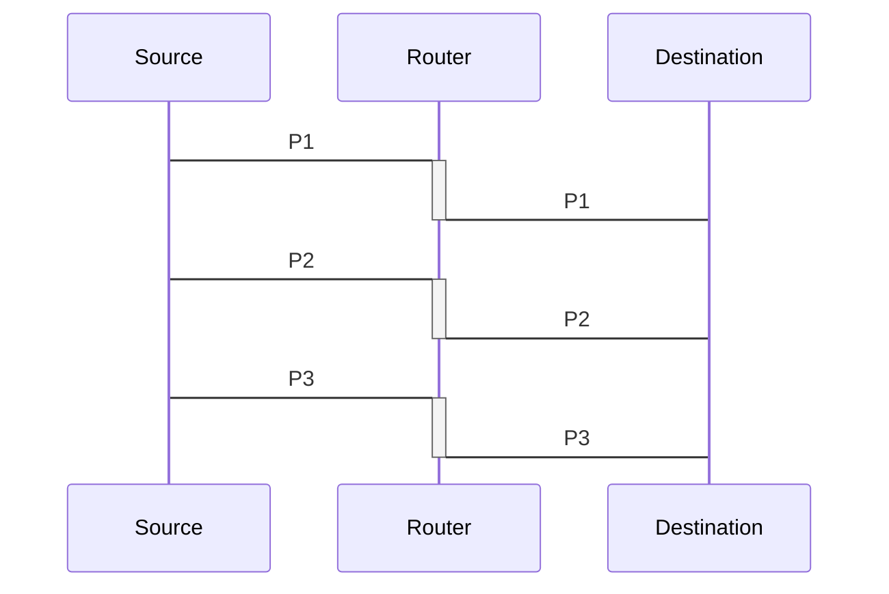
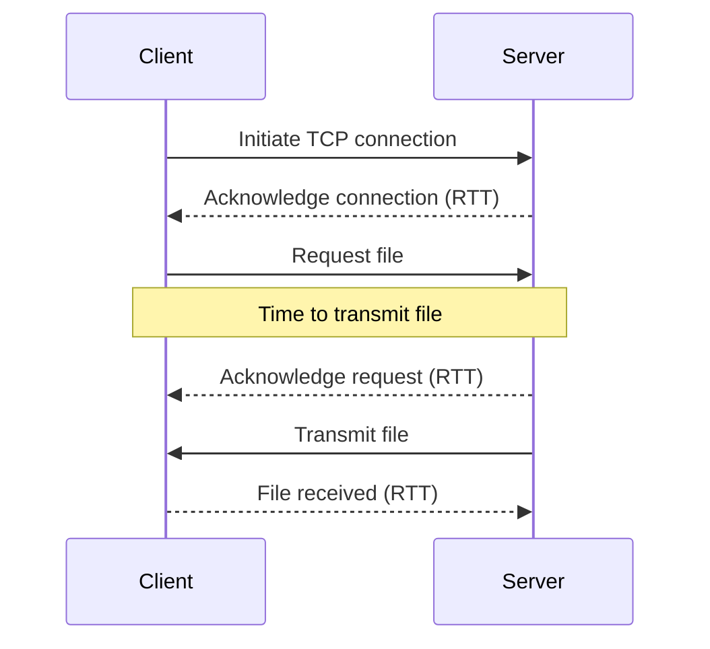
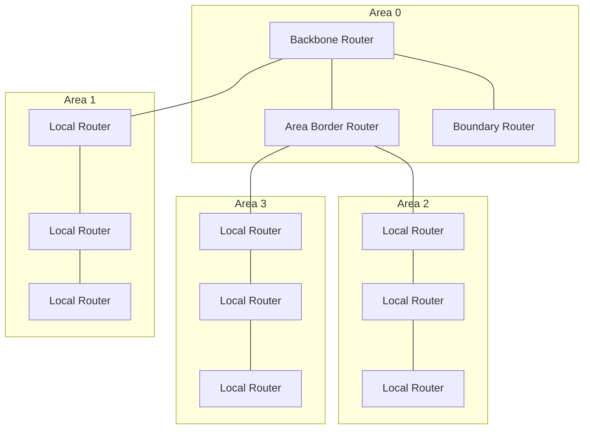

# 1. Introduction
The **Internet** is often referred to as a *network of networks* due to its structure. It connects billions of devices globally through an intricate system of routers, switches, communication links, and hosts. At its core, the Internet can be broken down into three main components:
1. **Network Edge** – This encompasses the *end devices*, including hosts such as clients and servers, and the *physical media* through which they connect to networks.
2. **Access Networks / Physical Media** – These represent the *wired and wireless communication links* that connect end systems to the Internet, often referred to as access networks.
3. **Network Core** – The heart of the Internet, consisting of a mesh of *interconnected routers* that direct packets of data across the world.
### Key Components of Internet Structure:
1. **Packet Switching**  
   The Internet relies on a technique known as **packet switching**, where data is divided into small chunks called **packets**. Each packet contains a portion of the overall message along with control information such as the destination address.  
   - *Why use packet switching?*  
     It allows for more efficient use of network resources. Instead of establishing a dedicated connection between devices, the data is broken into packets, which can take different paths through the network. This makes the network more resilient to failures and optimizes bandwidth usage.
2. **Communication Links**  
   Communication links form the backbone of data transmission between devices across the Internet. These links can be categorized as wired (e.g., fiber-optic cables, Ethernet) or wireless (e.g., radio, satellite).  
	- *Transmission rate* (also referred to as bandwidth) is a key characteristic of these links, measuring how fast data can be sent. The unit of measurement for bandwidth is typically **bits per second (bps)**.
1. **Networks**  
   A **network** is a collection of devices such as routers, servers, and links managed by organizations like Internet Service Providers (ISPs) or businesses. These networks are interconnected to form the larger structure of the Internet, enabling global communication.
4. **Protocols**  
   Communication between devices is standardized through **protocols**. Protocols define the rules for how data is formatted, transmitted, and received. Examples include:
	- **Transmission Control Protocol (TCP)**
	- **Internet Protocol (IP)**
	- **Hypertext Transfer Protocol (HTTP)**
   These protocols ensure that data sent by one device can be understood by another, even if the two are separated by thousands of miles and hundreds of intermediate devices.
### Network Edge
At the network edge, devices must connect to the Internet through various types of access networks:
1. **Residential access networks** (e.g., DSL, cable modems)
2. **Institutional access networks** (e.g., university or corporate LANs)
3. **Mobile access networks** (e.g., 4G, 5G, Wi-Fi)
Each of these access types provides a different method for connecting to the Internet, with varying levels of speed, reliability, and availability.
#### Host: Packet Forwarding
A **host** (such as a laptop or smartphone) plays a critical role in Internet communication:
1. It takes the message generated by an application (e.g., a web browser loading a page).
2. The message is then broken down into smaller units called **packets**, each of which is typically a fixed length of **L bits**.
3. These packets are transmitted over the access network at a rate **R** bits per second (R bps), which is also called the *transmission rate* or *link bandwidth*.  
   The **packet transmission delay**, the time taken to send a packet, is calculated as $\frac{L}{R}$.
### Link: Physical Media
A **link** refers to the physical connection between a transmitter and a receiver, through which data is sent as a stream of bits. This link can vary in its physical form:
1. **Guided Media**  
   Transmission through solid mediums such as copper wire, coaxial cable, or fiber-optic cable. These are generally more stable and faster compared to wireless media.
2. **Unguided Media**  
   Wireless communication where signals are transmitted through the air, such as with radio waves or satellite communication. Although wireless media offer greater flexibility and mobility, they are typically more prone to interference.
### Network Core
The **network core** is the central backbone of the Internet, made up of a vast array of interconnected routers. Two key processes occur within this core:
1. **Forwarding**  
   A *local* operation performed at each router, where incoming packets are moved to the appropriate outgoing link based on destination addresses.
2. **Routing**  
   A *global* process involving the determination of the path that packets will follow to reach their destination. This is done using algorithms that choose the best path through the network, taking into account factors such as congestion and distance.
#### Packet Switching in Action
```tikz
\begin{document}
	\begin{tikzpicture}
		% Draw the source and destination laptops
		\draw[fill=gray!20] (0,0) rectangle (1.5,1.2);
		\draw[fill=gray!20] (10,0) rectangle (11.5,1.2);
		\draw (0.5,1.2) -- (0.5,1.5) -- (1,1.5) -- (1,1.2); % Top part of laptop
		\draw (10.5,1.2) -- (10.5,1.5) -- (11,1.5) -- (11,1.2);
		
		% Draw faces on the laptops
		\draw (0.75,0.8) circle [radius=0.2];
		\draw (10.75,0.8) circle [radius=0.2];
		\draw (0.6,0.85) -- (0.7,0.85);
		\draw (10.6,0.85) -- (10.7,0.85);
		\draw (0.8,0.85) -- (0.9,0.85);
		\draw (10.8,0.85) -- (10.9,0.85);
		\draw (0.7,0.75) arc (0:180:0.1);
		\draw (10.7,0.75) arc (0:180:0.1);
		
		% Draw the source and destination labels
		\node[align=center] at (0.65,-0.5) {source};
		\node[align=center] at (10.75,-0.5) {destination};
		
		% Draw the router
		\draw[fill=gray!20] (5.4,0.6) circle [radius=0.6];
		\node[align=center] at (5.4,-0.5) {Router};
		
		% Draw the links
		\draw[->,thick] (1.7,0.6) -- (4.7,0.6);
		\draw[->,thick] (6.2,0.6) -- (9.8,0.6);
		
		% Labels for links
		\node[align=center] at (2.875,1.1) {LINK};
		\node[align=center] at (7.875,1.1) {LINK};
		
		% Transmit and receive labels
		\node[align=center] at (7.875,0) {transmits at $R$ bits/sec};
		
		% Draw the L bits per packet on the source
		\draw[->] (-1,1.75) -- (-0.25,0.6);
		\node[align=center] at (-1.5,1.75) {$L$ bits per packet};
		% Title
		\node[align=center] at (5,-2) {\textbf{Packet Switching}};
	\end{tikzpicture}
\end{document}
```
In a **packet-switched network**, each router along the path uses a process known as **store and forward**. This means:
- The router must receive the *entire packet* before it can forward it to the next router in the path.
- The time taken to transmit a packet into a link is known as **transmission delay** and is calculated as $T = \frac{L}{R}$, where:
	- $L$ is the packet size (in bits)
	- $R$ is the link bandwidth (in bits per second)
For multiple packets, the total time to transmit $N$ packets would be calculated as $T_N = (N + 1) \frac{L}{R}$.
This can be represented diagrammatically as:

OR:
```tikz
\usetikzlibrary{positioning}
\begin{document}
	\begin{tikzpicture}
		    % Draw vertical lines
		    \draw[thick] (0,0) -- (0,-9) node[] {time} node[very near start,left] {source};
		    \draw[thick] (2,0) -- (2,-9) node[] {time} node[very near start,left] {router};
		    \draw[thick] (4,0) -- (4,-9) node[] {time} node[very near start,left] {destination};
		
		    % Draw horizontal lines representing packets
		    \draw[thick] (0,-2) -- (2,-2) node[midway,above] {P1};
		    \draw[thick] (0,-4) -- (2,-4) node[midway,above] {P2};
		    \draw[thick] (0,-6) -- (2,-6) node[midway,above] {P3};
		
		    \draw[thick] (2,-4) -- (4,-4) node[midway,above] {P1};
		    \draw[thick] (2,-6) -- (4,-6) node[midway,above] {P2};
		    \draw[thick] (2,-8) -- (4,-8) node[midway,above] {P3};
		    % Time indicators
		    \node[left] at (0,0) {0};
	\end{tikzpicture}
\end{document}
```
### Packet Queuing and Loss
In a network core, packets arriving at a router may need to wait before being transmitted if the router’s outgoing link is already busy. This creates a **queue**. When this happens:
- **Packet Queuing** occurs when the arrival rate (in bits per second) exceeds the transmission rate of the outgoing link.
- **Packet Loss** occurs when the router’s buffer (where waiting packets are stored) becomes full, resulting in packets being dropped.
### Circuit Switching
In contrast to packet switching, **circuit switching** is a method where the path between the sender and receiver is dedicated for the duration of the communication. This method is commonly used in traditional telephone networks.
- Resources (such as bandwidth) are pre-allocated and dedicated to the communication, ensuring guaranteed delivery and minimal delay.
- Circuit switching can be implemented using techniques such as:
	1. **Frequency Division Multiplexing (FDM)** – where different communication streams are allocated different frequency bands.
	```tikz
	   \begin{document}
	   \begin{tikzpicture}
		    % Draw the axes
		    \draw[thick,->>] (0,0) -- (13,0) node[right] {time};
		    \draw[thick,->>] (0,0) -- (0,5) node[above] {freq.};
		    % Draw the horizontal colored bands
		    \filldraw[fill=yellow!50, draw=black] (0,0) rectangle (12,1) node[midway] {};
		    \filldraw[fill=purple!20, draw=black] (0,1) rectangle (12,2) node[midway] {};
		    \filldraw[fill=green!20, draw=black] (0,2) rectangle (12,3) node[midway] {};
		    \filldraw[fill=red!20, draw=black] (0,3) rectangle (12,4) node[midway] {};
		    % Labels
		    \node[right] at (7,2) {4 users};
	    \end{tikzpicture}
	    \end{document}
   ```
    2. **Time Division Multiplexing (TDM)** – where each communication stream is allocated a time slot.
  ```tikz
       \begin{document}
       \begin{tikzpicture}
		    % Draw the axes
		    \draw[thick,->] (0,0) -- (9,0) node[right] {time};
		    \draw[thick,->] (0,0) -- (0,7) node[above] {freq.};
		    % Draw the colored ovals (representing time slots for different users)
		    \filldraw[fill=red!20, draw=black] (0,0) rectangle (1,6);
		    \filldraw[fill=green!20, draw=black] (1,0) rectangle (2,6);
		    \filldraw[fill=purple!20, draw=black] (2,0) rectangle (3,6);
		    \filldraw[fill=yellow!20, draw=black] (3,0) rectangle (4,6);
		    \filldraw[fill=red!20, draw=black] (4,0) rectangle (5,6);
		    \filldraw[fill=green!20, draw=black] (5,0) rectangle (6,6);
		    \filldraw[fill=purple!20, draw=black] (6,0) rectangle (7,6);
		    \filldraw[fill=yellow!20, draw=black] (7,0) rectangle (8,6);
		\end{tikzpicture}
		\end{document}
   ```
### Performance Metrics
Several factors affect the overall performance of a network:
1. **Packet Loss**  
   This occurs when packets are dropped due to full queues at routers. In a well-functioning network, packet loss is minimized through efficient congestion control mechanisms.
2. **Packet Delay**  
   This includes:
	- **Processing Delay**: Time taken to process a packet at a router (e.g., checking for bit errors).
	- **Queuing Delay**: Time a packet spends waiting in a router’s queue.
	- **Transmission Delay**: Time taken to push the packet onto the link.
	- **Propagation Delay**: Time taken for the packet to travel along the physical medium (distance/speed).
3. **Throughput**  
   The throughput is the actual rate at which data is transferred across the network. It can vary based on the number of users, the type of communication links, and other factors such as congestion.Continuing from where you left off, let's expand your explanation of **packet delay** and related concepts to make the notes more verbose, detailed, and informative, similar to high-quality university course notes.
### Packet Delay
In a network, the end-to-end delay experienced by a packet as it travels from a sender to a receiver is the sum of several contributing delays. These delays can occur at multiple points during the packet’s journey, including the processing by intermediate routers and the propagation through the physical communication links.
The total **nodal delay** experienced by a packet at a router or any network node can be modeled as:
$$d_{\text{nodal}} = d_{\text{proc}} + d_{\text{queue}} + d_{\text{trans}} + d_{\text{prop}}$$
```tikz
\begin{document}
\begin{tikzpicture}
% Draw the source laptop
\draw[fill=gray!20] (0,0) rectangle (1.5,1.2);
\draw (0.5,1.2) -- (0.5,1.5) -- (1,1.5) -- (1,1.2); % Top part of laptop
% Draw face on the laptop
\draw (0.75,0.8) circle [radius=0.2];
\draw (0.6,0.85) -- (0.7,0.85);
\draw (0.8,0.85) -- (0.9,0.85);
\draw (0.7,0.75) arc (0:180:0.1);
% Draw the routers
\draw[fill=gray!20] (3,-0.5) circle [radius=0.75];
\draw[fill=gray!20] (8,-0.5) circle [radius=0.75];
% Draw the links
\draw[->,thick] (1.5,0.6) -- (2.25,0.6);
\draw[->,thick] (3.75,0.6) -- (7.25,0.6);
\draw[->,thick] (8.75,0.6) -- (10,0.6);
% Add labels
\node[align=center, red] at (2.875,1.5) {transmission};
\node[align=center, red] at (5.5,1.5) {propagation};
\node[align=center, red] at (3,-1.25) {node processing};
\node[align=center, red] at (3.875,-0.5) {queuing};
\draw[<->,red] (2.25,1.2) -- (3.75,1.2); % Transmission
\draw[<->,red] (3.75,-0.5) -- (2.25,-0.5); % Queuing
\draw[<->,red] (3.75,1.2) -- (7.25,1.2); % Propagation
% Draw the second router and final link to destination
\draw[->,thick] (8.75,0.6) -- (10,0.6);
\end{tikzpicture}
\end{document}
```
#### 1. Nodal Processing Delay ($d_{\text{proc}}$)
- This is the time it takes for the router to examine the packet's header and determine the appropriate outgoing link.
- **Processing tasks** include error checking (e.g., verifying the integrity of the packet using checksums) and looking up the destination in a routing table to decide the best route.
- Processing delay is typically very small (on the order of microseconds), but it can increase if the router is heavily loaded or if it needs to perform more complex operations (e.g., running security checks or traffic filtering).
#### 2. Queuing Delay ($d_{\text{queue}}$)
- After the packet is processed, it may need to wait in a **queue** before being transmitted onto the next link. This is especially likely when multiple packets are competing for the same outgoing link.
- The queuing delay depends heavily on the **traffic intensity** at the router. 
	- If packets are arriving faster than the link can transmit them, the queue will grow and packets will experience longer delays.
	- The **traffic intensity** can be calculated as $\frac{L \cdot a}{R}$, where:
		- $L$ is the packet size in bits,
		- $a$ is the average arrival rate of packets (packets per second),
		- $R$ is the link transmission rate (bits per second).
- As traffic intensity approaches 1 (i.e., the arrival rate equals or exceeds the service rate), the queuing delay can become very large and packet loss due to buffer overflow can occur.
#### 3. Transmission Delay ($d_{\text{trans}}$)
- This is the time required to actually **push the packet onto the link**. The transmission delay depends on the size of the packet ($L$ bits) and the transmission rate of the link ($R$ bits per second), this is sometimes referred to as, **the link capacity or the link bandwidth**.
- Transmission delay is calculated as: $$d_{\text{trans}} = \frac{L}{R}$$
- For example, if a packet is 1,500 bits and the transmission rate is 1,000,000 bits per second (1 Mbps), the transmission delay would be: $$d_{\text{trans}} = \frac{1500}{1,000,000} = 1.5 \times 10^{-3} \ \text{seconds} = 1.5 \ \text{ms}$$
#### 4. Propagation Delay ($d_{\text{prop}}$)
- Once a packet is placed on the link, the time it takes to **propagate** from one end of the link to the other is called propagation delay. This delay depends on the physical length of the link ($d$) and the propagation speed of the signal through the medium ($S$), which is typically around $2 \times 10^8$ meters per second in fiber optics or copper.
- The propagation delay is given by: $$d_{\text{prop}} = \frac{d}{S}$$
- For instance, if the distance between two routers is 1000 km and the propagation speed is $2 \times 10^8$ m/s, the propagation delay would be: $$d_{\text{prop}} = \frac{1000 \times 10^3}{2 \times 10^8} = 5 \times 10^{-3} \ \text{seconds} = 5 \ \text{ms}$$
In summary, the total delay a packet experiences at each hop can be thought of as the sum of these four delays, with queuing and propagation delays often dominating in cases of high network congestion or long-distance communication.
### Throughput
**Throughput** is another critical metric in network performance. It is the rate at which data is successfully transmitted over a network link from sender to receiver, usually measured in bits per second (bps).
There are two types of throughput:
1. **Instantaneous Throughput**  
   This is the transmission rate at any given moment. For example, if there is a brief period of high network activity, the instantaneous throughput could be quite high.
2. **Average Throughput**  
   This is the rate over a longer period of time and is typically more meaningful when assessing the performance of a network over sustained usage. It takes into account periods of both high and low traffic.
#### Bottleneck Link
```tikz
\begin{document}
\begin{tikzpicture}
    % Draw the central router (circle with X)
    \draw[thick] (0,0) circle (0.5) node {$\times$};
    \node[pink] at (-1,-0.1) {\large R};
    % Draw the first server icon
    \begin{scope}[shift={(-4,2)}, scale=0.50]
        \draw[rounded corners, fill=black!70] (0,1.5) rectangle ++(5,1);
        \draw[rounded corners, fill=black!70] (0,0) rectangle ++(5,1);
        \fill[white] (3.75,2) circle (0.2);
        \fill[white] (4.5,2) circle (0.2);
        \fill[white] (3.75,0.5) circle (0.2);
        \fill[white] (4.5,0.5) circle (0.2);
    \end{scope}
    \node[orange] at (-4.5,2.5) {\large $R_s$};
    % Draw the second server icon
    \begin{scope}[shift={(2,2)}, scale=0.50]
        \draw[rounded corners, fill=black!70] (0,1.5) rectangle ++(5,1);
        \draw[rounded corners, fill=black!70] (0,0) rectangle ++(5,1);
        \fill[white] (3.75,2) circle (0.2);
        \fill[white] (4.5,2) circle (0.2);
        \fill[white] (3.75,0.5) circle (0.2);
        \fill[white] (4.5,0.5) circle (0.2);
    \end{scope}
    % Draw the first laptop
    \begin{scope}[shift={(-1.4,-1.6)},scale=0.50]
	    \fill[color=black!70] (-3,-3) rectangle (-1,-3.5);
	    \draw[fill=black!70] (-2.75,-3) -- (-2.75,-1.5) -- (-1.25,-1.5) -- (-1.25,-3) -- cycle;
	    \fill[color=white] (-2.5,-2.75) rectangle (-1.5,-1.75);
	    \draw[fill=black!70] (-3,-3) to[out=-90, in=-90] (-1,-3) -- (-1,-3.5) -- (-3,-3.5) -- cycle;
	    %% \node[orange] at (-3.5,-2.5) {\large $R_c$}; %%
	\end{scope}
    % Draw the second laptop
    \begin{scope}[shift={(1.4,-1.5)},scale=0.50]
	    \fill[color=black!70] (3,-3) rectangle (1,-3.5);
	    \draw[fill=black!70] (1.25,-3) -- (1.25,-1.5) -- (2.75,-1.5) -- (2.75,-3) -- cycle;
	    \fill[color=white] (1.5,-2.75) rectangle (2.5,-1.75);
	    \draw[fill=black!70] (3,-3) to[out=-90, in=-90] (1,-3) -- (1,-3.5) -- (3,-3.5) -- cycle;
	\end{scope}
    % Draw the connections
    \draw[thick,->] (-2.5,2) -- (0,0.7) node[midway,above,orange] {$R_s$};
    \draw[thick,->] (2.5,2) -- (0,0.7);
    \draw[thick,->] (-2,-2.75) -- (0,-0.7) node[midway,below,orange] {$R_c$};
    \draw[thick,->] (2,-2.75) -- (0,-0.7);
\end{tikzpicture}
\end{document}
```
In any end-to-end communication path, there is usually a **bottleneck link** — the link with the lowest transmission rate. This link limits the overall throughput of the connection.
For example, if data is being transmitted through several links with different transmission rates, the bottleneck link will constrain the end-to-end throughput.
**Example:**
- Suppose there are two links in a path:
	- Link 1: $R_1 = 50$ Mbps
	- Link 2: $R_2 = 25$ Mbps
- The throughput of the system would be determined by the slower link (Link 2), i.e., 25 Mbps.
### Protocol Layers
```tikz
\begin{document}
\begin{tikzpicture}
	% Layer colors
	\fill[red!20] (0,4) rectangle (4,5);
	\fill[blue!20] (0,3) rectangle (4,4);
	\fill[cyan!20] (0,2) rectangle (4,3);
	\fill[blue!10] (0,1) rectangle (4,2);
	\fill[cyan!10] (0,0) rectangle (4,1);
	% Layers and labels
	\node[text=red] at (2,4.5) {Application};
	\node at (5.5,4.5) {$\rightarrow$ message};
	\node[text=red] at (2,3.5) {Transport};
	\node at (5.5,3.5) {$\rightarrow$ segment};
	\node[text=red] at (2,2.5) {Network};
	\node at (5.5,2.5) {$\rightarrow$ datagram};
	\node[text=red]  at (2,1.5) {Link};
	\node at (5.5,1.5) {$\rightarrow$ frame};
	\node[text=orange] at (2,0.5) {Physical};
	\node at (5.5,0.5) {$\rightarrow$ frame};
	% Outline the layers
	\draw[thick] (0,0) rectangle (4,5);
\end{tikzpicture}
\end{document}
```
Networking protocols are organized in layers, forming a stack known as the **Internet Protocol Stack**. Each layer provides a set of services to the layer above it, encapsulating the data as it moves down the stack from the application layer to the physical layer during transmission, and decapsulating it as it moves up the stack at the receiving end.
#### 1. Application Layer
- This layer is responsible for supporting network applications, such as web browsing, email, and file transfer.
- Examples of protocols: **HTTP, SMTP, FTP, DNS**
- Data at this layer is referred to as a **message**.
#### 2. Transport Layer
- This layer provides process-to-process data transfer.
- The two most important transport layer protocols are:
	- **TCP** (Transmission Control Protocol) – Provides reliable, ordered, and error-checked delivery.
	- **UDP** (User Datagram Protocol) – Provides a connectionless, lightweight transport.
- Data at this layer is referred to as a **segment**.
#### 3. Network Layer
- This layer handles **routing** of datagrams (packets) from source to destination, ensuring that data can move across different networks.
- The most important protocol at this layer is **IP** (Internet Protocol), which provides logical addressing and path selection.
- Data at this layer is referred to as a **datagram**.
#### 4. Link Layer
- This layer provides the point-to-point data transfer between two physically connected network nodes.
- Examples include **Ethernet, Wi-Fi, PPP (Point-to-Point Protocol)**.
- Data at this layer is referred to as a **frame**.
#### 5. Physical Layer
- The physical layer is concerned with the transmission of raw bits over a physical medium. It involves converting digital data into electrical or optical signals for transmission.
- Data at this layer is still referred to as a **frame**.
### Encapsulation and Decapsulation
```tikz
\usepackage{xcolor}
\begin{document}
	\begin{tikzpicture}
		% Encapsulation and Decapsulation arrows
		\draw[orange, thick, ->] (-1,4.5) -- (-1,0) node[midway, left] {\textcolor{orange}{encapsulation}};
		\draw[orange, thick, ->] (5.5,0) -- (5.5,4.5) node[midway, right] {\textcolor{orange}{decapsulation}};
		% Messages and headers
		% Message M
		\draw[thick] (3.5,4.5) rectangle (4,5);
		\node at (3.75,4.75) {\textbf{M}};
		% Header Ht + Message M
		\draw[thick] (2.5,3.5) rectangle (3.5,4);
		\draw[thick] (3.5,3.5) rectangle (4,4);
		\node at (3,3.75) {\textbf{H\textsubscript{t}}};
		\node at (3.75,3.75) {\textbf{M}};
		% Header Hm + Ht + Message M
		\draw[thick] (1.5,2.5) rectangle (2.5,3);
		\draw[thick] (2.5,2.5) rectangle (3.5,3);
		\draw[thick] (3.5,2.5) rectangle (4,3);
		\node at (2,2.75) {\textbf{H\textsubscript{m}}};
		\node at (3,2.75) {\textbf{H\textsubscript{t}}};
		\node at (3.75,2.75) {\textbf{M}};
		% Header Hj + Hm + Ht + Message M
		\draw[thick] (0.5,1.5) rectangle (1.5,2);
		\draw[thick] (1.5,1.5) rectangle (2.5,2);
		\draw[thick] (2.5,1.5) rectangle (3.5,2);
		\draw[thick] (3.5,1.5) rectangle (4,2);
		\node at (1,1.75) {\textbf{H\textsubscript{j}}};
		\node at (2,1.75) {\textbf{H\textsubscript{m}}};
		\node at (3,1.75) {\textbf{H\textsubscript{t}}};
		\node at (3.75,1.75) {\textbf{M}};
		% Labels
		\node[pink] at (4.7,5.2) {message};
		\node[pink] at (1.9,4.2) {header};
	\end{tikzpicture}
\end{document}
```
As data is transmitted from one end to the other in a network, it undergoes **encapsulation** at the sender and **decapsulation** at the receiver:
- **Encapsulation**: Data is wrapped with protocol-specific headers at each layer as it moves down the protocol stack.
- **Decapsulation**: As data is received, the protocol-specific headers are removed at each layer as it moves up the protocol stack.
This process ensures that each layer can provide its specific services, such as addressing, error-checking, or routing, without interfering with the operation of other layers.
For example:
- At the network layer, the **transport layer segment** is encapsulated with a **network layer header**, creating a **datagram**.
- At the link layer, the **datagram** is encapsulated with a **link layer header**, creating a **frame**.
**Example**: The network layer encapsulates the transport layer segment $$\fbox{H$_{t}$}\fbox{$M_\ $}$$with a network layer header $H_n$ to create a network layer datagram. $H_n$ is used by the network layer protocol to implement its service.
# 2. Application Layer
### Application Layer: Explanation
The **Application Layer** is the highest layer in the network protocol stack, where user-level applications interface with network services. Applications like web browsers, email clients, and video conferencing tools rely on this layer to communicate with their counterparts over the network. This layer defines how network applications send and receive data, focusing on the interaction between software (e.g., browsers, servers) rather than the specifics of network transport.
#### Principles of Network Applications
Network applications follow specific **communication paradigms** to manage how they exchange data across the network:
#### Paradigms
1. **Client-Server Paradigm**
	- **Server**:  
	  In this paradigm, the **server** is an **always-on host** with a **permanent IP address**, often housed in **data centers** to provide the necessary resources and scalability for large-scale operations. The server continuously waits for and responds to client requests, providing the necessary resources or data.  
		 - Examples: Web servers, database servers, email servers.
		 - Servers are engineered for **high availability** and **scalability**. They maintain the same IP address to ensure that clients can reliably initiate contact.
	- **Clients**:  
	  **Clients** initiate communication with the server to request data or services. Clients are often **intermittently connected**, meaning they do not need to be online all the time and can join or leave the network dynamically. They also may have **dynamic IP addresses** that can change depending on the network (e.g., through DHCP).  
		 - Examples: Web browsers, mobile apps, desktop applications.
2. **Peer-to-Peer (P2P) Paradigm**
	- **No central server**:  
	  In a P2P network, there is no always-on server. Instead, **peers** (which are arbitrary end systems) directly communicate with each other. This decentralized approach allows any peer to act as both a **client** and a **server**, requesting services from other peers while also providing services in return.
	- **Self-Scalability**:  
	  As more peers join the network, both the demand for services and the capacity to provide services increase proportionally. This **self-scalability** is a key advantage of P2P networks, making them resilient and highly scalable.
	- **Dynamic connectivity**:  
	  Peers in a P2P network can connect and disconnect freely. They may also have **dynamic IP addresses**, meaning that each session might involve different network configurations.
	- Examples: File-sharing systems like **BitTorrent**, communication platforms like **Skype**, and decentralized blockchain networks.
#### Process Communication
At the core of application-layer communication is the **process**—an instance of a running program on a host. Communication between processes happens at both the client-server and P2P levels.
- **Process**:  
  A program running on a host. There are two main types of processes in network applications:
	1. **Client Process**: A process that initiates communication (e.g., a web browser requesting a webpage).
	2. **Server Process**: A process that waits to be contacted and responds to client requests (e.g., a web server).
- **Inter-Process Communication (IPC)**:  
  This refers to the communication between two processes running on the same host. It allows processes to exchange data and signals within a single machine, typically through shared memory or message passing.
- **Messages**:  
  When processes are running on **different hosts**, they exchange data through messages sent over the network. These messages carry the data being requested or provided, along with necessary control information (headers, addresses, etc.).
- **Socket**:  
  A **socket** serves as the endpoint for sending and receiving messages in a process. Each process in a host has a socket that facilitates network communication. The socket provides an interface to the transport layer, allowing processes to exchange data over the network.
#### Addressing Processes
For a process to receive messages, it needs a unique **identifier** that consists of two elements:
1. **IP Address**: Identifies the host on which the process runs. This ensures the message is delivered to the correct machine in a network.
2. **Port Number**: Identifies the specific process running on the host. Port numbers are used to route incoming messages to the correct application.
Example: A web server running on the host with IP address `129.97.58.100` typically listens for requests on **port 80** (HTTP). A message sent to `129.97.58.100:80` will be routed to the web server process running on that machine.
### Application-Layer Protocols
An **application-layer protocol** defines the rules for how network applications communicate. These protocols standardize the format and exchange of messages between applications on different hosts. Here are key components of an application-layer protocol:
1. **Types of messages exchanged**:  
   Different types of messages are used depending on the application. For example, HTTP uses **request** and **response** messages, while email protocols like SMTP use **send** and **receive** commands.
2. **Message Syntax**:  
   The format of messages, including the structure of fields, headers, and payloads. Protocols must define how data is arranged and separated to ensure accurate interpretation.
3. **Message Semantics**:  
   The meaning of the fields and data within the message. Each protocol specifies what information each field carries (e.g., destination URL, status codes in HTTP).
4. **Rules for sending and receiving messages**:  
   Protocols define when and how processes should send and respond to messages, including handling errors, timeouts, and retransmissions.
5. **Open Protocols**:  
   Many application-layer protocols are open, meaning they are publicly defined and standardized in **Request for Comments (RFCs)**. This promotes **interoperability**, ensuring that different implementations can work together.  
   - Examples: **HTTP**, **SMTP**, **FTP**.
1. **Proprietary Protocols**:  
   Some protocols are proprietary and privately owned, meaning they are controlled by a specific organization. These protocols may provide additional features but are generally not interoperable with open systems.  
	- Examples: **Skype**, **Zoom**.
### The Web & HTTP
The **Web** is built on the **Hypertext Transfer Protocol (HTTP)**, an application-layer protocol designed for retrieving and displaying web pages.
- **Webpages** consist of multiple **objects** such as images, audio files, and scripts. Each object is identified by a unique **Uniform Resource Locator (URL)**, which specifies the location of the object on the server.
- A webpage typically includes a **base HTML file** along with several referenced objects, each of which the browser must request separately.
#### HTTP Overview
- **HTTP** follows a **client-server model**, where:
	- The **client** is a web browser that requests and displays webpages.
	- The **server** stores and serves these webpages in response to client requests.
- HTTP relies on **TCP** as its transport protocol:
	1. The client initiates a **TCP connection** to the server on port 80 (HTTP) or port 443 (HTTPS for secure connections).
	2. The server accepts the TCP connection and establishes a communication link.
	3. **HTTP messages** are exchanged between the client (requesting objects) and the server (delivering objects).
	4. After all objects are transferred, the **TCP connection is closed** (in non-persistent connections).
- **HTTP is stateless**:  
  Each request from a client is treated as an independent transaction, with no memory of previous requests. This simplifies the protocol but requires the client to include all relevant information (e.g., cookies) in every request.

### Non-Persistent HTTP
- **Round-Trip Time (RTT)**:  
  The time for a small packet to travel from the client to the server and back is called the **RTT**. This is a crucial metric for determining the total time required for an HTTP request to complete.
- **HTTP Response Time**:  
  In non-persistent HTTP, the response time can be calculated as: $$\text{HTTP Response Time} = 2 \times \text{RTT} + \text{file transmission time}$$
**Challenges with Non-Persistent HTTP**:
- Each object requires **2 RTTs** (one for the request and one for the object).
- There is significant **OS overhead** for creating and closing TCP connections for every object.
- To mitigate these issues, browsers often open **multiple parallel TCP connections** to fetch several objects simultaneously.
### Persistent HTTP
In **persistent HTTP**, the server leaves the TCP connection **open** after sending a response, allowing multiple objects to be transferred over the same connection. This approach reduces the need for repeated TCP handshakes and lowers overhead.
- **Benefits**:
	- The client can send **subsequent requests** for referenced objects over the same connection.
	- It requires **only 1 RTT** for all objects, significantly reducing the time required to load a webpage.
- **Operation**:  
  As soon as the client encounters a referenced object (e.g., an image or script), it can send a request for that object without waiting for a new TCP connection. Persistent HTTP is more efficient, especially for webpages with multiple embedded objects.
### HTTP Request Message
An **HTTP Request Message** is sent by a client (e.g., web browser) to request a resource (e.g., a webpage or an image) from a server. The request message follows a standard format with a clear structure to ensure that the server understands and processes the request correctly.
#### General Format of an HTTP Request:
1. **Request Line**:  
   This line specifies the **HTTP method** (e.g., GET, POST, PUT), the **URL** of the requested resource, and the **HTTP version**.  
   Example:  
   `GET /index.html HTTP/1.1`
2. **Header Lines**:  
   These lines contain additional information, in the form of key-value pairs, that provides context about the client and the request. Common headers include:
	- `Host`: Specifies the server’s hostname.
	- `User-Agent`: Provides information about the client software (browser, OS).
	- `Accept`: Specifies the types of media formats the client can handle.
	- `Connection`: Controls whether the connection should be kept alive after the transaction.
1. **Body** (optional):  
   The request body contains additional data for the server to process (mainly for POST and PUT requests). In a GET request, there is typically no body, but for POST, the body might contain form data or JSON payload.
#### Example HTTP Request:
```plaintext
GET /index.html HTTP/1.1\r\n
Host: www-net.cs.umass.edu\r\n
User-Agent: Mozilla/5.0 (Macintosh; Intel Mac OS X 10_15_7; rv:80.0) Gecko/20100101 Firefox/80.0\r\n
Accept: text/html,application/xhtml+xml\r\n
Accept-Encoding: gzip,deflate\r\n
Connection: keep-alive\r\n
```
In this example:
- The client is requesting the `/index.html` resource from the server.
- The `Host` header specifies the server `www-net.cs.umass.edu`.
- The `User-Agent` header indicates that the client is using **Firefox** on a **Macintosh** system.
- The `Accept` and `Accept-Encoding` headers tell the server which content types and encodings the client can handle.
- The `Connection` header requests that the connection be kept alive for potential future requests.
### HTTP Response Message
The **HTTP Response Message** is sent from the server back to the client to fulfill the request. It contains the requested data (if successful) and other information about the response.
#### General Format of an HTTP Response:
1. **Status Line**:  
   This line contains the **HTTP version**, a **status code**, and a **status phrase**.  
   Example:  
   `HTTP/1.1 200 OK`
2. **Header Lines**:  
   Like in the request message, these header lines provide additional information about the response. Common response headers include:
	- `Content-Type`: Specifies the media type of the returned resource (e.g., `text/html`).
	- `Content-Length`: Specifies the length of the returned content in bytes.
	- `Server`: Provides information about the server software (e.g., Apache, Nginx).
1. **Body**:  
   The body contains the requested resource, such as an HTML file, an image, or other data. For example, if the client requested an HTML page, the response body would contain the HTML content of that page.
#### Common Status Codes:
- **200 OK**: The request was successful, and the server is sending the requested data.
- **301 Moved Permanently**: The requested resource has been permanently moved to a new location.
- **400 Bad Request**: The server cannot process the request due to a client error (e.g., malformed request syntax).
- **404 Not Found**: The requested resource could not be found on the server.
- **505 HTTP Version Not Supported**: The server does not support the HTTP version used in the request.
#### Example HTTP Response:
```plaintext
HTTP/1.1 200 OK\r\n
Date: Tue, 15 Nov 2023 08:12:31 GMT\r\n
Server: Apache/2.4.7 (Ubuntu)\r\n
Last-Modified: Tue, 15 Nov 2023 08:12:31 GMT\r\n
Content-Type: text/html\r\n
Content-Length: 138\r\n
Connection: keep-alive\r\n
<html>
<head><title>Example</title></head>
<body>Hello World!</body>
</html>
```
In this response:
- The server responds with a status code of `200 OK`, indicating that the request was successful.
- Headers provide information about the server (`Apache/2.4.7`), content type (`text/html`), and content length (`138 bytes`).
- The body contains the requested HTML document, which the browser will render.
### DNS (Domain Name System)
The **Domain Name System (DNS)** is a hierarchical, distributed database that is used to map domain names (e.g., `www.example.com`) to IP addresses (e.g., `192.0.2.1`). DNS enables humans to use easily memorable domain names while the network operates using numerical IP addresses.
#### DNS Services:
1. **Hostname-to-IP Address Translation**:  
   DNS resolves domain names to IP addresses, allowing users to type in a domain like `google.com` instead of having to remember `142.250.72.14`.
2. **Host Aliasing**:  
   DNS supports **canonical names** and **alias names**. For example, the domain `google.com` might have an alias like `mail.google.com`. DNS maps both names to the same canonical hostname.
3. **Mail Server Aliasing**:  
   Similar to host aliasing, DNS allows for **aliasing** of mail servers, helping with the management of email delivery.
4. **Load Distribution**:  
   DNS can balance traffic among multiple servers hosting the same domain. It distributes requests to different IP addresses associated with the same domain name to avoid overloading a single server.
#### DNS Structure:
DNS operates in a hierarchical structure, with **Root Name Servers** at the top, followed by **Top-Level Domain (TLD) Servers**, and **Authoritative Name Servers** that manage specific domains.
1. **Root Name Servers**:  
   These servers are at the top of the DNS hierarchy and manage queries for TLD servers like `.com`, `.org`, and `.edu`. They serve as the fallback when lower-level servers cannot resolve a domain name.
2. **Top-Level Domain (TLD) Servers**:  
   These servers are responsible for specific top-level domains such as `.com`, `.org`, and country-specific domains like `.uk` or `.in`. They direct queries to the correct authoritative DNS server for a particular domain.
3. **Authoritative DNS Servers**:  
   Each organization or domain has its **authoritative DNS server**, which provides the **hostname-to-IP mappings** for its own domain. For instance, `amazon.com` would have an authoritative DNS server that provides the IP address for its servers.
4. **Local DNS Name Servers**:  
   Each Internet Service Provider (ISP) maintains a **local DNS server** that serves as the first point of contact for DNS queries from end users. Local DNS servers often cache recently accessed domain names to improve lookup efficiency.
#### DNS Query Process:
1. **Iterated Query**:  
   In this method, the local DNS server queries different DNS servers, asking each for the next server in the chain. For example, if the local DNS server doesn’t know the IP for `amazon.com`, it first queries a root server, then a `.com` TLD server, and finally, the `amazon.com` authoritative server.
2. **Recursive Query**:  
   In a recursive query, the local DNS server takes full responsibility for resolving the query. The DNS server queries other DNS servers on behalf of the client and returns the final result without requiring further queries from the client.
### DNS Records
DNS uses **resource records (RRs)** to store mappings between domain names and IP addresses, among other things. Each record has a specific format and type.
#### RR Format:
$$\text{(name, value, type, ttl)}$$
Where:
- **name**: The domain name.
- **value**: The data associated with the name (e.g., an IP address).
- **type**: The type of DNS record.
- **ttl**: The time-to-live, which indicates how long the record should be cached before it must be refreshed.
#### Common DNS Record Types:
1. **Type A (Authoritative)**:  
	- **Name** = hostname
	- **Value** = IP address
   Maps a domain name to an IPv4 address.  
   Example: `(www.foo.com, 192.0.2.1, A)`
3. **Type NS (Name Server)**:  
	- **Name** = domain
	- **Value** = hostname of authoritative name server for this domain
   Specifies the authoritative DNS server for a domain.  
   Example: `(foo.com, dns.foo.com, NS)`
4. **Type CNAME (Canonical Name)**:  
	- **Name** = alias name for some canonical name
	- **Value** = canonical name
   Maps an alias domain name to the canonical domain name.  
   Example: `(mail.foo.com, www.foo.com, CNAME)`
5. **Type MX (Mail Exchange)**:  
	- **Name** = domain
	- **Value** = name of SMTP mail server associated with the name
   Specifies the mail server responsible for receiving emails for a domain.  
   Example: `(foo.com, mail.foo.com, MX)`
### DNS Protocol Messages
DNS uses a common format for both query and response messages. These messages include sections such as the header, question section, and answer section.
#### DNS Message Header:
1. **Identification**:  
   A 16-bit field that is used to match queries with responses.
2. **Flags**:  
   These bits indicate whether the message is a query or a response, whether recursion is desired, and whether the response is authoritative.
#### DNS Message Format:
```plaintext
  |----------------- 2 Bytes -----------------|  
  |       Identification      |     Flags     |  <-- Message Header
  |---------- # of Questions -----------------|
  |---------- # of Answer RRs ----------------|
  |---------- # of Authority RRs -------------|
  |---------- # of Additional RRs ------------|
  |------- Question Section (Variable) -------|
  |------- Answer Section (Variable) ---------|
  |------- Authority Section (Variable) ------|
  |------- Additional Section (Variable) -----|
```
- **Question Section**: Contains the domain name being queried.
- **Answer Section**: Contains the RRs for the domain name being queried.
- **Authority Section**: Lists the authoritative servers for the queried domain.
- **Additional Section**: Provides additional information to aid in resolution.
### Getting Your Info into DNS:
1. **Register the Domain Name**:  
   Choose and register a domain name (e.g., `example.com`) through a **DNS Registrar**.
2. **Set Up an Authoritative DNS Server**:  
   The registrar will point your domain to your authoritative DNS server, which contains the actual IP address mappings.
This ensures that when a user types your domain name, the DNS system can resolve it to the correct IP address.
# 3. Transport Layer
### Transport Layer Services
The **Transport Layer** is responsible for providing **logical communication** between application processes running on different hosts. Unlike the **Network Layer**, which handles the physical transmission of data across networks, the transport layer focuses on end-to-end communication, ensuring that data from one application can reach another application running on a different machine.
- **Logical Communication**: While the underlying network provides **physical communication** between systems, the transport layer ensures that the data from the application layer is reliably communicated between hosts in an organized and error-checked manner.
#### Key Responsibilities of the Transport Layer:
- The **transport layer** exists on both the sender's and receiver's **end systems**, but not in the routers in between.
- It provides **process-to-process communication**, where each application process (e.g., a web browser, email client) communicates via a **socket**.
- **Sender’s Role**:
	- The sender’s transport layer takes messages from the **application layer**, splits them into smaller segments (if necessary), and passes these segments to the **network layer**.
- **Receiver’s Role**:
	- The receiver’s transport layer receives segments from the **network layer**, reassembles them into messages, and then delivers them to the appropriate **application process**.
### Transport Protocols
There are two main transport layer protocols available on the Internet:
1. **TCP (Transmission Control Protocol)**:
	- **Reliable, in-order delivery**: TCP ensures that data is delivered accurately and in the correct order.
	- **Connection-oriented**: A connection must be established between the sender and receiver before communication can begin.
	- **Congestion Control**: TCP adjusts its sending rate to avoid overwhelming the network.
	- **Flow Control**: TCP prevents the sender from overwhelming the receiver with too much data at once.
	- **Error Detection and Recovery**: TCP uses checksums to detect errors in transmitted data and retransmits corrupted or lost segments.
2. **UDP (User Datagram Protocol)**:
	- **Unreliable, unordered delivery**: UDP does not guarantee that all data will arrive, and data may arrive out of order.
	- **Connectionless**: UDP does not require a connection to be established; it simply sends data without any prior coordination.
	- **No congestion control**: UDP sends data as fast as the application layer requests, without regard to network congestion.
	- **Low overhead**: UDP is simpler than TCP and has a smaller header, making it ideal for applications where speed and efficiency are more critical than reliability.
	- UDP is a **no-frills** protocol that builds upon the Internet’s **best-effort service**.
#### Transport Layer Services Summary:
- **TCP** is used for applications where reliability, in-order delivery, and connection management are essential (e.g., file transfers, emails, web browsing).
- **UDP** is used for applications where speed is more important than reliability, such as streaming media or online gaming, or for applications that handle error correction themselves (e.g., DNS, SNMP).
- Both protocols serve different needs, and their use depends on the requirements of the application.
### Transport Actions
1. **Sender-Side Actions**:
	- **Receives application data**: The sender's transport layer receives data from the application layer.
	- **Determines header fields**: It assigns values to various header fields, such as the source and destination port numbers.
	- **Creates a segment**: The data is packaged into a transport-layer segment, which is then handed to the network layer for delivery.
2. **Receiver-Side Actions**:
	- **Receives segment**: The transport layer receives the segment from the network layer.
	- **Checks headers**: It examines the header fields to determine where the segment came from and how it should be processed.
	- **Reassembles data**: The transport layer extracts the application data from the segment and, if necessary, reassembles it into its original form before passing it to the application layer.
	- **Demultiplexes data**: The transport layer identifies which application process should receive the data and passes it to the correct socket.
### Multiplexing & Demultiplexing
**Multiplexing** refers to the process of combining data from multiple applications (processes) at the sender's side and sending them over the network as a single stream, while **demultiplexing** refers to the process of delivering the correct data to the appropriate application at the receiver’s side.
- **Multiplexing**:  
  At the sender, the transport layer collects data from multiple applications, assigns each segment a transport header, and passes the segment to the network layer. The transport header contains information that helps in routing the segment to the correct destination.
- **Demultiplexing**:  
  When a transport layer segment arrives at the receiver, the transport layer uses the information in the transport header (such as **port numbers** and **IP addresses**) to direct the segment to the appropriate socket, delivering it to the correct application.The key information for demultiplexing includes:
	- **Source IP address**
	- **Destination IP address**
	- **Source port number**
	- **Destination port number**
This allows the transport layer to **route data to the correct socket** on the receiving end, ensuring that the correct application gets the message.
### How Demultiplexing Works
1. The host receives an **IP datagram** from the network layer.
2. Each IP datagram contains the **source IP address** and **destination IP address**.
3. The datagram also contains a **transport layer segment** (TCP or UDP), which has a **source port number** and a **destination port number**.
4. The host uses the IP addresses and port numbers to deliver the segment to the correct socket (application process).
#### TCP/UDP Segment Format:
- **32 bits** are used to store important transport layer information, including:
  - **Source Port Number**
  - **Destination Port Number**
  - Other header fields (such as sequence numbers, flags, etc.)
  - Application data (payload)
So if we look at it from an abstract perspective, both **TCP** and **UDP** use specific formats for their segments. Each segment includes both a header and payload (application data).
- **Segment Header**:  
  The header contains crucial information such as the **source port**, **destination port**, **checksum**, and other fields that enable proper routing and error-checking.
- **Application Data (Payload)**:  
  The payload consists of data from the application layer. For example, in a web request, the payload could contain the actual HTTP request data.
### Connectionless Demultiplexing (UDP)
**UDP** uses a simple form of demultiplexing, often referred to as **connectionless demultiplexing**, because there is no prior setup between sender and receiver.
- **UDP only requires the destination port number and IP address** to deliver a segment to the correct socket.
- When a host receives a UDP segment, it checks the **destination port number** and directs the segment to the appropriate socket. All segments with the same destination port will be delivered to the same socket, regardless of their source IP or source port number.
This is a minimalistic approach that reduces overhead but provides no guarantees for delivery or order.
### Connection-Oriented Demultiplexing (TCP)
In **TCP**, a more complex form of demultiplexing is used, known as **connection-oriented demultiplexing**. TCP requires a **four-tuple** to identify each connection uniquely:
1. **Source IP address**
2. **Source port number**
3. **Destination IP address**
4. **Destination port number**
This allows the receiver to maintain **multiple connections** on the same port, each identified by its own unique combination of source and destination IP/port pairs. For instance, a web server may be listening on port 80 but can maintain separate TCP connections for each client accessing the site.
### Connectionless Transport: UDP
**UDP (User Datagram Protocol)** is a simple transport protocol that provides connectionless communication between processes. Unlike TCP, UDP does not establish a connection before sending data and treats each segment independently.
- *If reliable transfer is needed over UDP, then add needed reliability + congestion control at the application layer.*
#### Characteristics of UDP:
- **No connection establishment**: UDP does not require a handshake between sender and receiver, resulting in reduced **Round Trip Time (RTT)** delays.
- **Stateless**: UDP does not track or maintain connection states, making it simpler and faster than TCP.
- **No congestion control**: UDP sends data at the rate requested by the application, regardless of the network state. This can lead to packet loss in congested networks but allows UDP to work well in scenarios where low latency is more important than reliability.
#### Pros of UDP:
1. **No connection setup delay**: Since UDP doesn’t establish a connection before sending data, there is no delay due to the handshake process, making it ideal for time-sensitive applications like **live video streaming**.
2. **Small header size**: UDP has a smaller header compared to TCP, resulting in less overhead.
3. **No congestion control**: UDP can send data as fast as the network allows, even in congested networks, which can be useful for applications like **online gaming** and **VoIP**.
#### Use Cases for UDP:
- **Streaming multimedia applications**: Applications like video streaming (e.g., Netflix, YouTube) and real-time communications (e.g., Skype, Zoom) often use UDP because they prioritize **speed** and **low latency** over reliability.
- **DNS (Domain Name System)**: DNS queries typically use UDP since they are small and simple, and the overhead of TCP is unnecessary.
- **SNMP (Simple Network Management Protocol)**: SNMP uses UDP for lightweight network monitoring and management tasks.
- **HTTP/3**: A newer version of the HTTP protocol that utilizes UDP to reduce connection setup time and improve performance.
### UDP Segment Header
The **UDP segment header** is simple and lightweight compared to TCP’s, containing only four fields:
#### UDP Segment Header Fields:
1. **Source Port Number**:  
   Identifies the port number of the sending process.
2. **Destination Port Number**:  
   Identifies the port number of the receiving process.
3. **Length**:  
   Indicates the length of the entire UDP segment, including the header and data.
4. **Checksum**:  
   Provides **error detection** by allowing the receiver to verify whether the segment was corrupted during transmission.
5. **Application Data (Payload)**:  
   The application layer data is carried within the UDP segment as the payload.
```plaintext
  0        15        16        31   
 +--------+---------+---------+--------+
 | Source Port      | Destination Port |
 +--------+--------+----------+--------+
 |     Length       |     Checksum     |
 +--------+--------+----------+--------+
 | Application Data (Payload)          |
 +-------------------------------------+
```
### Principles of Reliable Data Transfer
Reliable data transfer is essential when data is transmitted over unreliable communication channels. These channels may introduce various types of errors such as **packet corruption**, **duplication**, **packet reordering**, or **packet loss**. To ensure data integrity, several mechanisms and protocols are designed to detect and correct these errors, ensuring that data is delivered correctly and in the right order.
#### Challenges of Unreliable Channels:
1. **Packet Corruption**: Data bits may get corrupted during transmission.
2. **Duplication**: The same packet may be delivered multiple times due to retransmissions.
3. **Out-of-Order Delivery**: Packets may arrive at the destination in an incorrect sequence.
4. **Packet Loss**: Some packets may never reach their destination.
#### ARQ (Automatic Repeat Request) Protocols
**ARQ** protocols are a family of techniques used to achieve reliable data transfer over unreliable channels. The key idea behind ARQ protocols is that the sender waits for a positive acknowledgment (**ACK**) from the receiver after sending each packet. If the ACK is not received within a certain timeframe (due to packet loss or corruption), the sender retransmits the packet.
##### ARQ Protocol Components:
1. **Acknowledgments (ACKs)**:  
   Positive feedback sent from the receiver to confirm successful reception of the packet.
2. **Sequence Numbers**:  
   Sequence numbers are added to packets to help the receiver detect **duplicate packets** or **out-of-order packets**.
3. **Timers**:  
   Timers are used to detect **packet loss**. If the sender does not receive an ACK within the timeout period, it assumes the packet was lost and retransmits it.
### Stop-and-Wait Operation
The **Stop-and-Wait** protocol is the simplest ARQ protocol. In this protocol, the sender transmits one packet at a time and then waits for an acknowledgment before sending the next packet. If the ACK is not received before the timer expires, the sender retransmits the packet.
#### Stop-and-Wait Scenarios:
1. **No Loss Scenario**:
	- The sender sends packet 0 (pkt0), the receiver receives pkt0 and sends ACK0. The sender receives ACK0 and then sends the next packet (pkt1).
2. **Packet Loss Scenario**:
	- The sender sends pkt0, the receiver receives pkt0 and sends ACK0. The sender sends pkt1, but pkt1 is lost. The sender waits for ACK1, but it never arrives, causing a **timeout**. The sender retransmits pkt1, and the process continues.
3. **ACK Loss Scenario**:
	- The sender sends pkt0, the receiver receives pkt0 and sends ACK0, but ACK0 is lost. The sender times out and retransmits pkt0, but the receiver detects a duplicate packet and sends ACK0 again. The sender then proceeds with the next packet.
4. **Premature Timeout/Delayed ACK**:
	- The sender sends pkt0, the receiver receives pkt0 but sends a delayed ACK. Before the ACK arrives, the sender times out and retransmits pkt0. The receiver detects the duplicate and resends ACK0.
#### Stop-and-Wait Performance:
- **Sender Utilization** measures the efficiency of the sender's transmission under the Stop-and-Wait protocol. Due to the waiting time, the sender may spend a significant portion of time idle, leading to poor utilization: $$U_{\text{sender}} = \frac{L/R}{RTT + L/R}$$Where:
	- $L$ is the packet size (in bits),
	- $R$ is the transmission rate (in bits per second),
	- $RTT$ is the round-trip time.
**Conclusion**: Stop-and-Wait is inefficient for high-bandwidth or long-latency networks since the sender is idle during the RTT, waiting for the ACK.
### Pipelined Protocols Operation
To improve upon the performance of Stop-and-Wait, **pipelining** allows the sender to transmit multiple packets before waiting for ACKs. This means that the sender can have several "in-flight" packets at any given time, increasing **throughput** and **utilization**.
#### Sender Utilization in Pipelined Protocols:
For $N$ packets in the pipeline: $$U_{\text{sender}} = \frac{N \times L/R}{RTT + L/R}$$
The larger the window size $N$, the higher the utilization and performance. However, as the window size increases, so do the complexity and memory requirements.
#### Types of Pipelined Protocols:
1. **Go-Back-N (GBN)**:
	- The sender can have up to $N$ unacknowledged packets in the pipeline.
	- The receiver only sends **cumulative ACKs**, acknowledging all packets up to a specific sequence number.
	- The sender maintains one timer for the **oldest unACKed packet**. If this timer expires, the sender **retransmits all unACKed packets** starting from the oldest one.
1. **Selective Repeat (SR)**:
	- The sender can have up to $N$ unacknowledged packets in the pipeline.
	- The receiver sends **individual ACKs** for each received packet, allowing out-of-order packets to be acknowledged.
	- The sender maintains a timer for **each unACKed packet**. If a timer expires, the sender only retransmits the specific unacknowledged packet (instead of all unacknowledged packets).
### Go-Back-N Protocol (GBN)
The **Go-Back-N** protocol uses a **sliding window** to control the flow of packets and ACKs. The sender has a window of up to $N$ consecutive unacknowledged packets that can be sent before receiving an acknowledgment.
#### Key Concepts of Go-Back-N:
1. **Cumulative ACKs**:  
	- ACKs in GBN acknowledge all packets up to and including a specific sequence number. For example, receiving ACK$n$ acknowledges all packets from 0 to $n$.
2. **Window Movement**:  
	- Once an ACK is received, the sender’s window slides forward to include new packets. For example, if the sender receives ACK$n$, the window moves to begin at $n+1$.
3. **Timeout and Retransmission**:  
	- If a packet timeout occurs (e.g., for packet $n$), the sender retransmits **packet $n$** and **all packets with higher sequence numbers** in the current window.
4. **Handling Out-of-Order Packets**:
	- The receiver discards or buffers out-of-order packets and re-acknowledges the last correctly received in-order packet.
#### Duplicate ACKs:
- **Duplicate ACKs** can occur if a packet is lost or delayed. In GBN, if the receiver gets an out-of-order packet, it can either:
  1. **Discard** the packet or **buffer** it temporarily.
  2. **Re-ACK** the last correctly received in-order packet, causing the sender to retransmit starting from the missing packet.
### Selective Repeat (SR)
**Selective Repeat** is a more sophisticated pipelining protocol than Go-Back-N. Instead of retransmitting all unACKed packets after a timeout, SR only retransmits the specific packet that was lost or corrupted.
#### Key Concepts of Selective Repeat:
1. **Individual ACKs**:  
	- The receiver acknowledges each packet individually, even if it arrives out of order. This allows the sender to retransmit only the missing packets instead of all packets in the window.
2. **Multiple Timers**:  
	- The sender maintains a separate timer for each unacknowledged packet. If a packet’s timer expires, the sender retransmits only that specific packet.
3. **Receiver Buffering**:  
	- Since packets may arrive out of order, the receiver buffers out-of-order packets until missing packets are received, ensuring that data can be passed to the application layer in order.
4. **Window Size Considerations**:  
	- The window size must be carefully chosen. If the window size is too large, sequence number wraparound can cause confusion (i.e., the receiver may mistake a retransmitted packet for a new one).
### Comparison of Go-Back-N and Selective Repeat
| **Feature**            | **Go-Back-N (GBN)**                                                     | **Selective Repeat (SR)**                                      |
| ---------------------- | ----------------------------------------------------------------------- | -------------------------------------------------------------- |
| **ACK Type**           | Cumulative ACKs                                                         | Individual ACKs for each packet                                |
| **Retransmission**     | Retransmits all unACKed packets starting from the oldest unACKed packet | Retransmits only the specific unACKed packet                   |
| **Sender Timers**      | One timer for the oldest unACKed packet                                 | One timer for each unACKed packet                              |
| **Receiver Buffering** | Discards out-of-order packets                                           | Buffers out-of-order packets                                   |
| **Efficiency**         | Less efficient, retransmits many packets unnecessarily                  | More efficient, minimizes retransmissions                      |
| **Window Size**        | Can be larger, but wasteful during retransmissions                      | Requires careful management to avoid sequence number confusion |
By exploring **pipelined protocols**, **ARQ mechanisms**, and the differences between **Go-Back-N** and **Selective Repeat**, these concepts form the core of reliable data transfer in modern networks. These protocols are essential in applications requiring **high reliability**, such as file transfers, database synchronization, and web communications. Let me know if you'd like to dive deeper into any of these topics or proceed further!
### Selective Repeat (SR)
The **Selective Repeat (SR)** protocol is a **pipelined ARQ (Automatic Repeat Request)** mechanism that enhances the efficiency of data transmission by allowing the sender to transmit multiple packets without waiting for an acknowledgment for each one. Unlike **Go-Back-N (GBN)**, the Selective Repeat protocol allows individual acknowledgment of packets, minimizing retransmission of correctly received packets and improving performance, particularly in unreliable networks.
#### Key Features of Selective Repeat:
1. **Individual Acknowledgments**:  
   The receiver acknowledges **each correctly received packet** individually, rather than using cumulative acknowledgments like GBN. This allows the sender to only retransmit the specific lost or corrupted packets, rather than all unacknowledged packets.
2. **Sliding Window Protocol**:  
   The sender maintains a window of $N$ consecutive sequence numbers for unacknowledged packets. Both the sender and receiver have a window of packets they are responsible for sending or receiving.
#### Selective Repeat Sender Operations:
- **Send New Packets**:  
  The sender transmits data as long as the next sequence number is within the sender window. If the window is full, the sender must wait until some packets are acknowledged before sending more.
- **Timeout and Retransmission**:  
  If the timer for a specific packet expires (indicating no acknowledgment was received within the time limit), the sender **retransmits only that unacknowledged packet** and restarts its timer.
- **ACK Handling**:  
  When the sender receives an acknowledgment (ACK) for packet $n$, it marks packet $n$ as successfully delivered. If packet $n$ is the smallest unacknowledged packet, the sender advances the window to the next sequence number.
#### Selective Repeat Receiver Operations:
- **In-Order Packet Handling**:  
  When the receiver gets an in-order packet (the packet with the sequence number it expected), it delivers the packet to the application layer and sends an acknowledgment for the received packet. If there are buffered out-of-order packets, the receiver also delivers them in sequence.
- **Out-of-Order Packet Handling**:  
  If the receiver gets a packet out of order, it buffers the packet and sends an acknowledgment for the received packet. The receiver's window only moves forward once all preceding packets are received.
- **Duplicate Packets**:  
  If the sender retransmits a packet that the receiver has already acknowledged, the receiver simply re-ACKs the packet without processing it again.
### Window Size and Sequence Number Space in Selective Repeat
A critical condition for **Selective Repeat** to function correctly is that the **window size ($W$)** must be less than or equal to **half of the sequence number space**. If this condition is not met, the protocol could fail to distinguish between old and new packets, particularly when sequence numbers wrap around.
- **Example**: If the window size is $W = 3$ and the sequence number space is 4, the receiver might incorrectly accept a duplicate packet, thinking it is a new one because of the sequence number overlap. This can lead to data corruption and protocol failure.
### Connection-Oriented Transport: TCP (Transmission Control Protocol)
**TCP** is the most widely used transport protocol in the Internet today, providing a **connection-oriented**, **reliable**, and **byte-stream** service between two end systems. TCP ensures that data is delivered correctly and in the right order, using various mechanisms to control flow, congestion, and errors.
#### Key Features of TCP:
1. **Point-to-Point Communication**:  
   TCP is designed for **one-to-one communication** between a sender and a receiver.
2. **Reliable, In-Order Byte Stream**:  
   TCP guarantees that the data will be delivered in the correct order, even if packets are received out of sequence.
3. **Cumulative Acknowledgments**:  
   TCP uses cumulative ACKs, where the acknowledgment number refers to the next expected byte. This allows TCP to acknowledge the receipt of a contiguous stream of bytes efficiently.
4. **Pipelining**:  
   TCP uses **pipelining** to allow multiple packets to be in transit at the same time, controlled by both congestion control and flow control mechanisms.
5. **Connection-Oriented**:  
   Before any data is transmitted, TCP establishes a connection between the sender and the receiver using a **three-way handshake**. This ensures that both sides are ready to exchange data and can handle the connection's state.
6. **Flow-Controlled**:  
   TCP prevents the sender from overwhelming the receiver by adjusting the sender’s transmission rate based on the receiver's available buffer space.
7. **Full-Duplex Data**:  
   TCP supports **bidirectional data transfer**, meaning data can flow in both directions simultaneously on the same connection.
8. **Maximum Segment Size (MSS)**:  
   TCP defines the **Maximum Segment Size (MSS)**, which indicates the largest amount of data that can be sent in a single TCP segment. The MSS is typically determined during the connection setup phase.
### TCP Segment Structure
TCP segments contain both **header fields** and **payload data**. The header contains important control information, while the payload carries the actual data being transmitted.
#### Key TCP Header Fields:
- **Sequence Number**:  
  Indicates the **byte number** of the first byte of data in this segment. TCP uses sequence numbers to ensure that packets are received in the correct order and to detect any missing packets.
- **Acknowledgment Number**:  
  Indicates the next byte that the receiver expects from the sender. This provides a cumulative acknowledgment of all data received up to and including this byte.
- **Flags**:  
  TCP has several control flags, including:
	- **SYN**: Initiates a connection.
	- **ACK**: Acknowledges the receipt of data.
	- **FIN**: Closes a connection.
	- **RST**: Resets a connection.
- **Window Size**:  
  Specifies the amount of **buffer space** available at the receiver. This value is used for **flow control** to prevent the sender from overwhelming the receiver with too much data.
- **Checksum**:  
  Provides **error detection** to ensure that the segment has not been corrupted during transmission.
- **Urgent Pointer**:  
  Marks **urgent data** that should be prioritized over regular data.
```plaintext
  0              15 16             31
 +--------+--------+--------+--------+
 |  Source Port    | Destination Port|
 +--------+--------+--------+--------+
 |     Sequence Number (32 bits)     |
 +-----------------------------------+
 |   Acknowledgment Number (32 bits) |
 +--------+--------+--------+--------+
 | Header  | Flags  | Window Size     |
 +--------+--------+--------+--------+
 |    Checksum     | Urgent Pointer  |
 +--------+--------+--------+--------+
 |          Options (if any)         |
 +-----------------------------------+
 |             Data                  |
 +-----------------------------------+
```
### TCP Sequence Numbers and ACKs
#### TCP Sequence Numbers:
- TCP treats data as a continuous **byte stream**. Each byte of data is assigned a unique sequence number.
- The **sequence number** in a TCP segment refers to the byte number of the first byte in the segment. This helps ensure that segments are reassembled in the correct order at the receiver.
#### TCP Acknowledgments (ACKs):
- **Cumulative ACKs**:  
  TCP uses cumulative ACKs, meaning that an acknowledgment for byte $n$ implies that all bytes up to $n$ have been successfully received.
#### Sender-Side Operations:
##### Event 1: Data Arrival from Application:  
- The TCP sender receives data from the application layer, creates a segment with a sequence number, and starts a timer if one is not already running.
##### Event 2: Timeout:  
- If the timer expires before receiving an acknowledgment, the sender retransmits the segment and restarts the timer.
##### Event 3: ACK Arrival:  
- When the sender receives an acknowledgment, it updates the ACKed sequence number and, if there are still unACKed segments, it continues to manage the timers.
#### Receiver-Side Operations in TCP
##### Receiver Event 1: In-Order Segment Arrival:
- When an in-order segment (one with the expected sequence number) arrives and all previous data has been acknowledged, the receiver delivers the segment to the application layer.
- The receiver **delays sending an ACK** (up to 500 ms) to see if it receives more data. If no additional data arrives, it sends an ACK for the received segment.
##### Receiver Event 2: In-Order Segment with Pending ACK:
- When an in-order segment arrives, but an ACK for a previous segment is pending, the receiver immediately sends a **cumulative ACK**, acknowledging both segments.
##### Receiver Event 3: Out-of-Order Segment Arrival:
- If an out-of-order segment arrives, indicating a **gap** in the received data, the receiver sends a **duplicate ACK** to inform the sender of the missing segment. The duplicate ACK contains the sequence number of the next expected byte.
##### Receiver Event 4: Filling the Gap:
- If a segment arrives that fills a gap in the received data, the receiver immediately sends an ACK to acknowledge the newly received data and any buffered segments.
### Retransmission Scenarios
Retransmissions in **TCP** occur when the sender detects packet loss or an acknowledgment (ACK) loss. Different scenarios can lead to different retransmission behaviors:
1. **Lost ACK**:
   - If an acknowledgment is lost, the sender's timer for that packet expires, triggering a **timeout**. The sender retransmits the packet that caused the timeout.
   
2. **Premature Timeout**:
   - If a sender times out too early, it may retransmit a packet even though the receiver already received and acknowledged it. This results in a **duplicate transmission**, leading to unnecessary retransmissions.
   
3. **Cumulative ACK Covers for Earlier Lost ACK**:
   - If an earlier ACK is lost, a later **cumulative ACK** (covering multiple packets) can still acknowledge all the data up to that point, eliminating the need for retransmissions of the unACKed packet.
### TCP Fast Retransmit
TCP has a mechanism to avoid waiting for a timeout before retransmitting lost segments. **Fast Retransmit** allows the sender to retransmit a packet without waiting for a timeout if it receives **three duplicate ACKs** (ACKs acknowledging the same data repeatedly). This indicates that the receiver is expecting a particular segment, which likely has been lost in the network. 
- **Triple Duplicate ACKs**:
	- When the sender receives **three duplicate ACKs**, it assumes the packet with the smallest unACKed sequence number was lost and **retransmits it immediately**.
### TCP Flow Control
Flow control in **TCP** prevents the sender from overwhelming the receiver with too much data. This is different from **congestion control**, which addresses network congestion.
#### Buffer Overflow:
- Occurs when the sender transmits data faster than the receiver's application can process and remove it from the buffer. This results in filled buffers, and new data cannot be received, leading to potential data loss.
#### Flow Control Mechanism:
- **Receive Window (RWND)**:  
	- The TCP receiver advertises its available buffer space (known as the **receive window**, or **RWND**) in every segment it sends back to the sender. This informs the sender how much data it can send without causing buffer overflow at the receiver.
	- **RevBuffer**:  
		- The TCP receiver buffer temporarily stores incoming data before the application processes it. The size of the receiver’s buffer determines the size of the **RWND**.
### TCP Connection Establishment: 3-Way Handshake
TCP establishes a connection using a **3-way handshake** to synchronize both the sender and receiver before actual data transmission begins. This handshake ensures that both ends are aware of each other’s **Initial Sequence Number (ISN)** and that both can start sending and receiving data reliably.
#### Steps to Open a TCP Connection:
1. **SYN (Synchronize)**:
	- The client sends a **SYN** segment to the server with its **ISN** and requests to establish a connection.
2. **SYN + ACK**:
	- The server responds with its own **SYN** and an acknowledgment (**ACK**) of the client's SYN. This packet contains the server’s ISN.
3. **ACK**:
	- The client acknowledges the server’s SYN with an ACK, completing the 3-way handshake. The connection is now established.
### Closing a TCP Connection
TCP uses a process called **graceful termination** to close a connection. This ensures that all outstanding data is transmitted before the connection is fully terminated.
#### Steps to Close a TCP Connection:
1. **FIN (Finish)**:
	- The client sends a **FIN** packet to signal the intent to terminate the connection.
2. **ACK + (Optional FIN)**:
	- The server acknowledges the FIN. It may also send a FIN of its own to signal that it too is ready to close the connection.
3. **Final ACK**:
	- The client acknowledges the server's FIN, completing the termination. The connection is now closed, and both sides can release resources associated with the connection.
### Principles of Congestion Control
**Congestion** occurs when too much data is being sent over the network, leading to increased packet loss and delays. To mitigate this, **TCP congestion control** mechanisms adjust the sending rate based on network conditions.
- **Congestion**: 
	- Too many senders transmitting data at a high rate leads to network congestion, where routers become overloaded, resulting in packet loss and long delays.
- **Congestion Control vs Flow Control**:
	- **Congestion Control**: Prevents the sender from overwhelming the **network**.
	- **Flow Control**: Prevents the sender from overwhelming the **receiver**.
### Two Approaches to Congestion Control
1. **End-to-End Congestion Control**:
	- In this method, no direct feedback is provided from the network. Instead, the sender infers congestion based on observed conditions such as **packet loss** or **increased delay**.
	- **TCP** uses this method to control congestion, adjusting its rate based on packet loss or duplicate ACKs.
1. **Network-Assisted Congestion Control**:
	- In this approach, the network provides explicit feedback to the sender or receiver. Routers can indicate congestion levels or even explicitly dictate the rate at which the sender should transmit data.
	- Examples include **TCP ECN** (Explicit Congestion Notification), where routers mark packets to indicate congestion, or older protocols like **DECbit** and **ATM**.
### TCP Congestion Control: AIMD (Additive Increase, Multiplicative Decrease)
**AIMD** is the core congestion control algorithm used by TCP. The algorithm aims to balance **throughput** and **fairness** by increasing the sending rate during periods of low congestion and decreasing it sharply when congestion is detected.
1. **Additive Increase (AI)**:
	- During normal operation, the sender increases its sending rate **linearly** by 1 **Maximum Segment Size (MSS)** for each **Round Trip Time (RTT)** that passes without packet loss.
2. **Multiplicative Decrease (MD)**:
	- When a loss event (packet loss or triple duplicate ACKs) is detected, the sender **halves** its sending rate to reduce congestion.
### TCP Tahoe vs. TCP Reno
- **TCP Tahoe**:
	- **Timeout**: When packet loss is detected by a timeout, TCP Tahoe reduces the congestion window to **1 MSS** and enters **slow start**.
- **TCP Reno**:
	- **Triple Duplicate ACKs**: If packet loss is detected by **three duplicate ACKs**, TCP Reno reduces the congestion window by half and enters **congestion avoidance**, allowing for a quicker recovery.
### TCP Phases: Slow Start and Congestion Avoidance
1. **Slow Start**:
	- When a TCP connection is first established, the **congestion window (Cwnd)** starts small (1 MSS) and grows **exponentially** with each ACK received.
	- The growth continues until a **threshold (ssthresh)** is reached or packet loss occurs. $$\text{ssthresh} = \frac{1}{2} \times \text{Cwnd (at loss event)}$$
		- When the congestion window reaches the threshold, TCP switches to **congestion avoidance**.
2. **Congestion Avoidance**:
	- After the slow start phase, TCP enters **congestion avoidance**, where the congestion window grows **linearly** (by 1 MSS per RTT) to prevent rapid congestion.
	- This slower growth phase continues until congestion is detected, at which point the window size is reduced.
### Detecting and Reacting to Loss
TCP uses different mechanisms to detect and react to packet loss:
1. **Loss Detected by Timeout (TCP Tahoe)**:
	- When packet loss is detected via timeout, the congestion window is reset to **1 MSS**, and TCP reenters **slow start**, growing the window exponentially again until it reaches the threshold.
2. **Loss Detected by 3 Duplicate ACKs (TCP Reno)**:
	- If packet loss is detected via **three duplicate ACKs**, TCP assumes the network can still deliver some packets. In this case, TCP cuts the congestion window **in half** and enters **congestion avoidance**, growing the window linearly.
### TCP Throughput Formula
TCP’s throughput depends on the size of the **congestion window (Cwnd)** and the **round-trip time (RTT)** of the connection.
- **TCP Rate Formula**: $$\text{TCP Rate} = \frac{\text{Cwnd}}{\text{RTT}}$$
- **Average TCP Throughput**: $$\text{Avg Throughput} = \frac{3}{4} \times \left( \frac{W}{RTT} \right) \text{ bytes/sec}$$Where:
	- $W$ is the maximum window size during a transmission round.
	- RTT is the round-trip time.
This formula gives an estimate of the throughput, showing that throughput is proportional to the window size and inversely proportional to the RTT.
# 4. Network Layer
The **Network Layer** is responsible for **delivering packets** from the source host to the destination host across multiple networks. It is a critical layer that deals with **routing**, **forwarding**, and **addressing** mechanisms. In the context of the Internet, the primary network layer protocol is the **Internet Protocol (IP)**.
### Network Layer Overview
The network layer is tasked with moving **data segments** (from the transport layer) between hosts. This process involves encapsulating transport layer segments into **datagrams** (IP packets) and transmitting them over networks. The responsibilities are split between:
- **Sender (Source Host)**:
	- Encapsulates transport layer segments into **datagrams** and passes them to the link layer for transmission.
- **Receiver (Destination Host)**:
	- Extracts the segments from the received datagrams and passes them to the transport layer for further processing.
#### Routers:
- **Router Role**: Routers are critical components in the network layer. They inspect the **header fields** of all IP datagrams passing through them to determine where the datagram should go next. This decision process includes both **routing** and **forwarding**.
### Key Network Layer Functions
1. **Forwarding**:
	- The process of **moving packets** from a router's **input link** to the appropriate **output link**.
	- Happens at each router along the path from the source to the destination.
1. **Routing**:
	- The process of **determining the path** that packets should take from source to destination.
	- Routing decisions are made using **routing algorithms** that calculate optimal paths based on various metrics (such as distance, cost, and congestion).
### Data Plane and Control Plane
The **network layer** can be conceptually divided into two planes that manage packet handling:
#### Data Plane:
- The **data plane** is a **local, per-router function** that determines how packets arriving at a router’s input port are forwarded to the output port. 
- This is done by looking up the destination in a **forwarding table**.
#### Control Plane:
- The **control plane** governs the overall **network-wide routing logic**. It determines the paths datagrams take as they traverse multiple routers from source to destination.
There are two common approaches to implementing the control plane:
1. **Traditional Routing Algorithms**:
	- Each router computes its own forwarding tables independently using **distributed algorithms** (e.g., **Distance Vector**, **Link State**).
2. **Software-Defined Networking (SDN)**:
	- A centralized controller located on a remote server computes forwarding tables and **installs** them in routers. This controller manages the network-wide routing logic, simplifying control and enhancing flexibility.
### Router Architecture
A **router** is a specialized device that directs packets across networks, and it consists of several key components:
1. **Input Ports**:  
	- The input ports receive packets and perform **physical** and **link layer** functions, such as handling Ethernet or other protocols.
	- Input ports also include **forwarding logic**, determining the correct output port for each packet.
1. **Switching Fabric**:  
	- The switching fabric transfers packets from input ports to the appropriate output ports.
2. **Output Ports**:  
	- The output ports transmit packets to the next hop on the route to their destination. This could be the next router or the final host.
### Input Ports
The input ports perform several important functions, including:
- **Physical Layer**: 
	- Converts bits received over the link into data that can be processed by the router.
- **Link Layer**: 
	- Manages protocols such as **Ethernet**, which encapsulate the data for transmission over the link.
- **Forwarding Logic**: 
	- Determines which **output port** the datagram should be forwarded to based on the destination address in the header.
### Decentralized Switching
In **decentralized switching**, each input port **independently** makes forwarding decisions using a **forwarding table** stored locally. These forwarding tables are usually updated by the routing protocols running on the router.
- **Input Port Queuing**:  
  If packets arrive at an input port faster than they can be processed, they are temporarily stored in a queue. **Queuing delays** or **packet loss** may occur if the buffer overflows.
### Switching Fabrics
The **switching fabric** is responsible for transferring packets from input ports to output ports. The efficiency of this component is critical for the router's overall performance.
- **Switching Rate**:  
   The switching rate is the speed at which packets are moved from input to output ports. It is measured as a multiple of the input/output line rate. For $N$ inputs, the switching fabric should ideally handle $N \times$ the line rate to avoid delays.
### Types of Switching Fabrics
1. **Switching via Memory**:  
	- In this approach, datagrams are copied into the router’s memory at the input port and then transferred to the appropriate output port.
	- The speed of this method is limited by **memory bandwidth**, as two memory accesses are required per datagram.
1. **Switching via Bus**:  
	- Datagrams are transferred via a **shared bus** that connects the input and output ports.
	- This approach is limited by the bus bandwidth since all datagrams must share the same bus.
2. **Switching via Interconnection Network**:  
	- More advanced routers use **interconnection networks** (e.g., crossbar switches) to handle multiple datagrams in parallel.
	- Multistage interconnection networks use a series of small switches, allowing the router to handle a higher volume of data efficiently.
### Queuing
When the speed of the input or output ports does not match the speed of the switching fabric, **queuing** occurs. Queuing mechanisms help manage packet traffic, but they also introduce potential delays and packet loss.
#### Types of Queuing:
1. **Input Port Queuing**:  
   If the switching fabric is slower than the combined arrival rate at the input ports, packets must wait in a queue at the input ports.
	- **Head-of-the-Line (HOL) Blocking**:  
	  Occurs when the datagram at the front of the input queue blocks the others behind it from moving forward, even if they are destined for different output ports.
2. **Output Port Queuing**:  
   If packets arrive at the output port faster than they can be transmitted, they are queued at the output port.
	- **Drop Policy**:  
	  If the buffer at the output port is full, the router must decide which packets to drop. Drop policies can range from **random drop** to **priority-based drop**.
#### Scheduling Discipline:
- Routers use different **scheduling algorithms** to determine the order in which packets are transmitted from the queue. These can include **FIFO (First In, First Out)**, **Priority Queuing**, and **Weighted Fair Queuing (WFQ)**.
### IP (Internet Protocol)
The **Internet Protocol (IP)** is the foundational protocol of the network layer, responsible for moving datagrams across networks. IP provides an **unreliable**, **connectionless** delivery service, meaning that packets are sent without any guarantees of delivery or ordering.
### IP Datagram Format
An IP datagram is a structured packet containing **header information** and **payload data**.
#### Header Fields:
1. **Version** (4 bits):  Specifies the version of IP being used (e.g., IPv4 or IPv6).
2. **Header Length** (4 bits):  Indicates the length of the header.
3. **Type of Service (DSCP)** (6 bits):  Specifies the priority or quality of service required for the datagram.
4. **Datagram Length** (16 bits):  The total length of the datagram (header + data).
5. **Identification, Flags, Fragment Offset**:  Used for fragmentation and reassembly of datagrams.
6. **Time to Live (TTL)**:  Limits the lifetime of the datagram. Each router along the path decrements the TTL, and if it reaches 0, the datagram is discarded.
7. **Protocol**:  Specifies the upper layer protocol (e.g., TCP, UDP) encapsulated in the datagram.
8. **Header Checksum**:  Used for error-checking the header.
1. **Source IP Address**:  The IP address of the sender.
1. **Destination IP Address**:  The IP address of the intended recipient.
### Fragmentation and Reassembly
IP datagrams may need to be **fragmented** if they are larger than the Maximum Transfer Unit (MTU) of the network link. Fragmentation occurs at the **router level**, and fragments are reassembled at the destination.
- **MTU (Maximum Transfer Unit)**:  
   Each link has an MTU that defines the maximum size of a datagram that can be transmitted.
- **Example of Fragmentation**:   A 4000-byte datagram might be fragmented into three smaller datagrams if the MTU is 1500 bytes:
	- 1st Fragment: 20-byte header + 1480 bytes of data.
	- 2nd Fragment: 20-byte header + 1480 bytes of data.
	- 3rd Fragment: 20-byte header + 1040 bytes of data.
### IP Addressing
Every device connected to the Internet is assigned an **IP address**, which uniquely identifies it on the network. An IP address consists of two parts:
1. **Network (Subnet) Part**: Identifies the subnet to which the device belongs.
2. **Host Part**: Identifies the specific device within the subnet.
#### Interfaces:
- **Interfaces** are the points where a host or router connects to the physical network. Each interface has its own IP address. A router typically has multiple interfaces, each connected to a different subnet. 
#### Subnets
A **subnet** is a logical subdivision of an IP network. Devices in the same subnet can communicate with each other directly without passing through a router. Subnetting allows networks to be divided into smaller, more manageable groups of devices.
#### Classless InterDomain Routing (CIDR)
**CIDR (Classless InterDomain Routing)** is a method used by IP networks to allocate IP addresses and manage routing more flexibly than the older **classful addressing**. In CIDR, the **subnet portion** of the IP address can be of **arbitrary length**, allowing more efficient use of IP address space.
- **Address Format**:  
  In CIDR notation, IP addresses are written in the format $a.b.c.d/x$, where:
	- $a.b.c.d$ represents the **IPv4 address**.
	- $/x$ denotes the number of **bits used for the network (or subnet) portion** of the address.
- **Example**:  
  `200.23.16.0/23` indicates that the first 23 bits are used for the network portion, and the remaining 9 bits are for the host portion. This allows more flexibility in creating subnets of various sizes.
### Network/Subnet ID and Broadcast Address
- **Network / Subnet ID**:  
  The **network ID** (or subnet ID) is the first address in the network and is used to identify the network in routing tables. **Routing tables** typically contain entries for subnet IDs, not individual host addresses.
- **Broadcast Address**:  
  The **broadcast address** is the last address in a subnet and is used to send a packet to all hosts within the subnet. This address is typically used for IP-level broadcasts.
### Dynamic Host Configuration Protocol (DHCP)
**DHCP** is a network protocol that enables devices to dynamically obtain IP addresses from a network server. Instead of manually configuring IP addresses, DHCP automatically assigns IP addresses and other network settings to hosts as they join the network.
#### DHCP Operation:
1. **Host broadcasts a DHCP discover message** to request an IP address (optional).
2. **DHCP server responds with an offer message**, offering an IP address to the host (optional).
3. **Host sends a DHCP request message**, confirming that it wants to use the offered IP address.
4. **DHCP server sends a DHCP ACK message**, finalizing the lease of the IP address to the host.
In addition to IP addresses, DHCP servers can return:
1. The address of the **first-hop router** for clients (gateway).
2. The **DNS server** address.
3. The **subnet mask**, indicating the network and host portions of the IP address.
#### Subnet Mask:
- The **subnet mask** is used to divide an IP address into its **network** and **host** components. It is written like an IP address, where all bits corresponding to the network portion are set to `1`, and the host bits are set to `0`.
### Packet Forwarding
**Packet forwarding** refers to the process by which routers relay packets from one physical interface to another. Routers use **routing tables** to determine the next hop for packets. These tables contain information about the destination networks and the next hop (or output interface) required to reach them.
#### Example Routing Table:
```plaintext
                Routing Table for Router B
            --------------------------------------
            Dest. Addr   Mask          Next Hop  Interface
            --------------------------------------
            73.2.0.0     255.255.0.0   IP1         1
            129.97.8.0   255.255.255.0 connected   3
            0.0.0.0      0.0.0.0       IP2         2
```
In this table:
- **73.2.0.0/16** is reachable via **Next Hop IP1** on **Interface 1**.
- **129.97.8.0/24** is a directly connected subnet via **Interface 3**.
- **0.0.0.0/0** is the default route, used for any destination not covered by other entries.
### Address Matching
When a router receives a packet, it uses **address matching** to determine which route in its routing table applies to the destination IP address in the packet.
- **Matching Process**:  
  For a given destination IP address, the router checks whether the **subnet address and subnet mask** in the routing table match the **destination IP address**. This is done by performing a bitwise AND operation on both the destination address and the subnet mask.
#### Example of Address Matching:
```plaintext
    Dest.          Subnet Mask
    128.128.64.0   255.255.255.0
```
Given the destination IP address `128.128.64.37`, the router performs the following checks:
1. `128.128.64.0 AND 255.255.255.0 = 128.128.64.0`
2. `128.128.64.37 AND 255.255.255.0 = 128.128.64.0`
	→ Match! Therefore, the router forwards the packet according to the routing table     entry for **128.128.64.0/24**.
### Longest Prefix Matching
In cases where multiple routing table entries match a destination IP address, the router uses **longest prefix matching**. This means that the route with the **longest subnet prefix** (i.e., the most specific match) is chosen.
#### Example:
```plaintext
Destination IP address: 11001000 00010111 00011000 ...
Routing table:
Dest.                                      Link Interface
11001000 00010111 00011000 00101010 ...    1  
11001000 00010111 00011011 ...             2  
```
In this case, the router will forward the packet to **Interface 1** because it has a longer matching prefix.
### Hierarchical Addressing
**Hierarchical addressing** allows routers to aggregate multiple routes into a single **summary route**, which reduces the size of routing tables and makes network routing more efficient.
- **Without Aggregation**:  
  Routers must advertise many individual routes for different subnets.
- **With Aggregation**:  
  Multiple subnets can be summarized into a single route, reducing the number of routing table entries that need to be advertised.
#### Example of Route Aggregation:
```plaintext
    200.23.16.0/23 → 11001000 00010111 00010000 00000000
    200.23.18.0/23 → 11001000 00010111 00010001 00000000
    200.23.20.0/23 → 11001000 00010111 00011000 00000000
    200.23.22.0/23 → 11001000 00010111 00011001 00000000
    Summary Address = 200.23.16.0/20
```
By summarizing these four subnets into a single **/20** route, the router can advertise just one route (`200.23.16.0/20`) instead of four.
### Network Address Translation (NAT)
**NAT (Network Address Translation)** is a technique that allows multiple devices in a **private network** to share a single **public IP address** when communicating with external networks, such as the Internet. This approach helps conserve IPv4 address space and provides an additional layer of security.
#### How NAT Works:
- **Outgoing Packets**:  
  When a device within the private network sends a packet to the Internet, the **NAT router** replaces the **source IP address** and **source port number** in the packet with its own **public IP address** and a unique **port number**.
- **Incoming Packets**:  
  When a response is received from the external network, the NAT router translates the destination IP address and port number back to the corresponding internal device using a **NAT translation table**.
#### Example of NAT:
- Local network devices with private addresses:  
	- **10.0.0.1**, **10.0.0.2**, **10.0.0.3**  
	- **Public NAT IP**: **136.76.29.7**
When these devices access the Internet, they appear to be using the same **public IP address** (**136.76.29.7**), but with different **source port numbers** to distinguish between them.
### Advantages of NAT:
1. **Conservation of Public IP Addresses**:  
   Only one public IP address is required for the entire private network.
2. **Network Flexibility**:  
   Internal IP addresses can be changed without affecting the external world. Additionally, the ISP can be changed without affecting the internal network structure.
3. **Security**:  
   Devices inside the private network are not directly visible to the outside world, adding a layer of security since external entities cannot directly address them.
### NAT Router Implementation
To implement NAT, the NAT router must:
1. **Modify Outgoing Packets**:  
   Replace the **source IP address** and **source port number** in every outgoing datagram with the **NAT IP address** and a new port number. This ensures that external servers will send responses back to the NAT router.
2. **Maintain a NAT Translation Table**:  
   Keep track of every translation pair between the **source IP address + port** and the **NAT IP address + new port**.
3. **Modify Incoming Packets**:  
   Replace the **NAT IP address** and **port number** in incoming datagrams with the **original source IP address** and **port number** stored in the NAT table.
### Routing Protocols
The primary goal of **routing protocols** is to determine the best paths for data to travel from **sending hosts** to **receiving hosts** through a network of interconnected routers. Routing protocols utilize various algorithms to calculate these paths based on factors like link cost, network congestion, and policy constraints.
### Routing Algorithm Classifications
Routing algorithms are categorized into two broad classifications based on how they gather information about the network:
1. **Global Routing Algorithms (Link-State)**:  
	- In a **global** routing algorithm, each router has a **complete view of the network topology** and link cost information. All routers share the same network map and can calculate the best paths independently.  
	- Example: **Dijkstra's Algorithm**.
1. **Decentralized Routing Algorithms (Distance Vector)**:  
	- In a **decentralized** algorithm, each router knows only about its **immediate neighbors** and iteratively exchanges information with them to compute the best path.  
	- Example: **Bellman-Ford Algorithm**.
### OSPF - Dijkstra’s Link-State Routing Algorithm
**Dijkstra's Algorithm** is used in link-state routing to compute the **least-cost paths** from a given source node to all other nodes in the network. The algorithm builds a shortest-path tree by expanding outward from the source node.
#### Key Notation:
- $c(x, y)$: The direct link cost between nodes $x$ and $y$. If $x$ and $y$ are not directly connected, the cost is infinity.
- $D(v)$: The current estimate of the least-cost path from the source node to destination node $v$.
- $p(v)$: The predecessor node along the path from the source node to $v$.
- $N'$: The set of nodes whose least-cost paths from the source node are definitively known.
#### Algorithm:
1. Start with the source node and set its cost to 0.
2. In each iteration, choose the node with the lowest tentative cost, add it to $N'$, and update the cost estimates of its neighboring nodes.
3. Repeat until the least-cost path to all nodes is found.
#### Formula:
For each node $v$, the cost to reach $v$ is updated using the formula:
$$
D(v) = \min \{ D(v), D(w) + c(w, v) \}
$$
Where $w$ is any neighboring node.
#### Example:
Given a network of nodes $u$, $v$, $w$, etc., the algorithm constructs a table showing the least-cost paths from the source node $u$ to all other nodes.
### Routing Informaiton Protocol (RIP) - Bellman-Ford's Distance Vector Algorithm
The **Bellman-Ford Algorithm** is a **distance-vector** algorithm where each node calculates the cost of reaching every other node by exchanging information with its neighbors.
#### Key Formula:
For each node $x$ and destination $y$, the least-cost path from $x$ to $y$ is calculated as:
$$D_x(y) = \min \{ c(x, v) + D_v(y) \}$$
Where $v$ is any neighbor of $x$.
#### Algorithm Steps:
1. Each node starts with distance estimates to its direct neighbors.
2. Iteratively, nodes exchange their distance vectors with neighbors, updating their own distance estimates based on the information received.
3. The process stops when no further updates are necessary.
#### Example:
Each node maintains a distance vector showing the estimated cost and next hop for each destination in the network.
### Count-to-Infinity Problem
The **count-to-infinity problem** is an issue in distance-vector routing algorithms like Bellman-Ford, where a **link cost change** can cause incorrect information to propagate through the network, leading to slow convergence or incorrect routing decisions.
#### Example:
Suppose the cost of the link from node **X** to node **Y** increases. Node **Y** might incorrectly believe that **Z** has a cheaper path to **X**, causing the cost to **X** to be reduced erroneously. This causes a loop where **Y** and **Z** continuously update their cost to **X**, resulting in an infinite loop.
#### Solutions:
1. **Split Horizon**:  
	- If node **B** learns about a path to **X** from **A**, it does not tell **A** about the path, preventing incorrect route information from being sent back to the origin.
2. **Poisoned Reverse**:  
	- If node **A** tries to route to **X** via **B**, **A** tells **B** that the cost to **X** is infinity when the direct link from **A** to **X** breaks. This ensures that **B** will not try to send packets to **X** via **A**.
#### Routing Types:
1. **Intra-AS Routing**:
	- Routing within a single AS. All routers within the AS use the same **intra-domain routing protocol**.
2. **Inter-AS Routing**:
	- Routing between different AS's. Routers at the boundary of an AS (gateway routers) handle both **intra-domain** and **inter-domain** routing.
### Intra-ISP Routing: OSPF (Open Shortest Path First)
To make routing scalable within large organizations or Internet Service Providers (ISPs), the network is divided into **Autonomous Systems (AS)** or **domains**. **OSPF** is one of the most common routing protocols used within an AS.
### OSPF Routing (Open Shortest Path First)
**OSPF** is a **link-state routing protocol** that uses **Dijkstra's algorithm** to compute shortest paths. It is a widely used, **publicly available** protocol that provides various features like authentication and hierarchical routing.
#### Key Characteristics of OSPF:
1. **Link-State Advertisements (LSAs)**:
	- Each router periodically broadcasts **link-state advertisements** to all other routers in the AS. These advertisements contain information about the router’s links and their costs.
2. **Topology Awareness**:
	- Each router builds a complete map of the network topology based on LSAs and uses Dijkstra’s algorithm to compute the best paths.
3. **Authentication**:
	- OSPF supports authentication, ensuring that routers can verify the origin of LSAs and prevent malicious routing updates.
#### 2-Level Hierarchy:
OSPF uses a two-level hierarchy to reduce the complexity of routing:
1. **Local Area + Backbone**:
	- Routers within a local area exchange routing information only with each other. **Area Border Routers** summarize the routing information and forward it to the **backbone**.
2. **Backbone Routers**:
	- The **backbone routers** handle inter-area routing, ensuring that packets can travel between different local areas within the AS.
#### Area Border Routers (ABR):
- These routers summarize routing information for routers in their area and advertise this summary to the backbone routers. They only flood detailed routing information within their area, helping to reduce routing overhead.
#### Boundary Routers:
- **Boundary routers** connect the AS to external networks and handle inter-AS routing.
### Intra-AS Routing Protocols
Intra-AS routing protocols are used to manage routing within a single Autonomous System (AS). Common intra-AS routing protocols include:
1. **RIP (Routing Information Protocol)**:
	- A **distance-vector protocol** where routers exchange distance vectors every **30 seconds**. RIP is simple but slow to converge in large networks.
2. **EIGRP (Enhanced Interior Gateway Routing Protocol)**:
	- A **hybrid distance-vector** protocol developed by Cisco that improves on traditional distance-vector methods by providing faster convergence and more efficient updates.
3. **OSPF (Open Shortest Path First)**:
	- A **link-state protocol** that provides fast convergence, detailed topological awareness, and scalability. It is the most commonly used intra-AS routing protocol.
### Hierarchical Routing
**Hierarchical routing** is a strategy used to make routing in large networks more scalable by organizing routers into a **hierarchy of regions** or **domains** especially called a "**Areas**". This approach reduces the complexity of routing by allowing routers to aggregate multiple routes into a single summary route and advertising only that summary route outside of their domain.
#### Example of Hierarchical Routing:
In a large ISP, routers are organized into regions (e.g., North America, Europe), and each region summarizes its internal routes to reduce the amount of information that needs to be propagated globally.
- **Without Aggregation**:  
  A router would need to advertise many individual routes.
- **With Aggregation**:  
  The router can summarize many smaller subnets into a single, larger route, reducing the number of entries in routing tables.

```tikz
\usetikzlibrary{shapes.geometric, positioning, backgrounds}
\begin{document}
\begin{tikzpicture}[
    router/.style={circle, draw, minimum size=10mm, inner sep=0pt},
    area/.style={ellipse, draw, minimum width=5cm, minimum height=2.5cm, fill=blue!20, opacity=0.2, text opacity=1},
    label/.style={midway, fill=white, text=blue},
    backbone/.style={fill=blue!20, opacity=0.3},
    border/.style={fill=red!20, opacity=0.3}
]
% Backbone area (Area 0)
\fill[backbone] (-4,3.5) rectangle (4, 1.5);
% Area 1 (left)
\fill[border] (-5,-2) ellipse (2 and 2);
% Area 2 (center)
\fill[border] (0,-2) ellipse (2 and 2);
% Area 3 (right)
\fill[border] (5,-2) ellipse (2 and 2);
% Backbone routers
\node[router] (r1) at (-3, 2) {Backbone};
\node[router] (r2) at (0, 2) {Backbone};
\node[router] (r3) at (3, 2) {Backbone};
% Area border routers
\node[router] (a1r1) at (-4, 0) {Area 1};
\node[router] (a2r1) at (0, 0) {Area 2};
\node[router] (a3r1) at (4, 0) {Area 3};
% Local routers
\node[router] (a1l1) at (-5, -1.5) {Local};
\node[router] (a2l1) at (-1, -1.5) {Local};
\node[router] (a3l1) at (5, -1.5) {Local};
% Connecting lines
\draw (r1) -- (a1r1) -- (a1l1);
\draw (r2) -- (a2r1) -- (a2l1);
\draw (r3) -- (a3r1) -- (a3l1);
\draw (r1) -- (r2) -- (r3);
% Labels
\node at (-2,3) [text=blue] {Backbone (Area 0)};
\node at (-5,-3.5) {Area 1};
\node at (0,-3.5) {Area 2};
\node at (5,-3.5) {Area 3};
\end{tikzpicture}
\end{document}
```
### Inter-ISP Routing: BGP (Border Gateway Protocol)
**BGP (Border Gateway Protocol)** is the de facto **inter-domain routing protocol** used to exchange routing information between different **Autonomous Systems (AS)** across the Internet. BGP allows each AS to advertise **network reachability** information, propagate this information internally, and determine the best routes to external networks.
#### Key Functions of BGP:
1. **eBGP (External BGP)**:  
	- **eBGP** is used to exchange **reachability information** between different Autonomous Systems (AS's). Each AS uses eBGP to advertise the networks (subnets) it can reach to its neighboring AS's.
2. **iBGP (Internal BGP)**:  
	- **iBGP** is used within an AS to propagate the routing information learned from eBGP to all internal routers. This ensures that all routers within the AS know about the paths to external destinations.
3. **Route Determination**:  
	- Based on the reachability information and policies, BGP determines the **best routes** for reaching external networks. These decisions are often influenced by network policies, business relationships, and the overall structure of the Internet.
### BGP Session and Peering
A **BGP session** is established between two BGP routers, called **peers**, that exchange BGP messages over a **semi-permanent TCP connection**. These peers advertise **routes** to different **network prefixes** (the destination subnets). The exchange of routes allows each AS to learn about reachable networks through neighboring AS's.
- **BGP Messages**:  
   BGP routers exchange several types of messages during their session:
	1. **OPEN**: Initiates a connection and authenticates the peers.
	2. **UPDATE**: Advertises new routes or withdraws previously advertised routes.
	3. **KEEPALIVE**: Maintains the connection by sending a keep-alive message if no update is exchanged.
	4. **NOTIFICATION**: Reports errors in previous messages or closes the connection.
### Path Attributes in BGP
Each **BGP route advertisement** consists of a **destination prefix** and **path attributes**. These attributes provide information about the path that data must take to reach the advertised network.
#### Key Path Attributes:
1. **AS-PATH**:  
	- The **AS-PATH** is a list of Autonomous Systems that a route advertisement has traversed. This list helps prevent **routing loops** and provides information about the path's length (measured in the number of AS's traversed).
2. **NEXT-HOP**:  
	- The **NEXT-HOP** attribute specifies the IP address of the next-hop router along the path to the destination. In eBGP, the NEXT-HOP is often the IP address of the external gateway to the neighboring AS.
### Policy-Based Routing in BGP
BGP allows each AS to implement its own **routing policies**, which define how it interacts with other AS's. Routing decisions are not purely based on technical metrics (like shortest path) but also on **administrative policies**.
#### Import and Export Policies**:
- **Import Policy**:  
   When a BGP router receives a route advertisement from a neighboring AS, it uses an **import policy** to determine whether to accept or reject the advertised path.
- **Export Policy**:  
   An AS may also use **export policies** to decide which paths to advertise to its neighboring AS's. For example, an AS might not advertise certain routes to avoid unwanted traffic.
#### BGP Route Selection**:
When an AS receives multiple routes to the same destination, BGP selects the best route based on the following criteria (in order of preference):
1. **Local Preference Value**:  
   The **local preference** attribute allows network administrators to prioritize certain paths over others. This decision is typically based on business relationships or network management policies.
2. **Shortest AS-PATH**:  
   BGP prefers routes with the **shortest AS-PATH**, meaning that it selects the route that traverses the fewest number of Autonomous Systems.
3. **Closest NEXT-HOP**:  
   **Hot Potato Routing** is the practice of selecting the route where the data leaves the AS as quickly as possible, minimizing the intra-AS transmission cost.
4. **Other Criteria**:  
   If the above attributes are equal, BGP uses additional criteria such as the **router ID** to break ties.
### BGP Path Advertisement**
When BGP routers exchange routing information, they follow a standardized message format. BGP routers send **UPDATE** messages to advertise or withdraw routes. These messages propagate throughout the AS's, allowing routers to learn about new paths and update their forwarding tables accordingly.
#### Types of BGP Messages:
1. **OPEN**:  
   The **OPEN** message initiates a connection between two BGP routers. It includes parameters for session negotiation, such as the **BGP version** and **autonomous system number** (ASN) of the router.
2. **UPDATE**:  
   **UPDATE** messages advertise new network paths or withdraw previously advertised paths. These messages carry the destination **prefix** (subnet) and the associated **path attributes** (e.g., AS-PATH, NEXT-HOP).
3. **KEEPALIVE**:  
   In the absence of UPDATE messages, **KEEPALIVE** messages are exchanged periodically to maintain the BGP session and ensure that the connection remains active.
4. **NOTIFICATION**:  
   A **NOTIFICATION** message is sent when an error occurs (such as protocol violation or authentication failure), and it is also used to close a BGP session.

> [!Removed]
> ### Hot Potato Routing**
> **Hot Potato Routing** refers to a strategy where an AS forwards packets to the **closest exit point**, minimizing the time the packets spend within the AS. This approach reduces the internal cost of handling the data by sending it to the neighboring AS as quickly as possible.
> - **How It Works**:  
>    When multiple BGP routes are available, an AS might select the route that allows it to **offload traffic** to a neighboring AS with the least internal transmission cost. In other words, the AS tries to "get rid of the data" as soon as possible by routing it through the closest external gateway.


#### BGP Peering and TCP Connections
- **BGP Peers**: BGP routers that establish a connection to exchange routing information. 
	- eBGP Peers are those which are able to establish a connection given both ASes' import and export policies
	- All routers within the same AS are iBGP peers.
- **TCP Connection**: BGP relies on a semi-permanent TCP connection between peers to maintain a reliable session for route advertisement and updates.
- **All-to-All iBGP Connections**: Within an AS, iBGP peers typically establish a full-mesh of TCP connections to propagate routing information to all internal routers.

#### Learning and Update Phases in BGP
- **Learning Phase**: Each BGP peer learns routes from its peers and stores them in a routing information base (RIB).
- **Update Phase**: BGP peers periodically exchange UPDATE messages to advertise new routes or withdraw obsolete ones.
- **Routing Table Updates**: Learned routes are processed based on import policies and selected paths are added to the routing table.

#### BGP Prefix Advertisement and Attributes
- **Prefix Advertisement**: BGP advertises routes to destination prefixes using UPDATE messages. Prefixes represent network subnets and their associated path attributes.
- **Attributes**:
    - **AS-PATH**: List of AS's a route has traversed.
    - **NEXT-HOP**: IP address of the next-hop router.
    - **LOCAL PREF**: Used within an AS to prioritize paths.
    - **MED (Multi-Exit Discriminator)**: Suggests a preferred entry point into the advertising AS.

#### BGP Policies: Import and Export
- **Import Policy**: Determines whether a received route is accepted or filtered. Policies can prioritize certain paths over others or reject undesirable routes.
- **Export Policy**: Defines which routes are advertised to neighboring AS's. Policies may restrict specific prefixes or paths based on agreements.

#### Autonomous Systems in BGP
- **Stub AS**: An AS connected to only one provider and does not transit traffic for other AS's.
- **Multi-homed AS**: An AS connected to multiple providers but does not act as a transit network.
- **Transit AS**: An AS that provides routing services to other AS's, enabling them to connect to multiple networks.

#### Intra-AS vs. Inter-AS Routing
- **Policy Management**: Intra-AS routing prioritizes performance, while inter-AS routing prioritizes administrative policies and business agreements.
- **Scaling**: Hierarchical routing conserves resources by separating intra-AS and inter-AS routing.
- **Performance**: Intra-AS routing typically optimizes for low latency and high throughput, while inter-AS routing focuses on policy compliance.


### BGP in Practice**
BGP is crucial to the functioning of the Internet, as it allows **independent networks (AS's)** to exchange routing information and reachability data. BGP's flexibility in supporting **policy-based routing** makes it ideal for complex networks with varying business agreements and traffic management strategies.
#### Challenges of BGP**:
1. **Scalability**:  
   With thousands of AS's and millions of IP prefixes, BGP must handle a large volume of routing information efficiently.
2. **Security**:  
   Since BGP relies on trust between peers, it is vulnerable to **routing attacks**, such as **route hijacking** or **prefix misadvertisement**. Mechanisms like **BGPsec** are being developed to address these security concerns.
3. **Convergence Time**:  
   BGP can take time to converge after a network failure or topology change. This delay occurs because of the asynchronous nature of BGP message exchanges and the time it takes for all routers to update their forwarding tables.
### Summary of BGP**
- **BGP (Border Gateway Protocol)** is the primary protocol for **inter-domain routing** on the Internet. It operates between Autonomous Systems (AS's) to exchange routing information and select the best paths for traffic.
- BGP supports **policy-based routing**, allowing networks to prioritize routes based on administrative preferences rather than purely technical metrics like shortest path.
- BGP uses **eBGP** for communication between AS's and **iBGP** for distributing routing information within an AS.
- **Path attributes** such as **AS-PATH** and **NEXT-HOP** help routers make informed decisions about which routes to select.
- **Hot Potato Routing** minimizes intra-AS transmission costs by sending packets to the closest external gateway.
# 5. Link Layer
The **Link Layer** is responsible for transferring data between **physically adjacent nodes** over a link. In this context, the term **link** refers to the communication channel that connects the sender and receiver, such as an Ethernet cable, Wi-Fi, or optical fiber. The packet at the link layer is called a **frame**, which encapsulates the network layer **datagram** (self-contained unit of data that is transmitted between adjacent nodes on a network) along with the necessary headers and trailers for transmission.
#### Key Services of the Link Layer:
1. **Framing & Link Access**:
	- The link layer encapsulates the network layer datagram into a **frame**, adding **header** and **trailer** fields.
	- On a **shared medium** (such as Ethernet or Wi-Fi), the link layer ensures **channel access** by controlling when nodes can send data.
	- **MAC (Media Access Control) addresses** are included in the frame headers to identify the source and destination devices at the link layer.
2. **Reliable Delivery**:
	- Ensures reliable data transfer between adjacent nodes, especially over unreliable links (e.g., wireless connections).
3. **Flow Control**:
	- By the virtue of this role, the link layer regulates the rate of data transmission between two adjacent nodes, preventing the receiver from being overwhelmed by too much incoming data.
4. **Error Detection**:
	- Errors such as bit flips caused by **signal attenuation** or **noise** can be detected by the receiver. The link layer either signals for **retransmission** or drops the corrupted frame.
5. **Error Correction**:
	- Some link layer protocols support **error correction**, allowing the receiver to identify and correct small errors without requesting a retransmission.
6. **Half-Duplex & Full-Duplex Communication**:
	- **Half-duplex** communication allows data transmission in one direction at a time, while **full-duplex** allows simultaneous transmission in both directions.
### Link Layer Implementation
The **link layer** is typically implemented in the **Network Interface Card (NIC)** or an integrated chip that interfaces with the system’s buses. It's responsible for implementing the link as well as the physical layer.
#### Functions of the NIC:
1. **Sending Side**:
	- Encapsulates network layer datagrams into frames.
	- Adds **error-checking bits**, ensures **reliable data transfer**, and regulates the **flow** of data.
2. **Receiving Side**:
	- Extracts the frame’s payload, checks for errors, performs **reliable data transfer**, and passes the datagram to the **upper layers** (network layer).
### Error Detection and Correction (EDC)
The link layer includes **Error Detection and Correction (EDC)** fields in the frame header to ensure data integrity during transmission. The longer the EDC field, the more robust the error detection and correction.
#### Parity Checking:
1. **Single-Bit Parity**:  
   Adds a single **parity bit** to detect single-bit errors. This method is simple but cannot correct errors, and it is not effective for multiple bit errors.
2. **Even Parity**:  
   The **parity bit** is set such that the total number of `1` bits in the data plus the parity bit is **even**. This ensures that single-bit errors can be detected.
3. **2-Dimensional Bit Parity**:  
   A more advanced method that uses both **row** and **column parity** to detect and **correct single-bit errors**. Multiple bit errors can also be detected, but not always corrected.
#### Cyclic Redundancy Check (CRC):
**CRC** is a powerful technique used for detecting errors in transmitted data. It uses a **polynomial division** method to calculate a **checksum** (called the **CRC code**) for the transmitted data.
- **D**: The data bits (in binary form).
- **G**: A generator bit pattern (often represented as a polynomial) of length $r + 1$.
- The data, padded with $r$ zeroes, is divided by **G** using **mod-2 arithmetic** (binary division). The **remainder** from this division is appended to the data and sent along with it.
The receiver performs the same division and checks whether the remainder is zero. A non-zero remainder indicates that an error has occurred.
### Multiple Access Protocols
**Multiple access protocols** determine how multiple nodes share a **broadcast channel** (such as Ethernet or Wi-Fi). These protocols prevent **collisions** that occur when two or more nodes transmit data simultaneously.
#### Multiple Access Channel:
- **R**: The total channel rate in bits per second (bps). 
- An **ideal multiple access protocol** should:
	1. Allow a single node to transmit at rate **R** when no other nodes are transmitting.
	2. Share the channel evenly among **M** nodes when all nodes wish to transmit, so each node can transmit at an average rate of **R/M**.
	3. Operate in a **fully decentralized** manner, requiring no coordination among nodes.
	4. Avoid the need for precise synchronization among nodes.
	5. Be simple to implement.
### Taxonomy of MAC Protocols
There are three broad classes of **MAC (Media Access Control) protocols**:
1. **Channel Partitioning**:  
   The channel is divided into smaller segments, and each node is allocated a segment to avoid collisions. Examples include **Time Division Multiple Access (TDMA)** and **Frequency Division Multiple Access (FDMA)**.
2. **Random Access**:  
   Nodes transmit without dividing the channel, but collisions are allowed, and protocols are used to recover from collisions. Examples include **ALOHA** and **CSMA/CD** (Carrier Sense Multiple Access with Collision Detection).
3. **Taking Turns**:  
   Nodes take turns transmitting, but nodes that want to transmit more data may take longer turns. Examples include **Polling** and **Token Passing**.
### Channel Partitioning: TDMA (Time Division Multiple Access)
**TDMA** divides the channel into **time slots** and allocates each node a fixed-length slot for data transmission. Time is divided into **rounds**, and each node gets an opportunity to transmit during its assigned slot.
- **Example**:  
   In a 6-station LAN, each station gets a time slot. If stations 1, 3, and 4 have data to send, but 2, 5, and 6 are idle, only slots 1, 3, and 4 are used in the current round.
### Channel Partitioning: FDMA (Frequency Division Multiple Access)
In **FDMA**, the available channel bandwidth is divided into several **frequency bands**. Each station is assigned a fixed frequency band for transmission. Like TDMA, any unused time in a frequency band results in wasted bandwidth.
- **Example**:  
   In a 6-station LAN, each station is allocated a different frequency band. Stations 1, 3, and 4 use their bands, while 2, 5, and 6 are idle, resulting in unused bandwidth in their frequency bands.
### Random Access: Slotted ALOHA
**Slotted ALOHA** is a **random access protocol** in which time is divided into equal-sized slots. When a node has data to send, it transmits in the next available time slot.
#### How It Works:
- **No collision**:  
   If no other node transmits in the same slot, the transmission is successful, and the node can send more data in subsequent slots.
- **Collision**:  
   If two or more nodes transmit in the same slot, a **collision** occurs. The nodes involved in the collision must **retransmit** in later slots, each with a probability $p$ until success.
#### Assumptions:
1. All frames are the same size.
2. Time is divided into **equal-sized slots**, each long enough to transmit one frame.
3. Nodes can only start transmitting at the beginning of a slot.
4. Nodes are **synchronized**.
5. If two or more nodes transmit in the same slot, all nodes can detect the collision.
#### Pros:
- A single active node can continuously transmit at the full channel rate.
- The system is **decentralized**, with minimal coordination required among nodes.
#### Cons:
- **Collisions** result in wasted slots.
- Nodes may detect collisions only after the entire frame has been transmitted, resulting in inefficiency.
- Requires **clock synchronization** among all nodes to ensure transmissions start at the same time.
### Cyclic Redundancy Check (CRC) Example
CRC is a widely used error detection mechanism in the link layer, particularly for Ethernet, Wi-Fi, and other network protocols. Let’s work through a CRC example to better understand how it works.
#### Example Process:
1. **Given**:  
   Data **D**: `101110`  
   Generator polynomial **G**: `1101` (of length 4, so $r = 3$)
2. **Step 1**:  
   Append **r** zero bits to **D**, creating **D.R**:  
   `101110000`
3. **Step 2**:  
   Divide **D.R** by **G** using **mod-2 division** (binary division without carries or borrows).
4. **Step 3**:  
   The **remainder** from this division becomes the **CRC bits**. Append the CRC bits to the original data **D** to form the final frame.
5. **Step 4**:  
   At the receiver side, perform the same division. If the remainder is zero, no error is detected. Otherwise, an error is flagged.
### Random Access: Pure ALOHA
**Pure ALOHA** is a **random access protocol** where nodes can transmit data immediately without waiting for a specific time slot. Unlike **Slotted ALOHA**, which requires synchronization, Pure ALOHA allows transmission anytime, making it simpler but less efficient.
- **Collision Probability**:  
  Since transmissions can occur at any time, collisions are more likely. If a collision happens, the entire transmission is wasted, and the node must retransmit after a random time interval.
  
- **Efficiency**:  
  The overall efficiency of Pure ALOHA is lower than Slotted ALOHA due to the higher collision probability. In ideal conditions, the maximum efficiency is approximately **18.4%**.
### Random Access: CSMA (Carrier Sense Multiple Access)
In **CSMA**, nodes **listen to the channel** before attempting to transmit data. If the channel is **idle**, the node transmits; if the channel is **busy**, the node defers its transmission until the channel becomes free.
#### Collision Detection and Channel Waste:
- If two nodes transmit simultaneously (even after sensing the channel to be idle), a **collision** occurs, and the entire packet transmission is wasted.
- The **probability of collision** depends on the **propagation delay** and the distance between nodes.
### Random Access: CSMA/CD (Carrier Sense Multiple Access with Collision Detection)
**CSMA/CD** improves upon CSMA by including **collision detection**. When a node detects that a collision has occurred, it **aborts** the transmission and sends a **jam signal** to notify other nodes. This reduces the amount of time wasted on collisions.
#### CSMA/CD Efficiency:
The efficiency of CSMA/CD is given by the formula:
$$\text{Efficiency} = \frac{1}{1 + 5 \cdot \left(\frac{t_{prop}}{t_{trans}}\right)}$$
Where:
- $t_{prop}$ = **Maximum propagation delay** (the time it takes for a signal to travel between the two farthest nodes in a LAN).
- $t_{trans}$ = **Time to transmit the largest possible frame**.
As the **propagation delay** ($t_{prop}$) becomes smaller relative to the transmission time ($t_{trans}$), the efficiency of CSMA/CD increases.
### Ethernet CSMA/CD Algorithm
Ethernet, which is the most widely used wired LAN technology, employs **CSMA/CD** to manage access to the shared communication medium.
#### Steps in the Ethernet CSMA/CD Algorithm:
1. **Frame Creation**:  
   The NIC (Network Interface Card) receives a **datagram** from the network layer and encapsulates it in a **frame**.
2. **Carrier Sense**:  
   The NIC listens to the channel:
	- If the channel is **idle**, it starts transmitting the frame.
	- If the channel is **busy**, the NIC waits until the channel is free and then transmits.
1. **Collision Detection**:  
	- If the NIC detects another node transmitting while sending its frame, it **aborts** the transmission and sends a **jam signal** to inform other nodes of the collision.
2. **Binary Exponential Backoff**:  
	- After each collision, the NIC waits a random amount of time before attempting to retransmit. The wait time is chosen randomly from the set $\{0, 1, 2, \dots, 2^n - 1\}$, where $n$ is the number of collisions. The wait time increases exponentially with each successive collision.
### "Taking Turns": Polling
In the **Polling** protocol, a **master node** controls access to the communication channel by **inviting** other nodes to transmit one at a time.
#### Concerns:
- **Polling Overhead**:  
  The master node must continuously manage communication, adding latency to the system.
- **Single Point of Failure**:  
  If the master node fails, the entire system can halt because no other node can initiate transmission.
### "Taking Turns": Token Passing
In **Token Passing**, a special message called a **token** circulates among the nodes. Only the node holding the token is allowed to transmit data. Once it has transmitted its data, the token is passed to the next node in the sequence.
#### Concerns:
- **Token Overhead**:  
  The token must be passed even when no node has data to send, adding unnecessary overhead.
- **Single Point of Failure**:  
  If the token is lost or corrupted, the network can become non-functional until a new token is generated.
### LANs (Local Area Networks)
A **Local Area Network (LAN)** is a network that connects devices within a small geographic area, such as a building or campus. **Ethernet** is the most common technology used for LANs, typically using **CSMA/CD** for medium access control.
### MAC Addresses
A **MAC address** is a **48-bit** address that uniquely identifies each device's network interface on a LAN. Unlike IP addresses, which are assigned based on network topology, MAC addresses are **permanent** and typically assigned by the hardware manufacturer.
#### Characteristics of MAC Addresses:
1. **Global Uniqueness**:  
   Each MAC address is unique across the world, assigned by manufacturers based on rules set by IEEE.
   
2. **Portability**:  
   MAC addresses are **portable**, meaning they remain the same regardless of the network the device connects to. In contrast, IP addresses can change depending on the network.
### ARP (Address Resolution Protocol)
**ARP (Address Resolution Protocol)** is used to map an **IP address** to a device's **MAC address** within the same LAN. ARP operates between the network layer (IP) and the link layer (MAC).
#### ARP Table:
- Each device on a LAN maintains an **ARP table**, which is a cache that maps **IP addresses** to **MAC addresses**.
- **Entry Format**: $\left\{ \text{IP address}, \text{MAC address}, \text{TTL (Time To Live)} \right\}$
- **TTL**: Determines how long the entry remains in the ARP table before it is removed (typically 20 minutes).
#### ARP Process:
1. If a device (A) wants to send data to another device (B) on the same subnet but doesn't know B's MAC address, it sends an **ARP query** to all devices on the network (broadcast).
2. Device B responds with its **MAC address**.
3. Device A caches the response in its ARP table for future communications.
### Routing to Another Subnet
If a device (A) wants to send data to a device (B) on a **different subnet**, the data must pass through a **router (R)**. The process involves multiple steps:
1. Device A creates an **IP datagram** with its IP as the source and B's IP as the destination.
2. Device A encapsulates the datagram into a link-layer **frame** and sets **R’s MAC address** as the frame's destination.
3. The frame is sent to the router **R**, which decapsulates the frame and forwards the datagram to its next destination based on the routing table.
4. Router R delivers the frame to device B on the destination subnet.
### Ethernet (Continued)
**Ethernet** is the dominant wired LAN technology and operates over both **bus** and **switched** topologies. Ethernet's **MAC protocol** is **un-slotted CSMA/CD** with a **binary exponential backoff**.
#### Key Characteristics of Ethernet:
- **Connectionless**:  
  Ethernet does not establish a connection between the sender and receiver before transmitting data. Frames are sent without requiring any prior coordination.
- **Unreliable**:  
  Ethernet does not provide delivery guarantees. The receiver does not send acknowledgments (ACKs) or negative acknowledgments (NAKs) for received frames. If a frame is lost or corrupted, it is simply discarded.
### Ethernet Frame Structure
An **Ethernet frame** encapsulates the **IP datagram** and includes several important fields:

| 8 bytes  | 6 bytes       | 6 bytes        | 2 bytes |                | 4 bytes |
| -------- | ------------- | -------------- | ------- | -------------- | ------- |
| Preamble | Dest. Address | Source Address | Type    | Data (Payload) | CRC     |
1. **Preamble** (8 bytes):  
   A sequence of alternating 1s and 0s used to **synchronize** the clocks of the sender and receiver.
2. **Destination Address** (6 bytes):  
   The **MAC address** of the destination device.
3. **Source Address** (6 bytes):  
   The **MAC address** of the sending device.
4. **Type** (2 bytes):  
   Specifies the **higher layer protocol** encapsulated in the frame (typically **IP**).
5. **Data (Payload)**:  
   Contains the actual data being transmitted, such as an **IP datagram**.
6. **CRC (Cyclic Redundancy Check)** (4 bytes):  
   Used for **error detection**. If the CRC value does not match at the receiver, the frame is discarded.
### Ethernet Switch
An **Ethernet switch** is a **link-layer device** that connects multiple devices within a LAN (Local Area Network). The switch forwards Ethernet frames from one device to another based on the destination **MAC address**. Unlike hubs, which broadcast frames to all devices, switches forward frames only to the appropriate destination, making communication more efficient.
#### Key Features of Ethernet Switches:
1. **Transparent**:  
   - Devices connected to the switch are unaware of its presence. They operate as if they are directly connected to one another, even though the switch handles frame forwarding in the background.
2. **Self-learning**:  
   - Switches do not need manual configuration. They **learn** the MAC addresses of devices connected to their ports by observing the source MAC addresses of incoming frames and building a **forwarding table** dynamically.
### Multiple Simultaneous Transmissions
One of the major advantages of switches is their ability to handle **multiple simultaneous transmissions** without causing collisions. Each host connected to the switch has a dedicated link, and switches **buffer** frames when necessary.
#### Full-Duplex Communication**:
- Each link between a host and the switch is its own **collision domain**, so **collisions are eliminated**.
- Full-duplex communication allows devices to **send and receive** data simultaneously over the same link.
#### Example of Multiple Simultaneous Transmissions:
- If **Host A** is communicating with **Host A'** on one port, and **Host B** is communicating with **Host B'** on another port, both communications can occur simultaneously without collisions. However, **Host A** and **Host C** cannot transmit to **Host A'** simultaneously because they would both be using the same destination port.
### Switch Forwarding Table
Every switch maintains a **forwarding table** (similar to a routing table in routers) that keeps track of which **MAC addresses** are reachable through which ports.
#### Forwarding Table Entries:
Each entry in the switch’s forwarding table contains:
1. The **MAC address** of the device.
2. The **interface** or port through which the switch can reach the device.
3. A **timestamp** to indicate when the entry was last updated. This helps the switch remove stale entries over time.
### Frame Filtering/Forwarding
When a switch receives a frame, it performs the following steps to determine how to handle it:
1. **Record the Source**:  
	- The switch records the incoming link and the **MAC address** of the sending host in its forwarding table.
2. **Look Up the Destination**:  
	- The switch examines the **destination MAC address** in the frame and looks it up in the forwarding table.
3. **Forward or Drop the Frame**:
	- If the destination is on the same port from which the frame arrived, the switch **drops** the frame, as it would be unnecessary to forward it.
	- If the destination is on a different port, the switch **forwards** the frame to that port.
4. **Flooding**:  
	- If the destination MAC address is **not in the table**, the switch **floods** the frame by forwarding it to all ports except the one it came from. This helps ensure that the frame reaches its destination, and once the destination replies, the switch learns its MAC address and updates its forwarding table.
### Interconnecting Switches
**Self-learning switches** can be connected together to form larger networks. When switches are interconnected, they can propagate frames across multiple segments of a network by learning which devices are accessible through which switches.
#### Example:
- If **Host C** sends a frame to **Host I**, and Host I responds, the switches in between (e.g., **Switch S1**, **Switch S2**) learn the MAC addresses of both hosts and store this information in their forwarding tables for future use.
### Switches vs. Routers
Although **switches** and **routers** are both **store-and-forward devices**, they operate at different layers of the OSI model and serve different purposes:
1. **Switches**:
   - **Link-layer devices** that examine the **MAC address** in the frame headers.
   - They use **self-learning** to dynamically build forwarding tables by observing traffic.
2. **Routers**:
   - **Network-layer devices** that examine the **IP address** in the packet headers.
   - They use **routing algorithms** and IP addresses to compute routes between different networks.
### Data Center Networks
In **data centers**, networks must handle **thousands of servers** that are closely coupled together to provide computing and storage services to external users. These networks are typically designed for **high throughput**, **low latency**, and **reliability**.
#### Challenges of Data Center Networks:
1. **Multiple Applications**:  
   Data centers host a variety of applications that must serve large numbers of clients simultaneously, which requires high bandwidth and low latency.
2. **Reliability**:  
   Data center networks must be resilient to failures to ensure that services remain available to users even when individual components fail.
3. **Load Balancing**:  
   Efficient load balancing is necessary to avoid bottlenecks and ensure that network, processing, and data resources are used effectively.
### Network Elements in Data Centers
Data center networks often use a **hierarchical** structure to organize their **switches** and **routers** for scalability and performance.
#### Key Network Elements:
- **Border Routers**:  
   Handle traffic entering and leaving the data center.
- **Tier-1 and Tier-2 Switches**:  
   These switches aggregate traffic from different parts of the data center and distribute it to the appropriate destinations.
- **Top of Rack (ToR) Switches**:  
   Each rack of servers in the data center is typically connected to a **ToR switch**, which consolidates traffic from the servers in the rack and forwards it to higher-level switches.
### Multipath Routing in Data Centers
Data centers use **multipath routing** to provide **redundant paths** between switches and routers. This improves throughput and ensures reliability by allowing traffic to be rerouted in case of a failure on one path.
### Application-Layer Routing with Load Balancers
**Load balancers** play a critical role in data centers by distributing incoming client requests across multiple servers to prevent any single server from being overwhelmed.
#### Load Balancer Workflow:
1. **Receive Requests**:  
   The load balancer receives external client requests (e.g., web requests).
2. **Distribute Workload**:  
   It selects an appropriate server within the data center to handle each request, based on factors such as server load and availability.
3. **Return Results**:  
   After the server processes the request, the load balancer forwards the response back to the external client.
### Protocol Innovations
Data center networks and modern networks in general have benefited from several innovations in different layers of the network stack:
1. **Link Layer Innovations**:  
   New technologies and protocols to improve reliability, reduce latency, and optimize throughput.
2. **Transport Layer Innovations**:  
   Enhanced mechanisms for flow control, congestion control, and error correction to handle the large volumes of data passing through data centers.
3. **Routing and Management**:  
   Advances in routing protocols and network management have enabled more efficient routing, better load balancing, and automated configuration in complex data center environments.

# 5A: WLAN
### WLAN Overview and WiFi Protocol Basics
**WiFi Protocol for WLAN:**
WLAN (Wireless Local Area Network) employs the WiFi protocol, which operates based on different modes within its MAC (Medium Access Control) layer, providing communication standards like IEEE 802.11 a/b/g/n/ac. The basic architecture of WLAN involves access points (APs) that facilitate wireless connectivity. 
- **Ad hoc Networks (IBSS)**: When nodes communicate directly without an access point, forming an independent BSS (Basic Service Set).
- **Extended Service Set (ESS)**: A network with multiple BSSs connected via a distribution system, allowing larger coverage. Example: UW WiFi is an ESS.

**WiFi Protocol Stack:**
WiFi operates in layers analogous to Ethernet, with WiFi utilizing CSMA/CA (Carrier Sense Multiple Access with Collision Avoidance) as opposed to Ethernet’s CSMA/CD (Collision Detection). This helps prevent collisions before they occur in a wireless environment where transmission errors are more probable.
### IEEE 802.11 Standards:
| IEEE         | Signal Tx. | Frequency Band | Rate (Mbps)    |
| ------------ | ---------- | -------------- | -------------- |
| 802.11       | DSSS       | 2.4 GHz        | 1 and 2        |
| 802.11       | FHSS       | 2.4 GHz        | 1 and 2        |
| 802.11b      | DSSS       | 2.4 GHz        | 5.5 and 11     |
| 802.11a      | OFDM       | 5 GHz          | 6--54          |
| 802.11g      | OFDM       | 2.4 GHz        | 22 and 54      |
| **802.11n**  | OFDM       | 2.4/5 GHz      | 72 and **150** |
| **802.11ac** | OFDM       | 5 GHz          | **6.9 Gbps**   |
- **DSSS (Direct Sequence Spread Spectrum)**: A modulation technique where data is spread across multiple frequencies.
- **FHSS (Frequency Hopping Spread Spectrum)**: Transmits radio signals by rapidly switching among many frequency channels.
- **OFDM (Orthogonal Frequency Division Multiplexing)**: A method that divides the transmission signal into smaller sub-signals that are then sent simultaneously at different frequencies.
Regardless of the physical layer, the MAC protocol remains consistent across all these standards.
### Modes of WiFi MAC Protocol Operation:
There are two primary operational modes:
1. **Distributed Coordination Function (DCF)**:
	- **No centralized control**: All nodes, including the AP, compete for access to the medium. There’s no need for a dedicated AP; nodes in ad hoc mode make independent decisions.
	- **Contention-based access**: Every node competes to transmit data, and the protocol handles medium access conflicts.
	- **Handshake and Without-Handshake modes**: DCF can function with or without a handshake, depending on frame length and collision probability. 
2. **Point Coordination Function (PCF)**:
	- **Centralized control**: The AP operates as the central controller in the BSS (Basic Service Set), deciding when each node transmits.
	- **No contention**: No competition for the medium, often using polling to decide which node can send data, reducing collision risks.
	- **Round-robin scheduling**: The AP can follow a systematic, ordered approach to transmission, allocating slots to nodes in turn. This can lead to inefficient use of bandwidth if a scheduled node has no data to send.
**Comparison**:
- **DCF Mode**: More decentralized, suitable for ad hoc networks and scenarios where APs don’t manage the entire communication process.
- **PCF Mode**: Ideal for environments needing controlled, collision-free communication but may result in bandwidth waste if not optimized for traffic loads.
### WLAN MAC Challenges:
Two common issues occur in WLANs due to the nature of wireless communication:
1. **Hidden Terminal Problem**: Occurs when two nodes can’t detect each other but can interfere with the same access point, causing potential collisions.
2. **Exposed Terminal Problem**: When a node refrains from sending a packet due to sensing the medium as busy, despite the transmission not being in conflict with its intended receiver.
These problems highlight why careful management of wireless communication protocols, such as CSMA/CA, is crucial for minimizing collisions and improving network efficiency.
### Detailed Explanation of CSMA/CA:
CSMA/CA is designed to avoid collisions, contrasting Ethernet’s CSMA/CD. Wireless signals are more susceptible to interference, making avoidance strategies necessary:
- **Listen before transmit**: Nodes wait until the channel is clear before transmitting. 
- **Collision avoidance mechanism**: Even when the channel is clear, there’s a waiting period (random backoff) before transmission to reduce the chances of simultaneous access by multiple nodes.
### Frame Types in WLAN MAC:
Frames are divided into:
- **Control frames**: Handle access control (e.g., RTS – Request to Send, CTS – Clear to Send).
- **Data frames**: Carry the actual data payload.
- **Acknowledgment frames**: Confirm successful receipt of data, crucial for ensuring reliable communication.
### DCF Handshake Mode:
When using the handshake mode in DCF, communication follows a strict request-response sequence to minimize collisions for longer frames:
1. **RTS (Request to Send)**: The sender requests the right to send data.
2. **CTS (Clear to Send)**: The receiver acknowledges the request.
3. **Data transmission**: Once CTS is received, the sender transmits the data.
4. **ACK (Acknowledgment)**: The receiver sends an acknowledgment to confirm data reception.
If the frame length is longer than the RTS threshold ($dotRTSThreshold$), this handshake process is initiated to minimize collision risks, which is more efficient for large data transfers.

> [!ChatGPT] dotRTSThreshold In DCF
> In Distributed Coordination Function (DCF) for IEEE 802.11 (Wi-Fi), the dotRTSThreshold is a parameter that determines whether to use an RTS/CTS (Request-to-Send/Clear-to-Send) handshake before transmitting a data packet. This threshold is essential for managing how network devices handle packet collisions and control network traffic effectively.
> Here’s how it works:
> 1.	Packet Size Condition: The RTS/CTS mechanism is only initiated if the size of the data packet exceeds the dotRTSThreshold. If a packet is smaller than this threshold, it is sent directly without an RTS/CTS exchange.
> 3.	Collision Reduction: The purpose of using RTS/CTS is to reduce the chance of collision, especially in environments with high contention or hidden nodes. For larger packets (exceeding the dotRTSThreshold), the overhead of an RTS/CTS exchange is worth it because it helps prevent the loss of significant data due to collisions.
> 2.	Trade-offs: A lower dotRTSThreshold means more packets will use RTS/CTS, which can prevent collisions but also adds control overhead, possibly lowering throughput. Conversely, a higher threshold reduces RTS/CTS usage, which might increase collisions but minimizes protocol overhead.
> Choosing the right dotRTSThreshold can balance efficiency and collision avoidance, depending on the network environment, density, and traffic patterns.


> [!ChatGPT] Where dotRTSThreshold is stored
> The **dotRTSThreshold** is typically stored in the **MAC (Media Access Control) management database** of the network interface card (NIC) or Wi-Fi chipset. This database maintains various MAC layer parameters and configurations for managing wireless communications.
> Here’s a bit more detail:
> 1. **Storage in MAC Management Database**: The MAC management database holds parameters like dotRTSThreshold, dotShortRetryLimit, dotLongRetryLimit, and dotFragmentationThreshold. These are vital for managing MAC layer functions such as retransmission, collision avoidance, and packet fragmentation in IEEE 802.11 protocols.
> 2. **Dynamic Adjustments**: While the dotRTSThreshold value can have a default set by the vendor, some drivers and advanced network management tools allow users to dynamically adjust this value in the MAC management database for performance tuning based on network conditions.
> 3. **Accessing the Database**: Network drivers or Wi-Fi configuration utilities access the MAC management database to read or write these parameters. In some systems, users can adjust these settings manually through network configuration commands or software interfaces.
> By tuning this value, network administrators can optimize RTS/CTS usage to best match the network’s load and physical environment.

### DCF Without Handshake:
For frames shorter than the RTS threshold ($dotRTSThreshold$), the system may forego the handshake to reduce overhead. In this case:
- The sender transmits data directly without a preliminary handshake.
- After receiving the data, the receiver sends an ACK to confirm successful delivery.
### Conclusion:
Understanding the detailed mechanisms of the WiFi protocol, its MAC modes, and challenges such as hidden and exposed terminal problems, is essential for efficient WLAN communication. Each aspect of the protocol—whether using DCF, PCF, handshake, or without-handshake mode—plays a critical role in optimizing performance in various networking scenarios.
### WLAN Problems: Hidden and Exposed Terminal
**Two Fundamental Problems in WLAN**:
1. **Hidden Terminal Problem**: 
	- Occurs when a node (C) is out of range of another node (A), but both are within the range of a third node (B). Since A cannot detect C's transmissions, if A sends data to B simultaneously while C is also transmitting to B, a collision occurs at B. However, A remains unaware of this collision because it cannot sense C.
	- **Solution**: The CSMA/CA protocol (Carrier Sense Multiple Access with Collision Avoidance) helps mitigate this problem. It ensures nodes sense the medium before transmitting and utilizes techniques like RTS (Request to Send) and CTS (Clear to Send) to manage transmission opportunities.
1. **Exposed Terminal Problem**: 
	- This occurs when a node (B) is aware of another node (A) transmitting, even though its own transmission would not interfere. For example, A may be transmitting to a node (D), while B, trying to transmit to C, refrains from doing so, assuming it might cause interference with A’s transmission. However, B's transmission to C wouldn't collide with A’s transmission to D. Thus, B unnecessarily loses the opportunity to transmit, leading to wasted bandwidth.
	- **Current Status**: No widely adopted solution exists to handle this problem, and it continues to cause inefficiencies in WLANs.
### WLAN Frame Types:
In wireless communication, control over the transmission process is managed through specific types of frames. These frames are structured to ensure data is properly sent, received, and validated.
1. **RTS (Request to Send) and CTS (Clear to Send) Frames**:
	- **Frame Structure**:  
		- **RTS** and **CTS** frames include:
			- **Frame Control**: Identifies the type of frame.
			- **Receiver’s MAC Address (RA)** and **Transmitter’s MAC Address (TA)**: Identifies the addresses of the nodes involved in the transmission.
			- **FCS (Frame Check Sequence)**: A CRC (Cyclic Redundancy Check) ensuring data integrity.
		- These frames add a slight overhead (20 bytes for RTS and 14 bytes for CTS), but this trade-off is worth it when ensuring collision avoidance for longer data frames.
	- These frames are used during the **handshake** process in DCF mode. When a node wants to transmit data, it sends an RTS frame, specifying the amount of time it requires for transmission. The intended receiver replies with a CTS frame, granting permission to proceed.
2. **Data Frame**: $$\fbox{Frame\ Control}\fbox{Duration}\fbox{A1}\fbox{A2}\fbox{A3}\fbox{Sequence Control}\fbox{A4}\fbox{Frame Body}\fbox{FCS}$$ 
	- Here,  A1 is RA, A2 is TA, Frame Body contains upper layer's data, and FCS is a checksum using CRC.
		- **A3**: This field is usually assigned to the **destination address (DA)** when the frame is traversing from a wireless client to an access point or router. In infrastructure mode, A3 identifies the final destination if the frame needs to pass through multiple nodes, ensuring it reaches the correct endpoint.
		- **A4**: This field is generally unused in simpler transmissions, such as direct communication between an access point and a client. However, when operating in a **Wireless Distribution System (WDS)**, A4 can hold the **original source address (SA)**, especially when frames are relayed between multiple access points or routers. This field ensures traceability back to the originating node in multi-hop scenarios.
	- The core structure for transferring data in WLAN.
	- It contains the source, transmitter, receiver, and destination addresses, along with other fields that manage the flow of data and ensure proper transmission.
### WLAN 1-Hop Communication:
WLAN operates based on the concept of 1-hop communication between a client (e.g., a laptop) and the nearest router (often through an access point).
**Case 1: Client to Router**:
- When a client sends an IP packet to the first hop router:
	- **SA (Source Address)**: Represents the origin of the frame (client).
	- **TA (Transmitter Address)**: Identifies the node physically transmitting the frame (can be the AP or the client).
	- **RA (Receiver Address)**: The intended receiver of the frame (usually the AP).
	- **DA (Destination Address)**: The final destination, 1-hop away from the client.
**Case 2: Router to Client**:
- When the router sends an IP packet back to the client:
	- The process is mirrored with the same addresses, but now the **DA** (destination address) is the client’s address, and **SA** is the router.
In both cases, the WLAN frames undergo transformations when they interact with the Ethernet layer. Specifically:
- The **WiFi-Ethernet Converter** creates new Ethernet frames from the WiFi frames or vice versa, ensuring compatibility across wired and wireless segments of the network.
### Addressing and Frame Conversion Between WiFi and Ethernet:
As wireless data packets (WiFi frames) transition to wired networks (Ethernet), the addresses in the frame headers adjust accordingly:
- **WiFi Frame** (on the client side) typically contains:
	- **A1 (RA)**: Receiver Address, often the BSSID (Basic Service Set Identifier) of the AP.
	- **A2 (SA/TA)**: Source Address and Transmitter Address.
	- **A3 (DA)**: Destination Address (intended final destination).
	- **A4**: Not used in most cases.
  The **WiFi-Ethernet Converter** takes these WiFi frames, converts them into Ethernet frames, and inserts them into the wired distribution system (the router network).
**Conversion on the Router Side**:
- The router, upon receiving WiFi frames, reassembles them into Ethernet frames, but reverses the addressing for transmission back to the client.
### Wireless Distribution System:
In more complex network setups (like corporate or university networks), a **Wireless Distribution System** (WDS) allows for extended connectivity between multiple APs and routers. Frames from the client are forwarded through these intermediate devices:
1. The client sends a frame to its associated AP.
2. The AP relays the frame to another AP, which is connected to the distribution system.
3. The final AP delivers the frame to the router.
The **four-address system** helps in this process:
- **MAC_C**: Client’s MAC address.
- **MAC_AP1**: The MAC address of the first access point.
- **MAC_AP2**: The MAC address of the second access point, forwarding the frame.
- **MAC_R**: The MAC address of the router.
By managing these multiple layers of addressing, the WLAN system ensures smooth communication from wireless clients to routers in a wired network. 
### Conclusion:
WLAN operations involve managing both the problems inherent to wireless communication (such as hidden and exposed terminals) and the intricate details of data transmission through various modes and frame types. The address transformation between WiFi and Ethernet frames, as well as the role of APs and routers in facilitating this communication, exemplifies the complexity and precision required in modern wireless networking systems.
### CSMA/CA in WLAN
**Collision Avoidance in WLAN (CSMA/CA):**
In wireless networks, collisions must be avoided proactively due to the inherent inability of nodes to detect collisions directly (unlike wired networks). To achieve this, two key techniques are used:
1. **PHY-Level Carrier Sensing (Physical Layer):** 
	- The hardware at the receiver senses whether the medium is idle or busy by checking for ongoing transmissions.
2. **Virtual Carrier Sensing (MAC Layer):**
	- Each node maintains a **Network Allocation Vector (NAV)**, a variable that predicts whether another node in the vicinity is transmitting. 
	- The NAV is set based on the duration field in control frames (e.g., RTS, CTS) and decrements over time. If **NAV > 0**, another node is likely transmitting, and the current node refrains from transmitting. If **NAV = 0**, it can transmit.
**Important NAV Behavior:**
- **NAV = 0**: No nearby transmissions, the node can transmit.
- **NAV > 0**: Indicates another node is transmitting, and the current node must wait.
- **NAV < 0**: Does not occur.
This virtual carrier sensing, combined with physical carrier sensing, forms the backbone of CSMA/CA, ensuring that nodes wait until the medium is clear before transmitting, significantly reducing the chance of collisions.
### NAV and Frame Durations:
- A **duration field** in frame headers specifies how long the medium is reserved for transmission, helping all nodes (even hidden terminals) know when to refrain from transmitting. This field plays a critical role in managing the NAV of surrounding nodes.
**Updating NAV:**
- Initially, NAV is set to 0.
- When a frame (RTS, CTS, or DATA) with a duration field is received, the NAV is updated.
- As time passes, the NAV decrements by 1 microsecond (μs) at a time until it reaches 0. This ensures nodes can accurately track when they can transmit.
### Timing Intervals in IEEE 802.11 MAC:
To further ensure controlled transmission, IEEE 802.11 defines four key timing intervals:
1. **SIFS (Short Inter-Frame Space)**: 
	- The shortest interval (10 microseconds), used between frames like RTS, CTS, DATA, and ACK. SIFS ensures an ongoing transmission cycle is not interrupted, giving priority to immediate response frames like ACKs.
2. **aSlot Time**: 
	- A 20 microsecond interval, sufficient for a node to detect whether another node has started transmitting. It includes the propagation time and some hardware delay.
3. **PIFS (PCF Inter-Frame Space)**:
	- A priority interval used in the Point Coordination Function (PCF) mode, calculated as SIFS + aSlot. It gives the AP priority access to the medium over DCF-based stations.
4. **DIFS (Distributed Inter-Frame Space)**:
	- Used in Distributed Coordination Function (DCF) mode. It’s the largest interval (PIFS + aSlot), allowing nodes using DCF to wait the longest, ensuring higher priority transmissions have occurred before the node attempts to transmit.
### DCF with Handshake Using RTS/CTS (Sender-Receiver Interaction):
1. **Initial Process**: 
	- The sender (A) wishes to send data to a receiver (B). A sends an RTS (Request to Send), including the duration for which it needs the medium. 
	- If the medium is idle and NAV is 0, A sends the RTS and starts a timer, waiting for B’s response.
2. **CTS Response**: 
	- If the medium remains idle and B receives the RTS, it responds with a CTS (Clear to Send), granting permission to A to send the data. 
	- Both A and B’s neighbors (C and D) update their NAV based on the duration fields in the RTS and CTS, preventing them from transmitting during A and B’s data exchange.
3. **Data Transmission**: 
	- Once CTS is received, A transmits the data frame, followed by an ACK (Acknowledgment) from B after successful receipt.
4. **Random Backoff**: 
	- If no CTS is received (due to collision or interference), the sender initiates a **random backoff**, selecting a random number of slots from the contention window and waiting before retrying. The backoff time is calculated as `aSlot × R` (R is a random number).
5. **Exponential Backoff**: 
	- The contention window (CW) starts with a minimum size (CW_min, typically 32) and doubles with each retransmission attempt until it reaches the maximum size (CW_max, typically 256). This backoff reduces the chance of repeated collisions.
### DCF Without Handshake Mode:
In the **without-handshake mode**, RTS and CTS frames are not exchanged, making this a special case of DCF. While the idea of NAV is still in use, the sender directly transmits the data frame, and the receiver sends an ACK if successful.
- **No Guaranteed Collision Avoidance**: Without the RTS/CTS exchange, the system lacks the handshake’s collision avoidance mechanism. There is a higher risk of collisions, especially in environments with hidden terminals.
### Timing in DCF Mode Without Handshake:
- **SIFS and DIFS**: These intervals are still critical in ensuring that the medium is accessed in an orderly manner. SIFS ensures that the ACK is sent immediately after receiving the DATA frame, while DIFS provides the waiting period for new transmissions.
### Summary of DCF Operation:
- **With Handshake**: Utilizes RTS/CTS to request medium access, preventing collisions, especially for long data transmissions.
- **Without Handshake**: Skips the RTS/CTS exchange for smaller frames, risking higher collisions but reducing overhead.
### Conclusion:
CSMA/CA effectively reduces the chance of collisions in WLAN environments by utilizing physical and virtual carrier sensing techniques. Timing intervals like SIFS, PIFS, and DIFS regulate medium access, ensuring high-priority traffic gets through first. Both the handshake and without-handshake modes in DCF balance efficiency and overhead, adapting to the size and urgency of transmitted data.
### Point Coordination Function (PCF) Mode in WLAN
**Overview of PCF Mode**:
PCF (Point Coordination Function) mode allows the Access Point (AP) to act as a central controller within a Basic Service Set (BSS), managing when each node can transmit. The AP alternates between PCF and DCF modes to ensure both contention-free and contention-based access.

**How the AP Controls Medium Access**:
1. **Beacon Frame Transmission**:
	- When the medium is idle (no carrier signal and NAV = 0) for a PIFS (Priority Inter-Frame Space) period, the AP transmits a **beacon** frame.
	- This beacon includes the **CFPMaxDuration** field, which defines the length of the Contention Free Period (CFP).
	- Nodes receiving this beacon set their NAV to CFPMaxDuration, interpreting the medium as busy for that duration and refraining from transmitting unless instructed by the AP.
2. **Frame Types in PCF Mode**:
	- After transmitting a beacon, the AP waits for PIFS and then sends one of the following frames to control the network:
		- **DATA Frame**: Regular data transmission.
		- **CF Poll Frame**: Polls a node to request data.
		- **DATA + CF Poll Frame**: Combines data transmission with a polling request.
		- **ACK Frame**: Acknowledges successful reception of data.
		- **CF End Frame**: Signals the end of the contention-free period.
### Detailed Operation of PCF Mode:
1. **Polling Mechanism**:
	- The AP can poll users in sequence. For example, it sends a **CF Poll** to User 1, and once User 1 completes transmission, it may poll User 2.
	- If a user has no data to send, they respond with a null DATA frame (a data frame containing no actual data).
	- If the AP does not receive an ACK from the polled user, it will retry after waiting for PIFS.
2. **DATA + CF Poll Frame**:
	- The AP can also combine data transmission with polling in a **DATA + CF Poll** frame, allowing it to both send data to a user and request data from another.
	- If the AP does not receive an ACK for the data sent, it retransmits after PIFS.
	- However, if the user receiving the CF Poll does not receive an ACK, they do not retransmit data, conserving bandwidth and avoiding unnecessary retransmissions.
3. **Data Transmission**:
	- **Unicast Data**: AP can send data to a single user (1-to-1) and expects an ACK after SIFS.
	- **Broadcast Data**: AP can broadcast data to all users in the BSS (1-to-all). In broadcast mode, no ACK is expected, and some frames may be lost if nodes are busy or out of range. Lost frames are not retransmitted in broadcast mode.
4. **CF End Frame**:
	- At the end of the CFP, the AP sends a **CF End** frame to all nodes. Upon receiving this frame, nodes reset their NAV to 0, indicating the medium is available for contention-based access in DCF mode.
### Connecting a Device to an AP (Layer-2 Process)
When a device, like a laptop, connects to an AP, it undergoes a multi-step process to establish a connection at the data link layer:
1. **Probe Request and Response**:
	- The device sends a **Probe Request** broadcast across all channels to find available APs.
	- Each AP responds with a **Probe Response** containing information like data rate, encryption type, and SSID.
2. **Authentication Process**:
	- The device sends an **Authentication Request** to the chosen AP, which responds with an **Authentication Response**. This process often involves a **challenge-response** mechanism if the network is secured, where the AP sends a challenge text, and the device returns an encrypted response.
3. **Association Process**:
	- After authentication, the device sends an **Association Request** to formally connect, to which the AP replies with an **Association Response**. The device is now fully connected to the network at the data link layer.

### Conclusion on PCF Mode and Device Connection:
PCF mode provides a controlled, centralized approach to medium access, reducing collisions and ensuring orderly data transmission during the contention-free period. Additionally, the process for a device to connect to an AP involves careful coordination at the link layer, with mechanisms for probing, authenticating, and associating, ensuring secure and reliable access to the network. This structured approach helps manage resources and maintains network stability, particularly in dense wireless environments.
### Reliable Data Transfer (RDT) in the Data Link Layer
Reliable data transfer ensures:
- **No Bit Errors**: Data integrity is maintained without errors.
- **No Loss, Duplication, or Reordering of Packets**: All packets are delivered in sequence, once, and without data loss.
In contrast, **unreliable channels** might experience bit errors, lost packets, packet duplication, and packet reordering. The Data Link Layer addresses these issues by employing a series of protocols designed to ensure reliability.
### Reliable Data Transfer Protocols: RDT Versions
1. **rdt1.0** (Reliable Transfer over a Perfect Channel):
	- Assumes a perfectly reliable channel without any bit errors or packet loss.
	- Utilizes simple finite state machines (FSMs) for the sender and receiver. The sender transmits data into the channel, and the receiver reads it without needing error detection or correction.
2. **rdt2.0** (Handling Bit Errors in Data):
	- Assumes the underlying channel might introduce bit errors in frames.
	- Introduces **Checksum** (often CRC) for error detection.
	- Uses **ACKs (Acknowledgments)** to confirm receipt of error-free packets and **NAKs (Negative Acknowledgments)** to signal corrupted packets, prompting the sender to retransmit.
	- Limitation: If ACK or NAK is corrupted, the sender cannot determine if the packet was received correctly, potentially causing duplicate packet transmissions at the receiver.
3. **rdt2.1** (Handling Corrupted ACKs/NAKs and Duplicates):
	- Adds **Sequence Numbers** to packets to differentiate between original and duplicate transmissions.
	- Only two sequence numbers (0 and 1) are needed due to the **stop-and-wait** approach.
	- When an ACK/NAK is garbled, the sender retransmits the packet, which the receiver can identify and discard as a duplicate if necessary.
4. **rdt2.2** (NAK-Free Protocol):
	- A streamlined version of rdt2.1 that eliminates NAKs entirely.
	- Instead of NAKs, the receiver sends an ACK for the last correctly received packet, including the sequence number of the acknowledged packet.
	- A **duplicate ACK** at the sender acts as a retransmission prompt, achieving the same outcome as a NAK without additional packet types.
5. **rdt3.0** (Handling Errors and Packet Loss):
	- Assumes the channel can lose packets, in addition to bit errors.
	- Adds a **Timer**: The sender waits a reasonable time for an ACK; if no ACK is received within this period, it assumes the packet is lost and retransmits.
	- Uses sequence numbers to handle duplicates, ensuring each packet is uniquely identifiable even if retransmitted.
### FSM Details of RDT Protocols
Each protocol version utilizes FSMs to handle state transitions for the sender and receiver based on packet events and errors:
- **Sender FSM (rdt2.0 onward)**:
	- Waits for data to send, creates a packet with checksum and sequence number, and sends it.
	- Upon receiving an ACK, it proceeds with the next packet. If it receives a NAK or detects a garbled ACK/NAK, it retransmits the current packet.
- **Receiver FSM (rdt2.1 onward)**:
	- Checks incoming packets for errors and sequence correctness.
	- If correct, it sends an ACK and delivers data to the application layer; if not, it sends an ACK for the last valid packet, prompting the sender to resend if needed.
### RDT Operation Examples
1. **Error-Free Operation (rdt2.0)**:
	- The sender receives data, creates a packet, and sends it.
	- The receiver checks the packet’s checksum and sequence, sends an ACK, and the sender moves to the next packet.
2. **Error Scenario (rdt2.0)**:
	- If the data packet is corrupted, the receiver sends a NAK, prompting the sender to retransmit.
	- If the ACK is corrupted, the sender retransmits based on sequence numbers, ensuring reliability despite the flawed communication.
3. **Handling Duplicate Packets (rdt2.1 and beyond)**:
	- To manage duplicate packets, rdt2.1 and rdt2.2 include sequence numbers so that receivers can identify and discard duplicates if retransmissions occur due to corrupted ACKs.
### Channel with Errors and Loss (rdt3.0)
In rdt3.0, which handles both errors and packet loss:
- **Timer-Driven Retransmission**: If an ACK is not received within a timeout period, the sender assumes packet loss and retransmits the packet.
- **Avoiding Deadlock**: Packet loss can lead to deadlocks if the sender indefinitely waits for an ACK. Timers prevent this by prompting retransmission after a set period.
### Stop-and-Wait Mechanism in rdt3.0
- **Round-Trip Time (RTT)**: The time for a packet to reach the receiver and for the ACK to return.
- **Sender Utilization**: This is the fraction of time the sender actively sends packets. With high propagation delays (RTT) relative to packet transmission time, utilization drops, limiting throughput.
**Example Calculation**:
- For a 1 Gbps link with a 15 ms propagation delay and 8000-bit packets:
	- **Throughput** is only around 33 KB/sec on a 1 Gbps link due to the RTT wait time, resulting in low utilization.
### Improving Throughput: Pipelining
To improve sender utilization, **pipelining** is introduced in more advanced protocols. Pipelining allows multiple packets to be sent before waiting for an ACK, significantly boosting throughput by filling the link capacity more effectively than the stop-and-wait approach.
### Pipelined Protocols in Reliable Data Transfer
**Pipelining** allows multiple packets to be sent before the sender waits for an acknowledgment (ACK) for the first one. This significantly improves utilization and throughput compared to stop-and-wait protocols. However, pipelining introduces the need for more complex sequence numbering and handling out-of-order packets.
**Key Aspects of Pipelining**:
1. **Multiple In-Flight Packets**: Multiple packets are sent without waiting for an ACK for each one, allowing more efficient use of the link.
2. **Increased Sequence Numbers**: Simple sequence numbers like {0, 1} are not enough. The range must be expanded based on the window size (number of in-flight packets).
3. **Two Common Pipelined Protocols**:
	- **Go-Back-N (GBN) Protocol**
	- **Selective Repeat (SR) Protocol**
### Go-Back-N Protocol (GBN)
**GBN Operation**:
- The sender can send up to **N unacknowledged packets** (in the "window").
- If a packet is lost or corrupted, the receiver discards it and does not buffer out-of-order packets.
- The sender has a single timer for the oldest unacknowledged packet.
- **Cumulative ACKs**: When an ACK is received for a specific packet, it implies all previous packets have been successfully received.
- If a timeout occurs, the sender retransmits **all packets** starting from the lost or corrupted one (including packets that may have already been received but not acknowledged).
**GBN Sender FSM**:
- The sender maintains a **sliding window** of up to N unacknowledged packets.
- On receiving an ACK, the sender slides the window forward and can send more packets.
- If a timeout occurs for a packet, the sender retransmits that packet and all subsequent unacknowledged packets within the window.
**GBN Example**:
- Sequence numbers: {0, 1, 2, … 31} for a window size of 12.
- If a timeout occurs for packet #7, the sender retransmits packets #7 to #12, even if some of those packets were successfully received but not yet acknowledged.
### Selective Repeat Protocol (SR)
**SR Operation**:
- Unlike GBN, the receiver **buffers out-of-order packets**.
- Each packet has its own timer at the sender. If a timeout occurs, only the specific packet that timed out is retransmitted.
- The receiver acknowledges each correctly received packet individually and buffers them until the missing packets arrive, allowing **in-order delivery** to the upper layer.
**SR Sender FSM**:
- The sender slides the window based on individual ACKs and retransmits only the packet that experiences a timeout.
- Each packet has a separate timer, ensuring more efficient recovery from packet loss compared to GBN.
**SR Receiver FSM**:
- The receiver buffers out-of-order packets and waits for the missing ones to complete the sequence before delivering them to the upper layer.
- This reduces unnecessary retransmissions but requires more memory and complexity to manage the buffer.
### Key Differences Between GBN and SR:

| Feature                      | Go-Back-N (GBN)                         | Selective Repeat (SR)                     |
|------------------------------|-----------------------------------------|-------------------------------------------|
| **Window Size**               | Can send N unacknowledged packets       | Can send N unacknowledged packets         |
| **Retransmission**            | Retransmits all packets after the lost one | Only retransmits the specific lost packet |
| **Receiver Behavior**         | Discards out-of-order packets           | Buffers out-of-order packets              |
| **Timers**                    | One timer for the oldest unacknowledged packet | Timer for each unacknowledged packet     |
### Sliding Window Protocols
The **sliding window** mechanism allows the sender and receiver to manage multiple packets simultaneously while keeping track of which packets have been acknowledged and which are still in flight.
- **Sender's Window**:
	- The window consists of packets that have been sent but not yet acknowledged.
	- As ACKs arrive, the window slides forward, allowing new packets to be sent.
- **Receiver's Window**:
	- The receiver's window tracks the sequence numbers of packets that can be accepted.
	- The receiver buffers out-of-order packets and delivers them once the missing packets are received (in SR protocol).
### Selective Repeat Dilemma (Duplicate Data Issue)
In some scenarios, the receiver might incorrectly interpret a retransmitted packet as a new one if the sequence numbers overlap or the window size is too large. For example:
- Sequence numbers: {0, 1, 2, 3}, with a window size of 3.
- If packet #0 is lost and retransmitted, the receiver might mistakenly accept it as new data, leading to duplicate data being passed to the application layer.
**Solution**:
- One potential solution is to ensure the window size is less than half the sequence number space, preventing ambiguity between new and retransmitted packets.
### Pipelined Protocols Conclusion:
Pipelined protocols like Go-Back-N and Selective Repeat significantly improve utilization in networks by allowing multiple packets to be transmitted before acknowledgment. However, they introduce complexities in handling out-of-order packets, timeouts, and retransmissions. GBN provides simplicity at the cost of efficiency, while SR offers more fine-grained control and efficient handling of packet loss, but with added complexity in both the sender and receiver.