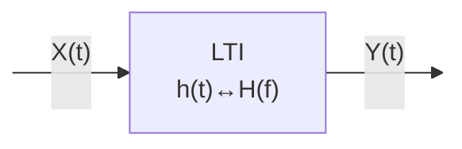
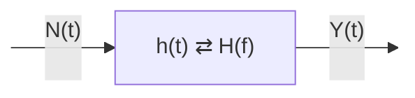

# Introduction to Random Processes

#### Basic Concepts
A **random process** is a rule for assigning a real-valued time function (or signal) to each outcome of a random experiment. Let's denote a random experiment's outcome as $e_i$. The random process $X(t, e_i)$ maps each outcome $e_i$ to a real function $x_i(t)$.
For instance, consider a sample space $S$ with outcomes $e_1, e_2, e_3, \ldots$. Each outcome $e_i$, $X(t, \cdot)$ generates a corresponding real function $x_i(t)$, represented as $X(t, e_i) = x_i(t)$. This mapping creates a set of functions over time, forming a two-dimensional signal space $(x, t)$.
![[Pasted image 20240630201626.png|Random Processes]]


#### Interpretations
A random process $X(t,e)$ can be interpreted in various ways:
- **Family of deterministic functions:** Here, $t$ and $e$ are variables. $X(t,e) = \{x(t,e_i)|e_i \in S\}$.
- **Random variable at $t = t_0$:** $X = X(t_0,e)$, where $e$ varies depending on the outcome of a particular trial.
- **Single time function (or a sample of the given process):** Given that $e$ is fixed, $X(t,e) = x(t)$, where $t$ is variable.
- **Real number:** If both $t$ and $e$ are fixed.
```tikz
\usepackage{pgfplots}
\usetikzlibrary{3d,decorations.pathmorphing}
\begin{document}
\begin{tikzpicture}
    \begin{axis}[
        view={120}{60},
        axis lines=center,
        xlabel={}, ylabel={}, zlabel={},
        zmin=0, zmax=5,
        ymin=0, ymax=5,
        xmin=0, xmax=5.5,
        samples=50,
        domain=0:10,
        grid=major,
		xtick=\empty, ytick=\empty, ztick=\empty
    ]
    % Plot the random process 1
    \addplot3[thick, color=orange, samples y=0, domain=0:5] ({1},{x},  {cos(deg(2*pi*1*x))});
    % Plot the random process 2
    \addplot3[thick, color=yellow, samples y=0, domain=0:5] ({3.5},{x},  {sin(deg(2*pi*0.5*x))});
    % Draw lines e1 and en
    \draw[dashed, thick] (axis cs:1,0,-2) -- (axis cs:1,5,-2) node [pos=0.5,below left] {$e_1$};
    \draw[dashed, thick] (axis cs:3.5,0,-2) -- (axis cs:3.5,5,-2) node [pos=0.5, below left] {$e_n$};
    % Axes labels
    \node at (axis cs:5,0,0) [below right] {$e$};
    \node at (axis cs:0,5,0) [above left] {$t$};
    \node at (axis cs:0,0,4) [below] {$X(t,e)$};
    \end{axis}
\end{tikzpicture}
\end{document}
```

To simplify, we'll use $X(t)$ to represent $X(t, e)$.
##### Example 1: Sinusoidal Process
Let's generate a sinusoid $X(t) = A \cos(2\pi f_c t + \Theta)$ where:
- $A$ is the amplitude,
- $f_c$ is the frequency,
- $\Theta$ is a random variable uniformly distributed over $[0, 2\pi]$.

```tikz
\usepackage{pgfplots}
\begin{document}
\begin{tikzpicture}
\begin{axis}[
    domain=-3*pi:3*pi, 
    samples=100, 
    axis lines=middle, 
    xlabel=$t$, 
    ylabel={}, 
    ymin=-1.5, 
    ymax=1.5,
    xtick={0, pi, 2*pi},
    xticklabels={0, $\pi$, $2\pi$},
    ytick={0},
    width=10cm,
    height=4cm,
    ]
    \addplot[orange, thick] {cos(deg(x))};
    \node at (axis cs:pi/2,1.5) [anchor=south] {$\theta=0$};
\end{axis}
\end{tikzpicture}
\begin{tikzpicture}
\begin{axis}[
    domain=-3*pi:3*pi, 
    samples=100, 
    axis lines=middle, 
    xlabel=$t$, 
    ylabel={}, 
    ymin=-1.5, 
    ymax=1.5,
    xtick={0, pi, 2*pi},
    xticklabels={0, $\pi$, $2\pi$},
    ytick={0},
    width=10cm,
    height=4cm,
    ]
    \addplot[orange, thick] {cos(deg(x - pi/4))};
    \node at (axis cs:pi/2,1.5) [anchor=south] {$\theta=-\pi/4$};
\end{axis}
\end{tikzpicture}

\begin{tikzpicture}
\begin{axis}[
    domain=-3*pi:3*pi, 
    samples=100, 
    axis lines=middle, 
    xlabel=$t$, 
    ylabel={}, 
    ymin=-1.5, 
    ymax=1.5,
    xtick={0, pi, 2*pi},
    xticklabels={0, $\pi$, $2\pi$},
    ytick={0},
    width=10cm,
    height=4cm,
    ]
    \addplot[orange, thick] {cos(deg(x + 3*pi/4))};
    \node at (axis cs:pi/2,1.5) [anchor=south] {$\theta=3\pi/4$};
\end{axis}
\end{tikzpicture}

\end{document}
```
##### Outputs Different Scenarios
- **Given $t = t_0$:** $X(t_0) = A\cos(2\pi f_c t_0 + \Theta) = X$ (a random variable).
- **Given $\Theta = \theta$:** $X(t) = A\cos(2\pi f_c t + \theta) = x(t)$ (a deterministic time function).
- **Given $t = t_0$ and $\Theta = \theta$:** $X(t_0) = A\cos(2\pi f_c t_0 + \theta) = x$ (a real number).
#### Description of Random Processes
**Analytical Description:** $$X(t): \{x(t, e_i)|e_i \in S\} \ +\ \text{probability information of S}$$
**Statistical Description:**
**Definition:** A complete statistical description of a random process $X(t)$ is known if, for any integer $n$ and any choice of sampling instants $t_1, t_2, \ldots, t_n$, the joint pdf of $(X(t_1), X(t_2), \ldots, X(t_n))$,
$$f_{X(t_1),X(t_2), \ldots, X(t_n)}(x_1, x_2, \ldots, x_n)$$
is given.
![[Pasted image 20240704013106.png|Statistical Average - Mean]]

#### Statistical Averages
**Statistical average (mean):**
The mean, or expectation, of a random process $X(t)$ is a deterministic function of time. It is denoted by $m_X(t)$ and is defined as: $$m_X(t) = E[X(t)]$$
If we fix a time instant $t = t_0$, $X(t_0)$ becomes a random variable with a probability density function (pdf) $f_{X(t_0)}(x)$. The mean at $t_0$ is given by: $$m_X(t_0) = E[X(t_0)] = \int_{-\infty}^{\infty} x \cdot f_{X(t_0)}(x) \, dx$$
For example, consider a random process where $X(t) = A \cos(2\pi f_c t + \Theta)$, and $\Theta$ is a random variable uniformly distributed over $[0, 2\pi]$. The mean $m_X(t)$ is computed as: $$m_X(t) = E[X(t)] = \int_{0}^{2\pi} A \cos(2\pi f_c t + \Theta) \cdot f_{\Theta}(\theta) \, d\theta = 0$$
This result shows that the mean $m_X(t)$ is independent of $t$.
> [!Context] A direct conclusion from "uniformly distributed over $[0,2\pi]$"
> $$f_\Theta(\theta) = \begin{cases} 
> 						\frac{1}{2\pi}     , & \text{if } 0 \leq \theta \leq 2\pi \\
> 						0                  , & \text{otherwise}
> 				   \end{cases}$$

> [!Example] Detailed Example Solution
> The mean $m_X(t)$ of the random process $X(t) = A \cos(2\pi f_c t + \Theta)$ is zero due to the properties of the cosine function and the uniform distribution of $\Theta$.
> **Uniform Distribution of $\Theta$**: The random variable $\Theta$ is uniformly distributed over $[0, 2\pi]$. This means its probability density function $f_{\Theta}(\theta)$ is given by:$$f_{\Theta}(\theta) = \begin{cases} \frac{1}{2\pi}, & \text{if } 0 \leq \theta \leq 2\pi \\0, & \text{otherwise}
>    \end{cases}$$**Expected Value Calculation**: The mean (expected value) of $X(t)$, $m_X(t)$, is calculated as:$$m_X(t) = E[X(t)] = \int_{0}^{2\pi} A \cos(2\pi f_c t + \theta) \cdot f_{\Theta}(\theta) \, d\theta$$**Substitute $f_{\Theta}(\theta)$**: Substituting the PDF of $\Theta$ into the integral:$$m_X(t) = \int_{0}^{2\pi} A \cos(2\pi f_c t + \theta) \cdot \frac{1}{2\pi} \, d\theta$$**Factor Out Constants**: Since $A$ and $\frac{1}{2\pi}$ are constants, they can be factored out:$$m_X(t) = \frac{A}{2\pi} \int_{0}^{2\pi} \cos(2\pi f_c t + \theta) \, d\theta$$**Integral of Cosine Function**: To solve the integral, note that the integral of $\cos$ over a full period $0$ to $2\pi$ is zero: $$\int_{0}^{2\pi} \cos(2\pi f_c t + \theta) \, d\theta = \left[ \sin(2\pi f_c t + \theta) \right]_{0}^{2\pi} = \sin(2\pi f_c t + 2\pi) - \sin(2\pi f_c t + 0) = \sin(2\pi f_c t + 2\pi) - \sin(2\pi f_c t) = \sin(2\pi f_c t) - \sin(2\pi f_c t) = 0$$This is because $\sin(x + 2\pi) = \sin(x)$, and hence both terms cancel out.
> **Conclusion**: Hence, the mean $m_X(t)$ simplifies to:$$m_X(t) = \frac{A}{2\pi} \cdot 0 = 0$$So, the mean $m_X(t)$ is zero. This result is independent of $t$ because the integral of the cosine function over a full period $[0, 2\pi]$ always equals zero, regardless of the phase shift $2\pi f_c t$.
#### Autocorrelation Function
The **autocorrelation function** of a random process $X(t)$, denoted as $R_X(t_1, t_2)$, is defined by:
$$R_X(t_1, t_2) = E[X(t_1)X(t_2)]$$

The autocorrelation function provides a way of describing the interdependence of two random variables obtained by observing a random process $X(t)$ at $t_1$ and $t_2$. The more rapidly $X(t)$ changes with time, the more rapidly $R_X(t_1, t_2)$ decreases from its maximum value $R_X(t_1, t_2)$ as $|t_2 - t_1|$ increases.

For example, the autocorrelation function of the random process in Example 1 is:
$$R_X(t_1, t_2) = E[A \cos(2\pi f_c t_1 + \Theta) \cdot A \cos(2\pi f_c t_2 + \Theta)]$$
$$R_X(t_1, t_2) = \frac{A^2}{2} \cos[2\pi f_c (t_1 - t_2)]$$
> [!Example] Detailed Example Solution
> Given: $$R_X(t_1, t_2) = E[A \cos(2\pi f_c t_1 + \Theta) \cdot A \cos(2\pi f_c t_2 + \Theta)]$$
> 1. **Expand the Expectation**: First, we expand the expectation:$$R_X(t_1, t_2) = A^2 E[\cos(2\pi f_c t_1 + \Theta) \cos(2\pi f_c t_2 + \Theta)]$$
> 2. **Use Trigonometric Identity**: We use the trigonometric identity for the product of cosines:$$\cos(x) \cos(y) = \frac{1}{2}[\cos(x - y) + \cos(x + y)]$$
> Applying this identity: $$\cos(2\pi f_c t_1 + \Theta) \cos(2\pi f_c t_2 + \Theta) = \frac{1}{2} [\cos(2\pi f_c t_1 + \Theta - (2\pi f_c t_2 + \Theta)) + \cos(2\pi f_c t_1 + \Theta + 2\pi f_c t_2 + \Theta)]$$
> Simplify the arguments of the cosines: $$= \frac{1}{2} [\cos(2\pi f_c (t_1 - t_2)) + \cos(2\pi f_c (t_1 + t_2) + 2\Theta)]$$
> 3. **Take the Expectation**: Now we take the expectation of both terms. Remember that $\Theta$ is uniformly distributed over $[0, 2\pi]$ with $f_{\Theta}(\theta) = \frac{1}{2\pi}$ for $0 \leq \theta \leq 2\pi$.
>    The expectation of $\cos(2\pi f_c (t_1 + t_2) + 2\Theta)$ is zero because $\Theta$ is uniformly distributed, making the average value of a cosine function over one full period zero.
>    Thus:$$E[\cos(2\pi f_c (t_1 + t_2) + 2\Theta)] = \int_0^{2\pi} \cos(2\pi f_c (t_1 + t_2) + 2\theta) \cdot \frac{1}{2\pi} \, d\theta = 0$$
>    However, the expectation of $\cos(2\pi f_c (t_1 - t_2))$ is simply $\cos(2\pi f_c (t_1 - t_2))$, as it is a constant with respect to $\Theta$:$$E[\cos(2\pi f_c (t_1 - t_2))] = \cos(2\pi f_c (t_1 - t_2))$$
> Putting it all together:$$R_X(t_1, t_2) = \frac{A^2}{2} \cos[2\pi f_c (t_1 - t_2)]$$
> So, the autocorrelation function $R_X(t_1, t_2)$ is:$$R_X(t_1, t_2) = \frac{A^2}{2} \cos[2\pi f_c (t_1 - t_2)]$$

#### Wide-Sense Stationary (WSS) Processes
A process is called **wide-sense stationary (WSS)** if its mean $m_X(t)$ is constant over time and its autocorrelation function $R_X(t_1, t_2)$ depends only on the time difference $t_2 - t_1$. The autocorrelation function is defined as: $$R_X(t_1, t_2) = E[X(t_1)X(t_2)]$$
The autocorrelation function provides a way to describe the interdependence of two random variables obtained by observing a random process $X(t)$ at different times $t_1$ and $t_2$.
For example, consider the random process $X(t) = A \cos(2\pi f_c t + \Theta)$ from before. The autocorrelation function is: $$R_X(t_1, t_2) = E[A \cos(2\pi f_c t_1 + \Theta) \cdot A \cos(2\pi f_c t_2 + \Theta)]$$
$$R_X(t_1, t_2) = \frac{A^2}{2} \cos[2\pi f_c (t_1 - t_2)]$$
#### Wide-Sense Stationary (WSS) Processes.
A random process $X(t)$ is considered **Wide-Sense Stationary (WSS)** if its mean $m_X(t)$ is constant and its autocorrelation function $R_X(t_1, t_2)$ depends only on the time difference $\tau = t_2 - t_1$. Specifically,                                                                                                                                                                               9$$m_X(t) = m_X$$$$R_X(t_1, t_2) = R_X(\tau)$$
For example, the random process in Example 1 is WSS. Generally, we will focus on WSS processes in our studies.
**Properties of $R_X(\tau)$**:
1. **Symmetry**: $$R_X(\tau) = R_X(-\tau)$$**Proof**: By definition, $$R_X(\tau) = E[X(t)X(t - \tau)]$$Since $E[X(t)X(t - \tau)] = E[X(t - \tau)X(t)]$, $$R_X(\tau) = R_X(-\tau)$$
2. **Non-negativity**: $$|R_X(\tau)| \leq R_X(0)$$**Proof**: Consider the expectation of the squared process: $$E[(X(t) \pm X(t - \tau))^2] \geq 0$$Expanding this, $$E[X^2(t) + X^2(t - \tau) \pm 2X(t)X(t - \tau)] \geq 0$$ $$R_X(0) + R_X(0) \pm 2R_X(\tau) \geq 0$$ $$2R_X(0) \pm 2R_X(\tau) \geq 0$$Thus, $$|R_X(\tau)| \leq R_X(0)$$
#### Power and PSD of WSS Random Signal $X(t)$
For a random signal $X(t)$, the corresponding power is a random variable. The average power of $X(t)$ is defined as:
$$P = E\left[\lim_{T \to \infty} \frac{1}{T} \int_{-T/2}^{T/2} X^2(t) \, dt \right] = \lim_{T \to \infty} \frac{1}{T} \int_{-T/2}^{T/2} E[X^2(t)] \, dt$$

If $X(t)$ is WSS, then $E[X^2(t)] = R_X(0)$:
$$P = E\left[\lim_{T \to \infty} \frac{1}{T} \int_{-T/2}^{T/2} X^2(t) \, dt \right] = \lim_{T \to \infty} \frac{1}{T} \int_{-T/2}^{T/2} R_X(0) \, dt = R_X(0)$$
#### Wiener-Khintchine Relations for WSS Processes
For a WSS random signal, its autocorrelation function and its power spectral density (PSD) are a pair of Fourier transforms: $$S_X(f) = \int_{-\infty}^{\infty} R_X(\tau) e^{-j2\pi f \tau} \, d\tau$$$$R_X(\tau) = \int_{-\infty}^{\infty} S_X(f) e^{j2\pi f \tau} \, df$$**Check**: The average power $P$ is:
$$P = \int_{-\infty}^{\infty} S_X(f) \, df = R_X(0)$$
#### Response of LTI System to Random Signal Input
For an LTI system, the input-output relation is given by: $$y(t) = x(t) \otimes h(t) = \int_{-\infty}^{\infty} x(t - \tau) h(\tau) \, d\tau$$with $H(f) = F[h(t)] = \int_{-\infty}^{\infty} h(t) e^{-j2\pi f t} \, dt$ (Fourier Transform).
  ```mermaid
flowchart LR
	START:::hidden -->|"x(t)<br><br>"| A["LTI<br> h(t)↔H(f)"] -->|"y(t)<br><br>"| END:::hidden
	classDef hidden display: none;
```

In the case of a random input: $$m_Y(t) = E[Y(t)] = E\left[\int_{-\infty}^{\infty} X(t - \tau) h(\tau) \, d\tau \right] = \int_{-\infty}^{\infty} E[X(t - \tau)] h(\tau) \, d\tau$$$$m_Y(t) = E[X(t)] \otimes h(t) = m_X \otimes h(t)$$
If $X(t)$ is WSS, then $m_Y(t) = m_X \cdot H(0)$ is constant.
The autocorrelation function of the output $Y(t)$ is: $$R_Y(t, t + \tau) = E[Y(t)Y(t + \tau)] = E\left[\{X(t) \ast h(t)\} \cdot \{X(t + \tau) \ast h(t)\}\right]$$ 
$$R_Y(\tau) = \int_{-\infty}^{\infty} \int_{-\infty}^{\infty} h(a) h(b) R_X(\tau + a - b) \, da \, db$$
Thus, $Y(t)$ is also a WSS signal.
#### The White Noise Model and Thermal Noise
**Noise** consists of unwanted signals that interfere with the transmission and processing of desired signals in a communication system. Noise can be either random or deterministic.
**Noise Sources**:
- **External**: Atmospheric noise, man-made noise, etc.
- **Internal**: Thermal noise
**Thermal noise** is produced due to the random motion of free electrons in a conducting medium, such as a resistor.
*One Level Deeper Information:* 
	**White noise** is a random process with a constant power spectral density over all frequencies. This means that its autocorrelation function $R_X(t_1, t_2)$ is a delta function: $$R_X(t_1, t_2) = N_0 \delta(t_2 - t_1)$$**Thermal noise** is a type of white noise that originates from the random motion of electrons in a conductor due to thermal energy. It has a flat power spectral density and is modeled as a Gaussian process with zero mean and variance proportional to the temperature of the conductor.
#### Time-Average Representations of Random Noise
For random noise, time-average representations are useful:
- **Mean (DC) value**: $$\overline{n(t)} = \lim_{T \to \infty} \frac{1}{T} \int_{-T/2}^{T/2} n(t) \, dt$$
  here, the $\overline{overbar}$ indicates time averaging 
- **Mean-square value (Power)**: $$P_n = \overline{n^2(t)} = \lim_{T \to \infty} \frac{1}{T} \int_{-T/2}^{T/2} n^2(t) \, dt$$
- **AC component**: $$\sigma(t) = n(t) - \overline{n(t)}$$
**Signal-to-Noise Ratio (SNR)** is also a widely used performance measure: $$\frac{S}{N} = \frac{\overline{s^2(t)}}{\overline{n^2(t)}}$$$$\left[ \frac{S}{N} \right]_{dB} = 10 \log_{10} \left( \frac{\overline{s^2(t)}}{\overline{n^2(t)}} \right)$$
#### White Noise and Band-Limited White Noise
**White noise** is characterized by a flat power spectral density (PSD), meaning it contains all frequency components with equal power, akin to white light. The PSD of white noise, which can be denoted as $S_n(f)$ is constant:
$$S_n(f) = \frac{N_0}{2}$$
```tikz
\begin{document}
\begin{tikzpicture}
    % Draw axes
    \draw[thick,->] (-3,0) -- (3,0) node[right] {$f$}; % x-axis
    \draw[thick,->] (0,0) -- (0,3) node[above] {$S_n(f)$}; % y-axis
    % Draw the vertical line
    \draw[thick] (0,0) -- (0,2);
    % Draw the horizontal line as a marker
    \draw[thick] (-2,2) -- (2,2);
    % Draw labels
    \node at (0,2.25) [left] {$N_0/2$};
\end{tikzpicture}
\end{document}
```
The average power of white noise, $P_n$, is theoretically infinite:
$$P_n = \overline{n^2(t)} = \int_{-\infty}^{\infty} S_n(f) \, df \to \infty$$

However, in practical systems, the bandwidth of the receiver is narrower than the bandwidth of the noise process. When the noise process is limited to a certain bandwidth $W$, it is called **band-limited white noise**. The average power of band-limited white noise is finite:
$$P_n = \overline{n^2(t)} = \int_{-W}^{W} \frac{N_0}{2} \, df = N_0 W$$

```tikz
\begin{document}
\begin{tikzpicture}
    % Draw axes
    \draw[thick,->] (-3,0) -- (3,0) node[right] {$f$}; % x-axis
    \draw[thick,->] (0,0) -- (0,3) node[above] {$S_n(f)$}; % y-axis

    % Draw the gate function
    \draw[thick] (-2,0) -- (-2,2) -- (2,2) -- (2,0);
    
    % Draw labels
    \node at (0,2) [left] {$N_0/2$};
    \node at (2,0) [below] {$W$};
    \node at (-2,0) [below] {$-W$};
    
    % Optionally adding grid or dashed lines
    \draw[dashed] (-2,0) -- (-2,2); % Dashed line to y-axis
    \draw[dashed] (2,0) -- (2,2); % Dashed line to y-axis
\end{tikzpicture}
\end{document}
```
#### Thermal Noise
**Thermal noise** arises from the random motion of electrons in a conductor due to thermal energy. The PSD of thermal noise $S_n(f)$ is given by: $$S_n(f) = \frac{h|f|}{2} \left[ \exp\left(\frac{h|f|}{kT}\right) - 1 \right]^{-1}$$
Where:
- $T$ is the temperature in Kelvin.
- $k$ is Boltzmann's constant ($1.38 \times 10^{-23}$ joules/K).
- $h$ is Planck's constant ($6.625 \times 10^{-34}$ joule-seconds).
Thermal noise achieves its maximum at $f = 0$, with a value of $\frac{kT}{2}$. As $f \to \infty$, the PSD approaches zero, but the convergence is very slow. For frequencies much less than $\frac{kT}{h}$, thermal noise can be approximated as white noise with a PSD of $\frac{kT}{2}$. $kT/h$ can be approximated with a value of $6\cdot 10^{12}\ Hz$, which is well beyond the operating frequency of conventional systems.

![[Pasted image 20240630195303.png]]
```tikz

\usepackage{pgfplots}
\pgfplotsset{compat=newest}
\begin{document}
\begin{tikzpicture}
\begin{axis}[
    title={Power Spectral Density},
    xlabel={$\omega$ [rad]},
    ylabel={Power Spectral Density},
    xmin=-40, xmax=40,
    ymin=1, ymax=10e10,
    ymode=log, % Logarithmic scale for y-axis
    grid=both, % Enables grid
    grid style={line width=.1pt, draw=gray!10},
    major grid style={line width=.2pt,draw=gray!50},
    minor tick num=10, % Number of minor ticks between major ticks
    tick align=outside,
    tickpos=left, % Positions the ticks on the left side
    scaled ticks=false,
    legend pos=north west,
    legend style={draw=none}, % No box around the legend
    thick,
    no markers,
    every axis plot/.append style={thick}
]
\addplot[orange, domain=-40:0] {x*1e6 + 1e8};
\addplot[orange, domain=0:40]  {-x*1e6 + 1e8};
\legend{Modeled PSD}
\end{axis}
\end{tikzpicture}
\end{document}
```
Conclusion: For most practical purposes, thermal noise can be considered white.
#### Example 4: Power Spectral Density (PSD) of a Random Process
Consider a random process $Y(t) = X(t) \cos(2\pi f_c t + \Theta)$, where $X(t)$ is a WSS process with PSD $S_X(f)$, $f_c$ is a constant, and $\Theta$ is a uniformly distributed random variable over $[0, 2\pi]$ independent of $X(t)$. Find the power spectral density of $Y(t)$.
**Step 1**: Show that $Y(t)$ is WSS. $$m_Y(t) = E[Y(t)] = E[X(t) \cos(2\pi f_c t + \Theta)] = E[X(t)] \cdot E[\cos(2\pi f_c t + \Theta)] = 0$$ 
$$R_Y(t, t + \tau) = E[Y(t)Y(t + \tau)] = E[X(t) \cos(2\pi f_c t + \Theta) \cdot X(t + \tau) \cos(2\pi f_c (t + \tau) + \Theta)]$$
$$= R_X(\tau) \cdot \frac{1}{2} \cos(2\pi f_c \tau)$$
Thus, $R_Y(t, t + \tau) = R_Y(\tau)$, indicating that $Y(t)$ is WSS.
**Step 2**: Use the Wiener-Khintchine relation to find the PSD of $Y(t)$.
$$S_Y(f) = F[R_Y(\tau)] = \frac{1}{4} \left[ S_X(f - f_c) + S_X(f + f_c) \right]$$
> [!Example] Expanded Steps
> #### Step 1: Show that $Y(t)$ is WSS
> To show that $Y(t)$ is WSS, we need to prove two things:
> 1. The mean $m_Y(t)$ of $Y(t)$ is constant and independent of $t$.
> 2. The autocorrelation function $R_Y(t, t + \tau)$ depends only on the time difference $\tau$.
> **Mean of $Y(t)$:**
> $$m_Y(t) = E[Y(t)] = E[X(t) \cos(2\pi f_c t + \Theta)]$$
> 
> Since $X(t)$ and $\Theta$ are independent, we can write:
> $$E[Y(t)] = E[X(t)] \cdot E[\cos(2\pi f_c t + \Theta)]$$
> 
> Because $X(t)$ is WSS, $E[X(t)] = m_X$ (a constant). Also, since $\Theta$ is uniformly distributed over $[0, 2\pi]$, its expected value when used inside the cosine function is zero. This is because the integral of the cosine function over a complete period is zero:
> $$E[\cos(2\pi f_c t + \Theta)] = \frac{1}{2\pi} \int_0^{2\pi} \cos(2\pi f_c t + \theta) \, d\theta = 0$$
> Therefore,
> $$m_Y(t) = m_X \cdot 0 = 0$$
> 
> So the mean of $Y(t)$ is zero and does not depend on $t$.
> **Autocorrelation of $Y(t)$:**
> $$R_Y(t, t + \tau) = E[Y(t) Y(t + \tau)]$$
> Substitute $Y(t) = X(t) \cos(2\pi f_c t + \Theta)$:
> $$R_Y(t, t + \tau) = E[X(t) \cos(2\pi f_c t + \Theta) \cdot X(t + \tau) \cos(2\pi f_c (t + \tau) + \Theta)]$$
> Using the trigonometric identity for the product of cosines:
> $$\cos(A) \cos(B) = \frac{1}{2} [\cos(A - B) + \cos(A + B)]$$
> Let $A = 2\pi f_c t + \Theta$ and $B = 2\pi f_c (t + \tau) + \Theta$:
> $$\cos(2\pi f_c t + \Theta) \cos(2\pi f_c (t + \tau) + \Theta) = \frac{1}{2} [\cos(-2\pi f_c \tau) + \cos(4\pi f_c t + 2\pi f_c \tau + 2\Theta)]$$
> Simplifying,
> $$\cos(2\pi f_c t + \Theta) \cos(2\pi f_c (t + \tau) + \Theta) = \frac{1}{2} [\cos(2\pi f_c \tau) + \cos(4\pi f_c t + 2\pi f_c \tau + 2\Theta)]$$
> Now, taking the expectation:
> $$R_Y(t, t + \tau) = E\left[X(t) X(t + \tau) \cdot \frac{1}{2} [\cos(2\pi f_c \tau) + \cos(4\pi f_c t + 2\pi f_c \tau + 2\Theta)]\right]$$
> Since $\Theta$ is uniformly distributed and independent of $X(t)$:
> $$E[\cos(4\pi f_c t + 2\pi f_c \tau + 2\Theta)] = \frac{1}{2\pi} \int_0^{2\pi} \cos(4\pi f_c t + 2\pi f_c \tau + 2\theta) \, d\theta = 0$$
> Therefore,
> $$R_Y(t, t + \tau) = E[X(t) X(t + \tau)] \cdot \frac{1}{2} \cos(2\pi f_c \tau)$$
> Since $X(t)$ is WSS, $E[X(t) X(t + \tau)] = R_X(\tau)$:
> $$R_Y(t, t + \tau) = R_X(\tau) \cdot \frac{1}{2} \cos(2\pi f_c \tau)$$
> This shows that $R_Y(t, t + \tau)$ depends only on $\tau$ and not on $t$, indicating that $Y(t)$ is WSS.
> #### Step 2: Use the Wiener-Khintchine relation to find the PSD of $Y(t)$
> The Wiener-Khintchine theorem states that the PSD $S_Y(f)$ is the Fourier transform of the autocorrelation function $R_Y(\tau)$:
> $$S_Y(f) = \mathcal{F}[R_Y(\tau)]$$
> We have found that:
> $$R_Y(\tau) = R_X(\tau) \cdot \frac{1}{2} \cos(2\pi f_c \tau)$$
> Using the Fourier transform properties, we can express $\cos(2\pi f_c \tau)$ as:
> $$\cos(2\pi f_c \tau) = \frac{1}{2} \left( e^{j 2\pi f_c \tau} + e^{-j 2\pi f_c \tau} \right)$$
> So,
> $$R_Y(\tau) = \frac{1}{2} R_X(\tau) \left( \frac{1}{2} e^{j 2\pi f_c \tau} + \frac{1}{2} e^{-j 2\pi f_c \tau} \right) = \frac{1}{4} R_X(\tau) e^{j 2\pi f_c \tau} + \frac{1}{4} R_X(\tau) e^{-j 2\pi f_c \tau}$$
> 
> The Fourier transform of $R_X(\tau) e^{j 2\pi f_c \tau}$ is $S_X(f - f_c)$ and the Fourier transform of $R_X(\tau) e^{-j 2\pi f_c \tau}$ is $S_X(f + f_c)$:
> $$\mathcal{F}[R_X(\tau) e^{j 2\pi f_c \tau}] = S_X(f - f_c)$$
> $$\mathcal{F}[R_X(\tau) e^{-j 2\pi f_c \tau}] = S_X(f + f_c)$$
> Therefore,
> $$S_Y(f) = \mathcal{F}\left[\frac{1}{4} R_X(\tau) e^{j 2\pi f_c \tau} + \frac{1}{4} R_X(\tau) e^{-j 2\pi f_c \tau}\right] = \frac{1}{4} S_X(f - f_c) + \frac{1}{4} S_X(f + f_c)$$
> Thus, the PSD of $Y(t)$ is:
> $$S_Y(f) = \frac{1}{4} \left[ S_X(f - f_c) + S_X(f + f_c) \right]$$

#### Example 5: White Gaussian Noise
A random process $N(t)$ is called white Gaussian noise if any samples $N(t_i)$ at any time instants are jointly Gaussian distributed, with:
$$R_N(\tau) = \frac{N_0}{2} \delta(\tau) \quad \text{and} \quad E[N(t)] = 0$$
- $E[N(t_1) N(t_2)] = 0$ if $t_1 \neq t_2$.
- $E[N^2(t)] = R_N(0) = \infty$, implying $N(t)$ is physically unrealizable.
- PSD: $S_N(f) = F[R_N(\tau)] = \frac{N_0}{2}$.
- The output of an LTI system with white Gaussian noise input has a PSD:
$$S_Y(f) = |H(f)|^2 S_N(f) = \frac{N_0}{2} |H(f)|^2$$

At the output, the mean and average power are: $$m_Y(t) = m_N(t) \otimes h(t) = 0$$$$E[Y^2(t)] = \int_{-\infty}^{\infty} S_Y(f) \, df = \frac{N_0}{2} \int_{-\infty}^{\infty} |H(f)|^2 \, df = \sigma_Y^2$$
 > [!Example] Detailed Explanation For Example 5: White Gaussian Noise
> A random process $N(t)$ is called white Gaussian noise if any samples $N(t_i)$ at any time instants are jointly Gaussian distributed, with:$$R_N(\tau) = \frac{N_0}{2} \delta(\tau) \quad \text{and} \quad E[N(t)] = 0$$
> #### Properties of White Gaussian Noise
> 1. **Mean of $N(t)$:** $$E[N(t)] = 0$$Since the mean of the process is zero, this simplifies our calculations and shows that $N(t)$ has no DC component.
> 2. **Autocorrelation Function:** $$R_N(\tau) = \frac{N_0}{2} \delta(\tau)$$The autocorrelation function is a scaled delta function, which indicates that the process is uncorrelated at different times. This is a key characteristic of white noise.
> 3. **Uncorrelated Samples:** $$E[N(t_1) N(t_2)] = 0 \quad \text{if} \quad t_1 \neq t_2$$This property follows directly from the autocorrelation function, since the delta function is zero for non-zero $\tau$.
> 4. **Infinite Power:** $$E[N^2(t)] = R_N(0) = \infty$$This implies that the instantaneous power of white noise is infinite, making it physically unrealizable. However, it is a useful theoretical construct.
> #### Power Spectral Density (PSD)
> To find the PSD of $N(t)$, we use the Wiener-Khintchine theorem, which states that the PSD is the Fourier transform of the autocorrelation function: $$S_N(f) = \mathcal{F}[R_N(\tau)]$$
> Given $R_N(\tau) = \frac{N_0}{2} \delta(\tau)$, we find the Fourier transform of the delta function. Recall that: $$\mathcal{F}[\delta(\tau)] = 1$$
> Therefore, $$S_N(f) = \frac{N_0}{2} \mathcal{F}[\delta(\tau)] = \frac{N_0}{2}$$
> This indicates that the PSD of white Gaussian noise is constant over all frequencies, which is another defining characteristic of white noise.
> #### Output of an LTI System with White Gaussian Noise Input
> When white Gaussian noise $N(t)$ passes through a Linear Time-Invariant (LTI) system with impulse response $h(t)$ and frequency response $H(f)$, the output process $Y(t)$ has specific properties. The relationship between the input and output in the frequency domain is given by: $$Y(f) = H(f) N(f)$$
> **PSD of $Y(t)$:** $$S_Y(f) = |H(f)|^2 S_N(f)$$Substituting $S_N(f) = \frac{N_0}{2}$: $$S_Y(f) = \frac{N_0}{2} |H(f)|^2$$This shows that the output PSD is the input PSD scaled by the magnitude squared of the system's frequency response.
> **Mean of $Y(t)$:** The mean $m_Y(t)$ of the output process is given by the convolution of the input mean $m_N(t)$ and the system's impulse response $h(t)$: $$m_Y(t) = m_N(t) \otimes h(t)$$
> Since $m_N(t) = 0$: $$m_Y(t) = 0$$**Average Power of $Y(t)$:** The average power $E[Y^2(t)]$ of the output process can be found by integrating the output PSD over all frequencies:
> $$E[Y^2(t)] = \int_{-\infty}^{\infty} S_Y(f) \, df = \int_{-\infty}^{\infty} \frac{N_0}{2} |H(f)|^2 \, df$$This integral gives us the total power of the output process: $$E[Y^2(t)] = \frac{N_0}{2} \int_{-\infty}^{\infty} |H(f)|^2 \, df$$Denoting the result of the integral as $\sigma_Y^2$: $$E[Y^2(t)] = \sigma_Y^2$$Thus, the output process $Y(t)$ has zero mean and finite average power, determined by the integral of the squared magnitude of the system's frequency response.
#### Summary
1. **Definition and Description of a Random Process**:
   - Mean: $m_X(t) = E[X(t)]$
   - Correlation: $R_X(t_1, t_2) = E[X(t_1)X(t_2)]$
2. **WSS Random Processes**:
   - $m_X(t) = \text{constant}$
   - $R_X(t, t + \tau) = R_X(\tau)$
   - Wiener-Khintchine relation: $R_X(\tau) \leftrightarrow S_X(f)$
   - Power: $P = \int_{-\infty}^{\infty} S_X(f) \, df = R_X(0)$
3. **Response of LTI System**:
  ```mermaid
flowchart LR
	START:::hidden -->|"X(t)<br>WSS"| A["LTI<br> h(t)↔H(f)"] -->|"Y(t)<br>WSS"| END:::hidden
    classDef hidden display: none;
```
   - $m_Y(t) = m_X \otimes h(t) = m_X \cdot H(0)$
   - $S_Y(f) = S_X(f) |H(f)|^2$
   - $P_Y = \int_{-\infty}^{\infty} S_Y(f) \, df$ 

4. **Thermal Noise, White Noise, Band-Limited White Noise, White Gaussian Noise**:
   - Thermal noise can be approximated as white for practical purposes.
